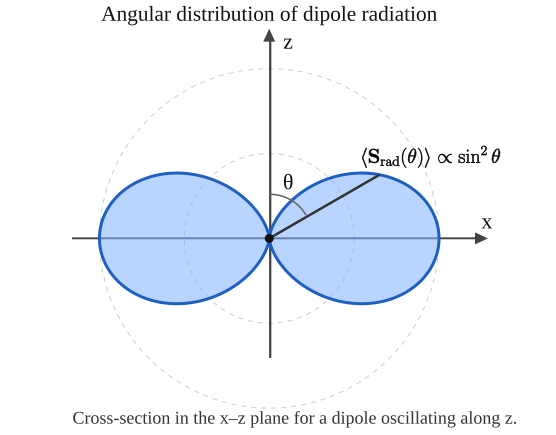
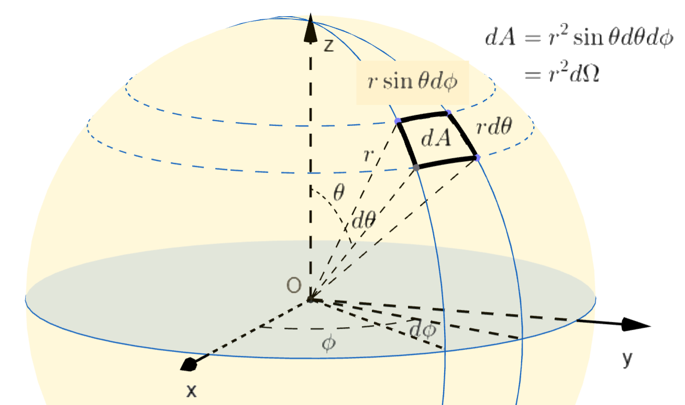

Picture two opposite charges moving relative to each other, or as a simple special case, one charge moving while the opposite charge remains fixed at the origin. Their electric field cannot rearrange everywhere at once, the changing dipole moment produces a time-dependent electromagnetic field, part of which travels outward as radiation. On this page, we will follow that wave from the moving dipole to its fields, energy flux, and total radiated power. **SI units** are used throughout.

## Geometry and assumptions

Consider a localized, electrically neutral source with dipole moment
$$
\mathbf p(t)=p(t)\hat{\mathbf z}.
$$ {#eq-dipole-moment}
In @eq-dipole-moment, the dipole points along the $z$ axis. Use spherical coordinates $(r,\theta,\phi)$ centered on the source: $\theta$ is measured from the positive $z$ axis, and $\phi$ is the azimuthal angle. The unit vectors $\hat{\mathbf r}$, $\hat{\boldsymbol\theta}$, and $\hat{\boldsymbol\phi}$ point in the directions of increasing $r$, $\theta$, and $\phi$. The two identities we will need are
$$
\hat{\mathbf z}=\cos\theta\,\hat{\mathbf r}-\sin\theta\,\hat{\boldsymbol\theta},
\qquad
\hat{\mathbf r}\times\hat{\boldsymbol\theta}=\hat{\boldsymbol\phi}.
$$ {#eq-spherical-basis}

{#fig-dipole-geometry fig-alt="Dipole along the z axis, spherical angles theta and phi, and field point labeled bold r with bold radial, polar, and azimuthal unit vectors forming a right-handed basis." width=50%}

The geometry in @fig-dipole-geometry makes @eq-spherical-basis visible: the three local unit vectors rotate as the field point moves. For two charges $+q$ and $-q$, let $\mathbf d(t)$ point from the negative charge to the positive charge. Then $\mathbf p(t)=q\mathbf d(t)$.

We use the **electric-dipole approximation**: the maximum charge separation $d_{\max}$ is much smaller than the radiation wavelength, with $k d_{\max}\ll1$, and the observation distance satisfies $r\gg d_{\max}$. The wave number in this condition is defined by
$$
k=\frac{\omega}{c}=\frac{2\pi}{\lambda}.
$$ {#eq-wavenumber}
Equation @eq-wavenumber tells us how rapidly the phase changes in space. The fields at time $t$ cannot know the source's present motion; they depend on its earlier motion at the **retarded time**
$$
t_r=t-\frac{r}{c}.
$$ {#eq-retarded-time}
The delay $r/c$ in @eq-retarded-time is simply the travel time from source to observer. Dots denote time derivatives. Unless stated otherwise, $p$, $\dot p$, and $\ddot p$ in the field equations are evaluated at $t_r$.

## Brief derivation from retarded potentials

You can skip the derivation

### Dipole potentials

The retarded potentials of a charge density $\rho$ and current density $\mathbf J$ are
$$
\mathnormal{\Phi}(\mathbf r,t)=\frac{1}{4\pi\epsilon_0}
\int\frac{\rho(\mathbf r',t-R/c)}{R}\,d^3r',
\qquad
\mathbf A(\mathbf r,t)=\frac{\mu_0}{4\pi}
\int\frac{\mathbf J(\mathbf r',t-R/c)}{R}\,d^3r',
$$ {#eq-retarded-potentials}
In @eq-retarded-potentials, $R=|\mathbf r-\mathbf r'|$ is the distance from a source point to the observer. Expanding these potentials for a small neutral source and using $\int\mathbf J\,d^3r'=\dot{\mathbf p}$ gives
$$
\mathnormal{\Phi}=\frac{\cos\theta}{4\pi\epsilon_0}
\left[\frac{p(t_r)}{r^2}+\frac{\dot p(t_r)}{cr}\right],
\qquad
\mathbf A=\frac{\mu_0}{4\pi r}\dot p(t_r)\hat{\mathbf z}.
$$ {#eq-dipole-potentials}
Thus $A_r=\mu_0\dot p\cos\theta/(4\pi r)$, $A_\theta=-\mu_0\dot p\sin\theta/(4\pi r)$, and $A_\phi=0$.

### Take the derivatives

Now comes the central step: turn the potentials in @eq-dipole-potentials into measurable fields using
$$
\mathbf E=-\boldsymbol{\nabla}\mathnormal{\Phi}-\frac{\partial\mathbf A}{\partial t},
\qquad
\mathbf B=\boldsymbol{\nabla}\times\mathbf A.
$$ {#eq-fields-from-potentials}
Be careful when differentiating. Changing $r$ also changes the retarded time in @eq-retarded-time, so
$$
\frac{\partial p(t_r)}{\partial r}=-\frac{\dot p(t_r)}{c}.
$$ {#eq-retarded-derivative}
Using @eq-fields-from-potentials and @eq-retarded-derivative, the transverse electric field becomes
$$
E_\theta=-\frac1r\frac{\partial\mathnormal{\Phi}}{\partial\theta}
-\frac{\partial A_\theta}{\partial t}
=\frac{\sin\theta}{4\pi\epsilon_0}
\left[\frac{p}{r^3}+\frac{\dot p}{cr^2}+\frac{\ddot p}{c^2r}\right].
$$ {#eq-transverse-electric-field}
This one calculation, @eq-transverse-electric-field, already reveals the three distance dependences $1/r^3$, $1/r^2$, and $1/r$. Applying the same derivatives to $E_r$ and $B_\phi$ gives the remaining components.

### The dipole-field solution

The complete electric-dipole fields outside the dipole source are:
$$
\mathbf E(r,\theta,t)=\frac{1}{4\pi\epsilon_0}
\left\{
2\cos\theta\left[\frac{p}{r^3}+\frac{\dot p}{cr^2}\right]\hat{\mathbf r}
+\sin\theta\left[\frac{p}{r^3}+\frac{\dot p}{cr^2}+\frac{\ddot p}{c^2r}\right]\hat{\boldsymbol\theta}
\right\}.
$$ {#eq-electric-dipole-field}
$$
\mathbf B(r,\theta,t)=\frac{\mu_0\sin\theta}{4\pi}
\left[\frac{\dot p}{r^2}+\frac{\ddot p}{cr}\right]\hat{\boldsymbol\phi}.
$$ {#eq-magnetic-dipole-field}
@eq-electric-dipole-field and @eq-magnetic-dipole-field contain every nonzero component: $E_\phi=B_r=B_\theta=0$. There is no dependence on $\phi$ because rotating the system around the dipole axis changes nothing.

| Distance dependence | Interpretation |
|:--|:--|
| $r^{-3}$ | Quasistatic electric-dipole field |
| $r^{-2}$ | Induction terms |
| $r^{-1}$ | Radiation fields that carry a finite power to infinity |

Far from the source, $kr\gg1$, the $1/r$ terms dominate over the faster-decaying near-field terms. Keeping only those terms in @eq-electric-dipole-field and @eq-magnetic-dipole-field gives the so called Radiation zone solution.

## Radiation zone and harmonic solution

For observation point far from the source, $kr\gg1$, the solution of field is
$$
\mathbf E_{\mathrm{rad}}(\mathbf r,t)
=
\frac{1}{4\pi\epsilon_0c^2}
\frac{
\hat{\mathbf r}\times
\left[
\hat{\mathbf r}\times\ddot{\mathbf p}(t_r)
\right]
}{r}.
$$
$$
\mathbf B_{\mathrm{rad}}=\frac1c\hat{\mathbf r}\times\mathbf E_{\mathrm{rad}}.
$$ {#eq-far-field-relation}
For a dipole directed along $z$, $\ddot{\mathbf p}(t)= \ddot{p}(t)\,\hat{\mathbf z}$. Because
$$
\hat{\mathbf r}\times
\left(\hat{\mathbf r}\times\hat{\mathbf z}\right)
=
\sin\theta\,\hat{\boldsymbol\theta}
$$
We have
$$
\boxed{\mathbf E_{\mathrm{rad}}=
\frac{\ddot p(t_r)\sin\theta}{4\pi\epsilon_0c^2r}\hat{\boldsymbol\theta}},
\qquad
\boxed{\mathbf B_{\mathrm{rad}}=
\frac{\ddot p(t_r)\sin\theta}{4\pi\epsilon_0c^3r}\hat{\boldsymbol\phi}}.
$$ {#eq-radiation-fields-general}
Equation @eq-radiation-fields-general shows that both fields are perpendicular to $\hat{\mathbf r}$ and therefore transverse to the propagation direction. 

To see an actual traveling wave, let us study a harmonic dipole, which oscillates sinusoidally with **peak amplitude** $p_0$:
$$
p(t)=p_0\cos\omega t,\qquad
\ddot p(t_r)=-\omega^2p_0\cos(\omega t-kr).
$$ {#eq-harmonic-dipole}
Substituting @eq-harmonic-dipole into @eq-radiation-fields-general gives
$$
\mathbf E_{\mathrm{rad}}(r,t)=
-\frac{\omega^2p_0\sin\theta}{4\pi\epsilon_0c^2r}
\cos(\omega t-kr)\hat{\boldsymbol\theta},
$$ {#eq-harmonic-electric-field}
$$
\mathbf B_{\mathrm{rad}}(r,t)=\frac{E_\theta(r,t)}{c}\hat{\boldsymbol\phi}.
$$ {#eq-harmonic-magnetic-field}
Equations @eq-harmonic-electric-field and @eq-harmonic-magnetic-field share the phase $\omega t-kr$, the signature of an outward-traveling wave. 

## Far-field Poynting vector

The Poynting vector is the electromagnetic energy flux, measured in $\mathrm{W\,m^{-2}}$:
$$
\mathbf S=\frac1{\mu_0}\mathbf E\times\mathbf B.
$$ {#eq-poynting-definition}
and for a linearly polarized sinusoidal wave, its one cycle average is 
$$
\langle|\mathbf{S}|\rangle=\frac{E_0^2}{2c\mu_0}=\frac{c E_0^2}{2\epsilon_0}
$$
Insert the radiation fields from @eq-radiation-fields-general into @eq-poynting-definition. Because $\hat{\boldsymbol\theta}\times\hat{\boldsymbol\phi}=\hat{\mathbf r}$, the energy flows outward:
$$
\boxed{\mathbf S_{\mathrm{rad}}(r,\theta,t)=
\frac{[\ddot p(t_r)]^2\sin^2\theta}{16\pi^2\epsilon_0c^3r^2}\hat{\mathbf r}.}
$$ {#eq-instantaneous-poynting}
For the harmonic dipole, the rapid oscillations are usually not resolved. Averaging @eq-instantaneous-poynting over one period and using $\langle\cos^2(\omega t-kr)\rangle=1/2$ gives
$$
\boxed{\langle\mathbf S_{\mathrm{rad}}(r,\theta,t)\rangle=
\frac{p_0^2\omega^4\sin^2\theta}{32\pi^2\epsilon_0c^3r^2}\hat{\mathbf r}.}
$$ {#eq-mean-poynting}
Read the $\sin^2\theta$ factor in @eq-mean-poynting physically: radiation is strongest sideways, in the equatorial plane, and vanishes along the dipole axis. The pattern is shaped like a doughnut. The intensity falls as $1/r^2$, exactly compensating for the growing area of a sphere.

@fig-angular shows an SVG drawing of the angular distribution, corresponding to Eq. (14).

{#fig-angular width=60%}

## Angular distribution and total radiated power
An element of solid angle is $d\Omega=\sin\theta\,d\theta\,d\phi$, and it cuts out an area $r^2d\Omega$ on a sphere of radius $r$. Multiplying the radial flux in @eq-instantaneous-poynting by this area gives
$$
dP=|\mathbf S_{\mathrm{rad}}|dA
=\frac{[\ddot p(t_r)]^2\sin^2\theta}{16\pi^2\epsilon_0c^3}\,d\Omega.
$$ {#eq-angular-power}

{#fig-solid-angle width=60%}

To collect the radiation sent in every direction, integrate the angular factor in @eq-angular-power:
$$
\int\sin^2\theta\,d\Omega
=\int_0^{2\pi}d\phi\int_0^\pi\sin^3\theta\,d\theta
=2\pi\times\frac43=\frac{8\pi}{3}.
$$ {#eq-angular-integral}
Using @eq-angular-integral, the power crossing a large sphere at r is
$$
\boxed{P_r(t)=\int dP =\frac{[\ddot p(t-r/c)]^2}{6\pi\epsilon_0c^3}.}
$$ {#eq-power-sphere}
The retarded time in @eq-power-sphere matters: the sphere receives now what the source emitted $r/c$ earlier. Equivalently, the instantaneous source power is $P_{\mathrm{emit}}(t)=\ddot p(t)^2/(6\pi\epsilon_0c^3)$.

For the harmonic dipole,
$$
\boxed{\langle P\rangle=\frac{p_0^2\omega^4}{12\pi\epsilon_0c^3}.}
$$ {#eq-mean-radiated-power}
The factor $1/2$ from time averaging is essential because $p_0$ is a peak amplitude, not an RMS value.
Equation @eq-mean-radiated-power contains a striking result: at fixed dipole amplitude, 20% of frequency increase give a power increase of ${1.2}^4 \approx 2$. 

## Connection to the Lorentz electron model

For an electron displaced by $z(t)$ relative to a fixed positive center,
$$
p(t)=-ez(t),\qquad \ddot p(t)=-e\ddot z(t),
$$ {#eq-electron-dipole}
where $e>0$ is the elementary charge. The emitted power becomes the nonrelativistic Larmor result for linear motion:
$$
P_{\mathrm{emit}}(t)=\frac{e^2\ddot z(t)^2}{6\pi\epsilon_0c^3}.
$$ {#eq-larmor-power}
Substituting @eq-electron-dipole into @eq-power-sphere gives @eq-larmor-power. An oscillating bound electron therefore reradiates energy, and its acceleration—not merely its displacement—sets the instantaneous power.

## Summary

Harmonic dipole radiation can be reduced to three main results.

The far-zone electric field is
$$
\mathbf E_{\mathrm{rad}}(r,t)=
-\frac{p_0\omega^2\sin\theta}{4\pi\epsilon_0c^2r}
\cos(\omega t-kr)\hat{\boldsymbol\theta},
$$
The angular distribution of the time-averaged radiated power is
$$
\frac{d\left\langle P\right\rangle}{d\Omega}
=
\frac{p_0^2\omega^4}
{32\pi^2\epsilon_0c^3}
\sin^2\theta.
$$
The total time-averaged radiated power is
$$
\left\langle P\right\rangle
=
\frac{p_0^2\omega^4}
{12\pi\epsilon_0c^3}.
$$
The essential physical result is
$$
E_{\mathrm{rad}}\propto\frac{\ddot p}{r},
$$
so that
$$
P_{\mathrm{rad}}\propto \ddot p^{\,2}\propto\omega^4p_0^2.
$$

## Check your understanding

1. Why is there no radiation along the dipole axis?
2. Why can a field proportional to $1/r$ carry the same total power through spheres of different radii?
3. If $p_0$ is unchanged and the frequency doubles, how does the mean radiated power change?

## Further reading

- [MIT, *Electromagnetic Fields and Energy*, §12.2: Electrodynamic fields of a current loop and electric dipole](https://web.mit.edu/6.013_book/www/chapter12/12.2.html).
- [The Feynman Lectures on Physics, Vol. II, Chapter 21: Solutions of Maxwell’s equations with currents and charges](https://www.feynmanlectures.caltech.edu/II_21.html).
