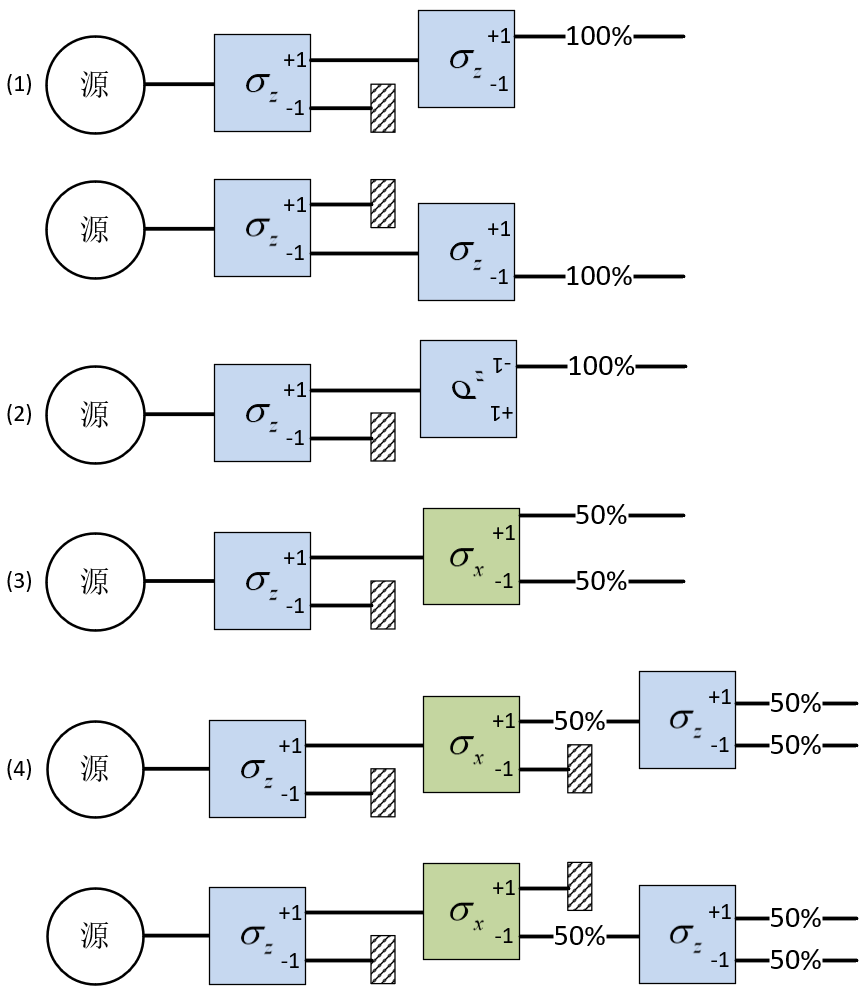
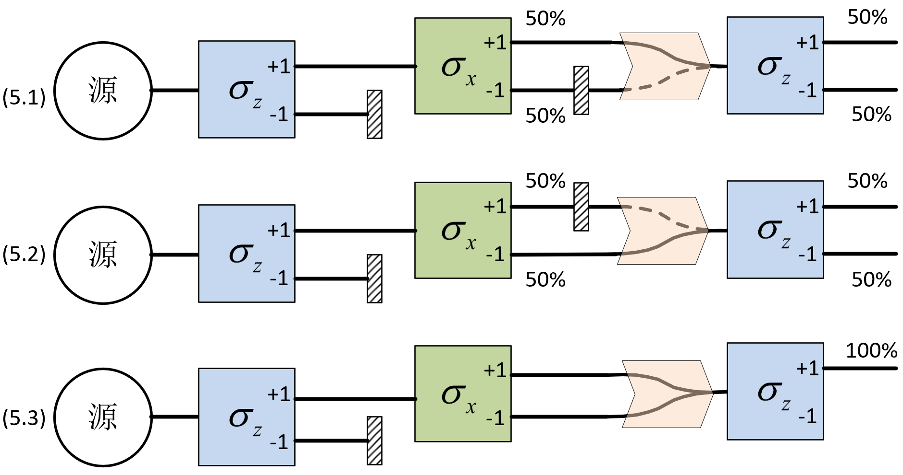

# Vectors and Quantum States

Quantum mechanics grew out of many researchers' ideas, experiments, and false starts. We could retrace that history, but there is a more direct way into the subject: begin with a simple experiment and let its results guide us toward the principles of modern quantum mechanics.

Our starting point is a particle with just two possible spin outcomes. By the end of this chapter, you should be able to distinguish spatial vectors from quantum state vectors, calculate inner products in a complex vector space, and express the same state vector in different orthonormal bases. Spin-1/2 states will give these mathematical ideas a physical setting.

## The Stern–Gerlach experiment

Spin angular momentum ${\bf{S}}$ is an intrinsic property of a microscopic particle, just as charge and mass are. Charge and mass are scalars, whereas spin is a vector. Its magnitude is fixed, but its projection along a chosen spatial direction can take different, quantized values. For electrons, neutrons, and protons, there are just two possibilities: $+ \frac{\hbar}{2}$ or $- \frac{\hbar}{2}$. These are spin-1/2 particles. A system with only two spin outcomes gives us a simple place to begin exploring quantum mechanics. To avoid repeatedly writing $\frac{\hbar}{2}$, we define a new quantity ${\bf{\sigma }}$:

$$
{\bf{S}} \equiv \frac{\hbar }{2}{\bf{\sigma }}
$$ {#eq-zeqnnum505139}

Choose a direction in space and label it with the unit vector ${\bf{n}}$. The quantity ${\sigma _n} \equiv {\bf{\sigma }} \cdot {\bf{n}}$ is the projection of ${\bf{\sigma }}$ along ${\bf{n}}$. When we measure ${\sigma _n}$ for a spin-1/2 particle, there are only two possible answers: $+ 1$ or $- 1$.

A Stern–Gerlach (SG) apparatus turns these spin outcomes into separate outgoing paths. A strong magnetic-field gradient deflects the particles, and each exit corresponds to a different spin projection along the gradient direction.[^01-vectors-and-quantum-states-1] A spin-$1/2$ particle has only two possible exits, corresponding to ${\sigma _n} = \pm 1$. Imagine a source continuously emitting spin-1/2 particles with random spin orientations. We make the beam weak enough that particles travel through the apparatus one at a time and do not interact with one another. We can now arrange the apparatuses as shown in @fig-sg-sequences and follow what happens to the particles.

[^01-vectors-and-quantum-states-1]: A Stern–Gerlach apparatus directly measures the magnetic moment $\mu$, with $\mu =\gamma S$, where $\gamma$ is a constant.

Before reading the result of each experiment, pause and make a prediction. Keep track of what has been measured and which outgoing beam is allowed to continue.

{#fig-sg-sequences width="537px"}

**Experiment 1.** Place an SG apparatus immediately after the source, with its field gradient along $z$, to measure ${\sigma _z}$. Particles from the random source leave through the positive and negative exits with equal probability. Now block the ${\sigma _z} = - 1$ exit. Only particles with ${\sigma _z} = + 1$ continue through the “$+1$” exit. Place a second apparatus, oriented in the same direction, after the first apparatus's “$+1$” exit and measure ${\sigma _z}$ again. This time there is no split: every particle ($100\%$) gives ${\sigma _z} = + 1$. Similarly, selecting ${\sigma _z} = - 1$ at the first apparatus and placing the second at its “$-1$” exit gives ${\sigma _z} = - 1$ for every particle ($100\%$). The same agreement holds when both detectors point along any direction ${\bf{n}}$. So a measurement result can be repeated. We have also gained a practical tool: measuring ${\sigma _n}$ allows us to prepare particles with ${\sigma _n} = + 1$ or $- 1$.

**Experiment 2.** Turn the second ${\sigma _z}$ apparatus around so that it points in the opposite direction to the first. Every particle leaving the first apparatus's “$+1$” exit now leaves the second apparatus's “$-1$” exit[^01-vectors-and-quantum-states-2], and vice versa. Reversing the detector reverses the sign of the result, just as we would expect for a vector projection.

[^01-vectors-and-quantum-states-2]: The force on the particle is ${F}_{z}\propto {\sigma }_{z}\frac{\partial {B}_{z}}{\partial z}$. The $z$ axis is fixed. Reversing the detector along $z$ reverses both the magnetic-field gradient convention and ${B}_{z}$, so the sign of the gradient of ${B}_{z}$ remains unchanged. The sign of the particle's ${\sigma }_{z}$ does not depend on detector orientation, so ${F}_{z}$ is unchanged and the particle still leaves through the upper exit. However, the exits marked $+1$ and $-1$ have exchanged places, so the particle now exits through $-1$. We need not know the detector's internal operation: its scale labels values of ${\sigma }_{z}$. Experiment shows that oppositely oriented detectors assign opposite signs to the same measured quantity.

**Experiment 3.** First use a ${\sigma _z}$ apparatus to select particles with ${\sigma _z} = + 1$. Then turn to a different direction and measure ${\sigma _x}$. The beam splits evenly: ${\sigma _x} = + 1$ for 50% of the particles and ${\sigma _x} = - 1$ for $50\%$. A natural classical picture is that we have simply sorted the particles by another property. On that picture, particles in the upper outgoing beam have both ${\sigma _z} = + 1$ and ${\sigma _x} = + 1$, while those in the lower beam have both ${\sigma _z} = + 1$ and ${\sigma _x} = - 1$.

Hold on to that prediction. The next experiment puts it to the test.

**Experiment 4.** After the second apparatus in Experiment 3, select particles with ${\sigma _x} = + 1$ and send them through a third apparatus measuring ${\sigma _z}$. Our classical picture predicts ${\sigma _z} = + 1$ every time. But the particles do something else: half give ${\sigma _z} = + 1$ and half give ${\sigma _z} = - 1$. Try the other beam. Select ${\sigma _x} = - 1$ after the second apparatus and move the third, ${\sigma _z}$-measuring apparatus to its “$-1$” exit. Once again, ${\sigma _z} = + 1$ and ${\sigma _z} = - 1$ occur with equal probabilities. Compare this with Experiment 1. The crucial change is a measurement of ${\sigma _x}$ between two measurements of ${\sigma _z}$. Measuring ${\sigma _x}$ completely destroys the previously acquired information about ${\sigma _z}$. This is not a peculiarity of the SG apparatus: any method of measuring the ${\bf{\sigma }}$ projection has the same consequence. A particle cannot have definite values of both ${\sigma }_{x}$ and ${\sigma }_{z}$.

{width="554px"}

::: source-caption
Figure 1.2. Recombination of the two SG paths.
:::

**Experiment 5.** Previously, we moved the next detector to align it with each exit of the preceding one. For convenience, we now use magnets as a beam combiner, merging particles entering at different heights into a single outgoing line. Place it between the second and third SG apparatuses of Experiment 4, as in Figure 1.2. **Experiments 5.1–5.2:** block one exit of the second apparatus to select ${\sigma }_{x}=-1$ or $+1$, and send the selected particles through the combiner into the ${\sigma }_{z}$ detector. As before, ${\sigma }_{z}=+1$ and $-1$ each occur with probability $50\%$. **Experiment 5.3:** remove the blocking plate so that particles from either exit pass through the combiner into the ${\sigma }_{z}$ detector. Classical reasoning says that each “$\pm 1$” exit of the ${\sigma }_{x}$ detector is taken with probability $50\%$, and that particles from either exit subsequently give $\pm 1$ in the ${\sigma }_{z}$ detector with probability $50\%$. Opening both exits should therefore still give each ${\sigma }_{z}=\pm 1$ result with probability $50\%$. In fact, every measurement of ${\sigma }_{z}$ gives $+1$! Experiments 4 and 5 show that when the result of ${\sigma }_{x}$ cannot be known, the probability of ${\sigma }_{z}=+1$ is $100\%$, whereas making the result of ${\sigma }_{x}$ knowable gives the two ${\sigma }_{z}=\pm 1$ results with probability $50\%$ each.

At this point, resist the urge to force the results into a familiar classical picture. They are the observations our theory must explain. The familiar behavior of the classical world emerges on a macroscopic scale, where enormous numbers of particles interact.

Experimentally, suppose two directions ${\bf{n}}$ and ${\bf{m}}$ make an angle $\theta$. First measure the projection of ${\bf{\sigma }}$ along ${\bf{n}}$, obtaining ${\sigma _n} = + 1$, and then measure ${\sigma _m}$, the projection of ${\bf{\sigma }}$ along ${\bf{m}}$. The probabilities of ${\sigma _m} = + 1$ and $- 1$ are ${\cos ^2}(\frac{\theta}{2})$ and ${\sin ^2}(\frac{\theta}{2})$, respectively. Experiment 1 has $\theta=0$, Experiment 2 has $\theta=\pi$, and Experiment 3 has $\theta=\pi/2$. These probabilities give the mean value $( + 1) \cdot {\cos ^2}(\frac{\theta}{2}) + ( - 1) \cdot {\sin ^2}(\frac{\theta}{2}) = \cos (\theta )$ for ${\sigma _m}$. Although individual measurements of ${\bf{\sigma }}$ have unfamiliar outcomes, the average of ${\bf{\sigma }}$ behaves like a classical vector. The mean of ${\bf{\sigma }}$ is also called the **spin-polarization vector**.

Keep these experiments in mind as we turn to the mathematics. We will build the language of quantum mechanics step by step, then return to the puzzles that brought us here.

## Vector spaces

In classical mechanics, a system's state at time $t$ is described by the collection of values of its dynamical variables at that instant. Imagine taking a complete snapshot of the system: for each particle, you record its position and momentum. For particle $i$, these are ${x}_{i}\left( t\right) ,{p}_{i}\left( t\right)$. Angular momentum, kinetic energy, and potential energy can then be calculated from the positions and momenta. The collection $\left\{ {x}_{i}\left( t\right) ,{p}_{i}\left( t\right) ,\cdots \right\}$ describes the classical state, and Newton's second law determines how it changes with time.

Einstein famously said that he did not believe God played dice. In classical mechanics, we use statistical predictions because our information or computational resources are limited. In principle, an observer with complete knowledge of every particle's state at one instant and unlimited computational resources could predict the system's state at any past or future time with unlimited precision. This is **classical determinism**.

Now try to take the same kind of snapshot of a quantum system. Even a single isolated electron cannot have definite spin projections along two nonparallel directions. Certain pairs of observables are generally incompatible, including position and its corresponding momentum component, and different angular-momentum components. A list of definite values for all dynamical variables therefore cannot describe a quantum state. We need a different mathematical description. Experiments show that this quantum description also underlies classical mechanics, which emerges as a macroscopic approximation.

In quantum mechanics, we distinguish a system's **quantum state** from its dynamical variables, called **observables**. Given the state at one instant, the Schrödinger equation determines how it evolves. Although the evolution of the state is deterministic and the state contains the maximal information of the system it describes, what we can tell about the measurement outcome of a observable of the system is mostly probabilistic. Heisenberg, Schrödinger, Dirac, and others developed the mathematical language needed to express this distinction. Several equivalent formulations exist. We will use the concise and general Dirac–von Neumann formulation; Heisenberg's matrix mechanics and Schrödinger's wave mechanics are concrete realizations of it.

The mathematical starting point is simple: in quantum mechanics quantum states are represented by vectors and observables by operators. This chapter develops the vectors; the next introduces the operators.

**Quantum postulate for pure states.** A pure quantum state contains all the information supplied by quantum mechanics about a system at a given instant. It is represented by a nonzero vector in a complex vector space equipped with an inner product. We normally choose this vector to have unit norm. Multiplying a normalized state vector by an overall phase factor $e^{i\alpha}$ does not change the physical state.

When you hear *vector*, you may picture an arrow in three-dimensional space. Keep that familiar picture, but make room for a second meaning: a vector can also represent a quantum state. We will call vectors in physical three-dimensional space **spatial vectors** and vectors representing quantum states **state vectors**. The latter belong to the system's **state space**, or **Hilbert space**.

Dirac gave state vectors their own notation: $\lvert\text{vector name}\rangle$. A vector written this way is called a **ket**. The symbols may look unfamiliar at first, but they obey the vector-space rules we are about to use.

For example, write $|+z\rangle$ for the state prepared by selecting the $\sigma_z=+1$ exit of an SG apparatus and $|-z\rangle$ for the state prepared by selecting the $\sigma_z=-1$ exit. These are state vectors, not spatial vectors pointing along the $z$ axis. A spatial vector has a well-defined length and direction, but state vector is an abstract identity representing the quantum state. Their distinctions will become clearer in the future.

Some useful vector-space identities are:

$$
\begin{aligned}
\text{Commutativity:}\quad &\lvert\psi_\alpha\rangle+\lvert\psi_\beta\rangle=\lvert\psi_\beta\rangle+\lvert\psi_\alpha\rangle\\
\text{Associativity:}\quad &(\lvert\psi_\alpha\rangle+\lvert\psi_\beta\rangle)+\lvert\psi_\gamma\rangle
=\lvert\psi_\alpha\rangle+(\lvert\psi_\beta\rangle+\lvert\psi_\gamma\rangle)\\
\text{Complex scalars:}\quad &c\lvert\psi\rangle=\lvert\psi\rangle c\\
\text{Scalar associativity:}\quad &c_1(c_2\lvert\psi\rangle)=(c_1c_2)\lvert\psi\rangle\\
\text{Scalar identity:}\quad &1\lvert\psi\rangle=\lvert\psi\rangle\\
\text{Distributivity:}\quad &(c_1+c_2)\lvert\psi\rangle=c_1\lvert\psi\rangle+c_2\lvert\psi\rangle\\
&c(\lvert\psi_\alpha\rangle+\lvert\psi_\beta\rangle)=c\lvert\psi_\alpha\rangle+c\lvert\psi_\beta\rangle
\end{aligned}
$$ {#eq-zeqnnum995300}

Here $c,{c_1},{c_2}$ are complex numbers. Read these identities as rules for working with vectors: we can change the order or grouping of addition and distribute scalar multiplication over a sum. The examples below will show what these operations look like in practice.

A vector space is closed under addition and scalar multiplication: these operations always produce another vector in the same space.

**Zero vector.** Every vector space contains a special zero vector, $\left\vert  {{\rm{null}}} \right\rangle$, which may be thought of as having zero length. It is defined by the following condition for every vector $|\psi\rangle$:

$$
\left\vert  {{\rm{null}}} \right\rangle + |\psi\rangle = |\psi\rangle , \qquad  \qquad  0|\psi\rangle = \left\vert  {{\rm{null}}} \right\rangle
$$ {#eq-zeqnnum835984}

The zero vector is needed for vector addition and cancellation, but represents no physical state.

If $|\psi_1\rangle$ and $|\psi_2\rangle$ belong to the same vector space, their linear combination $|\psi\rangle=c_1|\psi_1\rangle+c_2|\psi_2\rangle$ belongs to that space as well. A set of vectors is **linearly dependent** if some linear combination of them equals the zero vector with coefficients that are not all zero. In particular, the set $\{|\psi\rangle,|\psi_1\rangle,|\psi_2\rangle\}$ is dependent because $|\psi\rangle-c_1|\psi_1\rangle-c_2|\psi_2\rangle=0$.

## Examples of complex linear vector spaces

The word *vector* may bring an arrow to mind, but a vector space can contain other kinds of objects. What matters is how those objects add and how they multiply by scalars. In each example below, check that adding two members or multiplying a member by a complex number keeps us within the collection.

**Example 1: complex column matrices with** $n$ components.

Start with something familiar: a column of $n$ complex numbers. Add two such $n$-component columns entry by entry, or multiply every entry by the same complex number. The result is still a column with $n$ components. Thus, these columns form a complex vector space and will become a useful way to represent quantum states.

$$
\begin{pmatrix}a_1\\a_2\\a_3\\\vdots\\a_n\end{pmatrix},\quad a_i\in\mathbb C;\qquad\lvert\mathrm{null}\rangle=\begin{pmatrix}0\\0\\0\\\vdots\\0\end{pmatrix}
$$ {#eq-ch01-p0170}

**Example 2: solutions of a homogeneous linear differential equation.**

Now consider a different kind of object: a function that solves the equation

$$
\frac{{{d^2}}}{{d{t^2}}}x(t) + 2\beta \frac{d}{{dt}}x(t) + \omega _0^2x(t) = 0
$$ {#eq-ch01-p0173}

Here we allow complex-valued solutions. If ${x_1}(t)$ and ${x_2}(t)$ are solutions, any complex linear combination of them is also a solution. Thus, the collection of solutions forms a complex vector space. Restricting the solutions to real-valued functions would instead give a real vector space.

## Bras and inner products

So far, we can add vectors and multiply them by complex numbers. To discuss their lengths and how they relate to one another, we need another operation. Think of the dot product of two Cartesian vectors: it takes two vectors and returns a number.

An **inner product** generalizes this idea to complex vector spaces. It is a rule that assigns a complex number to each ordered pair of vectors. To qualify as an inner product, the rule must satisfy three conditions: linearity in the second vector, conjugate symmetry when the vectors are exchanged, and positive definiteness when a vector is paired with itself. We will write these conditions explicitly below. Together, they let us define length and orthogonality in the space.

Dirac introduced a neat notation for this operation. To write the inner product of $|\varphi\rangle$ and $|\psi\rangle$, we write the first vector as a **bra**, $\langle\varphi|$, and place it next to the second vector's ket. The two brackets fit together:

$$
\langle \varphi|  \cdot |\psi\rangle \equiv \langle \varphi|\psi\rangle = c
$$ {#eq-zeqnnum133573}

Here $c$ is the resulting complex number. The inner product supplies the rule for calculating it; the bra–ket notation gives us a compact way to write it. A bra is the dual object associated with a ket. For now, we can work with this correspondence through the rules below; the column-matrix example will make it concrete.

Kets and bras each form a complex vector space. The correspondence between them is **antilinear**: when we convert a ket into its corresponding bra, we take the complex conjugate of each coefficient. The conversion rules are

$$
\begin{aligned}
|\psi\rangle &\longleftrightarrow \langle\psi|,\\
c|\psi\rangle &\longleftrightarrow c^*\langle\psi|,\\
c_1|\alpha\rangle+c_2|\beta\rangle
&\longleftrightarrow c_1^*\langle\alpha|+c_2^*\langle\beta|.
\end{aligned}
$$ {#eq-zeqnnum136783}

We can now express the defining properties of the inner product in bra–ket notation.

**Distributivity:**

$$
\begin{array}{l} \langle \gamma\vert \left( {{c_1}\vert \alpha\rangle + {c_2}\vert \beta\rangle } \right) = {c_1}\langle \gamma|\alpha\rangle + {c_2}\langle \gamma|\beta\rangle ,\\ \left( {{c_1}\langle \gamma\vert {\rm{ + }}{c_2}\langle \beta\vert } \right)\vert \alpha\rangle = {c_1}\langle \gamma|\alpha\rangle + {c_2}\langle \beta|\alpha\rangle \end{array}
$$ {#eq-zeqnnum320588}

**Conjugate symmetry:**

$$
\langle \varphi|\psi\rangle = \langle \psi|\varphi\rangle *
$$ {#eq-zeqnnum921664}

Now apply conjugate symmetry, @eq-zeqnnum921664, to a vector paired with itself. The result equals its own complex conjugate, so it must be real:

$$
\langle \psi|\psi\rangle = \langle \psi|\psi\rangle *
$$ {#eq-ch01-p0188}

To make this quantity behave like a squared length, we also require

$$
\langle \psi|\psi\rangle \ge 0
$$ {#eq-zeqnnum281628}

Equality holds only for $\vert \psi\rangle = \vert {{\rm{null}}}\rangle$. A vector $\vert \psi\rangle$ whose inner product with itself is one,

$$
\langle \psi|\psi\rangle = 1
$$ {#eq-ch01-p0192}

is **normalized**. Any nonzero, unnormalized vector $|\psi\rangle$ can be normalized as follows:

$$
\left\vert  {\tilde \psi } \right\rangle = \frac{{|\psi\rangle }}{{\sqrt {\langle \psi|\psi\rangle } }}
$$ {#eq-ch01-p0194}

Try a concrete example: $|\chi\rangle=\begin{pmatrix}1\\i\end{pmatrix}$. To obtain its bra, turn the column into a row and take the complex conjugate of each entry. This gives $\langle\chi|=\begin{pmatrix}1&-i\end{pmatrix}$, so $\langle\chi|\chi\rangle=1+(-i)i=2$. Divide by the square root of this squared norm to obtain the normalized ket $|\chi\rangle/\sqrt{2}$. Notice the minus sign in the bra: it comes from complex conjugation. Simply turning the column into a row would give the wrong inner product.

Let us put the bra–ket notation to work with column matrices. Here we can see every step of the calculation.

**Example.** We know that complex column matrices form a complex linear vector space. How can their inner product produce a number and satisfy all the rules from @eq-zeqnnum133573 to @eq-zeqnnum281628? In linear algebra, multiplying a row matrix by a column matrix gives a number. Thus, if a column represents a ket, its conjugate-transpose row represents the dual bra. For example,

$$
\begin{array}{l} |\phi\rangle = \left( {\begin{array}{*{20}{c}} {{a_1}}\\ {{a_2}} \end{array}} \right) \leftrightarrow \langle \phi|  = \left( {\begin{array}{*{20}{c}} {a_1^*}&{a_2^*} \end{array}} \right)\\ |\psi\rangle = \left( {\begin{array}{*{20}{c}} {{b_1}}\\ {{b_2}} \end{array}} \right) \leftrightarrow \langle \psi|  = \left( {\begin{array}{*{20}{c}} {b_1^*}&{b_2^*} \end{array}} \right) \end{array}
$$ {#eq-ch01-p0197}

The inner product $\langle \phi|\psi\rangle$ can then be defined by ordinary matrix multiplication:

$$
\langle \phi|\psi\rangle = \left( {\begin{array}{*{20}{c}} {a_1^*}&{a_2^*} \end{array}} \right)\left( {\begin{array}{*{20}{c}} {{b_1}}\\ {{b_2}} \end{array}} \right) = a_1^*{b_1} + a_2^*{b_2}
$$ {#eq-zeqnnum248635}

These definitions satisfy all the required properties. Check conjugate symmetry, @eq-zeqnnum921664, explicitly by reversing the two vectors:

$$
\langle \psi|\phi\rangle = \left( {\begin{array}{*{20}{c}} {b_1^*}&{b_2^*} \end{array}} \right)\left( {\begin{array}{*{20}{c}} {{a_1}}\\ {{a_2}} \end{array}} \right) = b_1^*{a_1} + b_2^*{a_2} = {({b_1}a_1^* + {b_2}a_2^*)^*} = {\langle \phi|\psi\rangle ^*}
$$ {#eq-ch01-p0201}

## Orthogonality and basis vectors

Two Cartesian vectors ${\bf{a}},{\bf{b}}$ are perpendicular when ${\bf{a}} \cdot {\bf{b}} = 0$. At most three nonzero vectors in three-dimensional Cartesian space can be mutually perpendicular. Rotating such a set gives infinitely many alternative sets, but never more than three mutually perpendicular vectors; this is the dimension of the space. Given mutually perpendicular unit vectors ${\bf{x}},{\bf{y}},{\bf{z}}$, any Cartesian vector ${\bf{v}}$ can be expressed as their linear combination:

$$
{\bf{v}} = \left( {{\bf{x}} \cdot {\bf{v}}} \right){\bf{x}} + \left( {{\bf{y}} \cdot {\bf{v}}} \right){\bf{y}} + \left( {{\bf{z}} \cdot {\bf{v}}} \right){\bf{z}} = {v_x}{\bf{x}} + {v_y}{\bf{y}} + {v_z}{\bf{z}}
$$ {#eq-ch01-p0204}

We can collect the three components of ${\bf{v}}$ into a column matrix:

$$
{\bf{v}} = \left( {\begin{array}{*{20}{c}} {{v_x}}\\ {{v_y}}\\ {{v_z}} \end{array}} \right){\rm{ = }}\left( {\begin{array}{*{20}{c}} {{\bf{x}} \cdot {\bf{v}}}\\ {{\bf{y}} \cdot {\bf{v}}}\\ {{\bf{z}} \cdot {\bf{v}}} \end{array}} \right)
$$ {#eq-ch01-p0206}

Picture a fixed vector ${\bf{v}}$ while you rotate the coordinate axes. Rotating the ${\bf{x}},{\bf{y}},{\bf{z}}$ axes changes the components of ${\bf{v}}$, even though the vector itself stays fixed. In their own coordinate system, the coordinate unit vectors always have the following column representations:

$$
{\bf{x}} = \left( {\begin{array}{*{20}{c}} 1\\ 0\\ 0 \end{array}} \right), \qquad  {\bf{y}} = \left( {\begin{array}{*{20}{c}} 0\\ 1\\ 0 \end{array}} \right), \qquad  {\bf{z}} = \left( {\begin{array}{*{20}{c}} 0\\ 0\\ 1 \end{array}} \right)
$$ {#eq-ch01-p0208}

We can carry this familiar geometry into an inner-product vector space. Two nonzero vectors $|\psi\rangle$ and $|\phi\rangle$ are **orthogonal** if their inner product vanishes, $\langle \psi\vert \phi\rangle = 0$. The dimension is the maximum number of mutually orthogonal nonzero vectors. Using the inner product defined in @eq-zeqnnum248635, we can find infinitely many orthogonal pairs of two-component columns. Here are three pairs of normalized vectors:

$$
\left( {\begin{array}{*{20}{c}} 1\\ 0 \end{array}} \right),\;\;\left( {\begin{array}{*{20}{c}} 0\\ 1 \end{array}} \right); \qquad  \frac{1}{{\sqrt 2 }}\left( {\begin{array}{*{20}{c}} 1\\ 1 \end{array}} \right),\;\;\frac{1}{{\sqrt 2 }}\left( {\begin{array}{*{20}{c}} 1\\ { - 1} \end{array}} \right); \qquad  \frac{1}{{\sqrt 2 }}\left( {\begin{array}{*{20}{c}} 1\\ i \end{array}} \right),\;\;\frac{1}{{\sqrt 2 }}\left( {\begin{array}{*{20}{c}} 1\\ { - i} \end{array}} \right)
$$ {#eq-zeqnnum282640}

Choose any one of these pairs and try to find a third nonzero column vector orthogonal to both members. There is no room for one: the vector space of two-component columns has dimension two.

A **basis** is a linearly independent set of vectors that spans the space; it need not be orthogonal or normalized. A set of $N$ mutually orthogonal, normalized vectors in an $N$-dimensional inner-product space forms a **complete orthonormal basis**. We use orthonormal bases throughout this chapter. For any two vectors $|i\rangle,|j\rangle$ in such a basis,

$$
\langle j|i\rangle = {\delta _{ij}}
$$ {#eq-zeqnnum766490}

The symbol ${\delta _{ij}}$ is the **Kronecker delta**, defined by

$$
{\delta _{ij}} = \left\{ \begin{array}{l} 1, & i = j\\ 0, & i \ne j \end{array} \right.
$$ {#eq-ch01-p0216}

For spin-1/2, choose $|+z\rangle$ and $|-z\rangle$ as an orthonormal basis of the two-dimensional spin state space. Thus $\langle+z|+z\rangle=\langle-z|-z\rangle=1$ and $\langle+z|-z\rangle=0$. The measurement postulate introduced later will connect this orthogonality to the perfectly distinguishable outcomes of a $\sigma_z$ measurement.

A vector space has infinitely many possible complete bases. Each pair in @eq-zeqnnum282640 is a complete basis for the two-dimensional space. A basis acts like a coordinate system: every vector can be expanded as a linear combination of the basis vectors. In an $N$-dimensional space spanned by $\left\{ {|i\rangle } \right\},\;i \in \left\{ {1,2...N} \right\}$, any vector $|\psi\rangle$ can be written as

$$
|\psi\rangle = \sum\limits_i {{a_i}|i\rangle }
$$ {#eq-ch01-p0218}

Here ${a_i}$ is the complex coefficient of $|\psi\rangle$ along $|i\rangle$. To find a particular coefficient, apply the bra $\langle j|$ to both sides. Orthogonality removes every term except the one we want:

$$
\langle j|\psi\rangle = \sum\limits_i {\langle j| {a_i}|i\rangle } = \sum\limits_i {{a_i}\langle j|i\rangle } = \sum\limits_i {{a_i}{\delta _{ij}}} = {a_j}
$$ {#eq-ch01-p0220}

Thus the component of $|\psi\rangle$ along $|i\rangle$ is $\langle i|\psi\rangle$, and

$$
|\psi\rangle = \sum\limits_i {\langle i|\psi\rangle |i\rangle } = \sum\limits_i {|i\rangle } \langle i|\psi\rangle
$$ {#eq-zeqnnum935342}

This is an important identity. In the final step, the scalar $\langle i|\psi\rangle$ has been moved from the left of $|i\rangle$ to its right so that $\sum\nolimits_i {|i\rangle \langle i| }$ appears together. The [section on outer products, projection operators, and completeness](02-operators.qmd#outer-products-projection-operators-and-completeness) explains why. Combining @eq-zeqnnum136783 and @eq-zeqnnum921664 also gives the bra expansion:

$$
\langle \psi|  = \sum\limits_i {\langle \psi|i\rangle } \langle i|
$$ {#eq-ch01-p0224}

## Matrix representations of vectors

Once we have chosen a basis, we can gather the expansion coefficients in @eq-zeqnnum935342 into a column. This gives a concrete representation of the state vector:

$$
\lvert\psi\rangle=\begin{pmatrix}\langle 1\vert\psi\rangle\\\langle 2\vert\psi\rangle\\\vdots\\\langle N\vert\psi\rangle\end{pmatrix}
$$ {#eq-zeqnnum343100}

In this basis, each basis vector has one unit entry and zeros everywhere else:

$$
|1\rangle = \left( {\begin{array}{*{20}{c}} 1\\ 0\\ \vdots \\ 0 \end{array}} \right), \qquad  |2\rangle = \left( {\begin{array}{*{20}{c}} 0\\ 1\\ \vdots \\ 0 \end{array}} \right), \qquad  \cdots \qquad  |N\rangle = \left( {\begin{array}{*{20}{c}} 0\\ 0\\ \vdots \\ 1 \end{array}} \right)
$$ {#eq-ch01-p0229}

Always keep track of the basis attached to a column. Changing the basis changes the entries, so columns written in different bases must first be converted to a common basis before we combine them in a matrix calculation.

**Worked example: changing the basis.** Let us describe one state using two different sets of coordinates. In the $z$ basis, take

$$
|\psi\rangle=\frac{\sqrt{3}}{2}|+z\rangle+\frac{1}{2}|-z\rangle,
\qquad
[|\psi\rangle]_z=\begin{pmatrix}\sqrt{3}/2\\1/2\end{pmatrix}.
$$

Now choose a second orthonormal basis:

$$
|u\rangle=\frac{|+z\rangle+|-z\rangle}{\sqrt{2}},
\qquad
|v\rangle=\frac{|+z\rangle-|-z\rangle}{\sqrt{2}}.
$$

Taking inner products gives $\langle u|\psi\rangle=(\sqrt{3}+1)/(2\sqrt{2})$ and $\langle v|\psi\rangle=(\sqrt{3}-1)/(2\sqrt{2})$. Therefore

$$
|\psi\rangle=\frac{\sqrt{3}+1}{2\sqrt{2}}|u\rangle
+\frac{\sqrt{3}-1}{2\sqrt{2}}|v\rangle,
\qquad
[|\psi\rangle]_{uv}=\begin{pmatrix}(\sqrt{3}+1)/(2\sqrt{2})\\(\sqrt{3}-1)/(2\sqrt{2})\end{pmatrix}.
$$

Compare the two columns: their entries differ, yet they describe the same state vector. As a check, calculate its squared norm in each basis. We obtain $3/4+1/4=1$ in the first and $[(\sqrt{3}+1)^2+(\sqrt{3}-1)^2]/8=1$ in the second. The bracketed notation tells us which basis each column uses.

Use the following comparison to connect the new notation to the Cartesian vectors you already know:

$$
\begin{array}{*{20}{c}} {\text{Cartesian space}}&{{\text{ }} \to {\text{ }}}&{\text{Vector space}} \\ {\text{Dot product}:{\mathbf{a}} \cdot {\mathbf{b}} = {\mathbf{b}} \cdot {\mathbf{a}}}&{}&{\text{Inner product}:\;\langle \phi\vert \psi\rangle = {{\langle \psi\vert \phi\rangle }^*}} \\ {\text{Perpendicular}:{\mathbf{a}} \cdot {\mathbf{b}} = 0}&{}&{\text{Orthogonal}:\;\langle \psi\vert \phi\rangle = 0} \\ {\text{Coordinate unit vectors}{\mathbf{\hat x}},{\mathbf{\hat y}},{\mathbf{\hat z}}}&{}&{\text{Basis vectors}{\text{ }}\left\{ {\vert i\rangle } \right\}} \\ {\text{Coordinate system}}&{}&{\text{Complete basis}(\text{basis})} \\ {\text{Coordinates}:{\mathbf{v}} = \left( {\begin{array}{*{20}{c}} {{\mathbf{\hat x}} \cdot {\mathbf{v}}} \\ {{\mathbf{\hat y}} \cdot {\mathbf{v}}} \\ {{\mathbf{\hat z}} \cdot {\mathbf{v}}} \end{array}} \right)}&{}&{\text{Basis expansion}:|\psi\rangle = \left( {\begin{array}{*{20}{c}} {\langle 1|\psi\rangle } \\ {\langle 2|\psi\rangle } \\ \vdots \\ {\langle N|\psi\rangle } \end{array}} \right)} \end{array}
$$ {#eq-ch01-p0232}

## Exercises

**Warm-up.** Given $|\chi\rangle=\begin{pmatrix}2\\i\end{pmatrix}$ and $|\eta\rangle=\begin{pmatrix}1\\1\end{pmatrix}$, write their bras, calculate $\langle\chi|\eta\rangle$ and $\langle\eta|\chi\rangle$, and normalize $|\chi\rangle$. Check conjugate symmetry.

**1.1.** Test each collection below: does it form a complex vector space under the usual addition and scalar multiplication? Focus on the vector-space rules; an inner product and completeness are not required.

- All complex numbers.

- All vectors in three-dimensional Cartesian space.

- All complex-valued solutions $\psi(x)$ of the following equation on a fixed interval, with fixed real $E$ and a finite, continuous $V(x)$. No normalization or boundary conditions are imposed.

$$
\left[ { - \frac{{{\hbar ^2}}}{{2m}}\frac{{{d^2}}}{{d{x^2}}} + V(x)} \right]\psi (x) = E\psi (x)
$$ {#eq-ch01-p0240}

**1.2.** Prove $\langle \alpha|\alpha\rangle \langle \beta|\beta\rangle \ge {\left\vert  {\langle \alpha|\beta\rangle } \right\vert ^2}$.

Hint: construct $\vert \psi \rangle$ as a linear combination of $\vert \alpha\rangle$ and $\vert \beta\rangle$, and use @eq-zeqnnum281628 $\langle \psi|\psi\rangle \ge 0$.

**1.3.** A two-dimensional vector $|\psi\rangle$ has the following expansion in the basis $\left\{ {\vert {\alpha _1}\rangle ,\vert {\alpha _2}\rangle } \right\}$:

$$
\vert \psi \rangle = \vert {\alpha _1}\rangle + 3\vert {\alpha _2}\rangle
$$ {#eq-ch01-p0246}

A second basis $\left\{ {\vert {\beta _1}\rangle ,\vert {\beta _2}\rangle } \right\}$ satisfies

$$
\left\vert  {{\beta _1}} \right\rangle = \frac{1}{{\sqrt 2 }}\left( {\vert {\alpha _1}\rangle + i\vert {\alpha _2}\rangle } \right), \qquad  \left\vert  {{\beta _2}} \right\rangle = \frac{1}{{\sqrt 2 }}\left( {\vert {\alpha _1}\rangle - i\vert {\alpha _2}\rangle } \right)
$$ {#eq-ch01-p0248}

Express $|\psi\rangle$ in the second basis using two different methods, and check that your answers agree.