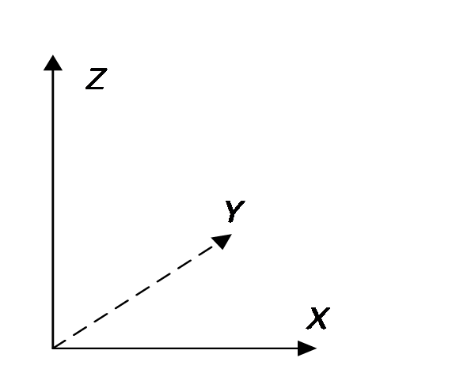
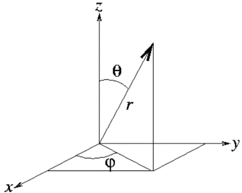

# Quantum Measurement

We now connect the abstract mathematics of vectors and operators with physical reality.

## The measurement postulates

- **Quantum postulate 1.** An observable corresponds to a Hermitian operator, whose eigenvalues are all the possible values of that observable.

- **Quantum postulate 2.** A system's quantum state corresponds to a normalized vector, such as $\vert \psi \rangle$, containing all information about the system. If $c$ is a phase factor, $c\left\vert  \psi \right\rangle$ and $\left\vert  \psi \right\rangle$ represent the same physical state.

- **Quantum postulate 3.** If $\vert {{\psi _1}}\rangle ,\vert {{\psi _2}}\rangle ,...$ are possible states of a system, their superposition $\sum\nolimits_j {{c_j}\vert {{\psi _j}}\rangle }$ is also a possible state, with $\sum\nolimits_j {\vert {c_j}{\vert ^2}} = 1$.

- If the superposition reduces to $c\left( {\vert {\psi _\alpha }\rangle + \vert {\psi _\beta }\rangle } \right)$, it represents the same state as $\vert {\psi _\alpha }\rangle + \vert {\psi _\beta }\rangle$. A common overall phase has no physical significance.

- **Quantum postulate 4.** If observable $\hat A$ has a definite value $a$, the system is in eigenstate $\vert a\rangle$ of $\hat A$ belonging to eigenvalue $a$. Here we assume $a$ is nondegenerate.

- **Quantum postulate 5—the measurement principle.** Measuring $\hat A$ in state $\vert \psi \rangle$ gives an eigenvalue ${a_j}$ of $\hat A$ with probability $\vert \langle {a_j}\vert \psi \rangle {\vert ^2}$. Afterward, the state collapses to eigenstate $\vert {a_j}\rangle$ associated with the measured value ${a_j}$. The inner product $\langle {a_j}\vert \psi \rangle$ is the **probability amplitude** for this event. More generally, the probability of finding $\vert \phi \rangle$ in state $\vert \psi \rangle$ is ${\left\vert  {\langle \phi\vert \psi\rangle } \right\vert ^2}$, with amplitude $\langle \phi\vert \psi\rangle$.

The measurement principle can be summarized as follows.

Solve the eigenvalue equation $\hat A\left\vert  {{a_i}} \right\rangle = {a_i}\left\vert  {{a_i}} \right\rangle$ of observable $\hat A$ to obtain its eigenvalues and eigenstates:

$$
\begin{array}{*{20}{c}} {\text{Initial state}}&{}&{}&{\text{Final state}}&{\text{Result}}&{\text{Probability}} \\ {\left\vert  \psi \right\rangle }&{\xrightarrow{{\text{Measure }\hat A}}}&{\left\{ {\begin{array}{*{20}{c}} {} \\ {} \\ {} \\ {} \end{array}} \right.}&{\begin{array}{*{20}{c}} {\vert {{a_1}} \rangle } \\ \vdots \\ {\vert {{a_j}} \rangle } \\ \vdots \end{array}}&{\begin{array}{*{20}{c}} {{a_1}} \\ \vdots \\ {{a_j}} \\ \vdots \end{array}}&{\begin{array}{*{20}{c}} {{{\left\vert  {\langle {{a_1}}\vert \psi\rangle } \right\vert }^2}} \\ \vdots \\ {{{\left\vert  {\langle {{a_j}}\vert \psi\rangle } \right\vert }^2}} \\ \vdots \end{array}} \end{array}
$$ {#eq-ch03-p0440}

Collapse is random: we know the probabilities, but cannot predict which eigenstate of $\hat A$ the state $\vert \psi \rangle$ will collapse into. Only when the initial state is already an eigenstate $\left\vert  a \right\rangle$ of $\hat A$ does measuring $\hat A$ leave it unchanged, with the definite result $a$. An observable therefore has a definite value in its eigenstates.

Measuring $\hat A$ must yield some eigenvalue of $\hat A$, so the probabilities sum to $1$:

$$
\sum\limits_j {{{\left\vert  {\left\langle {{{a_j}}} \mathrel{\left \vert  {\vphantom {{{a_j}} \psi }} \right. \kern-1.2pt } {\psi } \right\rangle } \right\vert }^2} = 1}
$$ {#eq-ch03-p0443}

Equivalently,

$$
\sum\limits_j {\left\langle {\psi } \mathrel{\left \vert  {\vphantom {\psi {{a_j}}}} \right. \kern-1.2pt } {{{a_j}}} \right\rangle \left\langle {{{a_j}}} \mathrel{\left \vert  {\vphantom {{{a_j}} \psi }} \right. \kern-1.2pt } {\psi } \right\rangle } = 1
$$ {#eq-ch03-p0445}

Using completeness, @eq-zeqnnum286146, this simplifies to

$$
\left\langle {\psi } \mathrel{\left \vert  {\vphantom {\psi \psi }} \right. \kern-1.2pt } {\psi } \right\rangle = 1
$$ {#eq-ch03-p0447}

Thus state vectors must be normalized to conserve total probability.

The postulates also imply the following.

- Measurement provides a method of state preparation: select systems with measured value ${a_j}$ to prepare the definite state $\vert {a_j}\rangle$.

- Eigenvectors of a Hermitian operator with different eigenvalues are orthogonal. Therefore, two states that can be distinguished with certainty by a single measurement must be orthogonal.

- If $\hat A$ has value $a$, the probability that a measurement of $\hat B$ yields $b$ is ${\left\vert  {\langle b\vert a\rangle } \right\vert ^2}$.

- After measuring $\hat B$ and obtaining $b$, the state collapses to $\vert b\rangle$. The probability that $\hat A$ still has value $a$ is then ${\left\vert  {\langle a\vert b\rangle } \right\vert ^2}$. The next chapter examines relationships between observables.

**Theorem 3.1.** In state $\left\vert  \psi \right\rangle$, the mean value of observable $\hat A$ is $\left\langle \psi \right\vert \hat A\left\vert  \psi \right\rangle$.

**Proof.**

$$
\begin{array}{c} \left\langle \psi \right\vert \hat A\left\vert  \psi \right\rangle = \sum\limits_i {\left\langle \psi \right\vert \hat A\left\vert  {{a_i}} \right\rangle \left\langle {{{a_i}}} \mathrel{\left \vert  {\vphantom {{{a_i}} \psi }} \right. \kern-1.2pt } {\psi } \right\rangle } = \sum\limits_i {\left\langle \psi \right\vert {a_i}\left\vert  {{a_i}} \right\rangle \left\langle {{{a_i}}} \mathrel{\left \vert  {\vphantom {{{a_i}} \psi }} \right. \kern-1.2pt } {\psi } \right\rangle } \\ = \sum\limits_i {{a_i}\left\langle {\psi } \mathrel{\left \vert  {\vphantom {\psi {{a_j}}}} \right. \kern-1.2pt } {{{a_j}}} \right\rangle \left\langle {{{a_i}}} \mathrel{\left \vert  {\vphantom {{{a_i}} \psi }} \right. \kern-1.2pt } {\psi } \right\rangle } = \sum\limits_i {{a_i}{{\left\vert  {\left\langle {{{a_i}}} \mathrel{\left \vert  {\vphantom {{{a_i}} \psi }} \right. \kern-1.2pt } {\psi } \right\rangle } \right\vert }^2}} \end{array}
$$ {#eq-zeqnnum739477}

The last line multiplies each value ${a_i}$ of $\hat A$ by the probability of obtaining ${a_i}$ in state $\left\vert  \psi \right\rangle$, then sums over all possibilities. This is precisely the mean of $\hat A$ in state $\left\vert  \psi \right\rangle$.

When the state is understood, the mean of a Hermitian operator $\hat X$ may be abbreviated $\langle {\hat X}\rangle$.

## A two-state spin system

Consider an observable with only two eigenstates. A system whose state space consists of these states is a **two-state system**, like the system in Chapter 1. Its observable is ${\hat \sigma _n}$, the projection of ${\bf{\sigma }}$ along ${\bf{n}}$, so ${\hat \sigma _n}$ is Hermitian. We now determine the eigenvalues and eigenstates of ${\hat \sigma _n}$.

- **Experiment:** measuring ${\hat \sigma _n}$ yields either $+ 1$ or $- 1$.

- **Postulate:** a measurement of an observable always yields one of its eigenvalues.

- **Conclusion:** ${\hat \sigma _n}$ has only two eigenvalues, $+ 1$ and $- 1$. Assuming each is nondegenerate, call their eigenstates $\left\vert  {\hat n + } \right\rangle$ and $\left\vert  {\hat n - } \right\rangle$:

$$
{\hat \sigma _n}\left\vert  {\hat n + } \right\rangle = + \left\vert  {\hat n + } \right\rangle , \qquad  \qquad  {\hat \sigma _n}\left\vert  {\hat n - } \right\rangle = - \left\vert  {\hat n - } \right\rangle
$$ {#eq-ch03-p0464}

The eigenvalues differ, so $\left\langle {{\hat n + }} \mathrel{\left \vert  {\vphantom {{\hat n + } {\hat n - }}} \right. \kern-1.2pt } {{\hat n - }} \right\rangle = 0$. These eigenstates form a basis for a two-dimensional vector space, called the ${\hat \sigma _n}$ representation.

We give the states memorable names. In the coordinates of Figure 3.1, the states for ${\sigma _z} = + 1$ and $- 1$ are $\left\vert  U \right\rangle$ and $\left\vert  D \right\rangle$ (Up and Down); those for ${\sigma _x} = + 1$ and $- 1$ are $\left\vert  R \right\rangle$ and $\left\vert  L \right\rangle$ (Right and Left). Measuring the projection along $y$, we call the states for ${\sigma _y} = + 1$ and $- 1$ $\left\vert  I \right\rangle$ and $\left\vert  O \right\rangle$ (In and Out).

{width=200px}

::: {.source-caption}
Figure 3.1. Coordinates defining Up and Down, Left and Right, and In and Out.
:::

The eigenstates of ${\hat \sigma _z}$ are $\left\vert  U \right\rangle$ and $\left\vert  D \right\rangle$, with eigenvalues $+ 1$ and $- 1$, respectively. Hence

$$
{\hat \sigma _z}\left\vert  U \right\rangle = + \left\vert  U \right\rangle , \qquad  \qquad  {\hat \sigma _z}\left\vert  D \right\rangle = - \left\vert  D \right\rangle , \qquad  \qquad  \left\langle {U} \mathrel{\left \vert  {\vphantom {U D}} \right. \kern-1.2pt } {D} \right\rangle = 0
$$ {#eq-ch03-p0470}

Similarly, for ${\hat \sigma _x}$ and ${\hat \sigma _y}$,

$$
{\hat \sigma _x}\left\vert  R \right\rangle = + \left\vert  R \right\rangle , \qquad  \qquad  {\hat \sigma _x}\left\vert  L \right\rangle = - \left\vert  L \right\rangle , \qquad  \qquad  \left\langle {R} \mathrel{\left \vert  {\vphantom {R L}} \right. \kern-1.2pt } {L} \right\rangle = 0
$$ {#eq-zeqnnum903599}

$$
{\hat \sigma _y}\left\vert  I \right\rangle = + \left\vert  I \right\rangle , \qquad  \qquad  {\hat \sigma _y}\left\vert  O \right\rangle = - \left\vert  O \right\rangle , \qquad  \qquad  \left\langle {I} \mathrel{\left \vert  {\vphantom {I O}} \right. \kern-1.2pt } {O} \right\rangle = 0
$$ {#eq-ch03-p0473}

To explain the experiments, we must now determine the relationships between these different states.

## Superposition of quantum states

We begin with eigenstates of different observables. In a spin-$1/2$ state space, at most two states can be mutually orthogonal, such as $\left\vert  U \right\rangle$ and $\left\vert  D \right\rangle$, $\left\vert  R \right\rangle$ and $\left\vert  L \right\rangle$, or $\left\vert  I \right\rangle$ and $\left\vert  O \right\rangle$. Choosing the ${\hat \sigma _z}$ representation with basis $\left\vert  U \right\rangle$ and $\left\vert  D \right\rangle$, completeness @eq-zeqnnum286146 gives

$$
\left\vert  U \right\rangle \left\langle U \right\vert  + \left\vert  D \right\rangle \left\langle D \right\vert  = \hat I
$$ {#eq-ch03-p0477}

Any spin state $\left\vert  \psi \right\rangle$ is a linear combination of $\left\vert  U \right\rangle$ and $\left\vert  D \right\rangle$. Following @eq-zeqnnum935342,

$$
\left\vert  \psi \right\rangle = \left\vert  U \right\rangle \left\langle {U} \mathrel{\left \vert  {\vphantom {U \psi }} \right. \kern-1.2pt } {\psi } \right\rangle + \left\vert  D \right\rangle \left\langle {D} \mathrel{\left \vert  {\vphantom {D \psi }} \right. \kern-1.2pt } {\psi } \right\rangle
$$ {#eq-zeqnnum905994}

To express $\left\vert  R \right\rangle$ and $\left\vert  L \right\rangle$ in basis $\left\{ {\left\vert  U \right\rangle ,\left\vert  D \right\rangle } \right\}$, use @eq-zeqnnum905994:

$$
\begin{array}{l} \left\vert  R \right\rangle = \left\vert  U \right\rangle \left\langle {U} \mathrel{\left \vert  {\vphantom {U R}} \right. \kern-1.2pt } {R} \right\rangle + \left\vert  D \right\rangle \left\langle {D} \mathrel{\left \vert  {\vphantom {D R}} \right. \kern-1.2pt } {R} \right\rangle \\ \left\vert  L \right\rangle = \left\vert  U \right\rangle \left\langle {U} \mathrel{\left \vert  {\vphantom {U L}} \right. \kern-1.2pt } {L} \right\rangle + \left\vert  D \right\rangle \left\langle {D} \mathrel{\left \vert  {\vphantom {D L}} \right. \kern-1.2pt } {L} \right\rangle \end{array}
$$ {#eq-ch03-p0481}

The SG experiment shows that when ${\hat \sigma _x}$ equals $1$, that is, in state $\left\vert  R \right\rangle$, a measurement of ${\hat \sigma _z}$ yields $+ 1$ and $- 1$ with equal 50% probabilities. Therefore,

$$
{\left\vert  {\left\langle {U} \mathrel{\left \vert  {\vphantom {U R}} \right. \kern-1.2pt } {R} \right\rangle } \right\vert ^2} = {\left\vert  {\left\langle {D} \mathrel{\left \vert  {\vphantom {D R}} \right. \kern-1.2pt } {R} \right\rangle } \right\vert ^2} = 1/2
$$ {#eq-zeqnnum248257}

The general solution is

$$
\left\langle {U} \mathrel{\left \vert  {\vphantom {U R}} \right. \kern-1.2pt } {R} \right\rangle = \frac{1}{{\sqrt 2 }}{e^{i{\phi _U}}}, \qquad  \qquad  \left\langle {D} \mathrel{\left \vert  {\vphantom {D R}} \right. \kern-1.2pt } {R} \right\rangle = \frac{1}{{\sqrt 2 }}{e^{i{\phi _D}}}
$$ {#eq-ch03-p0485}

The angles ${\phi _U}$ and ${\phi _D}$ are undetermined phases. The expansion of $\left\vert  R \right\rangle$ is therefore

$$
\left\vert  R \right\rangle = \frac{1}{{\sqrt 2 }}\left( {\left\vert  U \right\rangle + {e^{i\delta }}\left\vert  D \right\rangle } \right){e^{i{\phi _U}}}
$$ {#eq-zeqnnum575274}

Here $\delta = {\phi _D} - {\phi _U}$. Since an overall phase is arbitrary, choose ${\phi _U} = 0$, or ${e^{i{\phi _U}}} = 1$, giving

$$
\left\vert  R \right\rangle = \frac{1}{{\sqrt 2 }}\left( {\left\vert  U \right\rangle + {e^{i\delta }}\left\vert  D \right\rangle } \right)
$$ {#eq-zeqnnum655177}

One relative phase ${e^{i\delta }}$ remains undetermined. States $\left\vert  U \right\rangle$ and $\left\vert  D \right\rangle$ fix the positive and negative ${\bf{\hat z}}$ directions, but the positive ${\bf{\hat x}}$ direction may still be chosen anywhere in the plane perpendicular to ${\bf{\hat z}}$. To keep the expression for $\left\vert  R \right\rangle$ free of complex coefficients, choose ${e^{i\delta }} = 1$. Then

$$
\left\vert  R \right\rangle = \frac{1}{{\sqrt 2 }}\left( {\left\vert  U \right\rangle + \left\vert  D \right\rangle } \right)
$$ {#eq-zeqnnum225749}

That is,

$$
\left\langle {U} \mathrel{\left \vert  {\vphantom {U R}} \right. \kern-1.2pt } {R} \right\rangle = \frac{1}{{\sqrt 2 }}, \qquad  \left\langle {D} \mathrel{\left \vert  {\vphantom {D R}} \right. \kern-1.2pt } {R} \right\rangle = \frac{1}{{\sqrt 2 }}
$$ {#eq-ch03-p0493}

Next express $\left\vert  L \right\rangle$ in the ${\hat \sigma _z}$ representation. Using $\left\langle {L} \mathrel{\left \vert  {\vphantom {L R}} \right. \kern-1.2pt } {R} \right\rangle = 0$ and $\left\langle {L} \mathrel{\left \vert  {\vphantom {L L}} \right. \kern-1.2pt } {L} \right\rangle = 1$, and setting an irrelevant overall phase to $1$, gives

$$
\left\vert  L \right\rangle = \frac{1}{{\sqrt 2 }}\left( {\left\vert  U \right\rangle - \left\vert  D \right\rangle } \right)
$$ {#eq-zeqnnum448258}

Equations @eq-zeqnnum225749 and @eq-zeqnnum448258 expand $\left\vert  R \right\rangle {\rm{,}}\left\vert  L \right\rangle$ in the ${\hat \sigma _z}$ representation. Inverting them gives the expansion of $\left\vert  U \right\rangle {\rm{,}}\left\vert  D \right\rangle$ in the ${\hat \sigma _x}$ representation:

$$
\left\vert  U \right\rangle = \frac{1}{{\sqrt 2 }}\left( {\left\vert  R \right\rangle + \left\vert  L \right\rangle } \right), \qquad  \qquad  \left\vert  D \right\rangle = \frac{1}{{\sqrt 2 }}\left( {\left\vert  R \right\rangle - \left\vert  L \right\rangle } \right)
$$ {#eq-zeqnnum667352}

Thus, when ${\sigma _z}$ is definitely $+ 1$ or $- 1$, a measurement of ${\sigma _x}$ yields $+ 1$ and $- 1$ with equal 50% probabilities, agreeing with experiment.

Finally, express the eigenstates $\left\vert  I \right\rangle$ and $\left\vert  O \right\rangle$ of ${\hat \sigma _y}$ in the ${\hat \sigma _z}$ representation. In an eigenstate of ${\hat \sigma _z}$, measurements of ${\hat \sigma _y}$ and ${\hat \sigma _x}$ are symmetric, so, as in @eq-zeqnnum248257,

$$
{\left\vert  {\left\langle {U} \mathrel{\left \vert  {\vphantom {U I}} \right. \kern-1.2pt } {I} \right\rangle } \right\vert ^2} = {\left\vert  {\left\langle {D} \mathrel{\left \vert  {\vphantom {D I}} \right. \kern-1.2pt } {I} \right\rangle } \right\vert ^2} = \frac{1}{2}
$$ {#eq-ch03-p0500}

Repeating the reasoning from @eq-zeqnnum248257 to @eq-zeqnnum655177 gives

$$
\left\vert  I \right\rangle = \frac{1}{{\sqrt 2 }}\left( {\left\vert  U \right\rangle + {e^{i\delta }}\left\vert  D \right\rangle } \right)
$$ {#eq-zeqnnum757923}

The relative phase ${e^{i\delta }}$ cannot be chosen arbitrarily as it was for $\left\vert  R \right\rangle$. By symmetry, when ${\hat \sigma _y}$ equals $1$, measuring ${\hat \sigma _x}$ must also yield the values $\pm 1$ with equal 50% probabilities. Thus $\left\vert  I \right\rangle$ must satisfy

$$
{\left\vert  {\left\langle {R} \mathrel{\left \vert  {\vphantom {R I}} \right. \kern-1.2pt } {I} \right\rangle } \right\vert ^2} = {\left\vert  {\left\langle {L} \mathrel{\left \vert  {\vphantom {L I}} \right. \kern-1.2pt } {I} \right\rangle } \right\vert ^2} = \frac{1}{2}
$$ {#eq-zeqnnum871161}

Substituting @eq-zeqnnum225749 and @eq-zeqnnum757923 into @eq-zeqnnum871161 gives

$$
\left\langle {R} \mathrel{\left \vert  {\vphantom {R I}} \right. \kern-1.2pt } {I} \right\rangle = \frac{1}{{\sqrt 2 }}\left( {\left\langle U \right\vert  + \left\langle D \right\vert } \right) \cdot \frac{1}{{\sqrt 2 }}\left( {\left\vert  U \right\rangle + {e^{i\delta }}\left\vert  D \right\rangle } \right) = \frac{{1 + {e^{i\delta }}}}{2}
$$ {#eq-ch03-p0506}

$$
\frac{1}{2} = {\left\vert  {\left\langle {I} \mathrel{\left \vert  {\vphantom {I R}} \right. \kern-1.2pt } {R} \right\rangle } \right\vert ^2} = \frac{{1 + {e^{ - i\delta }}}}{2} \cdot \frac{{1 + {e^{i\delta }}}}{2} = \frac{{2 + 2\cos \delta }}{4} = \frac{1}{2} + \frac{{\cos \delta }}{2}
$$ {#eq-ch03-p0507}

Therefore,

$$
\delta = \pm \frac{\pi }{2}
$$ {#eq-ch03-p0509}

The condition ${\left\vert  {\left\langle {L} \mathrel{\left \vert  {\vphantom {L I}} \right. \kern-1.2pt } {I} \right\rangle } \right\vert ^2} = {1 \mathord{\left/ {\vphantom {1 2}} \right. \kern-1.2pt } 2}$ gives the same result. The remaining ambiguity in $\delta$ reflects the two possible choices of $y$ perpendicular to the already fixed $z$ and $x$ axes: left-handed (${\bf{\hat x}} \times {\bf{\hat y}} = - {\bf{\hat z}}$) and right-handed (${\bf{\hat x}} \times {\bf{\hat y}} = {\bf{\hat z}}$) coordinates. Choosing the usual right-handed system gives $\delta = \pi /2$, and hence

$$
\left\vert  I \right\rangle = \frac{1}{{\sqrt 2 }}\left( {\left\vert  U \right\rangle + i\left\vert  D \right\rangle } \right)
$$ {#eq-zeqnnum920345}

Using $\left\langle {I} \mathrel{\left \vert  {\vphantom {I O}} \right. \kern-1.2pt } {O} \right\rangle = 0,\;\left\langle {O} \mathrel{\left \vert  {\vphantom {O O}} \right. \kern-1.2pt } {O} \right\rangle = 1,\;{\left\vert  {\left\langle {U} \mathrel{\left \vert  {\vphantom {U O}} \right. \kern-1.2pt } {O} \right\rangle } \right\vert ^2} = {\left\vert  {\left\langle {D} \mathrel{\left \vert  {\vphantom {D O}} \right. \kern-1.2pt } {O} \right\rangle } \right\vert ^2} = {1 \mathord{\left/ {\vphantom {1 2}} \right. \kern-1.2pt } 2}$ then gives

$$
\left\vert  O \right\rangle = \frac{1}{{\sqrt 2 }}\left( {\left\vert  U \right\rangle - i\left\vert  D \right\rangle } \right)
$$ {#eq-ch03-p0513}

Although we tried to avoid complex numbers, they have inevitably entered the quantum-mechanical description.

## Matrix representations of states and observables

Matrices greatly simplify calculations, but the representation must always be clear. Physical predictions are independent of the chosen representation; all matrices combined in a calculation must nevertheless use the same basis.

### Matrices of the ${\sigma }_{x,y,z}$ eigenstates

From @eq-zeqnnum935342 and @eq-zeqnnum343100, choosing $\left\vert  U \right\rangle$ and $\left\vert  D \right\rangle$ as basis vectors gives the following column for any state $\left\vert  \psi \right\rangle$:

$$
\left\vert  \psi \right\rangle = \left\vert  U \right\rangle \left\langle {U} \mathrel{\left \vert  {\vphantom {U \psi }} \right. \kern-1.2pt } {\psi } \right\rangle + \left\vert  D \right\rangle \left\langle {D} \mathrel{\left \vert  {\vphantom {D \psi }} \right. \kern-1.2pt } {\psi } \right\rangle \buildrel\textstyle.\over= \left( {\begin{array}{*{20}{c}} {\left\langle {U} \mathrel{\left \vert  {\vphantom {U \psi }} \right. \kern-1.2pt } {\psi } \right\rangle }\\ {\left\langle {D} \mathrel{\left \vert  {\vphantom {D \psi }} \right. \kern-1.2pt } {\psi } \right\rangle } \end{array}} \right)
$$ {#eq-ch03-p0519}

Thus,

$$
\left\vert  U \right\rangle = \left( {\begin{array}{*{20}{c}} 1\\ 0 \end{array}} \right), \qquad  \left\vert  D \right\rangle = \left( {\begin{array}{*{20}{c}} 0\\ 1 \end{array}} \right)
$$ {#eq-ch03-p0521}

$$
\left\vert  R \right\rangle = \frac{1}{{\sqrt 2 }}\left( {\begin{array}{*{20}{c}} 1\\ 1 \end{array}} \right), \qquad  \left\vert  L \right\rangle = \frac{1}{{\sqrt 2 }}\left( {\begin{array}{*{20}{c}} 1\\ { - 1} \end{array}} \right)
$$ {#eq-zeqnnum109578}

$$
\left\vert  I \right\rangle = \frac{1}{{\sqrt 2 }}\left( {\begin{array}{*{20}{c}} 1\\ i \end{array}} \right), \qquad  \left\vert  O \right\rangle = \frac{1}{{\sqrt 2 }}\left( {\begin{array}{*{20}{c}} 1\\ { - i} \end{array}} \right)
$$ {#eq-zeqnnum389239}

As an example, prove ${\left\vert  {\left\langle {I} \mathrel{\left \vert  {\vphantom {I R}} \right. \kern-1.2pt } {R} \right\rangle } \right\vert ^2} = {1 \mathord{\left/ {\vphantom {1 2}} \right. \kern-1.2pt } 2}$ using matrices.

**Proof.** Use the matrices of $\vert R\rangle$ and $\vert I\rangle$ in @eq-zeqnnum109578 and @eq-zeqnnum389239:

$$
\left\langle {I} \mathrel{\left \vert  {\vphantom {I R}} \right. \kern-1.2pt } {R} \right\rangle = \frac{1}{{\sqrt 2 }}\left( {\begin{array}{*{20}{c}} 1&{ - i} \end{array}} \right)\frac{1}{{\sqrt 2 }}\left( {\begin{array}{*{20}{c}} 1\\ 1 \end{array}} \right) = \frac{{1 - i}}{2}
$$ {#eq-zeqnnum316358}

When converting a ket column into a bra row, remember to take the complex conjugate as well as the transpose.

$$
{\left\vert  {\left\langle {I} \mathrel{\left \vert  {\vphantom {I R}} \right. \kern-1.2pt } {R} \right\rangle } \right\vert ^2} = \frac{{1 - i}}{2} \cdot \frac{{1 + i}}{2} = \frac{1}{2}
$$ {#eq-ch03-p0528}

### Matrices of the ${\sigma }_{x,y,z}$ operators

By @eq-zeqnnum449673, the matrix of ${\hat \sigma _z}$ in the ${\hat \sigma _z}$ representation is

$$
{\hat \sigma _z} = \left( {\begin{array}{*{20}{c}} 1&0\\ 0&{ - 1} \end{array}} \right)
$$ {#eq-ch03-p0531}

Next find the matrix of ${\hat \sigma _x}$ in the ${\hat \sigma _z}$ representation.

**Method 1.** From @eq-zeqnnum667352 and @eq-zeqnnum903599,

$$
\begin{array}{l} {{\hat \sigma }_x}\vert U\rangle = \frac{1}{{\sqrt 2 }}{{\hat \sigma }_x}\left( {\vert R\rangle + \vert L\rangle } \right) = \frac{1}{{\sqrt 2 }}\left( {\vert R\rangle - \vert L\rangle } \right) = \vert D\rangle \\ {{\hat \sigma }_x}\vert D\rangle = \frac{1}{{\sqrt 2 }}{{\hat \sigma }_x}\left( {\vert R\rangle - \vert L\rangle } \right) = \frac{1}{{\sqrt 2 }}\left( {\vert R\rangle + \vert L\rangle } \right) = \vert U\rangle \end{array}
$$ {#eq-ch03-p0534}

Thus ${\hat \sigma _x}$ has the following matrix in the ${\hat \sigma _z}$ representation:

$$
{\hat \sigma _x} = \left( {\begin{array}{*{20}{c}} {\langle U\vert {{\hat \sigma }_x}\vert U\rangle }&{\langle U\vert {{\hat \sigma }_x}\vert D\rangle }\\ {\langle D\vert {{\hat \sigma }_x}\vert U\rangle }&{\langle D\vert {{\hat \sigma }_x}\vert D\rangle } \end{array}} \right) = \left( {\begin{array}{*{20}{c}} {\langle U\vert D\rangle }&{\langle U\vert U\rangle }\\ {\langle D\vert D\rangle }&{\langle U\vert U\rangle } \end{array}} \right) = \left( {\begin{array}{*{20}{c}} 0&1\\ 1&0 \end{array}} \right)
$$ {#eq-ch03-p0536}

**Method 2.** First expand ${\hat \sigma _x}$ in its own eigenvectors:

$$
{\hat \sigma _x} = {\hat \sigma _x}\hat I = {\hat \sigma _x}\left( {\left\vert  R \right\rangle \left\langle R \right\vert  + \left\vert  L \right\rangle \left\langle L \right\vert } \right) = \left\vert  R \right\rangle \left\langle R \right\vert  - \left\vert  L \right\rangle \left\langle L \right\vert
$$ {#eq-zeqnnum507960}

Substitute the matrices @eq-zeqnnum109578 of $\vert R\rangle ,\vert L\rangle$ in the ${\hat \sigma _z}$ representation into @eq-zeqnnum507960:

$$
{\hat \sigma _x} = \left\vert  R \right\rangle \left\langle R \right\vert  - \left\vert  L \right\rangle \left\langle L \right\vert  = \frac{1}{2}\left( {\begin{array}{*{20}{c}} 1\\ 1 \end{array}} \right)\left( {\begin{array}{*{20}{c}} 1&{ - 1} \end{array}} \right) - \frac{1}{2}\left( {\begin{array}{*{20}{c}} 1\\ { - 1} \end{array}} \right)\left( {\begin{array}{*{20}{c}} 1&1 \end{array}} \right) = \left( {\begin{array}{*{20}{c}} 0&1\\ 1&0 \end{array}} \right)
$$ {#eq-ch03-p0540}

Similarly, the matrix of ${\hat \sigma _y}$ in the ${\hat \sigma _z}$ representation follows from @eq-zeqnnum298708 and @eq-zeqnnum389239:

$$
{\hat \sigma _y} = \left\vert  I \right\rangle \left\langle I \right\vert  - \left\vert  O \right\rangle \left\langle O \right\vert  = \left( {\begin{array}{*{20}{c}} 0&{ - i}\\ i&0 \end{array}} \right)
$$ {#eq-zeqnnum872439}

For reference, the matrices of ${\hat \sigma _x}$, ${\hat \sigma _y}$, and ${\hat \sigma _z}$ in the ${\hat \sigma _z}$ representation are the **Pauli matrices**:

$$
{\hat \sigma _x} = \left( {\begin{array}{*{20}{c}} 0&1\\ 1&0 \end{array}} \right),{\rm{ }}\;\;\;{\hat \sigma _y} = \left( {\begin{array}{*{20}{c}} 0&{ - i}\\ i&0 \end{array}} \right),{\rm{ }}\;\;\;{\hat \sigma _z} = \left( {\begin{array}{*{20}{c}} 1&0\\ 0&{ - 1} \end{array}} \right)
$$ {#eq-zeqnnum418366}

Two useful pairs of relations are

$$
{\hat \sigma _x}\vert U\rangle = \vert D\rangle , \qquad  {\hat \sigma _x}\vert D\rangle = \vert U\rangle
$$ {#eq-ch03-p0546}

$$
{\hat \sigma _y}\vert U\rangle = i\vert D\rangle , \qquad  {\hat \sigma _y}\vert D\rangle = - i\vert U\rangle ,
$$ {#eq-ch03-p0547}

Using ${\bf{S}} = {{{\bf{\sigma }}\hbar } \mathord{\left/ {\vphantom {{{\bf{\sigma }}\hbar } 2}} \right. \kern-1.2pt } 2}$, the three Cartesian spin-component operators for a spin-1/2 particle have the following matrices in the ${\hat \sigma _z}$ representation:

$$
{\hat S_x} = \frac{\hbar }{2}\left( {\begin{array}{*{20}{c}} 0&1\\ 1&0 \end{array}} \right),\;\;\;\;\;{\hat S_y} = \frac{\hbar }{2}\left( {\begin{array}{*{20}{c}} 0&{ - i}\\ i&0 \end{array}} \right),\;\;\;\;\;{\hat S_z} = \frac{\hbar }{2}\left( {\begin{array}{*{20}{c}} 1&0\\ 0&{ - 1} \end{array}} \right)
$$ {#eq-zeqnnum931030}

For teaching purposes, we inferred the eigenvalues and eigenstate relationships of ${\hat \sigma _{x,y,z}}$ from experiments and then obtained the operator matrices. In applications, we usually start with the Hermitian operator representing an observable and solve its eigenvalue equation.

## Common conceptual confusions

### How to express a measurement

If we measure $\hat A$ in state $\left\vert  \psi \right\rangle$, does the state become $\hat A\left\vert  \psi \right\rangle$?

Measurement is not simply the action of an operator on a state. $\hat A\left\vert  \psi \right\rangle$ is a definite vector, whereas the state after measurement is random. It is one of the eigenstates of $\hat A$, selected from the initial state according to the relevant probabilities. This collapse cannot be expressed by a deterministic state transformation.

### Quantum and classical dynamical quantities

Microscopic observables are treated as Hermitian operators, whereas macroscopic fields may be approximated by classical numerical variables. For example, the energy of an electron's spin magnetic moment in an external field ${\bf{B}} = {B_z}{\bf{z}}$ is

$$
\hat H = - {\bf{\mu }} \cdot {\bf{B}} = - {\hat \mu _z}{B_z}
$$ {#eq-zeqnnum392782}

Here ${B_z}$ is a numerical variable, whether produced by Earth's field or a current-carrying coil. The $z$ component ${\hat \mu _z}$ of the electron magnetic moment is a Hermitian operator, as is the energy $\hat H$.

### An observable versus its value

An operator's eigenvalues and eigenstates are intrinsic properties, independent of the system's current state. Saying that $\hat L$ has value 5 means a measurement of $\hat L$ will certainly give 5. Do not write “$\hat L = 5$”: the left side is an operator and the right side a number. They are different objects, just as “my student number is 3288” does not mean “I am 3288.” We may introduce a variable $L$ for the value of $\hat L$, then write “$\hat L$ has value 5” as “$L = 5$,” indicating state $\vert L = 5\rangle$.

Expressions such as $\hat A = c$ sometimes suppress an identity operator. Their actual meaning is $\hat A = c\hat I$.

### Spatial vectors and state vectors

State vectors represent quantum states. For example, eigenstates $\left\vert  U \right\rangle$ and $\left\vert  D \right\rangle$ of ${\hat \sigma _z}$ represent positive and negative spin projections along $z$. Although their spatial spin directions are opposite, their state vectors are orthogonal: one measurement of ${\hat \sigma _z}$ distinguishes them with certainty. Conversely, $\vert R\rangle$ and $\vert U\rangle$ represent spin right and spin up. Those spatial directions are perpendicular, but the state vectors are not orthogonal because $\langle U\vert R\rangle = {1 \mathord{\left/ {\vphantom {1 {\sqrt 2 }}} \right. \kern-1.2pt } {\sqrt 2 }}$ is nonzero. No single measurement can distinguish them with certainty.

Several kinds of spatial vectors occur in quantum mechanics:

- Coordinate unit vectors have definite directions and are not observables.

- Macroscopic vector quantities, such as applied magnetic and electric fields or electromagnetic waves, may be approximated by classical vectors; ${\bf{B}}$ in @eq-zeqnnum392782 is an example.

- A microscopic vector observable comprises three component observables. Electron spin ${\bf{S}}$ has components ${\hat S_x}$, ${\hat S_y}$, and ${\hat S_z}$, each with two eigenvalues and two orthogonal eigenstates. Their eigenstates differ, so no state makes all components definite simultaneously: ${\bf{S}}$ has no definite direction. However, in any state $\vert {\psi}\rangle$, each component mean $\langle \psi\vert {{{\hat S}_i}}\vert \psi\rangle$ is definite, and the mean $\langle\mathbf S\rangle=\langle\hat S_x\rangle\mathbf i+\langle\hat S_y\rangle\mathbf j+\langle\hat S_z\rangle\mathbf k$ of ${\bf{S}}$ has a definite direction.

- Some microscopic vector observables do have three simultaneously definite components. Position is one example; momentum is another.

- The next chapter gives the conditions under which observables can have definite values simultaneously.

## Summary of vector and operator matrices

Using the eigenstates $\left\{ {\vert {{a_j}}\rangle } \right\}$ of a Hermitian operator $\hat A$ as a basis, we summarize the matrix representations.

- **Ket matrix:**

$$
\left\vert  \psi \right\rangle = \sum\limits_j {\left\vert  {{a_j}} \right\rangle \left\langle {{{a_j}}} \mathrel{\left \vert  {\vphantom {{{a_j}} \psi }} \right. \kern-1.2pt } {\psi } \right\rangle } = \left( \begin{array}{c} \left\langle {{{a_1}}} \mathrel{\left \vert  {\vphantom {{{a_1}} \psi }} \right. \kern-1.2pt } {\psi } \right\rangle \\ \left\langle {{{a_2}}} \mathrel{\left \vert  {\vphantom {{{a_2}} \psi }} \right. \kern-1.2pt } {\psi } \right\rangle \\ \vdots \end{array} \right)
$$ {#eq-zeqnnum168984}

The expression on the right depends on the representation. For example, the matrices of $\left\vert  R \right\rangle$ in the ${\hat \sigma _z}$ and ${\hat \sigma _x}$ representations are

$$
\begin{array}{l} \left\vert  R \right\rangle = \frac{1}{{\sqrt 2 }}\left\vert  U \right\rangle + \frac{1}{{\sqrt 2 }}\left\vert  D \right\rangle = \frac{1}{{\sqrt 2 }}\left( {\begin{array}{*{20}{c}} 1\\ 1 \end{array}} \right)\\ \left\vert  R \right\rangle = 1\left\vert  R \right\rangle + 0\left\vert  L \right\rangle = \left( {\begin{array}{*{20}{c}} 1\\ 0 \end{array}} \right) \end{array}
$$ {#eq-ch03-p0576}

- **Bra matrix:**

$$
\left\langle \psi \right\vert  = \sum\limits_j {\left\langle {\psi } \mathrel{\left \vert  {\vphantom {\psi {{a_j}}}} \right. \kern-1.2pt } {{{a_j}}} \right\rangle \left\langle {{a_j}} \right\vert } = \sum\limits_j {{{\left\langle {{{a_j}}} \mathrel{\left \vert  {\vphantom {{{a_j}} \psi }} \right. \kern-1.2pt } {\psi } \right\rangle }^*}\left\langle {{a_j}} \right\vert } = \left( {\begin{array}{*{20}{c}} {{{\left\langle {{{a_1}}} \mathrel{\left \vert  {\vphantom {{{a_1}} \psi }} \right. \kern-1.2pt } {\psi } \right\rangle }^*}}&{{{\left\langle {{{a_2}}} \mathrel{\left \vert  {\vphantom {{{a_2}} \psi }} \right. \kern-1.2pt } {\psi } \right\rangle }^*}}& \cdots \end{array}} \right)
$$ {#eq-ch03-p0578}

- **Inner product:** $\left\langle {\phi } \mathrel{\left \vert  {\vphantom {\phi \psi }} \right. \kern-1.2pt } {\psi } \right\rangle$ is a row matrix multiplied by a column matrix.

$$
\left\langle {\phi } \mathrel{\left \vert  {\vphantom {\phi \psi }} \right. \kern-1.2pt } {\psi } \right\rangle = \left( {\begin{array}{*{20}{c}} {{{\left\langle {{{a_1}}} \mathrel{\left \vert  {\vphantom {{{a_1}} \phi }} \right. \kern-1.2pt } {\phi } \right\rangle }^*}}&{{{\left\langle {{{a_2}}} \mathrel{\left \vert  {\vphantom {{{a_2}} \phi }} \right. \kern-1.2pt } {\phi } \right\rangle }^*}}& \cdots \end{array}} \right)\left( \begin{array}{c} \left\langle {{{a_1}}} \mathrel{\left \vert  {\vphantom {{{a_1}} \psi }} \right. \kern-1.2pt } {\psi } \right\rangle \\ \left\langle {{{a_2}}} \mathrel{\left \vert  {\vphantom {{{a_2}} \psi }} \right. \kern-1.2pt } {\psi } \right\rangle \\ \vdots \end{array} \right)
$$ {#eq-ch03-p0580}

- **Eigenvector $\left\vert  {{a_i}} \right\rangle$ of $\hat A$ in its own representation:**

$$
\lvert a_i\rangle=\sum_j\lvert a_j\rangle\langle a_j\vert a_i\rangle=\sum_j\lvert a_j\rangle\delta_{ij}=\begin{pmatrix}0\\\vdots\\1\\\vdots\\0\end{pmatrix}\quad\text{(1 in row }i\text{)}
$$ {#eq-ch03-p0582}

- **Dirac expansion of an arbitrary operator $\hat M$ in the $\hat A$ representation:**

$$
\hat M = \sum\limits_{i,j} {\left\langle {{a_i}} \right\vert {\hat M}\left\vert  {{a_j}} \right\rangle \left\vert  {{a_i}} \right\rangle \left\langle {{a_j}} \right\vert } = \sum\limits_{i,j} {{M_{ij}}\left\vert  {{a_i}} \right\rangle \left\langle {{a_j}} \right\vert }
$$ {#eq-ch03-p0584}

- **Matrix of an arbitrary operator $\hat M$ in the $\hat A$ representation:**

$$
\hat M = \left( {\begin{array}{*{20}{c}} {\left\langle {{a_1}} \right\vert \hat M\left\vert  {{a_1}} \right\rangle }&{\left\langle {{a_1}} \right\vert \hat M\left\vert  {{a_2}} \right\rangle }& \cdots \\ {\left\langle {{a_2}} \right\vert \hat M\left\vert  {{a_1}} \right\rangle }&{\left\langle {{a_2}} \right\vert \hat M\left\vert  {{a_2}} \right\rangle }& \cdots \\ \vdots & \vdots & \ddots \end{array}} \right)
$$ {#eq-zeqnnum452145}

- **Dirac expansion of $\hat A$ in its own representation:**

$$
\hat A = \hat A\sum\limits_i {\left\vert  {{a_i}} \right\rangle } \left\langle {{a_i}} \right\vert  = \sum\limits_i {{a_i}\left\vert  {{a_i}} \right\rangle } \left\langle {{a_i}} \right\vert
$$ {#eq-ch03-p0588}

- **Matrix of $\hat A$ in its own representation:** a diagonal matrix containing the eigenvalues of $\hat A$.

$$
\hat A = \left( {\begin{array}{*{20}{c}} {{a_1}}&0& \cdots \\ 0&{{a_2}}& \cdots \\ \vdots & \vdots & \ddots \end{array}} \right)
$$ {#eq-zeqnnum761044}

- **Matrix of $\left\vert  {{a_i}} \right\rangle \left\langle {{a_j}} \right\vert$ in the $\hat A$ representation:**

$$
\lvert a_i\rangle\langle a_j\rvert=\bigl(\delta_{ki}\delta_{lj}\bigr)_{kl}\quad\text{(1 in row }i\text{, column }j\text{; 0 elsewhere)}
$$ {#eq-ch03-p0592}

- **Eigenvalue equation, eigenvalues, and eigenvectors of $\hat L$:**

$$
\hat L\left\vert  {{\lambda _j}} \right\rangle = {\lambda _j}\left\vert  {{\lambda _j}} \right\rangle
$$ {#eq-ch03-p0594}

In the $\hat A$ representation, this equation becomes

$$
\left( {\begin{array}{*{20}{c}} {\left\langle {{a_1}} \right\vert \hat L\left\vert  {{a_1}} \right\rangle }&{\left\langle {{a_1}} \right\vert \hat L\left\vert  {{a_2}} \right\rangle }& \cdots \\ {\left\langle {{a_2}} \right\vert \hat L\left\vert  {{a_1}} \right\rangle }&{\left\langle {{a_2}} \right\vert \hat L\left\vert  {{a_2}} \right\rangle }& \cdots \\ \vdots & \vdots & \ddots \end{array}} \right)\left( \begin{array}{c} \left\langle {{{a_1}}} \mathrel{\left \vert  {\vphantom {{{a_1}} {{\lambda _j}}}} \right. \kern-1.2pt } {{{\lambda _j}}} \right\rangle \\ \left\langle {{{a_2}}} \mathrel{\left \vert  {\vphantom {{{a_2}} {{\lambda _j}}}} \right. \kern-1.2pt } {{{\lambda _j}}} \right\rangle \\ \vdots \end{array} \right) = {\lambda _j}\left( \begin{array}{c} \left\langle {{{a_1}}} \mathrel{\left \vert  {\vphantom {{{a_1}} {{\lambda _j}}}} \right. \kern-1.2pt } {{{\lambda _j}}} \right\rangle \\ \left\langle {{{a_2}}} \mathrel{\left \vert  {\vphantom {{{a_2}} {{\lambda _j}}}} \right. \kern-1.2pt } {{{\lambda _j}}} \right\rangle \\ \vdots \end{array} \right)
$$ {#eq-zeqnnum662634}

## Exercises

**3.1.** A spin-1/2 particle initially has spin state $\left. \vert \psi \right\rangle =\left. \vert U\right\rangle +\left. 2i\vert D\right\rangle$.

- Normalize $\left. \vert \psi \right\rangle$.

- In state $\left. \vert \psi \right\rangle$, what is the probability that measuring ${\sigma }_{z}$ gives $+1$?

- In state $\left. \vert \psi \right\rangle$, what is the probability that measuring ${\sigma }_{x}$ gives $-1$?

- In state $\left. \vert \psi \right\rangle$, first measure ${\sigma }_{z}$, then ${\sigma }_{x}$. What is the probability that both results equal $+1$?

- In state $\left. \vert \psi \right\rangle$, first measure $\sigma_x$, then ${\sigma }_{z}$. What is the probability that both results equal $+1$?

**3.2.** The electron magnetic moment ${\bf{\hat \mu }}$ is proportional to its spin ${\bf{\hat S}}$, with ${\bf{\hat \mu }} = {{ - 2{\mu _{\rm{B}}}{\bf{\hat S}}} \mathord{\left/ {\vphantom {{ - 2{\mu _{\rm{B}}}{\bf{\hat S}}} \hbar }} \right. \kern-1.2pt } \hbar }$. Place a stationary electron in a uniform field of magnitude $B$. Using its magnetic energy $\hat H = - {\bf{\hat \mu }} \cdot {\bf{B}}$, find the eigenvalues, eigenstates, and energy-level separation of $\hat H$. Hint: the field may be treated as a classical numerical quantity.

**3.3.** As shown, the projection of ${\bf{\hat \sigma }}$ along direction ${\bf{n}}{\rm{(}}\theta {\rm{,}}\phi )$ is ${\hat \sigma _n}$.

- {width=172px} Write the matrix of ${\hat \sigma _n}$ in the ${\hat \sigma _z}$ representation. Show that its eigenvalues are $+ 1, - 1$, with the following eigenvectors:

$$
\left\vert  {\hat n + } \right\rangle \buildrel\textstyle.\over= \left( {\begin{array}{*{20}{c}} {\cos \frac{\theta }{2}}\\ {{e^{i\phi }}\sin \frac{\theta }{2}} \end{array}} \right), \qquad  \left\vert  {\hat n - } \right\rangle \buildrel\textstyle.\over= \left( {\begin{array}{*{20}{c}} {{e^{ - i\phi }}\sin \frac{\theta }{2}}\\ { - \cos \frac{\theta }{2}} \end{array}} \right)
$$ {#eq-ch03-p0610}

- Given that ${\hat \sigma _x}$ has value $1$, find the probability that ${\hat \sigma _n}$ has value $-1$.

- Find the mean $\langle {{\bf{\hat \sigma }}}\rangle \equiv \left( {\langle {{\hat \sigma }_x}\rangle ,\langle {{\hat \sigma }_y}\rangle ,\langle {{\hat \sigma }_z}\rangle } \right)$ of ${\bf{\sigma }}$ in state $\left\vert  {\hat n + } \right\rangle$, and compare it with an ordinary spatial vector.

**Hint:**

$$
{\hat \sigma _n} = {\bf{\hat \sigma }} \cdot {\bf{n}} = \left( {{{\hat \sigma }_x}{\bf{x}} + {{\hat \sigma }_y}{\bf{y}} + {{\hat \sigma }_z}{\bf{z}}} \right) \cdot \left( {{n_x}{\bf{x}} + {n_y}{\bf{y}} + {n_z}{\bf{z}}} \right){\rm{ = }}{\hat \sigma _x}{n_x} + {\hat \sigma _y}{n_y} + {\hat \sigma _z}{n_z}
$$ {#eq-ch03-p0614}

${\bf{x}},{\bf{y}},{\bf{z}}$ and ${\bf{n}}$ are spatial unit vectors. The components of ${\bf{n}}$ along ${\bf{x}},{\bf{y}},{\bf{z}}$ are numbers:

$$
{\rm{(}}{n_x},\;{n_y},\;{n_z}) = (\sin \theta \cos \phi ,\;\sin \theta \sin \phi ,\;\cos \theta )
$$ {#eq-ch03-p0616}

By contrast, ${\bf{\hat \sigma }}$ is a vector observable; its projections along the three ${\bf{x}},{\bf{y}},{\bf{z}}$ directions are operators.
