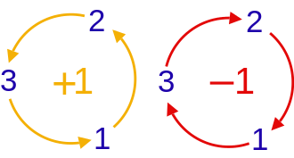

# Commutation Relations of Observables

If two observables share an eigenstate, they both have definite values in that state. This chapter asks when observables can possess simultaneous definite values in a complete set of states.

## Commutators and common eigenstates

The result of successive operator actions generally depends on their order: $\hat A\hat B \ne \hat B\hat A$. We define the **commutator** $\left[ {\hat A,\hat B} \right]$ of $\hat A$ and $\hat B$ to measure the difference between the two products:

$$
\left[ {\hat A,\hat B} \right] \equiv \hat A\hat B - \hat B\hat A
$$ {#eq-zeqnnum285812}

If $\left[ {\hat A,\hat B} \right] = 0$, operators $\hat A$ and $\hat B$ **commute**, or are **compatible**. If $\left[ {\hat A,\hat B} \right] \ne 0$, $\hat A$ and $\hat B$ are incompatible. Definition @eq-zeqnnum285812 gives the identities

$$
\left[ {\hat A,\hat B} \right] = - \left[ {\hat B,\hat A} \right], \qquad  \qquad  \left[ {c\hat A,\hat B} \right] = \left[ {\hat A,c\hat B} \right] = c\left[ {\hat A,\hat B} \right]
$$ {#eq-zeqnnum530166}

$$
\left[ {\hat A,\hat A} \right] = 0, \qquad  \left[ {{{\hat A}^m},{{\hat A}^n}} \right] = 0, \qquad  \left[ {\hat A,c} \right] = 0
$$ {#eq-ch04-p0626}

$$
\left[ {\hat A + \hat B,\hat C} \right] = \left[ {\hat A,\hat C} \right] + \left[ {\hat B,\hat C} \right], \qquad  \qquad  \left[ {\hat A,\hat B + \hat C} \right] = \left[ {\hat A,\hat B} \right] + \left[ {\hat A,\hat C} \right]
$$ {#eq-ch04-p0627}

$$
\left[ {\hat A\hat B,\hat C} \right] = \hat A\left[ {\hat B,\hat C} \right] + \left[ {\hat A,\hat C} \right]\hat B, \qquad  \qquad  \left[ {\hat A,\hat B\hat C} \right] = \hat B\left[ {\hat A,\hat C} \right] + \left[ {\hat A,\hat B} \right]\hat C
$$ {#eq-zeqnnum842864}

For examples, return to the two-state spin system. Using the matrices of ${\hat S_n}$ in @eq-zeqnnum931030, one readily proves

$$
\left[ {{{\hat S}_x},{{\hat S}_y}} \right] = i\hbar {\hat S_z},\quad \qquad  \left[ {{{\hat S}_y},{{\hat S}_z}} \right] = i\hbar {\hat S_x},\quad \qquad  \left[ {{{\hat S}_z},{{\hat S}_x}} \right] = i\hbar {\hat S_y}
$$ {#eq-zeqnnum232011}

These three equations are often abbreviated as

$$
\left[ {{{\hat S}_j},{{\hat S}_k}} \right] = i\hbar {\varepsilon _{jkl}}{\hat S_l}
$$ {#eq-zeqnnum743287}

Here ${\varepsilon _{ijk}}$ is the **Levi-Civita symbol**:

{width=177px}

The indices $j,k,l$ are drawn from 1, 2, and 3. An ordering $j,k,l$ matching the left diagram gives ${\varepsilon _{jkl}} = + 1$; one matching the right gives ${\varepsilon _{jkl}} = - 1$. If any indices coincide, ${\varepsilon _{jkl}} = 0$. For example, ${\varepsilon _{312}} = {\varepsilon _{231}} = 1,\;\;{\varepsilon _{132}} = {\varepsilon _{213}} = - 1,\;\;{\varepsilon _{133}} = 0$.

We will see that @eq-zeqnnum743287 also holds for the components of orbital angular momentum $L\equiv r\times p$, making it a general angular-momentum commutation relation.

Define new observables:

$$
\begin{array}{c} \hat S_x^2 \equiv {{\hat S}_x}{{\hat S}_x}, & \hat S_y^2 \equiv {{\hat S}_y}{{\hat S}_y}, & \hat S_z^2 \equiv {{\hat S}_z}{{\hat S}_z}\\ {{{\bf{\hat S}}}^2} \equiv S_x^2 + S_y^2 + S_z^2 \end{array}
$$ {#eq-ch04-p0638}

These are the squared components and the squared magnitude of angular momentum. The matrices @eq-zeqnnum931030 of ${\hat S_{x,y,z}}$ give

$$
\hat S_x^2 = \hat S_y^2 = \hat S_z^2 = \frac{{{\hbar ^2}}}{4}\left( {\begin{array}{*{20}{c}} 1&0\\ 0&1 \end{array}} \right) = \frac{{{\hbar ^2}}}{4}\hat I
$$ {#eq-ch04-p0640}

$$
{{\bf{\hat S}}^2} \equiv \frac{3}{4}{\hbar ^2}\hat I
$$ {#eq-ch04-p0641}

Each is a constant times the identity. Since the identity commutes with every operator on the same space, they commute with all spin components:

$$
\left[ {\hat S_n^2,{{\hat S}_{n'}}} \right] = 0, \qquad  \left[ {{{{\bf{\hat S}}}^2},{{\hat S}_n}} \right] = 0 \qquad  n,n' \in \{ x,y,z\}
$$ {#eq-ch04-p0643}

From its matrix, ${{\bf{\hat S}}^2}$ has only one eigenvalue:

$$
{{\bf{S}}^2} = \frac{3}{4}{\hbar ^2}
$$ {#eq-ch04-p0645}

It may seem surprising that the largest component of spin ${\bf{\hat S}}$ along any direction is ${\hbar \mathord{\left/ {\vphantom {\hbar 2}} \right. \kern-1.2pt } 2}$, yet ${{\bf{\hat S}}^2}$ equals ${{3{\hbar ^2}} \mathord{\left/ {\vphantom {{3{\hbar ^2}} 4}} \right. \kern-1.2pt } 4}$, not ${{{\hbar ^2}} \mathord{\left/ {\vphantom {{{\hbar ^2}} 4}} \right. \kern-1.2pt } 4}$. This is a characteristic feature of angular momentum.

The matrix of ${{\bf{\hat S}}^2}$ is two-dimensional but has a single eigenvalue, which is therefore doubly degenerate. Any orthogonal pair of two-component vectors, such as $\left\{ {\left\vert  U \right\rangle {\rm{,}}\left\vert  D \right\rangle } \right\},\;\;\left\{ {\left\vert  R \right\rangle {\rm{,}}\left\vert  L \right\rangle } \right\}$ or $\left\{ {\left\vert  I \right\rangle {\rm{,}}\left\vert  O \right\rangle } \right\}$, can serve as its eigenvectors. In an eigenstate of any component ${\hat S_n}$, both ${\hat S_n}$ and ${{\bf{\hat S}}^2}$ can be definite.

## Common eigenstates of compatible observables

If $\hat A$ is definite, the state must be an eigenstate of $\hat A$. If $\hat B$ is also definite, it must also be an eigenstate of $\hat B$, hence a common eigenstate of $\hat A,\hat B$. If every eigenstate of $\hat A$ is an eigenstate of $\hat B$ and conversely, the observables commute.

**Theorem 4.1.** Two observables with a complete common eigenbasis commute.

**Proof.** Let $\left\{ {\left\vert  i \right\rangle } \right\}$ be a complete common eigenbasis of $\hat A,\hat B$. For any basis vector $\left\vert  i \right\rangle$,

$$
\hat A\left\vert  i \right\rangle = {a_i}\left\vert  i \right\rangle ,\quad \hat B\left\vert  i \right\rangle = {b_i}\left\vert  i \right\rangle
$$ {#eq-ch04-p0652}

Therefore,

$$
\hat A\hat B\left\vert  i \right\rangle = \hat A{b_i}\left\vert  i \right\rangle = {a_i}{b_i}\left\vert  i \right\rangle
$$ {#eq-ch04-p0654}

$$
\hat B\hat A\left\vert  i \right\rangle = \hat B{a_i}\left\vert  i \right\rangle = {a_i}{b_i}\left\vert  i \right\rangle
$$ {#eq-ch04-p0655}

Hence $\hat A\hat B\vert i\rangle = \hat B\hat A\vert i\rangle$. Since $\left\{ {\left\vert  i \right\rangle } \right\}$ is complete, every vector can be expanded in it. For arbitrary $\vert \psi\rangle = \sum\nolimits_i {{\psi _i}\vert i\rangle }$,

$$
\hat A\hat B\vert \psi\rangle = \sum\limits_i {{\psi _i}\hat A\hat B\vert i\rangle } = \sum\limits_i {{\psi _i}\hat B\hat A\vert i\rangle } = \hat B\hat A\sum\limits_i {{\psi _i}\hat B\hat A\vert i\rangle } = \hat B\hat A\vert \psi\rangle
$$ {#eq-ch04-p0657}

Thus $\hat A\hat B = \hat B\hat A$.

The contrapositive also holds: incompatible observables have no complete common eigenbasis. For spin 1/2, ${\hat \sigma _z}$ and ${\hat \sigma _x}$ do not commute, as in @eq-zeqnnum232011, and have no common eigenstate. A definite ${\hat \sigma _z}$ requires an eigenstate of ${\hat \sigma _z}$, for example $\left\vert  U \right\rangle$. But $\left\vert  U \right\rangle$ is not an eigenstate of ${\hat \sigma _x}$, so ${\hat \sigma _x}$ is indefinite. Similarly, a definite ${\hat \sigma _x}$ excludes a definite ${\hat \sigma _z}$.

Simultaneous measurement can be difficult. Alternating measurements and finding that each observable's result remains unchanged establishes simultaneous definite values.

**Theorem 4.2.** If $[\hat A,\hat B] = 0$ and $\hat A$ has nondegenerate eigenvalues, every eigenstate of $\hat A$ is also an eigenstate of $\hat B$.

**Proof.** Let $\left\{ {\left\vert  {{a_j}} \right\rangle } \right\}$ be the orthonormal eigenstates of $\hat A$:

$$
\hat A\left\vert  {{a_j}} \right\rangle = {a_j}\left\vert  {{a_j}} \right\rangle
$$ {#eq-ch04-p0664}

Then

$$
\hat A\left( {\hat B\left\vert  {{a_j}} \right\rangle } \right) = \hat B\left( {\hat A\left\vert  {{a_j}} \right\rangle } \right) = \hat B{a_j}\left\vert  {{a_j}} \right\rangle = {a_j}\left( {\hat B\left\vert  {{a_j}} \right\rangle } \right)
$$ {#eq-zeqnnum209049}

Thus $\hat B\vert {a_j}\rangle$ is an eigenstate of $\hat A$ with eigenvalue ${a_j}$. Because eigenvalue ${a_j}$ of $\hat A$ is nondegenerate, $\hat B\vert {a_j}\rangle$ and $\vert {a_j}\rangle$ must be linearly dependent. Write

$$
\hat B\left\vert  {{a_j}} \right\rangle = {b_j}\left\vert  {{a_j}} \right\rangle
$$ {#eq-ch04-p0668}

Here ${b_j}$ is constant. This is the eigenvalue equation of $\hat B$: $\vert {a_j}\rangle$ is an eigenstate of $\hat B$, and ${b_j}$ is the eigenvalue associated with $\vert {a_j}\rangle$. Therefore $\vert {a_j}\rangle$ is a common eigenstate of $\hat A$ and $\hat B$. To label both observables symmetrically, rename $\vert {a_j}\rangle$ as $\vert {a_j},{b_j}\rangle$.

$$
\begin{array}{l} \hat A\left\vert  {{a_j},{b_j}} \right\rangle = {a_j}\left\vert  {{a_j},{b_j}} \right\rangle \\ \hat B\left\vert  {{a_j},{b_j}} \right\rangle = {b_j}\left\vert  {{a_j},{b_j}} \right\rangle \end{array}
$$ {#eq-zeqnnum348929}

## Types of common eigenstates

We describe three patterns of compatibility. They may seem abstract initially; return to them after encountering more concrete examples.

- **Nondegenerate case.** In Figure 4.1, each dot represents an eigenstate $\vert {{a_j},{b_j}}\rangle$.

|  |  | $\hat{B}$ |  |  |  |
| --- | --- | --- | --- | --- | --- |
|  |  | ${b}_{1}$ | ${b}_{2}$ | ${b}_{3}$ | ${b}_{4}$ |
| $\hat{A}$ | ${a}_{1}$ | ● |  |  |  |
|  | ${a}_{2}$ |  | ● |  |  |
|  | ${a}_{3}$ |  |  | ● |  |
|  | ${a}_{4}$ |  |  |  | ● |

::: {.source-caption}
Figure 4.1. Nondegenerate common eigenstates.
:::

- Each $\vert {{a_j},{b_j}}\rangle$ corresponds uniquely to eigenvalue ${a_j}$ of $\hat A$ and eigenvalue ${b_j}$ of $\hat B$.

- **Example.** An electron has magnetic moment ${\bf{\mu }} = - {{2{\mu _B}{\bf{S}}} \mathord{\left/ {\vphantom {{2{\mu _B}{\bf{S}}} \hbar }} \right. \kern-1.2pt } \hbar }$. Its energy in a magnetic field of magnitude ${B}_{0}$ along $z$ is

$$
\hat H = - {\bf{\hat \mu }} \cdot {\bf{B}} = - {\hat \mu _z}{B_0} = 2\frac{{{\mu _B}}}{\hbar }{B_0}{\hat S_z}
$$ {#eq-ch04-p0750}

Clearly $\hat H$ and ${\hat S_z}$ commute. Both have nondegenerate eigenvalues, and their complete common eigenbasis is $\left\{ {\vert U\rangle ,\vert D\rangle } \right\}$.

- **Degenerate case.** Eigenvalues of $\hat A$ may be degenerate. In Figure 4.2, the number of eigenstates (dots) belonging to an eigenvalue is its degeneracy.

| Operator | Eigenvalue | Degeneracy |
| --- | --- | --- |
| $\hat{A}$ | ${a}_{1}$ | ●●●● |
|  | ${a}_{2}$ | ●●● |
|  | ${a}_{3}$ | ●●● |
|  | ${a}_{4}$ | ● |

::: {.source-caption}
Figure 4.2. Degenerate eigenvalues.
:::

For an eigenvalue of $\hat A$ with degeneracy $n$, we can construct $n$ mutually orthogonal eigenstates. Orthogonal states can be distinguished by a single measurement of a suitable observable. Suppose $\hat B$ commutes with $\hat A$, and these $n$ states are also eigenstates of $\hat B$ with distinct eigenvalues of $\hat B$. The eigenvalues of $\hat A$ and $\hat B$ then jointly identify a unique common eigenstate $\vert {{a_j},{b_l}}\rangle$, as in Figure 4.3. The degeneracy of eigenvalues ${b_2},{b_{3,}}{b_4}$ of $\hat B$ is resolved by measuring $\hat A$.

|  |  | $\hat{B}$ |  |  |  |  |  |  |
| --- | --- | --- | --- | --- | --- | --- | --- | --- |
|  |  | ${b}_{1}$ | ${b}_{2}$ | ${b}_{3}$ | ${b}_{4}$ | ${b}_{5}$ | ${b}_{6}$ | ${b}_{7}$ |
| $\hat{A}$ | ${a}_{1}$ | ● | ● | ● |  |  | ● |  |
|  | ${a}_{2}$ |  | ● |  | ● | ● |  |  |
|  | ${a}_{3}$ |  |  | ● | ● |  |  | ● |
|  | ${a}_{4}$ |  |  |  | ● |  |  |  |

::: {.source-caption}
Figure 4.3. Resolving degeneracy with a second observable.
:::

**Example.** The squared orbital angular momentum ${{\bf{\hat L}}^2}$ and its $z$ component ${\hat L_z}$ (or a component along any chosen direction) commute. Their complete common eigenbasis is $\left\vert  {l,m} \right\rangle$:

$$
\begin{array}{l} {{{\bf{\hat L}}}^2}\left\vert  {l,m} \right\rangle = l(l + 1){\hbar ^2}\left\vert  {l,m} \right\rangle , & & l = 0,1,2 \cdots \\ {{\hat L}_z}\left\vert  {l,m} \right\rangle = m\hbar \left\vert  {l,m} \right\rangle , & & m = - l, - l + 1, \cdots ,l & & \end{array}
$$ {#eq-ch04-p0890}

|  |  | ${\hat{L}}_{z}$ quantum number $m$ |  |  |  |  |  |  |
| --- | --- | --- | --- | --- | --- | --- | --- | --- |
|  |  | $\cdots$ | $-2$ | $-1$ | $0$ | $1$ | $2$ | $\cdots$ |
| ${\hat{L}}^{2}$ quantum number $l$ | $0$ |  |  |  | ● |  |  |  |
|  | $1$ |  |  | ● | ● | ● |  |  |
|  | $2$ |  | ● | ● | ● | ● | ● |  |
|  | $\vdots$ | $\cdots$ | $\cdots$ | $\cdots$ | $\cdots$ | $\cdots$ | $\cdots$ | $\cdots$ |

::: {.source-caption}
Figure 4.4. Orbital angular-momentum quantum numbers.
:::

If measuring $\hat B$ does not completely remove the degeneracy, a fixed combination ${a_j},{b_l}$ may still label several states. In Figure 4.5, $({a_{3,}}{b_7})$ remains degenerate. We can seek another observable $\hat C$ commuting with both $\hat A$ and $\hat B$. If $\hat C$ still fails to resolve the degeneracy, add $\hat D$, and so on. Ultimately, a complete set of pairwise compatible observables $\left\{ {\hat A,\hat B,\hat C \cdots } \right\}$ removes it.

|  |  | $\hat{B}$ |  |  |  |  |  |  |
| --- | --- | --- | --- | --- | --- | --- | --- | --- |
|  |  | ${b}_{1}$ | ${b}_{2}$ | ${b}_{3}$ | ${b}_{4}$ | ${b}_{5}$ | ${b}_{6}$ | ${b}_{7}$ |
| $\hat{A}$ | ${a}_{1}$ | ● | ● | ● |  |  | ● |  |
|  | ${a}_{2}$ |  | ● |  | ● | ● |  |  |
|  | ${a}_{3}$ |  |  |  |  |  |  | ●●● |
|  | ${a}_{4}$ |  |  |  | ● |  |  |  |

::: {.source-caption}
Figure 4.5. A complete set of commuting observables.
:::

Theorem 2.11 states that the eigenvectors $\{ \vert {a_1}\rangle ,\vert {a_2}\rangle \cdots \vert {a_N}\rangle \}$ of an observable $\hat A$ form a complete basis when its eigenvalues are nondegenerate. Even with degeneracy, a set of compatible observables $\left\{ {\hat A,\;\hat B,\;\hat C,\; \cdots } \right\}$ can be found such that each eigenvalue combination ${\rm{(}}{a_j},{b_l},{c_u}, \cdots {\rm{)}}$ uniquely identifies a common eigenstate $\left\vert  {{a_j},{b_l},{c_u}, \cdots } \right\rangle$. These common eigenstates form a complete basis.

$$
\left\langle {{{a_i},{b_l},{c_u}{\rm{,}} \cdots }} \mathrel{\left \vert  {\vphantom {{{a_i},{b_l},{c_u}{\rm{,}} \cdots } {{a_j},{b_m},{c_v}, \cdots }}} \right. \kern-1.2pt } {{{a_j},{b_m},{c_v}, \cdots }} \right\rangle = {\delta _{ij}}{\delta _{lm}}{\delta _{uv}} \cdots
$$ {#eq-ch04-p1092}

$$
\sum\limits_i {\sum\limits_l {\sum\limits_u {\sum\limits_ \cdots {\left\vert  {{a_i},{b_l},{c_u}{\rm{,}} \cdots } \right\rangle \left\langle {{a_i},{b_l},{c_u}{\rm{,}} \cdots } \right\vert } } } } = \hat I
$$ {#eq-ch04-p1093}

**Example.** Neglecting spin in hydrogen, electron energy, squared orbital angular momentum, and one angular-momentum component commute. Their common eigenstates are $\left\vert  {n,l,m} \right\rangle$, where $n,l,m$ label their eigenvalues. Each quantum number alone is degenerate, but all three together specify a unique eigenstate. The states $\left\vert  {n,l,m} \right\rangle$ form a complete basis; their superpositions describe any orbital quantum state of the electron.

- There is another form of compatibility.

- **Independent spaces.** $\hat A$ and $\hat B$ belong to different vector spaces; their values are independent.

|  |  | $\hat{B}$ |  |  |  |  |  |  |
| --- | --- | --- | --- | --- | --- | --- | --- | --- |
|  |  | ${b}_{1}$ | ${b}_{2}$ | ${b}_{3}$ | ${b}_{4}$ | ${b}_{5}$ | ${b}_{6}$ | ${b}_{7}$ |
| $\hat{A}$ | ${a}_{1}$ | ● | ● | ● | ● | ● | ● | ● |
|  | ${a}_{2}$ | ● | ● | ● | ● | ● | ● | ● |
|  | ${a}_{3}$ | ● | ● | ● | ● | ● | ● | ● |
|  | ${a}_{4}$ | ● | ● | ● | ● | ● | ● | ● |

::: {.source-caption}
Figure 4.6. Observables on independent vector spaces.
:::

- Observables acting on different vector spaces always commute. Their common eigenstates are tensor products of eigenstates in the component spaces, written $\left\vert  {{a_j}} \right\rangle \otimes \left\vert  {{b_l}} \right\rangle$, abbreviated $\left\vert  {{a_j}} \right\rangle \left\vert  {{b_l}} \right\rangle$, or written $\left\vert  {{a_j},{b_l}} \right\rangle$. The dimension is the dimension of the $\hat A$ space times that of the $\hat B$ space. An operator acts only on the vector factor belonging to its own space. For example,

$$
\hat A\hat B\left\vert  {{a_1}} \right\rangle \left\vert  {{b_1}} \right\rangle = \left( {\hat A\left\vert  {{a_1}} \right\rangle } \right)\left( {\hat B\left\vert  {{b_1}} \right\rangle } \right) = {a_1}{b_1}\left\vert  {{a_1}} \right\rangle \left\vert  {{b_1}} \right\rangle
$$ {#eq-ch04-p1198}

- Two common situations are: (1) $\hat A$ and $\hat B$ describe independent degrees of freedom of one system, such as electron orbital motion and intrinsic spin; (2) $\hat A$ and $\hat B$ belong to different subsystems, such as ${\hat S_z}$ of electron A and ${\hat S_z}$ of electron B.

## Quantum logic and addition of probability amplitudes

Classically, probabilities multiply for successive conditional steps and add for mutually exclusive alternative paths. Consider the following sequence of measurements.

$$
\boxed{\hat A}\xrightarrow{\lvert a\prime\rangle}\boxed{\hat B}\xrightarrow{\lvert b\prime\rangle}\boxed{\hat A}\xrightarrow{\lvert a\prime\prime\rangle}
$$ {#eq-measurement-paths-1203}

Figure 4.7. A selected sequence of measurement outcomes; other channels are blocked.

Let $\hat A,\hat B$ be incompatible, with complete eigenbases $\left\{ {\left\vert  {a'} \right\rangle } \right\}$ and $\left\{ {\left\vert  {b'} \right\rangle } \right\}$. Perform the measurements on $\hat A,\hat B$ shown in Figure 4.7. If the first result is $a'$, the probability of $b'$ at the second step is ${\left\vert  {\left\langle {{b'}} \mathrel{\left \vert  {\vphantom {{b'} {a'}}} \right. \kern-1.2pt } {{a'}} \right\rangle } \right\vert ^2}$. If the second result is $b'$, the probability of $a''$ at the third step is ${\left\vert  {\left\langle {{a''}} \mathrel{\left \vert  {\vphantom {{a''} {b'}}} \right. \kern-1.2pt } {{b'}} \right\rangle } \right\vert ^2}$. Thus, given $a'$ in the initial measurement of $\hat A$, classical probability assigns the following probability to $b'$ at step two and $a''$ at step three:

$$
{\left\vert  {\left\langle {{b'}} \mathrel{\left \vert  {\vphantom {{b'} {a'}}} \right. \kern-1.2pt } {{a'}} \right\rangle } \right\vert ^2} \times {\left\vert  {\left\langle {{a''}} \mathrel{\left \vert  {\vphantom {{a''} {b'}}} \right. \kern-1.2pt } {{b'}} \right\rangle } \right\vert ^2}
$$ {#eq-zeqnnum197115}

$$
\boxed{\hat A}\xrightarrow{\lvert a\prime\rangle}\boxed{\hat B}\xrightarrow{\text{all channels open}}\boxed{\hat A}\xrightarrow{\lvert a\prime\prime\rangle}
$$ {#eq-measurement-paths-1205}

Figure 4.8. All intermediate channels are open.

In Figure 4.8, all output paths after measuring $\hat B$ are open. Given $a'$ at the first step, what is the probability of $a''$ at the third? Classical reasoning sums over the alternative intermediate values of $\hat B$:

$$
\sum\limits_{b'} {{{\left\vert  {\left\langle {{b'}} \mathrel{\left \vert  {\vphantom {{b'} {a'}}} \right. \kern-1.2pt } {{a'}} \right\rangle } \right\vert }^2}{{\left\vert  {\left\langle {{a''}} \mathrel{\left \vert  {\vphantom {{a''} {b'}}} \right. \kern-1.2pt } {{b'}} \right\rangle } \right\vert }^2}} = \sum\limits_{b'} {\left\langle {{a'}} \mathrel{\left \vert  {\vphantom {{a'} {b'}}} \right. \kern-1.2pt } {{b'}} \right\rangle \left\langle {{b'}} \mathrel{\left \vert  {\vphantom {{b'} {a'}}} \right. \kern-1.2pt } {{a'}} \right\rangle \left\langle {{a''}} \mathrel{\left \vert  {\vphantom {{a''} {b'}}} \right. \kern-1.2pt } {{b'}} \right\rangle \left\langle {{b'}} \mathrel{\left \vert  {\vphantom {{b'} {a''}}} \right. \kern-1.2pt } {{a''}} \right\rangle }
$$ {#eq-zeqnnum885144}

Quantum reasoning uses amplitudes. The probability of finding $\vert \phi \rangle$ in state $\vert \psi \rangle$ is ${\left\vert  {\langle \phi\vert \psi\rangle } \right\vert ^2}$, with probability amplitude $\langle \phi\vert \psi\rangle$. Amplitudes multiply for successive steps. For indistinguishable alternative paths, amplitudes add. The probability is the squared magnitude of the resulting total amplitude.

The total amplitude for Figure 4.7 is $\left\langle {{b'}} \mathrel{\left \vert  {\vphantom {{b'} {a'}}} \right. \kern-1.2pt } {{a'}} \right\rangle \left\langle {{a''}} \mathrel{\left \vert  {\vphantom {{a''} {b'}}} \right. \kern-1.2pt } {{b'}} \right\rangle$, so its probability is

$$
{\left\vert  {\left\langle {{b'}} \mathrel{\left \vert  {\vphantom {{b'} {a'}}} \right. \kern-1.2pt } {{a'}} \right\rangle \left\langle {{a''}} \mathrel{\left \vert  {\vphantom {{a''} {b'}}} \right. \kern-1.2pt } {{b'}} \right\rangle } \right\vert ^2} = {\left\vert  {\left\langle {{b'}} \mathrel{\left \vert  {\vphantom {{b'} {a'}}} \right. \kern-1.2pt } {{a'}} \right\rangle } \right\vert ^2} \times {\left\vert  {\left\langle {{a''}} \mathrel{\left \vert  {\vphantom {{a''} {b'}}} \right. \kern-1.2pt } {{b'}} \right\rangle } \right\vert ^2}
$$ {#eq-ch04-p1209}

This agrees with the classical result @eq-zeqnnum885144. In Figure 4.8, however, the final result can arise through different intermediate paths, so the total amplitude is their sum:

$$
\sum\limits_{b'} {\left\langle {{b'}} \mathrel{\left \vert  {\vphantom {{b'} {a'}}} \right. \kern-1.2pt } {{a'}} \right\rangle \left\langle {{a''}} \mathrel{\left \vert  {\vphantom {{a''} {b'}}} \right. \kern-1.2pt } {{b'}} \right\rangle } = \sum\limits_{b'} {\left\langle {{a''}} \mathrel{\left \vert  {\vphantom {{a''} {b'}}} \right. \kern-1.2pt } {{b'}} \right\rangle \left\langle {{b'}} \mathrel{\left \vert  {\vphantom {{b'} {a'}}} \right. \kern-1.2pt } {{a'}} \right\rangle } = \left\langle {{a''}} \mathrel{\left \vert  {\vphantom {{a''} {a'}}} \right. \kern-1.2pt } {{a'}} \right\rangle
$$ {#eq-ch04-p1211}

The probability is ${\left\vert  {\left\langle {{a''}} \mathrel{\left \vert  {\vphantom {{a''} {a'}}} \right. \kern-1.2pt } {{a'}} \right\rangle } \right\vert ^2}$, exactly as if the intermediate step were absent.

We can now explain the final experiment in Figure 1.2. Particles initially in $\left\vert  U \right\rangle$ pass through a ${\hat \sigma _x}$ device before a final measurement of ${\hat \sigma _z}$. Since no result from the ${\hat \sigma _x}$ device is recorded, the probability of final state $\left\vert  U \right\rangle$ is

$$
{\left\vert  {\left\langle {U} \mathrel{\left \vert  {\vphantom {U U}} \right. \kern-1.2pt } {U} \right\rangle } \right\vert ^2} = 1
$$ {#eq-ch04-p1214}

Similarly, the probability of $\left\vert  D \right\rangle$ is

$$
{\left\vert  {\left\langle {D} \mathrel{\left \vert  {\vphantom {D U}} \right. \kern-1.2pt } {U} \right\rangle } \right\vert ^2} = 0
$$ {#eq-ch04-p1216}

These results also follow by evaluating each path amplitude. For example, the probability of final state $\left\vert  D \right\rangle$ is

$$
{\left\vert  {\left\langle {R} \mathrel{\left \vert  {\vphantom {R U}} \right. \kern-1.2pt } {U} \right\rangle \left\langle {D} \mathrel{\left \vert  {\vphantom {D R}} \right. \kern-1.2pt } {R} \right\rangle + \left\langle {L} \mathrel{\left \vert  {\vphantom {L U}} \right. \kern-1.2pt } {U} \right\rangle \left\langle {D} \mathrel{\left \vert  {\vphantom {D L}} \right. \kern-1.2pt } {L} \right\rangle } \right\vert ^2} = {\left\vert  {\frac{1}{{\sqrt 2 }}\frac{1}{{\sqrt 2 }} + \left( { - \frac{1}{{\sqrt 2 }}} \right)\frac{1}{{\sqrt 2 }}} \right\vert ^2} = {\left\vert  {\frac{1}{2} - \frac{1}{2}} \right\vert ^2} = 0
$$ {#eq-ch04-p1218}

The amplitudes of the two paths through the ${\hat \sigma _x}$ device cancel by destructive interference.

In classical optics, intensity at a screen point is proportional to the squared magnitude of the sum of electric fields arriving by different paths. Their relative phases produce constructive or destructive interference. The analogous relation between quantum probabilities and amplitudes motivates the description of quantum behavior as **wave behavior**.

When should classical or quantum reasoning be applied to the apparently identical sequence in Figure 4.8? Fundamentally, quantum reasoning applies. Microscopic and macroscopic systems, however, have different interactions with their surroundings. An isolated microscopic particle can traverse the intermediate device without leaving any record of its path, so no measurement-induced collapse occurs there. A macroscopic object continually interacts with light and air. Even if nobody looks at the intermediate result, the environment retains a record. The intermediate outcome exists but is random, so probabilities must be combined statistically.

## Changing representations

Chapter 3 used eigenvectors $\left\{ {\left\vert  U \right\rangle ,\left\vert  D \right\rangle } \right\}$ of ${\hat \sigma _z}$ as a basis. We could instead use eigenvectors $\left\{ {\left\vert  R \right\rangle ,\left\vert  L \right\rangle } \right\}$ of ${\hat \sigma _x}$. This section develops changes of representation, or changes of basis.

### Transformation rules

Let $\left\{ {\left\vert  {{a_i}} \right\rangle } \right\}$ and $\left\{ {\left\vert  {{b_i}} \right\rangle } \right\}$ be complete eigenbases of incompatible observables $\hat A$ and $\hat B$. The operator $\hat U$ that maps each basis vector of the $\hat A$ representation to its counterpart in the $\hat B$ representation is the transformation operator for $\hat A \to \hat B$:

$$
\hat U\left\vert  {{a_j}} \right\rangle = \left\vert  {{b_j}} \right\rangle
$$ {#eq-ch04-p1227}

One readily verifies

$$
\hat U = \sum\limits_i {\left\vert  {{b_i}} \right\rangle \left\langle {{a_i}} \right\vert }
$$ {#eq-zeqnnum306910}

By @eq-zeqnnum917915,

$$
{\hat U^\dag } = \sum\limits_i {\left\vert  {{a_i}} \right\rangle } \left\langle {{b_i}} \right\vert
$$ {#eq-zeqnnum147961}

One also verifies

$$
{\hat U^\dag }\left\vert  {{b_j}} \right\rangle = \left\vert  {{a_j}} \right\rangle
$$ {#eq-ch04-p1233}

Thus ${\hat U^\dag }$ transforms the representation $\hat B \to \hat A$. Combining @eq-zeqnnum306910 and @eq-zeqnnum147961 gives

$$
\hat U{\hat U^\dag } = {\hat U^\dag }\hat U = \hat I
$$ {#eq-ch04-p1235}

Hence ${\hat U^\dag }$ is the inverse of $\hat U$. A change of orthonormal basis is unitary and preserves inner products, as expected because their physical significance cannot depend on the calculation basis.

The matrix elements of transformation operator $\hat U$ in the $\hat A$ representation are

$$
\langle {{a_l}}\vert {\hat U}\vert {{a_m}}\rangle = \sum\limits_i {\left\langle {{a_l}} \right.\left\vert  {{b_i}} \right\rangle \left\langle {{a_i}} \right\vert } \left. {{a_m}} \right\rangle = \sum\limits_i {\left\langle {{a_l}} \right.\left\vert  {{b_i}} \right\rangle {\delta _{im}}} = \left\langle {{a_l}} \right.\left\vert  {{b_m}} \right\rangle
$$ {#eq-ch04-p1238}

The elements of $\hat U$ in the $\hat B$ representation are

$$
\langle {{b_l}}\vert {\hat U}\vert {{b_m}}\rangle = \sum\limits_i {\left\langle {{b_l}} \right.\left\vert  {{b_i}} \right\rangle } = \sum\limits_i {\left\langle {{a_i}} \right\vert \left. {{b_m}} \right\rangle {\delta _{li}}} = \left\langle {{a_l}} \right.\left\vert  {{b_m}} \right\rangle
$$ {#eq-ch04-p1240}

The transformation therefore has the same matrix in both representations:

$$
\hat U \buildrel\textstyle.\over= \left( {\begin{array}{*{20}{c}} {\left\langle {{{a_1}}} \mathrel{\left \vert  {\vphantom {{{a_1}} {{b_1}}}} \right. \kern-1.2pt } {{{b_1}}} \right\rangle }&{\left\langle {{{a_1}}} \mathrel{\left \vert  {\vphantom {{{a_1}} {{b_2}}}} \right. \kern-1.2pt } {{{b_2}}} \right\rangle }& \cdots \\ {\left\langle {{{a_2}}} \mathrel{\left \vert  {\vphantom {{{a_2}} {{b_1}}}} \right. \kern-1.2pt } {{{b_1}}} \right\rangle }&{\left\langle {{{a_2}}} \mathrel{\left \vert  {\vphantom {{{a_2}} {{b_2}}}} \right. \kern-1.2pt } {{{b_2}}} \right\rangle }& \cdots \\ \vdots & \vdots & \ddots \end{array}} \right)
$$ {#eq-zeqnnum504142}

Likewise, the inverse ${\hat U^\dag }$ has the same matrix in both:

$$
\hat U_{ij}^\dag = {\left( {{{\hat U}_{ji}}} \right)^*} = \left\langle {{{b_i}}} \mathrel{\left \vert  {\vphantom {{{b_i}} {{a_j}}}} \right. \kern-1.2pt } {{{a_j}}} \right\rangle
$$ {#eq-zeqnnum682052}

For any vector $\left\vert  \psi \right\rangle$,

$$
\left\langle {{{b_i}}} \mathrel{\left \vert  {\vphantom {{{b_i}} \psi }} \right. \kern-1.2pt } {\psi } \right\rangle = \sum\limits_j {\left\langle {{{b_i}}} \mathrel{\left \vert  {\vphantom {{{b_i}} {{a_j}}}} \right. \kern-1.2pt } {{{a_j}}} \right\rangle } \left\langle {{{a_j}}} \mathrel{\left \vert  {\vphantom {{{a_j}} \psi }} \right. \kern-1.2pt } {\psi } \right\rangle = \sum\limits_j {\left\langle {{a_i}} \right\vert {{\hat U}^\dag }\left\vert  {{a_j}} \right\rangle } \left\langle {{{a_j}}} \mathrel{\left \vert  {\vphantom {{{a_j}} \psi }} \right. \kern-1.2pt } {\psi } \right\rangle
$$ {#eq-ch04-p1246}

Therefore,

$$
\left( \begin{array}{c} \left\langle {{{b_1}}} \mathrel{\left \vert  {\vphantom {{{b_1}} \psi }} \right. \kern-1.2pt } {\psi } \right\rangle \\ \left\langle {{{b_2}}} \mathrel{\left \vert  {\vphantom {{{b_2}} \psi }} \right. \kern-1.2pt } {\psi } \right\rangle \\ \vdots \end{array} \right) = \left( {\begin{array}{*{20}{c}} {\left\langle {{{b_1}}} \mathrel{\left \vert  {\vphantom {{{b_1}} {{a_1}}}} \right. \kern-1.2pt } {{{a_1}}} \right\rangle }&{\left\langle {{{b_1}}} \mathrel{\left \vert  {\vphantom {{{b_1}} {{a_2}}}} \right. \kern-1.2pt } {{{a_2}}} \right\rangle }& \cdots \\ {\left\langle {{{b_2}}} \mathrel{\left \vert  {\vphantom {{{b_2}} {{a_1}}}} \right. \kern-1.2pt } {{{a_1}}} \right\rangle }&{\left\langle {{{b_2}}} \mathrel{\left \vert  {\vphantom {{{b_2}} {{a_2}}}} \right. \kern-1.2pt } {{{a_2}}} \right\rangle }& \cdots \\ \vdots & \vdots & \ddots \end{array}} \right)\left( \begin{array}{c} \left\langle {{{a_1}}} \mathrel{\left \vert  {\vphantom {{{a_1}} \psi }} \right. \kern-1.2pt } {\psi } \right\rangle \\ \left\langle {{{a_2}}} \mathrel{\left \vert  {\vphantom {{{a_2}} \psi }} \right. \kern-1.2pt } {\psi } \right\rangle \\ \vdots \end{array} \right)
$$ {#eq-ch04-p1248}

The left side is the column of $\left\vert  \psi \right\rangle$ in the $\hat B$ representation. The right side is the inverse transformation matrix times the column of $\left\vert  \psi \right\rangle$ in the $\hat A$ representation. Thus,

$$
{\left\vert  \psi \right\rangle _B} = {\hat U^\dag }{\left\vert  \psi \right\rangle _A}
$$ {#eq-zeqnnum557165}

For an operator, the corresponding transformation is

$$
\begin{array}{c} \left\langle {{b_i}} \right\vert \hat X\left\vert  {{b_j}} \right\rangle = \sum\limits_{l,m} {\left\langle {{{b_i}}} \mathrel{\left \vert  {\vphantom {{{b_i}} {{a_l}}}} \right. \kern-1.2pt } {{{a_l}}} \right\rangle } \left\langle {{a_l}} \right\vert \hat X\left\vert  {{a_m}} \right\rangle \left\langle {{{a_m}}} \mathrel{\left \vert  {\vphantom {{{a_m}} {{b_j}}}} \right. \kern-1.2pt } {{{b_j}}} \right\rangle \\ = \sum\limits_{l,m} {\left\langle {{a_i}} \right\vert {{\hat U}^\dag }\left\vert  {{a_l}} \right\rangle } \left\langle {{a_l}} \right\vert \hat X\left\vert  {{a_m}} \right\rangle \left\langle {{a_m}} \right\vert \hat U\left\vert  {{a_j}} \right\rangle \end{array}
$$ {#eq-zeqnnum132759}

The left side is the matrix of $\hat X$ in the $\hat B$ representation; the three factors on the right are the matrices of ${\hat U^\dag },\hat X,\hat U$ in the $\hat A$ representation. Hence

$$
{\hat X_B} = {\hat U^\dag }{\hat X_A}\hat U
$$ {#eq-zeqnnum834377}

This is a similarity transformation of matrices.

**Example.** Find the matrix of ${\hat \sigma _x},{\hat \sigma _y},{\hat \sigma _z}$ in the ${\hat \sigma _x}$ representation.

The ${\hat \sigma _z}$ basis is $\left\vert  U \right\rangle ,\left\vert  D \right\rangle$, and the ${\hat \sigma _x}$ basis is $\left\vert  R \right\rangle ,\left\vert  L \right\rangle$. By @eq-zeqnnum504142, the matrix of $\hat U$ for the change ${\hat \sigma _z} \to {\hat \sigma _x}$ is

$$
\hat U \buildrel\textstyle.\over= \left( {\begin{array}{*{20}{c}} {\left\langle {U} \mathrel{\left \vert  {\vphantom {U R}} \right. \kern-1.2pt } {R} \right\rangle }&{\left\langle {U} \mathrel{\left \vert  {\vphantom {U L}} \right. \kern-1.2pt } {L} \right\rangle }\\ {\left\langle {D} \mathrel{\left \vert  {\vphantom {D R}} \right. \kern-1.2pt } {R} \right\rangle }&{\left\langle {D} \mathrel{\left \vert  {\vphantom {D L}} \right. \kern-1.2pt } {L} \right\rangle } \end{array}} \right) = \frac{1}{{\sqrt 2 }}\left( {\begin{array}{*{20}{c}} 1&1\\ 1&{ - 1} \end{array}} \right)
$$ {#eq-ch04-p1258}

By @eq-zeqnnum682052, its inverse ${\hat U^\dag }$ has matrix

$$
{\hat U^\dag } \buildrel\textstyle.\over= \frac{1}{{\sqrt 2 }}\left( {\begin{array}{*{20}{c}} 1&1\\ 1&{ - 1} \end{array}} \right)
$$ {#eq-ch04-p1260}

Using @eq-zeqnnum834377, in the ${\hat \sigma _x}$ representation we obtain

$$
\begin{array}{l} {{\hat \sigma }_x} \buildrel\textstyle.\over= \frac{1}{{\sqrt 2 }}\left( {\begin{array}{*{20}{c}} 1&1\\ 1&{ - 1} \end{array}} \right)\left( {\begin{array}{*{20}{c}} 0&1\\ 1&0 \end{array}} \right)\frac{1}{{\sqrt 2 }}\left( {\begin{array}{*{20}{c}} 1&1\\ 1&{ - 1} \end{array}} \right) = \left( {\begin{array}{*{20}{c}} 1&0\\ 0&{ - 1} \end{array}} \right)\\ {{\hat \sigma }_y} \buildrel\textstyle.\over= \frac{1}{{\sqrt 2 }}\left( {\begin{array}{*{20}{c}} 1&1\\ 1&{ - 1} \end{array}} \right)\left( {\begin{array}{*{20}{c}} 0&{ - i}\\ i&0 \end{array}} \right)\frac{1}{{\sqrt 2 }}\left( {\begin{array}{*{20}{c}} 1&1\\ 1&{ - 1} \end{array}} \right) = \left( {\begin{array}{*{20}{c}} 0&i\\ { - i}&0 \end{array}} \right)\\ {{\hat \sigma }_z} \buildrel\textstyle.\over= \frac{1}{{\sqrt 2 }}\left( {\begin{array}{*{20}{c}} 1&1\\ 1&{ - 1} \end{array}} \right)\left( {\begin{array}{*{20}{c}} 1&0\\ 0&{ - 1} \end{array}} \right)\frac{1}{{\sqrt 2 }}\left( {\begin{array}{*{20}{c}} 1&1\\ 1&{ - 1} \end{array}} \right) = \left( {\begin{array}{*{20}{c}} 0&1\\ 1&0 \end{array}} \right) \end{array}
$$ {#eq-ch04-p1262}

**Theorem 4.3.** An observable's matrix has the same trace—the sum of diagonal entries—in every representation. It equals the sum of all eigenvalues, counting an eigenvalue of degeneracy $n$ exactly $n$ times.

$$
\sum\limits_i {\left\langle {{b_i}} \right\vert \hat X\left\vert  {{b_i}} \right\rangle } = \sum\limits_j {\left\langle {{a_j}} \right\vert \hat X\left\vert  {{a_j}} \right\rangle }
$$ {#eq-ch04-p1264}

**Proof.** Use @eq-zeqnnum834377 and the trace identity ${\rm{Tr}}\left( {AB} \right) = {\rm{Tr}}\left( {BA} \right)$.

$$
{\text{Tr}}\left( {{{\hat X}_\text{new}}} \right) = {\text{Tr}}\;\left( {{{\hat U}^\dag }{{\hat X}_\text{old}}\hat U} \right) = {\text{Tr}}\;\left( {\hat U{{\hat U}^\dag }{{\hat X}_\text{old}}} \right) = {\text{Tr}}\left( {{{\hat X}_\text{old}}} \right)
$$ {#eq-ch04-p1266}

The trace is therefore representation-independent. In its own eigenbasis, @eq-zeqnnum449673, the operator is diagonal, with each eigenvalue of degeneracy $n$ appearing $n$ times. Thus the trace in any basis is the eigenvalue sum, counting degeneracy $n$ with multiplicity $n$.

### Eigenvalue equations and changes of basis

Let $\left\{ {\left\vert  {{a_i}} \right\rangle } \right\}$ and $\left\{ {\left\vert  {{b_i}} \right\rangle } \right\}$ be eigenbases of incompatible observables $\hat A$ and $\hat B$. The eigenvalue equation $\hat B\vert {{b_m}}\rangle = {b_m}\vert {{b_m}}\rangle$ of $\hat B$ has the following form in the $\hat A$ representation:

$$
\begin{array}{c} \sum\limits_i {\langle {{a_l}}\vert {\hat B}\vert {{a_i}}\rangle \langle {{a_i}}\vert {{b_m}}\rangle } = \sum\limits_i {\langle {{a_l}}\vert {{b_m}}\vert {{a_i}}\rangle \langle {{a_i}}\vert {{b_m}}\rangle } \\ = {b_m}\langle {{a_l}}\vert {{b_m}}\rangle \end{array}
$$ {#eq-ch04-p1270}

The column of the $m$th eigenvector of $\hat B$ in the $\hat A$ representation is column $m$ of transformation matrix $\hat U$ for $\hat A \to \hat B$. Thus, assembling all eigenvector columns of $\hat B$ in the $\hat A$ basis gives transformation matrix $\hat U$ for $\hat A \to \hat B$. By @eq-zeqnnum834377, this transforms $\hat B$ from its $\hat A$ matrix to a diagonal matrix in its own basis, with eigenvalues of $\hat B$ on the diagonal. This is **diagonalization**.

### Summary of changes of representation

Define the transformation operator $\hat U$ for $\hat A \to \hat B$ by $\left\vert  {{b_j}} \right\rangle = \hat U\left\vert  {{a_j}} \right\rangle$.

Then ${\hat U^\dag }$ transforms $\hat B \to \hat A$: $\left\vert  {{a_j}} \right\rangle = {\hat U^\dag }\left\vert  {{b_j}} \right\rangle$.

The transformation operator is unitary: $\hat U{\hat U^\dag } = {\hat U^\dag }\hat U = \hat I$.

Vector representations are related by ${\left\vert  \psi \right\rangle _B} = {\hat U^\dag }{\left\vert  \psi \right\rangle _A}$.

Operator representations are related by ${\hat X_B} = {\hat U^\dag }{\hat X_A}\hat U$.

The matrices of $\hat U$ and ${\hat U^\dag }$ are representation-independent.

$$
\begin{array}{l} \langle {{a_l}}\vert {\hat U}\vert {{a_m}}\rangle = \langle {{b_l}}\vert {\hat U}\vert {{b_m}}\rangle = \langle {{a_l}}\vert {{b_m}}\rangle \\ \langle {{a_l}}\vert {{{\hat U}^\dag }}\vert {{a_m}}\rangle = \langle {{b_l}}\vert {{\hat U}^\dag }\vert {{b_m}}\rangle = \langle {b_l}\vert {{a_m}}\rangle \end{array}
$$ {#eq-ch04-p1279}

## \* The Heisenberg uncertainty principle

Define the deviation operator: $\Delta \hat A \equiv \hat A - \langle \hat A\rangle \equiv \hat A - \langle \hat A\rangle , \qquad  \;\;\;\Delta \hat B \equiv \hat B - \langle \hat B\rangle$.

Define the variance: ${\langle {(\Delta \hat A})^2}\rangle = \left\langle {{{\hat A}^2} - 2\hat A\langle {\hat A}\rangle + {{\langle {\hat A}\rangle }^2}} \right\rangle = \langle {{{\hat A}^2}}\rangle - {\langle {\hat A}\rangle ^2}$.

Prove $\langle {{{(\Delta \hat A)}^2}}\rangle \langle {{{(\Delta \hat B)}^2}}\rangle \ge \frac{1}{4}{\left\vert  {\langle [\hat A,\hat B]\rangle } \right\vert ^2}$.

**Proof.** Define $[\hat X,\hat Y] \equiv \hat X\hat Y - \hat Y\hat X,\;\;{\rm{\{ }}\hat X,\hat Y{\rm{\} }} \equiv \hat X\hat Y + \hat Y\hat X$. Clearly,

$$
\hat X\hat Y = \frac{1}{2}[\hat X,\hat Y] + \frac{1}{2}{\rm{\{ }}\hat X,\hat Y{\rm{\} }}
$$ {#eq-zeqnnum676215}

Let $\hat A,\hat B$ be Hermitian operators.

One readily proves ${[\hat A,\hat B]^\dag } = - [\hat A,\hat B], \qquad  \qquad  {\{ \hat A,\hat B\} ^\dag } = \{ \hat A,\hat B\}$.

Consequently, 

$$
\langle [\hat A,\hat B]\rangle \text{ is purely imaginary}, \qquad  \langle \{ \hat A,\hat B\} \rangle \text{ is real}
$$ {#eq-zeqnnum864955}

.

Also, 

$$
\langle [\Delta \hat A,\Delta \hat B]\rangle = \langle [\hat A,\hat B]\rangle , \qquad  \langle \{ \Delta \hat A,\Delta \hat B\} \rangle = \langle \{ \hat A,\hat B\} \rangle - 2\langle {\hat A}\rangle \langle {\hat B}\rangle
$$ {#eq-zeqnnum374297}

.

Combining these gives 

$$
\langle [\Delta \hat A,\Delta \hat B]\rangle = \langle [\hat A,\hat B]\rangle \;\text{ is purely imaginary}, \qquad  \langle \{ \Delta \hat A,\Delta \hat B\} \rangle \;\text{ is real}
$$ {#eq-zeqnnum153390}

.

Substitute $\hat X = \Delta \hat A,\;\hat Y = \Delta \hat B$ into @eq-zeqnnum676215 and take expectation values:

$$
\langle {\Delta \hat A\Delta \hat B}\rangle = \frac{1}{2}\langle {[\Delta \hat A,\Delta \hat B]}\rangle + \frac{1}{2}\langle {{\rm{\{ }}\Delta \hat A,\Delta \hat B{\rm{\} }}}\rangle
$$ {#eq-zeqnnum473569}

The Schwarz inequality states that for any states $\vert \alpha \rangle ,\;\vert \beta \rangle$,

$$
\langle \alpha \vert \alpha \rangle \langle \beta \vert \beta \rangle \ge {\left\vert  {\langle \alpha \vert \beta \rangle } \right\vert ^2}
$$ {#eq-zeqnnum750071}

For arbitrary state $\vert \;\rangle$, set $\vert \alpha \rangle = \Delta \hat A\vert \;\rangle ,\;\vert \beta \rangle = \Delta \hat B\vert \;\rangle$ in @eq-zeqnnum750071 and use @eq-zeqnnum473569 and @eq-zeqnnum153390:

$$
\langle {{{(\Delta \hat A)}^2}}\rangle \langle {{{(\Delta \hat B)}^2}}\rangle \ge {\left\vert  {\langle {\Delta \hat A\Delta \hat B}\rangle } \right\vert ^2} = {\left( {\frac{1}{{2i}}\langle [\hat A,\hat B]\rangle } \right)^2} + {\left( {\frac{1}{2}\langle \{ \Delta \hat A,\Delta \hat B\} \rangle } \right)^2}
$$ {#eq-zeqnnum813888}

The second term on the right of @eq-zeqnnum813888 is a real square and is nonnegative. Hence

$$
\langle {{{(\Delta \hat A)}^2}}\rangle \langle {{{(\Delta \hat B)}^2}}\rangle \ge \frac{1}{4}{\left( {i\langle [\hat A,\hat B]\rangle } \right)^2}
$$ {#eq-zeqnnum704405}

Define the standard deviation $\Delta A \equiv \sqrt {\langle {{{(\Delta \hat A)}^2}}\rangle }$ and take square roots to obtain the familiar uncertainty relation:

$$
\Delta A\Delta B \ge \frac{1}{2}\left\vert  {\langle [\hat A,\hat B]\rangle } \right\vert
$$ {#eq-zeqnnum149609}

This relation concerns the product of the standard deviations of two observables. Each standard deviation can be determined statistically from repeated measurements.

Time is a parameter, not an observable in this formulation. What, then, is the precise meaning of the energy–time relation $\Delta E\Delta t \ge {\hbar \mathord{\left/ {\vphantom {\hbar 2}} \right. \kern-1.2pt } 2}$?

## Exercises

**4.1.** Define ${\rm{\{ }}\hat A,\hat B{\rm{\} }} \equiv \hat A\hat B + \hat B\hat A$. Prove $\hat A\hat B = \frac{1}{2}\left[ {\hat A,\hat B} \right] + \frac{1}{2}\left\{ {\hat A,\hat B} \right\}$.

**4.2.** Eigenstates $\vert {a_i}\rangle ,\vert {a_j}\rangle$ of $\hat A$ have distinct eigenvalues ${a_i},{a_j}$. If $[\hat A,\hat B] = 0$, prove

$$
\langle {{a_i}}\vert {\hat B}\vert {{a_j}}\rangle = 0
$$ {#eq-ch04-p1309}

**4.3.** Using the commutator identity @eq-zeqnnum842864 and spin commutation relations @eq-zeqnnum232011, prove

$$
\left[ {{{{\bf{\hat S}}}^2},{{\hat S}_z}} \right] = 0, \qquad  \left[ {\hat S_x^2,\hat S_y^2} \right] = 0
$$ {#eq-ch04-p1312}

**4.4.** Prove that the mean of an anti-Hermitian operator, ${\hat C^\dag } = - \hat C$, is purely imaginary.

**4.5.** Write the matrix of $\left\vert  R \right\rangle ,\left\vert  L \right\rangle ,{\hat \sigma _x}$ in the ${\hat \sigma _{\rm{y}}}$ representation.

**4.6*.** Let $\langle {\hat X}\rangle$ be the expectation value of $\hat X$ in an arbitrary state, with $\Delta \hat X \equiv \hat X - \langle \hat X\rangle = \hat X - \langle \hat X\rangle \hat I$. If $\hat A,\hat B$ are Hermitian, prove:

- $\langle {[\hat A,\hat B]}\rangle$ is purely imaginary.

- $\langle {{\rm{\{ }}\Delta \hat A,\Delta \hat B{\rm{\} }}}\rangle$ is real.
