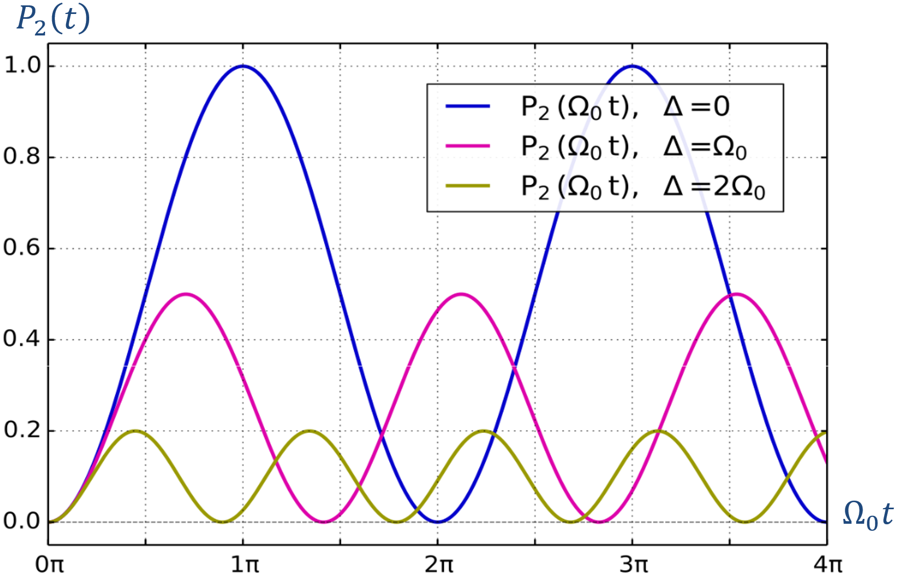
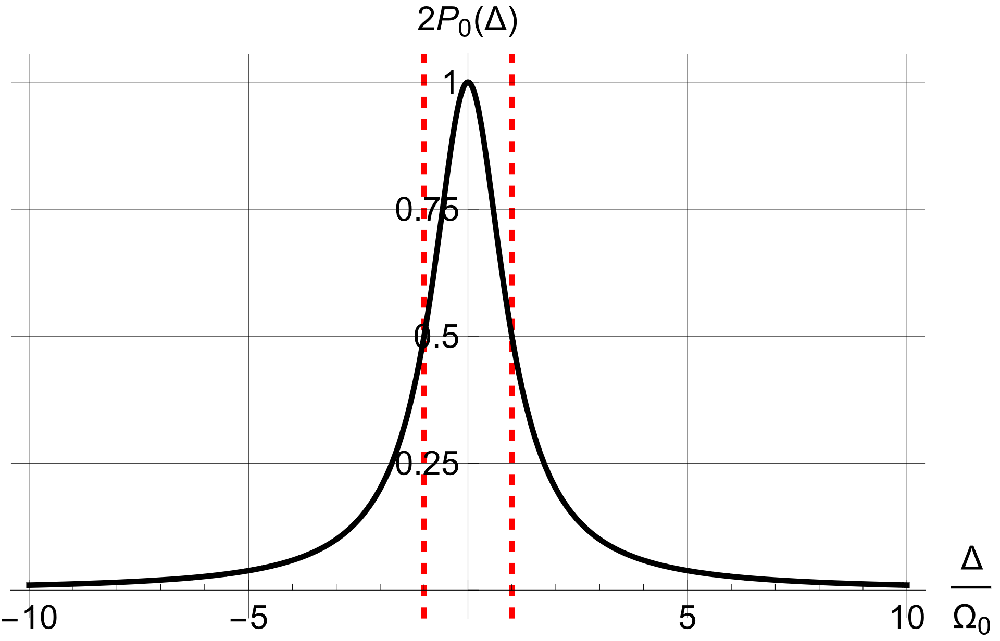
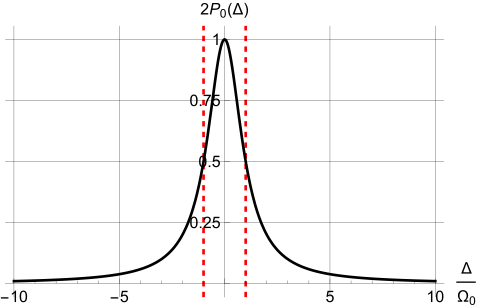

# \* Transitions

A state that is not an energy eigenstate evolves and can exhibit oscillations. Here we begin in an eigenstate of a dominant Hamiltonian and apply a small periodic perturbation that does not commute with it. This can drive oscillations between its eigenstates. Electron spin in a magnetic field remains our example.

## Magnetic resonance

An electron in static field ${{\bf{B}}_0} = {B_0}{\bf{\hat z}}$ initially has spin state $\vert U\rangle$. States $\vert U\rangle$ and $\vert D\rangle$ have energies ${\mu _{\rm{B}}}B$ and $- {\mu _{\rm{B}}}{B_0}$. Both are stationary, so the system remains in either state without a perturbation. Apply a transverse oscillating field ${\bf{B'}}$ at frequency $\omega$, perpendicular to ${{\bf{B}}_0}$, with $\left\vert  {{\bf{B'}}} \right\vert  \ll \left\vert  {{{\bf{B}}_0}} \right\vert$. Although weak, the periodic perturbation can profoundly affect the evolution under suitable conditions.

Write the transverse field as

$$
{\bf{B'}} = {B'_x}{\bf{\hat x}} + {B'_y}{\bf{\hat y}}
$$ {#eq-zeqnnum692846}

Let ${\bf{B'}}$ be a constant-magnitude circularly polarized field rotating in the same sense as the electron's precession in ${{\bf{B}}_0}$:

$$
{B'_x} = B'\cos \omega t; \qquad  \qquad  {B'_y} = B'\sin \omega t
$$ {#eq-zeqnnum766276}

The interaction Hamiltonian for the total field is

$$
\hat H = - {{\bf{\mu }}_{\rm{S}}} \cdot \left( {{{\bf{B}}_0} + {\bf{B'}}} \right) = {\hat H_0} + \hat V(t)
$$ {#eq-zeqnnum126030}

Here ${\hat H_0}$ and $\hat V$ are the static-field and oscillating-field energy operators. In the ${\hat \sigma _z}$ representation,

$$
{\hat H_0} = - {{\bf{\mu }}_{\rm{S}}} \cdot {{\bf{B}}_0} = {\mu _{\rm{B}}}{\hat \sigma _z}{B_0} \buildrel\textstyle.\over= {\mu _{\rm{B}}}\left( {\begin{array}{*{20}{c}} {{B_0}}&0\\ 0&{ - {B_0}} \end{array}} \right) = \frac{\hbar }{2}\left( {\begin{array}{*{20}{c}} {{\omega _0}}&0\\ 0&{ - {\omega _0}} \end{array}} \right)
$$ {#eq-zeqnnum864064}

Here ${\omega _0} \equiv {{({E_1} - {E_2})} \mathord{\left/ {\vphantom {{({E_1} - {E_2})} \hbar }} \right. \kern-1.2pt } \hbar } = {{2{\mu _{\rm{B}}}{B_0}} \mathord{\left/ {\vphantom {{2{\mu _{\rm{B}}}{B_0}} \hbar }} \right. \kern-1.2pt } \hbar }$ is the static-field Larmor frequency.

$$
\begin{array}{c} \hat V(t) = - {{\bf{\mu }}_{\rm{S}}} \cdot {\bf{B'}} = {\mu _{\rm{B}}}\left( {{{\hat \sigma }_x}{{B'}_x} + {{\hat \sigma }_y}{{B'}_y}} \right) \buildrel\textstyle.\over= {\mu _{\rm{B}}}\left( {\begin{array}{*{20}{c}} 0&{{{B'}_x} - i{{B'}_y}}\\ {{{B'}_x} + i{{B'}_y}}&0 \end{array}} \right)\\ = {\mu _{\rm{B}}}\left( {\begin{array}{*{20}{c}} 0&{B'{e^{ - i\omega t}}}\\ {B'{e^{i\omega t}}}&0 \end{array}} \right) = \frac{\hbar }{2}\left( {\begin{array}{*{20}{c}} 0&{{\Omega _0}{e^{ - i\omega t}}}\\ {{\Omega _0}{e^{i\omega t}}}&0 \end{array}} \right) \end{array}
$$ {#eq-zeqnnum833059}

The quantity ${\Omega _0} \equiv {{2{\mu _{\rm{B}}}B'} \mathord{\left/ {\vphantom {{2{\mu _{\rm{B}}}B'} \hbar }} \right. \kern-1.2pt } \hbar }$ is the **Rabi frequency**, or resonant Rabi frequency. Rabi received the 1944 Nobel Prize in Physics for the atomic and molecular beam magnetic-resonance method.

The total Hamiltonian is therefore

$$
\hat H \buildrel\textstyle.\over= \frac{\hbar }{2}\left( {\begin{array}{*{20}{c}} {{\omega _0}}&{{\Omega _0}{e^{ - i\omega t}}}\\ {{\Omega _0}{e^{i\omega t}}}&{ - {\omega _0}} \end{array}} \right)
$$ {#eq-zeqnnum963082}

Expand spin state $\vert {\psi (t)}\rangle$ at time $t$ in the ${\hat \sigma _z}$ representation, incorporating the initial condition:

$$
\vert {\psi (t)}\rangle = {c_1}(t)\vert U\rangle + {c_2}(t)\left\vert  D \right\rangle \buildrel\textstyle.\over= \left( {\begin{array}{*{20}{c}} {{c_1}(t)}\\ {{c_2}(t)} \end{array}} \right), \qquad  {\left\vert  {{c_1}} \right\vert ^2} + {\left\vert  {{c_2}} \right\vert ^2} = 1,\;\;\left( {\begin{array}{*{20}{c}} {{c_1}(0) = 1}\\ {{c_2}(0) = 0} \end{array}} \right),\;\;
$$ {#eq-zeqnnum361616}

Substituting @eq-zeqnnum963082 and @eq-zeqnnum361616 into the Schrödinger equation gives

$$
\left( {\begin{array}{*{20}{c}} {{{\dot c}_1}}\\ {{{\dot c}_2}} \end{array}} \right) = - \frac{i}{2}\left( {\begin{array}{*{20}{c}} {{\omega _0}}&{{\Omega _0}{e^{ - i\omega t}}}\\ {{\Omega _0}{e^{i\omega t}}}&{ - {\omega _0}} \end{array}} \right)\left( {\begin{array}{*{20}{c}} {{c_1}}\\ {{c_2}} \end{array}} \right)
$$ {#eq-zeqnnum927934}

Introduce a rotating-frame transformation:[^f4]

$$
{c_1}(t) = {d_1}(t){e^{ - {{i\omega t} \mathord{\left/ {\vphantom {{i\omega t} 2}} \right. \kern-1.2pt } 2}}}; \qquad  {c_2}(t) = {d_2}(t){e^{{{i\omega t} \mathord{\left/ {\vphantom {{i\omega t} 2}} \right. \kern-1.2pt } 2}}}.
$$ {#eq-zeqnnum414068}

Equation @eq-zeqnnum927934 becomes a system without the rapid oscillating factors:

$$
\left( {\begin{array}{*{20}{c}} {{{\dot d}_1}}\\ {{{\dot d}_2}} \end{array}} \right) = \frac{i}{2}\left( {\begin{array}{*{20}{c}} \Delta &{ - {\Omega _0}}\\ { - {\Omega _0}}&{ - \Delta } \end{array}} \right)\left( {\begin{array}{*{20}{c}} {{d_1}}\\ {{d_2}} \end{array}} \right), \qquad  \left( {\begin{array}{*{20}{c}} {{d_1}(0)}\\ {{d_2}(0)} \end{array}} \right) = \left( {\begin{array}{*{20}{c}} 1\\ 0 \end{array}} \right)
$$ {#eq-zeqnnum721542}

Here $\Delta \equiv \omega - {\omega _0}$ is the **detuning**. The solution of @eq-zeqnnum721542 is given below; the derivation appears in this chapter's appendix.

$$
\begin{array}{l} {d_1}(t) = \cos \frac{{\Omega t}}{2} + i\frac{\Delta }{\Omega }\sin \frac{{\Omega t}}{2}\\ {d_2}(t) = - i\frac{{{\Omega _0}}}{\Omega }\sin \frac{{\Omega t}}{2} \end{array}
$$ {#eq-zeqnnum460032}

The quantity $\Omega \equiv \sqrt {{\Delta ^2} + \Omega _0^2}$ is the **generalized Rabi frequency**. Substituting @eq-zeqnnum460032 into @eq-zeqnnum414068 and then @eq-zeqnnum361616 gives $\vert {\psi (t)}\rangle$ at any time. The probabilities of states $\vert U\rangle$ and $\vert D\rangle$ are

$$
\begin{gathered} {P_1}(t) \equiv {\left\vert  {{c_1}(t)} \right\vert ^2} = \frac{1}{2}\left( {1 + \frac{{{\Delta ^2}}}{{{\Omega ^2}}}} \right) + \frac{1}{2}\frac{{\Omega _0^2}}{{{\Omega ^2}}}\cos \Omega t\xrightarrow{{\Delta = 0}}\frac{1}{2}\left( {1 + \cos {\Omega _0}t} \right)  \\ {P_2}(t) \equiv {\left\vert  {{c_2}(t)} \right\vert ^2} = \frac{1}{2}\frac{{\Omega _0^2}}{{{\Omega ^2}}}\left( {1 - \cos \Omega t} \right)\xrightarrow{{\Delta = 0}}\frac{1}{2}\left( {1 - \cos {\Omega _0}t} \right)  \\ \Delta \equiv \omega - {\omega _0},\, \qquad  {\Omega _0} \equiv {{2{\mu _{\text{B}}}B'} \mathord{\left/ {\vphantom {{2{\mu _{\text{B}}}B'} \hbar }} \right. \kern-1.2pt } \hbar }, \qquad  \;\;\;\;\;\;\Omega \equiv \sqrt {{\Delta ^2} + \Omega _0^2} ,  \\ \end{gathered}
$$ {#eq-zeqnnum748213}

Both ${P}_{1}$ and ${P}_{2}$ oscillate at $\Omega$, describing population transfer between the two levels.

Figure 6.1 plots ${P_2}$ for several detunings. At $\Delta = 0$, ${P_2}$ oscillates most slowly but with maximum contrast, ranging from zero to one. The condition $\Delta = 0$ is **resonance**. Increasing detuning increases the oscillation frequency of ${P_2}$ but reduces its amplitude and the transition probability. By @eq-zeqnnum748213, whenever $\Omega t$ is an even multiple of $\pi$, ${P}_{2}=0$ and ${P}_{1}=1$, so the initial population returns. Whenever $\Omega t$ is an odd multiple of $\pi$, ${P}_{2}$ reaches its maximum for that detuning. At resonance, ${P}_{2}=1$, corresponding to complete transfer to the other level.

The drive ${\bf{B'}}$ makes ${P}_{2}$ oscillate at $\Omega$. As ${P}_{2}$ increases, the electron's mean magnetic energy decreases, transferring energy to the drive: **stimulated emission**. As ${P}_{2}$ decreases, its mean energy increases by absorbing energy from the drive: **stimulated absorption**. Both arise from the same mechanism, explaining the equality of Einstein's corresponding coefficients for this two-state case.

{width=410px}

::: {.source-caption}
Figure 6.1. Probability of electron spin state $\vert D\rangle$ versus time at different detunings.
:::

By @eq-zeqnnum748213, the oscillatory amplitudes of ${P}_{2}$ and ${P}_{1}$ are both

$$
{P_0}(\Delta ) = \frac{1}{2}\frac{{\Omega _0^2}}{{{\Omega ^2}}} = \frac{1}{2}\frac{{\Omega _0^2}}{{{\Delta ^2} + \Omega _0^2}}
$$ {#eq-zeqnnum340775}

At fixed ${\Omega _0}$, ${P_0}(\Delta )$ is a peaked function of detuning $\Delta$, as in Figure 6.2. Its half-width at half-maximum (HWHM) is ${\Omega _0}$. Since ${\Omega _0}$ is proportional to drive amplitude, stronger excitation broadens the line. This **power broadening** occurs in magnetic-resonance and spectroscopic measurements of level separations, such as absorption spectra.

{width=379px}{width=379px}

::: {.source-caption}
Figure 6.2. ${P_0}(\Delta )$ peaks at $\Delta = 0$ and has HWHM ${\Omega _0}$. Zero detuning is resonance.
:::

We can also calculate the evolution of the mean spin vector $\langle {\psi (t)}\vert {{{\hat S}_{x,y,z}}}\vert {\psi (t)}\rangle$.

$$
\begin{gathered} \langle {{{\hat S}_z}}(t)\rangle = \frac{\hbar }{2}\left( {\begin{array}{*{20}{c}} {c_1^*,}&{c_2^*} \end{array}} \right)\left( {\begin{array}{*{20}{c}} 1&0 \\ 0&{ - 1} \end{array}} \right)\left( {\begin{array}{*{20}{c}} {{c_1}} \\ {{c_2}} \end{array}} \right) = \frac{\hbar }{2}\left( {{{\left\vert  {{c_1}} \right\vert }^2} - {{\left\vert  {{c_2}} \right\vert }^2}} \right) \\ = \frac{\hbar }{2}\left[ {\left( {1 - \frac{{\Omega _0^2}}{{{\Omega ^2}}}} \right) + \frac{{\Omega _0^2}}{{{\Omega ^2}}}\cos \Omega t} \right]\xrightarrow{{\Delta = 0}}\frac{\hbar }{2}\cos {\Omega _0}t \\ \end{gathered}
$$ {#eq-ch06-p1453}

$$
\begin{gathered} \langle {{{\hat S}_x}(t)}\rangle = \frac{\hbar }{2}\left( {\begin{array}{*{20}{c}} {c_1^*,}&{c_2^*} \end{array}} \right)\left( {\begin{array}{*{20}{c}} 0&1 \\ 1&0 \end{array}} \right)\left( {\begin{array}{*{20}{c}} {{c_1}} \\ {{c_2}} \end{array}} \right) = \frac{\hbar }{2}\left( {{c_1}c_2^* + c_1^*{c_2}} \right) \\ = \frac{\hbar }{2}\frac{{{\Omega _0}}}{{{\Omega ^2}}}\left[ {\Omega \sin \Omega t\sin \omega t - \Delta (1 - \cos \Omega t)\cos \omega t} \right] \\ \xrightarrow{{\Delta = 0}}\frac{\hbar }{2}\sin {\Omega _0}t\sin {\omega _0}t \\ \end{gathered}
$$ {#eq-ch06-p1454}

$$
\begin{gathered} \langle {{{\hat S}_y}(t)}\rangle = \frac{\hbar }{2}\left( {\begin{array}{*{20}{c}} {c_1^*,}&{c_2^*} \end{array}} \right)\left( {\begin{array}{*{20}{c}} 0&{ - i} \\ i&0 \end{array}} \right)\left( {\begin{array}{*{20}{c}} {{c_1}} \\ {{c_2}} \end{array}} \right) = \frac{{i\hbar }}{2}\left( {{c_1}c_2^* - c_1^*{c_2}} \right) \\ = - \frac{\hbar }{2}\frac{{{\Omega _0}}}{{{\Omega ^2}}}\left[ {\Omega \sin \Omega t\cos \omega t + \Delta (1 - \cos \Omega t)\sin \omega t} \right] \\ \xrightarrow{{\Delta = 0}} - \frac{\hbar }{2}\sin {\Omega _0}t\cos {\omega _0}t \\ \end{gathered}
$$ {#eq-ch06-p1455}

A linearly polarized drive ${\bf{B'}}$ is easier to produce than a circularly polarized one. For polarization along $x$ with amplitude $2B'$, write ${\bf{B'}}$ as

$$
{B'_x} = 2B'\cos \omega t; \qquad  \qquad  {B'_y} = 0
$$ {#eq-ch06-p1457}

Its interaction ${\bf{B'}}$ with the electron magnetic moment has Hamiltonian

$$
\begin{array}{c} \hat V(t) = 2{\mu _{\rm{B}}}B'\cos \omega t\left( {\begin{array}{*{20}{c}} 0&1\\ 1&0 \end{array}} \right) = \hbar \left( {\begin{array}{*{20}{c}} 0&{{\Omega _0}\cos \omega t}\\ {{\Omega _0}\cos \omega t}&0 \end{array}} \right)\\ = \frac{\hbar }{2}\left( {\begin{array}{*{20}{c}} 0&{{\Omega _0}({e^{i\omega t}} + {e^{ - i\omega t}})}\\ {{\Omega _0}({e^{i\omega t}} + {e^{ - i\omega t}})}&0 \end{array}} \right) \end{array}
$$ {#eq-zeqnnum472633}

Following @eq-zeqnnum833059 through @eq-zeqnnum927934, the Schrödinger equation becomes

$$
\left( {\begin{array}{*{20}{c}} {{{\dot c}_1}}\\ {{{\dot c}_2}} \end{array}} \right) = - \frac{i}{2}\left( {\begin{array}{*{20}{c}} {{\omega _0}}&{{\Omega _0}({e^{i\omega t}} + {e^{ - i\omega t}})}\\ {{\Omega _0}({e^{i\omega t}} + {e^{ - i\omega t}})}&{ - {\omega _0}} \end{array}} \right)\left( {\begin{array}{*{20}{c}} {{c_1}}\\ {{c_2}} \end{array}} \right)
$$ {#eq-ch06-p1461}

Using the definitions and method following @eq-zeqnnum414068 gives

$$
\begin{array}{c} {{\dot d}_1} = \frac{i}{2}\left[ {\Delta {d_1} - {\Omega _0}({e^{2i\omega t}} + 1){d_2}} \right],\\ {{\dot d}_2} = \frac{i}{2}\left[ { - {\Omega _0}(1 + {e^{ - 2i\omega t}}){d_1} - \Delta {d_2}} \right], \end{array}
$$ {#eq-zeqnnum877206}

Assume $B' \ll {B_0}$ and near resonance between $\omega$ and ${\omega _0}$, namely ${\Omega _0},\;\left\vert  \Delta \right\vert  \ll {\omega _0},\omega$. These are the near-resonant, weak-drive conditions. In @eq-zeqnnum877206, the factors ${e^{ \pm 2i\omega t}}$ oscillate much faster than changes on the scales $\Delta$ and ${\Omega _0}$, so they may be replaced by their zero time average. This is the **rotating-wave approximation**. Equation @eq-zeqnnum877206 then reduces to @eq-zeqnnum721542 and has the same solution. A weak near-resonant linear drive is therefore approximately equivalent to a circular drive with half its amplitude.

## Transitions in a general two-level system

The magnetic-resonance analysis extends to other two-level transitions. For any two-level system of separation $\hbar {\omega _0}$, shifting the energy origin gives the unperturbed eigenvalue equation

$$
\begin{array}{l} {{\hat H}_0}\vert e\rangle = \hbar \frac{{{\omega _0}}}{2}\vert e\rangle \\ {{\hat H}_0}\vert g\rangle = - \hbar \frac{{{\omega _0}}}{2}\vert g\rangle \end{array}
$$ {#eq-ch06-p1468}

Here $\vert e\rangle ,{\rm{ }}\vert g\rangle$ denote excited and ground states. In the ${\hat H_0}$ representation,

$$
{\hat H_0} = \hbar \left( {\begin{array}{*{20}{c}} {{{{\omega _0}} \mathord{\left/ {\vphantom {{{\omega _0}} 2}} \right. \kern-1.2pt } 2}}&0\\ 0&{{{ - {\omega _0}} \mathord{\left/ {\vphantom {{ - {\omega _0}} 2}} \right. \kern-1.2pt } 2}} \end{array}} \right)
$$ {#eq-zeqnnum616848}

Adding a perturbation $\hat V(t) = {\hat V_0}\cos \omega t$ gives

$$
\hat V(t) = \left( {\begin{array}{*{20}{c}} {\langle 1\vert {{{\hat V}_0}}\vert 1\rangle }&{\langle 1\vert {{{\hat V}_0}}\vert 2\rangle }\\ {{{\langle 1\vert {{{\hat V}}_0}\vert 2\rangle }^*}}&{\langle 2\vert {{{\hat V}_0}}\vert 2\rangle } \end{array}} \right)\cos \omega t
$$ {#eq-ch06-p1472}

Frequently ${\hat V_0}$ has zero diagonal elements, $\langle 1\vert {{{\hat V}_0}}\vert 1\rangle = \langle 2\vert {{{\hat V}_0}}\vert 2\rangle = 0$, and $\langle 1\vert {{{\hat V}_0}}\vert 2\rangle$ is real. Defining ${\Omega _0} \equiv {{\langle 1\vert {{{\hat V}_0}}\vert 2\rangle } \mathord{\left/ {\vphantom {{\langle 1\vert {{{\hat V}_0}}\vert 2\rangle } \hbar }} \right. \kern-1.2pt } \hbar }$ gives

$$
\hat V(t) = \hbar \left( {\begin{array}{*{20}{c}} 0&{{\Omega _0}\cos \omega t}\\ {\Omega _0^{}\cos \omega t}&0 \end{array}} \right)
$$ {#eq-zeqnnum790744}

Equations @eq-zeqnnum616848 and @eq-zeqnnum790744 have the same form as @eq-zeqnnum864064 and @eq-zeqnnum472633. Such a two-level transition is therefore mathematically equivalent to spin-1/2 magnetic resonance.

## \* Density matrices and the Bloch vector

The preceding sections reduce two-level evolution to @eq-zeqnnum460032, the evolution of ${d_1},{d_2}$. We now give it a geometric interpretation.

An arbitrary pure state of a two-level system can be written as

$$
\left( {\begin{array}{*{20}{c}} {{d_1}}\\ {{d_2}} \end{array}} \right) = \left( {\begin{array}{*{20}{c}} {\cos \frac{\theta }{2}}\\ {{e^{i\phi }}\sin \frac{\theta }{2}} \end{array}} \right)
$$ {#eq-ch06-p1479}

Define the Cartesian **Bloch vector** ${\bf{P}} = \left\{ {u,v,w} \right\}$:

$$
\begin{array}{l} u = {\rho _{12}} + {\rho _{21}}\\ v = i({\rho _{12}} - {\rho _{21}})\\ \omega = {\rho _{11}} - {\rho _{22}} \end{array}
$$ {#eq-zeqnnum365247}

where

$$
{\rho _{ij}} \equiv {d_i}d_j^*
$$ {#eq-zeqnnum448235}

$$
\begin{array}{l} {\rho _{12}} = \frac{1}{2}{e^{ - i\phi }}\sin \theta \\ {\rho _{21}} = \frac{1}{2}{e^{i\phi }}\sin \theta \\ {\rho _{11}} = \frac{{1 + \cos \theta }}{2}\\ {\rho _{22}} = \frac{{1 - \cos \theta }}{2} \end{array}
$$ {#eq-ch06-p1484}

By @eq-zeqnnum365247,

$$
\begin{array}{l} u = {\rho _{12}} + {\rho _{21}} = \sin \theta \cos \phi \\ v = i({\rho _{12}} - {\rho _{21}}) = \sin \theta \sin \phi \\ \omega = {\rho _{11}} - {\rho _{22}} = \cos \theta \end{array}
$$ {#eq-ch06-p1486}

One verifies ${u^2} + {v^2} + {w^2} = 1$, so ${\bf{P}}$ is a unit vector. The parameters $\theta ,\phi$ are its spherical angles. All pure states lie on the surface traced by its tip, the **Bloch sphere**. For example,

$$
\begin{array}{*{20}{c}} {\left( {0,0,1} \right) \leftrightarrow \;\vert U\rangle }&{\left( {0,0, - 1} \right) \leftrightarrow \;\vert D\rangle }\\ {\left( {1,0,0} \right) \leftrightarrow \;\frac{1}{{\sqrt 2 }}\left( {\;\vert U\rangle + \;\vert D\rangle } \right)}&{\left( { - 1,0,0} \right) \leftrightarrow \frac{1}{{\sqrt 2 }}\left( {\;\vert U\rangle - \;\vert D\rangle } \right)}\\ {\left( {0,1,0} \right) \leftrightarrow \;\;\frac{1}{{\sqrt 2 }}\left( {\;\vert U\rangle + i\;\vert D\rangle } \right)}&{\left( {0, - 1,0} \right) \leftrightarrow \;\frac{1}{{\sqrt 2 }}\left( {\;\vert U\rangle - i\;\vert D\rangle } \right)} \end{array}
$$ {#eq-ch06-p1488}

The motion of ${\bf{P}}$ describes state evolution @eq-zeqnnum721542. From @eq-zeqnnum721542 and @eq-zeqnnum448235,

$$
\begin{array}{l} {{\dot \rho }_{12}} = i\Delta {\rho _{12}} + i\frac{{{\Omega _0}}}{2}\left( {{\rho _{11}} - {\rho _{22}}} \right)\\ {{\dot \rho }_{21}} = - i\Delta {\rho _{21}} - i\frac{{{\Omega _0}}}{2}\left( {{\rho _{11}} - {\rho _{22}}} \right)\\ {{\dot \rho }_{11}} = i\frac{{{\Omega _0}}}{2}\left( {{\rho _{12}} - {\rho _{21}}} \right)\\ {{\dot \rho }_{22}} = - i\frac{{{\Omega _0}}}{2}\left( {{\rho _{12}} - {\rho _{21}}} \right) \end{array}
$$ {#eq-zeqnnum821674}

Using @eq-zeqnnum821674 and @eq-zeqnnum365247,

$$
\begin{array}{l} \frac{{du}}{{dt}} = \Delta v\\ \frac{{dv}}{{dt}} = - \Delta u - {\Omega _0}w\\ \frac{{dw}}{{dt}} = {\Omega _0}v \end{array}
$$ {#eq-zeqnnum729193}

Define ${\bf{\Omega }} = \left\{ {{\Omega _0},0, - \Delta } \right\}$. Equation @eq-zeqnnum729193 becomes

$$
\frac{{d{\bf{P}}}}{{dt}} = {\bf{\Omega }} \times {\bf{P}}
$$ {#eq-zeqnnum862867}

Since ${\bf{\Omega }}$ is constant, @eq-zeqnnum862867 describes ${\bf{P}}$ precessing about ${\bf{\Omega }}$ with angular speed $\left\vert  {\bf{\Omega }} \right\vert  = \sqrt {\Omega _0^2 + {\Delta ^2}}$. Under the preceding rotating-wave treatment, two-state dynamics thus becomes a Bloch-vector equation,[^f5] giving a useful geometric picture of transitions.

This corresponds to the group-theoretic connection between a unitary transformation ${\rm{SU}}(2)$ in a two-dimensional complex space and a rotation ${\rm{SO}}(3)$ in three-dimensional Cartesian space.

## Appendix

We solve the linear differential system @eq-zeqnnum721542 as follows.

$$
\left( {\begin{array}{*{20}{c}} {{{\dot d}_1}}\\ {{{\dot d}_2}} \end{array}} \right) = \frac{i}{2}\left( {\begin{array}{*{20}{c}} \Delta &{ - {\Omega _0}}\\ { - {\Omega _0}}&{ - \Delta } \end{array}} \right)\left( {\begin{array}{*{20}{c}} {{d_1}}\\ {{d_2}} \end{array}} \right), \qquad  \left( {\begin{array}{*{20}{c}} {{d_1}(0)}\\ {{d_2}(0)} \end{array}} \right) = \left( {\begin{array}{*{20}{c}} 1\\ 0 \end{array}} \right)
$$ {#eq-ch06-p1500}

Try $\left( {{d_1},{d_2}} \right) = \left( {{k_1},{k_2}} \right){e^{{{i\lambda t} \mathord{\left/ {\vphantom {{i\lambda t} 2}} \right. \kern-1.2pt } 2}}}$, with time-independent ${k_{1,2}}$. Substitution gives the eigenvalue equation

$$
\lambda \left( {\begin{array}{*{20}{c}} {{k_1}}\\ {{k_2}} \end{array}} \right) = \left( {\begin{array}{*{20}{c}} \Delta &{ - {\Omega _0}}\\ { - {\Omega _0}}&{ - \Delta } \end{array}} \right)\left( {\begin{array}{*{20}{c}} {{k_1}}\\ {{k_2}} \end{array}} \right) \Rightarrow \left( {\begin{array}{*{20}{c}} {\Delta - \lambda }&{ - {\Omega _0}}\\ { - {\Omega _0}}&{ - \Delta - \lambda } \end{array}} \right)\left( {\begin{array}{*{20}{c}} {{k_1}}\\ {{k_2}} \end{array}} \right) = 0,
$$ {#eq-zeqnnum238012}

A nonzero solution requires

$$
\left\vert  {\begin{array}{*{20}{c}} {\Delta - \lambda }&{ - {\Omega _0}}\\ { - {\Omega _0}}&{ - \Delta - \lambda } \end{array}} \right\vert  = 0
$$ {#eq-ch06-p1504}

The eigenvalues are ${\lambda _ \pm } = \pm \Omega$, where $\Omega \equiv \sqrt {\Omega _0^2 + {\Delta ^2}}$. Substituting ${\lambda _ \pm }$ into @eq-zeqnnum238012 gives the eigenvectors

$$
\vert \lambda\rangle \equiv \left( {\begin{array}{*{20}{c}} {{k_1}}\\ {{k_2}} \end{array}} \right): \qquad  \vert {{\lambda _ + }}\rangle = \left( {\begin{array}{*{20}{c}} {{\Omega _0}}\\ {\Delta - \Omega } \end{array}} \right), \qquad  \vert {{\lambda _ - }}\rangle = \left( {\begin{array}{*{20}{c}} {{\Omega _0}}\\ {\Delta + \Omega } \end{array}} \right)
$$ {#eq-ch06-p1506}

The general solution is a linear combination of these particular solutions:

$$
\left( {\begin{array}{*{20}{c}} {{d_1}(t)}\\ {{d_2}(t)} \end{array}} \right) = {g_ + }\left( {\begin{array}{*{20}{c}} {{\Omega _0}}\\ {\Delta - \Omega } \end{array}} \right)\exp \left( {{{i{\lambda _ + }t} \mathord{\left/ {\vphantom {{i{\lambda _ + }t} 2}} \right. \kern-1.2pt } 2}} \right) + {g_ - }\left( {\begin{array}{*{20}{c}} {{\Omega _0}}\\ {\Delta + \Omega } \end{array}} \right)\exp \left( {{{i{\lambda _ - }t} \mathord{\left/ {\vphantom {{i{\lambda _ - }t} 2}} \right. \kern-1.2pt } 2}} \right)
$$ {#eq-zeqnnum771504}

Determine coefficients ${g_ \pm }$ from the initial condition:

$$
\left( {\begin{array}{*{20}{c}} 1\\ 0 \end{array}} \right) = {g_ + }\left( {\begin{array}{*{20}{c}} {{\Omega _0}}\\ {\Delta - \Omega } \end{array}} \right) + {g_ - }\left( {\begin{array}{*{20}{c}} {{\Omega _0}}\\ {\Delta + \Omega } \end{array}} \right) = \left( {\begin{array}{*{20}{c}} {{\Omega _0}}&{{\Omega _0}}\\ {\Delta - \Omega }&{\Delta + \Omega } \end{array}} \right)\left( {\begin{array}{*{20}{c}} {{g_ + }}\\ {{g_ - }} \end{array}} \right) = D\left( {\begin{array}{*{20}{c}} {{g_ + }}\\ {{g_ - }} \end{array}} \right)
$$ {#eq-ch06-p1510}

Therefore,

$$
\left( {\begin{array}{*{20}{c}} {{g_ + }}\\ {{g_ - }} \end{array}} \right) = {D^{ - 1}}\left( {\begin{array}{*{20}{c}} 1\\ 0 \end{array}} \right) = \frac{1}{{2{\Omega _0}\Omega }}\left( {\begin{array}{*{20}{c}} {\Omega + \Delta }&{ - {\Omega _0}}\\ {\Omega - \Delta }&{{\Omega _0}} \end{array}} \right)\left( {\begin{array}{*{20}{c}} 1\\ 0 \end{array}} \right) = \frac{1}{{2{\Omega _0}\Omega }}\left( {\begin{array}{*{20}{c}} {\Omega + \Delta }\\ {\Omega - \Delta } \end{array}} \right)
$$ {#eq-ch06-p1512}

Substituting ${g_ \pm }$ into @eq-zeqnnum771504 gives

$$
\begin{array}{c} \left( {\begin{array}{*{20}{c}} {{d_1}(t)}\\ {{d_2}(t)} \end{array}} \right) = \frac{1}{{2{\Omega _0}\Omega }}\left( {\begin{array}{*{20}{c}} {(\Omega + \Delta ){\Omega _0}}\\ {(\Omega + \Delta )(\Delta - \Omega )} \end{array}} \right){e^{{{i{\lambda _ + }t} \mathord{\left/ {\vphantom {{i{\lambda _ + }t} 2}} \right. \kern-1.2pt } 2}}} + \frac{1}{{2{\Omega _0}\Omega }}\left( {\begin{array}{*{20}{c}} {(\Omega - \Delta ){\Omega _0}}\\ {(\Omega - \Delta )(\Delta + \Omega )} \end{array}} \right){e^{{{i{\lambda _ - }t} \mathord{\left/ {\vphantom {{i{\lambda _ - }t} 2}} \right. \kern-1.2pt } 2}}}\\ = \frac{1}{{2{\Omega _0}\Omega }}\left( {\begin{array}{*{20}{c}} {(\Omega + \Delta ){\Omega _0}{e^{{{i\Omega t} \mathord{\left/ {\vphantom {{i\Omega t} 2}} \right. \kern-1.2pt } 2}}} + (\Omega - \Delta ){\Omega _0}{e^{{{ - i\Omega t} \mathord{\left/ {\vphantom {{ - i\Omega t} 2}} \right. \kern-1.2pt } 2}}}}\\ { - \Omega _0^2{e^{{{i\Omega t} \mathord{\left/ {\vphantom {{i\Omega t} 2}} \right. \kern-1.2pt } 2}}} + \Omega _0^2{e^{{{ - i\Omega t} \mathord{\left/ {\vphantom {{ - i\Omega t} 2}} \right. \kern-1.2pt } 2}}}} \end{array}} \right)\\ = = \left( {\begin{array}{*{20}{c}} {\cos \left( {\frac{\Omega }{2}t} \right) + \frac{{i\Delta }}{\Omega }\sin \left( {\frac{\Omega }{2}t} \right)}\\ { - \frac{{i{\Omega _0}}}{\Omega }\sin \left( {\frac{\Omega }{2}t} \right)} \end{array}} \right) \end{array}
$$ {#eq-ch06-p1514}

[^f4]: Some books use the interaction picture, setting ${c_1}(t) = {d_1}(t)\exp ( - {{i{\omega _0}t} \mathord{\left/ {\vphantom {{i{\omega _0}t} 2}} \right. \kern-1.2pt } 2}); \qquad  {c_2}(t) = {d_2}(t)\exp ({{i{\omega _0}t} \mathord{\left/ {\vphantom {{i{\omega _0}t} 2}} \right. \kern-1.2pt } 2})$. The method used here is equivalent to a rotating coordinate frame in classical mechanics and gives a shorter derivation for a two-level system.

[^f5]: Feynman, Vernon, and Hellwarth, “GEOMETRICAL REPRESENTATION OF THE SCHRODINGER EQUATION FOR SOLVING MASER PROBLEMS.”
