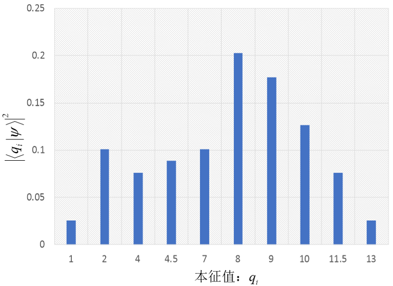
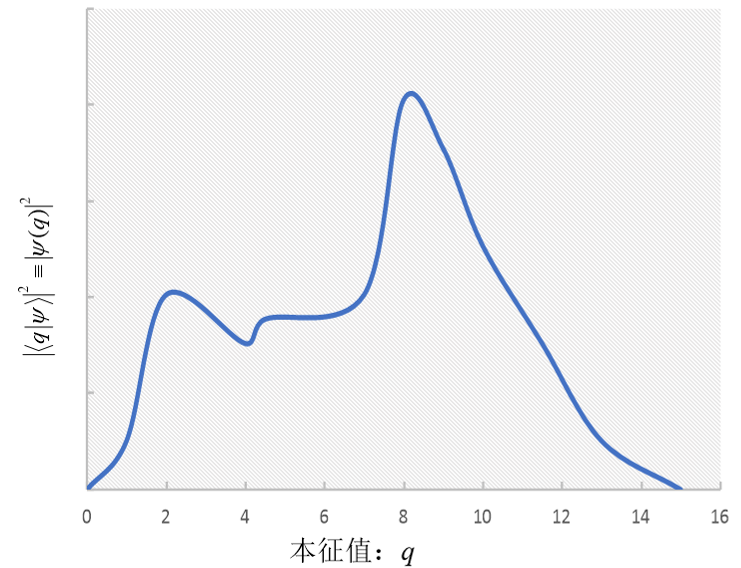
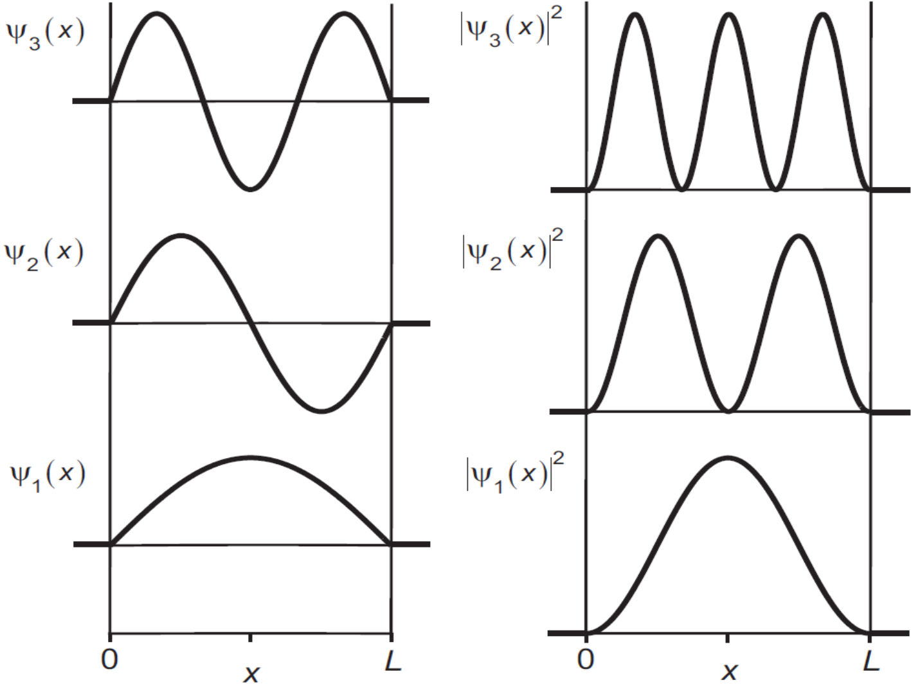
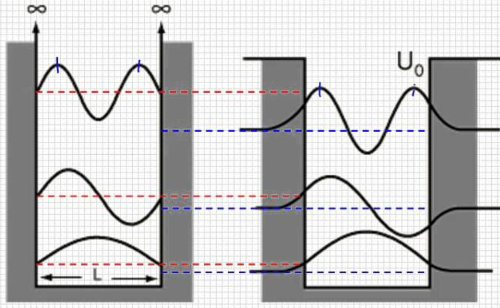
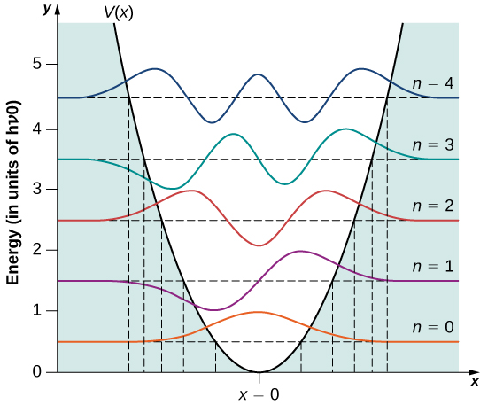

# Continuous Observables

So far, our observables have discrete eigenvalues. Their eigenbases define **discrete representations**. We now consider observables with continuous eigenvalues and the **continuous representations** they define, developing their properties by comparison. Unless stated otherwise, integrals extend from negative to positive infinity.

## The Dirac delta function

Introduce the Dirac $\delta$ function $\delta (x - x')$, where $x$ is a real variable and $x'$ a real parameter. It is defined by

$$
\delta \left( {x - x'} \right) = \left\{ {\begin{array}{*{20}{c}} {\infty ,}&{x = x'}\\ {0,}&{x \ne x'} \end{array}} \right.
$$ {#eq-ch07-p1520}

$$
\int_{ - \infty }^\infty {\delta \left( {x - x'} \right)dx} = 1
$$ {#eq-ch07-p1521}

The $\delta$ function has the properties

$$
\delta \left( {x - x'} \right) = \delta \left( {x' - x} \right)
$$ {#eq-ch07-p1523}

$$
\delta \left( {x - x'} \right)F\left( x \right) = \delta \left( {x - x'} \right)F\left( {x'} \right)
$$ {#eq-ch07-p1524}

$$
\int {dx\;\delta \left( {x - x'} \right)F\left( x \right)} = F\left( {x'} \right)
$$ {#eq-zeqnnum269859}

Equation @eq-zeqnnum269859 may itself be used to define the $\delta$ function.

A Fourier expansion expresses a function $F\left( x \right)$ in terms of $\exp \left( {ikx} \right)$:

$$
F\left( x \right) = \frac{1}{{\sqrt {2\pi } }}\int\limits_{{\rm{ - }}\infty }^{{\rm{ + }}\infty } {dk\;\widetilde F\left( k \right)\exp \left( {ikx} \right)}
$$ {#eq-zeqnnum712670}

The coefficients $\widetilde F\left( k \right)$ are

$$
\widetilde F\left( k \right) = \frac{1}{{\sqrt {2\pi } }}\int\limits_{{\rm{ - }}\infty }^\infty {dx\;F\left( x \right)\exp \left( { - ikx} \right)}
$$ {#eq-zeqnnum971789}

Functions $F\left( x \right)$ and $\widetilde F\left( k \right)$ are Fourier transforms of each other. Equations @eq-zeqnnum712670 and @eq-zeqnnum971789 give

$$
\begin{array}{c} F\left( {x'} \right) = \frac{1}{{\sqrt {2\pi } }}\int {dk\;\widetilde F\left( k \right)\exp \left( {ikx'} \right)} \\ = \frac{1}{{\sqrt {2\pi } }}\int {dk\;\left[ {\frac{1}{{\sqrt {2\pi } }}\int\limits_{{\rm{ - }}\infty }^\infty {dx\;F\left( x \right)\exp \left( { - ikx} \right)} } \right]\exp \left( {ikx'} \right)} \\ = \int {dx\left\{ {\frac{1}{{2\pi }}\int {dk\exp \left[ {ik\left( {x' - x} \right)} \right]} } \right\}F\left( x \right)} \\ = \int {dx\left\{ {\frac{1}{{2\pi }}\int {dk\exp \left[ {ik\left( {x - x'} \right)} \right]} } \right\}F\left( x \right)} \end{array}
$$ {#eq-zeqnnum832633}

Comparing @eq-zeqnnum832633 with the defining identity @eq-zeqnnum269859 gives

$$
\delta \left( {x - x'} \right) = \frac{1}{{2\pi }}\int_{ - \infty }^\infty {dk\exp \left[ {ik\left( {x - x'} \right)} \right]}
$$ {#eq-zeqnnum117049}

$$
\delta \left( x \right) = \frac{1}{{2\pi }}\int_{ - \infty }^\infty {dk\exp \left( {ikx} \right)} = \frac{1}{{\sqrt {2\pi } }}\int_{ - \infty }^\infty {dk\frac{1}{{\sqrt {2\pi } }}\exp \left( {ikx} \right)}
$$ {#eq-zeqnnum893086}

This is the Fourier representation of the $\delta$ function. Comparing @eq-zeqnnum893086 and @eq-zeqnnum712670, $\delta (x)$ and ${1 \mathord{\left/ {\vphantom {1 {\sqrt {2\pi } }}} \right. \kern-1.2pt } {\sqrt {2\pi } }}$ form a Fourier-transform pair.

## Continuous representations and wavefunctions

We extend the discrete formalism to continuous observables. For discrete eigenvalues of $\hat Q$, use integer-indexed quantities ${q_i}$. For continuous eigenvalues of $\hat Q$, use a continuous variable $q,q',q''...$.

{width=286px}{width=265px}

::: {.source-caption}
Figure 7.1. Left: ${\left\vert  {\langle {{q_i}}\vert \psi\rangle } \right\vert ^2}$ is a probability in a discrete representation. Right: ${\left\vert  {\langle q\vert \psi\rangle } \right\vert ^2}$ is a probability density in a continuous representation.
:::

For a discrete observable $\hat Q$, state $\left\vert  \psi \right\rangle$ has the expansion in the $\hat Q$ representation

$$
\left\vert  \psi \right\rangle = \sum\limits_i {\left\vert  {{q_i}} \right\rangle \left\langle {{{q_i}}} \mathrel{\left \vert  {\vphantom {{{q_i}} \psi }} \right. \kern-1.2pt } {\psi } \right\rangle }
$$ {#eq-ch07-p1542}

The probability amplitude $\langle {{q_i}}\vert \psi\rangle$ is a discrete function of ${q_i}$. Its squared magnitude ${\left\vert  {\left\langle {{{q_i}}} \mathrel{\left \vert  {\vphantom {{{q_i}} \psi }} \right. \kern-1.2pt } {\psi } \right\rangle } \right\vert ^2}$ is the probability that $\hat Q$ has value ${q}_{i}$ in state $\left\vert  \psi \right\rangle$. Probability conservation requires

$$
\sum\limits_i {{{\left\vert  {\left\langle {{{q_i}}} \mathrel{\left \vert  {\vphantom {{{q_i}} \psi }} \right. \kern-1.2pt } {\psi } \right\rangle } \right\vert }^2}} = 1
$$ {#eq-zeqnnum779322}

For a continuous observable $\hat Q$, $\left\langle {q} \mathrel{\left \vert  {\vphantom {q \psi }} \right. \kern-1.2pt } {\psi } \right\rangle$ becomes a continuous function of $q$, written

$$
\left\langle {q} \mathrel{\left \vert  {\vphantom {q \psi }} \right. \kern-1.2pt } {\psi } \right\rangle \equiv \psi \left( q \right)
$$ {#eq-ch07-p1546}

This is a **wavefunction**, although it need not describe an ordinary wave. It depends on the representation: $\psi \left( q \right)$ is state $\left\vert  \psi \right\rangle$ in the $\hat Q$ representation. As Figure 7.1 illustrates, ${\left\vert  {\psi (q)} \right\vert ^2}$ is continuous in $q$, so the sum in @eq-zeqnnum779322 becomes an integral:

$$
\int {dq} {\left\vert  {\psi (q)} \right\vert ^2} = 1
$$ {#eq-zeqnnum469206}

Thus $dq{\left\vert  {\psi (q)} \right\vert ^2}$ is the probability that $\hat Q$ lies in $q\~q + dq$ in state $\left\vert  \psi \right\rangle$. The quantity ${\left\vert  {\psi (q)} \right\vert ^2}$ is the probability density near $q$ for $\hat Q$ in state $\left\vert  \psi \right\rangle$, with dimensions ${1 \mathord{\left/ {\vphantom {1 q}} \right. \kern-1.2pt } q}$.

To ensure unique, normalized probabilities, the physically admissible wavefunctions $\psi (q)$ considered here satisfy three conditions:

- **Single-valued:** apart from an overall phase, each $q$ has a unique value $\psi (q)$.

- **Continuous everywhere.**

- **Vanishing at infinity:** $\psi (q = \pm \infty ) = 0$.

Normalization and probability conservation @eq-zeqnnum469206 give, for any state $\vert \psi \rangle$,

$$
\left\langle {\psi } \mathrel{\left \vert  {\vphantom {\psi \psi }} \right. \kern-1.2pt } {\psi } \right\rangle = 1 = \int {dq} {\left\vert  {\left\langle {q} \mathrel{\left \vert  {\vphantom {q \psi }} \right. \kern-1.2pt } {\psi } \right\rangle } \right\vert ^2} = \int {dq\left\langle {\psi } \mathrel{\left \vert  {\vphantom {\psi q}} \right. \kern-1.2pt } {q} \right\rangle \left\langle {q} \mathrel{\left \vert  {\vphantom {q \psi }} \right. \kern-1.2pt } {\psi } \right\rangle } = \left\langle \psi \right\vert \left( {\int {dq\left\vert  q \right\rangle \left\langle q \right\vert } } \right)\left\vert  \psi \right\rangle
$$ {#eq-ch07-p1555}

Hence the continuous completeness relation is

$$
\int {dq\;\left\vert  q \right\rangle \left\langle q \right\vert } = \hat I
$$ {#eq-zeqnnum869918}

Completeness gives the following results.

The expansion of an arbitrary state $\left\vert  \psi \right\rangle$ is

$$
\left\vert  \psi \right\rangle = \int {dq\left\vert  q \right\rangle \left\langle {q} \mathrel{\left \vert  {\vphantom {q \psi }} \right. \kern-1.2pt } {\psi } \right\rangle } = \int {dq\;\psi (q)\left\vert  q \right\rangle }
$$ {#eq-zeqnnum818008}

The inner product of two states is

$$
\left\langle {\phi } \mathrel{\left \vert  {\vphantom {\phi \psi }} \right. \kern-1.2pt } {\psi } \right\rangle = \int {dq\left\langle {\phi } \mathrel{\left \vert  {\vphantom {\phi q}} \right. \kern-1.2pt } {q} \right\rangle \left\langle {q} \mathrel{\left \vert  {\vphantom {q \psi }} \right. \kern-1.2pt } {\psi } \right\rangle } = \int {{\phi ^*}\left( q \right)\psi \left( q \right)dq}
$$ {#eq-ch07-p1562}

Take the inner product of @eq-zeqnnum818008 with eigenstate $\vert {q'}\rangle$ of $\hat Q$, belonging to eigenvalue $q'$:

$$
\psi (q') = \int {dq\;\psi (q)\left\langle {{q'}} \mathrel{\left \vert  {\vphantom {{q'} q}} \right. \kern-1.2pt } {q} \right\rangle }
$$ {#eq-ch07-p1564}

Comparison with the $\delta$-function definition @eq-zeqnnum269859 gives

$$
\left\langle {{q'}} \mathrel{\left \vert  {\vphantom {{q'} q}} \right. \kern-1.2pt } {q} \right\rangle = \delta (q - q') = \delta (q' - q) = \left\langle {q} \mathrel{\left \vert  {\vphantom {q {q'}}} \right. \kern-1.2pt } {{q'}} \right\rangle
$$ {#eq-ch07-p1566}

Thus the state with definite value $q'$ of continuous observable $\hat Q$ has wavefunction $\delta (q - q')$ in its own representation.

Table 7.1 compares the corresponding formulas in discrete and continuous representations.

Table 7.1. Expansions in discrete and continuous representations.

|  | Discrete representation | Continuous representation |
| --- | --- | --- |
| Eigenvalue equation | $\hat Q\left\vert  {{q_i}} \right\rangle = {q_i}\left\vert  {{q_i}} \right\rangle$ | $\hat Q\left\vert  q \right\rangle = q\left\vert  q \right\rangle$ |
| Relations between basis vectors | $\left\langle {{{q_i}}} \mathrel{\left \vert  {\vphantom {{{q_i}} {{q_j}}}} \right. \kern-1.2pt } {{{q_j}}} \right\rangle = {\delta _{ij}}$ | $\left\langle {q} \mathrel{\left \vert  {\vphantom {q {q'}}} \right. \kern-1.2pt } {{q'}} \right\rangle = \delta \left( {q - q'} \right)$ |
| State expansion | $\left\vert  \psi \right\rangle = \sum\limits_i {\left\vert  {{q_i}} \right\rangle \left\langle {{{q_i}}} \mathrel{\left \vert  {\vphantom {{{q_i}} \psi }} \right. \kern-1.2pt } {\psi } \right\rangle }$ | $\left\vert  \psi \right\rangle = \int {dq\left\vert  q \right\rangle \left\langle {q} \mathrel{\left \vert  {\vphantom {q \psi }} \right. \kern-1.2pt } {\psi } \right\rangle } = \int {dq\;\psi (q)\left\vert  q \right\rangle }$ |
| State in the chosen basis | Column of probability amplitudes $\left( {\begin{array}{*{20}{c}} \vdots \\ {\left\langle {{{q_i}}} \mathrel{\left \vert  {\vphantom {{{q_i}} \psi }} \right. \kern-1.2pt } {\psi } \right\rangle }\\ \vdots \end{array}} \right)$ | Wavefunction (probability-density amplitude) $\left\langle {q} \mathrel{\left \vert  {\vphantom {q \psi }} \right. \kern-1.2pt } {\psi } \right\rangle \equiv \psi {\rm{(}}q)$ Single-valued, continuous, $\psi (q = \pm \infty ) = 0$ |
| Measurement probability | ${\left\vert  {\left\langle {{{q_i}}} \mathrel{\left \vert  {\vphantom {{{q_i}} \psi }} \right. \kern-1.2pt } {\psi } \right\rangle } \right\vert ^2}$: probability of value ${q_i}$ | ${\left\vert  {\psi (q)} \right\vert ^2}dq$: probability of a value in $q\~q + dq$ |
| Probability conservation | $\sum\limits_i {{{\left\vert  {\left\langle {{{q_i}}} \mathrel{\left \vert  {\vphantom {{{q_i}} \psi }} \right. \kern-1.2pt } {\psi } \right\rangle } \right\vert }^2}} = 1$ | $\int {dq\;{{\left\vert  {\left\langle {q} \mathrel{\left \vert  {\vphantom {q \psi }} \right. \kern-1.2pt } {\psi } \right\rangle } \right\vert }^2}} = \int {dq\;{{\left\vert  {\psi (q)} \right\vert }^2}} = 1$ |
| Completeness relation | $\sum\limits_i {\left\vert  {{q_i}} \right\rangle \left\langle {{q_i}} \right\vert } = \hat I$ | $\int {dq\left\vert  q \right\rangle \left\langle q \right\vert } = \hat I$ |
| $\left\langle {\phi } \mathrel{\left \vert  {\vphantom {\phi \psi }} \right. \kern-1.2pt } {\psi } \right\rangle$ | $\sum\limits_i {\left\langle {\phi } \mathrel{\left \vert  {\vphantom {\phi {{q_i}}}} \right. \kern-1.2pt } {{{q_i}}} \right\rangle \left\langle {{{q_i}}} \mathrel{\left \vert  {\vphantom {{{q_i}} \psi }} \right. \kern-1.2pt } {\psi } \right\rangle }$ | $\int {dq\;\left\langle {\phi } \mathrel{\left \vert  {\vphantom {\phi q}} \right. \kern-1.2pt } {q} \right\rangle \left\langle {q} \mathrel{\left \vert  {\vphantom {q \psi }} \right. \kern-1.2pt } {\psi } \right\rangle } {\rm{ = }}\int {dq\;{\phi ^*}{\rm{(}}q)\psi (q)}$ |

We now examine several important continuous observables.

## Position

A particle's position is an observable, represented in one dimension by $\hat X$. Its eigenvalue equation is postulated to be

$$
\hat X\left\vert  x \right\rangle = x\left\vert  x \right\rangle
$$ {#eq-ch07-p1634}

The variable $x$ labels eigenvalues of $\hat X$, continuously from negative to positive infinity. The eigenstate $\left\vert  x \right\rangle$ corresponding to $x$ represents a particle definitely at $x$.

Position eigenstates form a delta-normalized complete set:

$$
\left\langle {{x'}} \mathrel{\left \vert  {\vphantom {{x'} {x''}}} \right. \kern-1.2pt } {{x''}} \right\rangle = \delta \left( {x'' - x'} \right)
$$ {#eq-ch07-p1637}

Any motional state $\left\vert  \psi \right\rangle$ can be expanded in $\left\{ {\left\vert  x \right\rangle } \right\}$:

$$
\left\vert  \psi \right\rangle = \int_{ - \infty }^\infty {dx\left\vert  x \right\rangle \left\langle {x} \mathrel{\left \vert  {\vphantom {x \psi }} \right. \kern-1.2pt } {\psi } \right\rangle }
$$ {#eq-ch07-p1639}

Here $\left\langle {x} \mathrel{\left \vert  {\vphantom {x \psi }} \right. \kern-1.2pt } {\psi } \right\rangle \equiv \psi \left( x \right)$ is the **position wavefunction**. ${\left\vert  {\psi \left( x \right)} \right\vert ^2}$ is the probability density at $x$ in state $\left\vert  \psi \right\rangle$, and ${\left\vert  {\psi \left( x \right)} \right\vert ^2}dx$ is the probability in interval $x\~x + dx$ in state $\left\vert  \psi \right\rangle$. Thus, in state $\left\vert  \psi \right\rangle$, the probability of position between $x = a$ and $x = b$ is

$$
\int_a^b {dx{{\left\vert  {\psi \left( x \right)} \right\vert }^2}}
$$ {#eq-ch07-p1641}

The probability of finding the particle somewhere in space is $1$:

$$
\int_{ - \infty }^\infty {dx{{\left\vert  {\psi \left( x \right)} \right\vert }^2}} = 1
$$ {#eq-zeqnnum866371}

In the special state $\vert {x_0}\rangle$, with definite position ${x_0}$, the wavefunction is

$$
\langle x\vert {x_0}\rangle = \delta (x - {x_0})
$$ {#eq-ch07-p1645}

### The position operator in position space

For any one-dimensional motional state $\vert \psi \rangle$,

$$
\langle x\vert \hat X\vert \psi \rangle = \left( {\langle x\vert \hat X} \right)\vert \psi \rangle = x\langle x\vert \psi \rangle = x\psi (x)
$$ {#eq-ch07-p1648}

Thus $\hat X\left\vert  \psi \right\rangle$ is represented by $x\psi \left( x \right)$ in position space, and $\hat X$ has the form

$$
\hat X = x
$$ {#eq-zeqnnum472694}

Real functions of the position operator are Hermitian. For example, ${\hat X^n}$ satisfies

$$
{\hat X^n}\left\vert  x \right\rangle = {\hat X^{n - 1}}\left( {\hat X\left\vert  x \right\rangle } \right) = {\hat X^{n - 1}}x\left\vert  x \right\rangle = x{\hat X^{n - 1}}\left\vert  x \right\rangle = \cdots = {x^n}\left\vert  x \right\rangle
$$ {#eq-ch07-p1652}

An operator function $V{\rm{(}}\hat X{\rm{)}}$ may be defined through its Taylor series:

$$
V(\hat X) \equiv V\left( 0 \right)\hat I + V'\left( 0 \right)\hat X + \frac{{V''\left( 0 \right)}}{{2!}}{\hat X^2} + \cdots
$$ {#eq-ch07-p1654}

Therefore,

$$
\begin{array}{c} V(\hat X)\left\vert  x \right\rangle = V\left( 0 \right)\hat I\left\vert  x \right\rangle + V'\left( 0 \right)\hat X\left\vert  x \right\rangle + \frac{{V''\left( 0 \right)}}{{2!}}{{\hat X}^2}\left\vert  x \right\rangle + \cdots \\ = \left\{ {V\left( 0 \right) + V'\left( 0 \right)x + \frac{{V''\left( 0 \right)}}{{2!}}{x^2} + \cdots } \right\}\left\vert  x \right\rangle \\ = V(x)\left\vert  x \right\rangle \end{array}
$$ {#eq-ch07-p1656}

The quantity $V(\hat X)$ on the left is an operator; $V(x)$ on the right is a number, the eigenvalue of $V(\hat X)$.

Using the Hermiticity of $V(\hat X)$, for any state $\vert \psi \rangle$,

$$
\left\langle x \right\vert V(\hat X)\left\vert  \psi \right\rangle = \left[ {\left\langle x \right\vert V(\hat X)} \right]\left\vert  \psi \right\rangle = V\left( x \right)\left\langle {x} \mathrel{\left \vert  {\vphantom {x \psi }} \right. \kern-1.2pt } {\psi } \right\rangle = V\left( x \right)\psi \left( x \right)
$$ {#eq-zeqnnum311642}

The position wavefunction of $V(\hat X)\left\vert  \psi \right\rangle$ is $V\left( x \right)$ times that of $\vert \psi \rangle$. Thus $V(\hat X)$ is represented in position space by $V(x)$.

$$
V(\hat X) = V\left( x \right)
$$ {#eq-zeqnnum494017}

### Position wavefunctions in three dimensions

A particle can have definite Cartesian position ${\bf{r}}$. The components $\hat X,\hat Y,\hat Z$ commute pairwise and have common three-dimensional position eigenstates:

$$
\left\vert  {\bf{r}} \right\rangle \equiv \left\vert  {x,y,z} \right\rangle
$$ {#eq-ch07-p1664}

$$
\hat X\left\vert  {\bf{r}} \right\rangle = x\left\vert  {\bf{r}} \right\rangle , \qquad  \hat Y\left\vert  {\bf{r}} \right\rangle = y\left\vert  {\bf{r}} \right\rangle , \qquad  \hat Z\left\vert  {\bf{r}} \right\rangle = z\left\vert  {\bf{r}} \right\rangle
$$ {#eq-ch07-p1665}

**Orthogonality:**

$$
\left\langle {{{\bf{r'}}}} \mathrel{\left \vert  {\vphantom {{{\bf{r'}}} {{\bf{r''}}}}} \right. \kern-1.2pt } {{{\bf{r''}}}} \right\rangle = {\delta ^3}\left( {{\bf{r'}} - {\bf{r''}}} \right)
$$ {#eq-ch07-p1667}

Here ${\delta ^3}$ is the three-dimensional $\delta$ function: ${\delta ^3}\left( {{\bf{r'}} - {\bf{r''}}} \right) \equiv \delta \left( {x' - x''} \right)\delta \left( {y' - y''} \right)\delta \left( {z' - z''} \right)$.

**Completeness:**

$$
\int {{d^3}r\left\vert  {\bf{r}} \right\rangle \left\langle {\bf{r}} \right\vert } = \hat I
$$ {#eq-ch07-p1670}

Here $\int {{d^3}r} \equiv \iiint {dxdydz}$.

Any three-dimensional motional state $\left\vert  \psi \right\rangle$ expands as

$$
\left\vert  \psi \right\rangle = \int {{d^3}r\left\vert  {\bf{r}} \right\rangle \left\langle {{\bf{r}}} \mathrel{\left \vert  {\vphantom {{\bf{r}} \psi }} \right. \kern-1.2pt } {\psi } \right\rangle } = \int {{d^3}r\left\vert  {\bf{r}} \right\rangle \psi \left( {\bf{r}} \right)}
$$ {#eq-ch07-p1673}

where $\left\vert  {\bf{r}} \right\rangle \equiv \left\vert  {x,y,z} \right\rangle$ and $\left\langle {{\bf{r}}} \mathrel{\left \vert  {\vphantom {{\bf{r}} \psi }} \right. \kern-1.2pt } {\psi } \right\rangle \equiv \left\langle {{x,y,z}} \mathrel{\left \vert  {\vphantom {{x,y,z} \psi }} \right. \kern-1.2pt } {\psi } \right\rangle \equiv \psi \left( {x,y,z} \right) \equiv \psi ({\bf{r}})$.

The quantity ${\left\vert  {\psi \left( {\bf{r}} \right)} \right\vert ^2}{d^3}r$ is the probability of finding a particle in state $\left\vert  \psi \right\rangle$ within volume ${d^3}r$ at ${\bf{r}}$. The quantity ${\left\vert  {\psi \left( {\bf{r}} \right)} \right\vert ^2}$ is the probability density at ${\bf{r}}$ in state $\left\vert  \psi \right\rangle$.

Extending @eq-zeqnnum472694 and @eq-zeqnnum494017 to three dimensions gives

$$
\hat X = x, \qquad  \hat Y = y, \qquad  \hat Z = z
$$ {#eq-zeqnnum707152}

$$
V(\hat X,\hat Y,\hat Z) = V(x,y,z)
$$ {#eq-ch07-p1678}

## Momentum

Momentum is also a continuous observable. Denote its one-dimensional operator by $\hat P$. Its eigenvalue equation is

$$
\hat P\left\vert  p \right\rangle = p\left\vert  p \right\rangle , \qquad  p \in \left( { - \infty , + \infty } \right)
$$ {#eq-ch07-p1681}

Momentum eigenstates form a complete set:

$$
\left\langle {{p'}} \mathrel{\left \vert  {\vphantom {{p'} p}} \right. \kern-1.2pt } {p} \right\rangle = \delta \left( {p - p'} \right), \qquad  \qquad  \int_{ - \infty }^\infty {dp\left\vert  p \right\rangle \left\langle p \right\vert } = \hat I
$$ {#eq-ch07-p1683}

Any one-dimensional motional state $\vert \psi \rangle$ can be expanded in $\left\{ {\left\vert  p \right\rangle } \right\}$, the momentum representation:

$$
\left\vert  \psi \right\rangle = \int_{ - \infty }^\infty {dp\left\vert  p \right\rangle \left\langle {p} \mathrel{\left \vert  {\vphantom {p \psi }} \right. \kern-1.2pt } {\psi } \right\rangle }
$$ {#eq-ch07-p1685}

The amplitude $\left\langle {p} \mathrel{\left \vert  {\vphantom {p \psi }} \right. \kern-1.2pt } {\psi } \right\rangle$ is the **momentum wavefunction**, usually written $\widetilde \psi \left( p \right)$:

$$
\left\langle {p} \mathrel{\left \vert  {\vphantom {p \psi }} \right. \kern-1.2pt } {\psi } \right\rangle \equiv \widetilde \psi \left( p \right)
$$ {#eq-ch07-p1687}

The tilde on $\widetilde \psi \left( p \right)$ distinguishes it from the position wavefunction $\psi \left( x \right)$. Functions $\widetilde \psi$ and $\psi$ differ in functional form, not merely in the name of their variable.

For momentum wavefunction $\widetilde \psi \left( p \right)$, ${\left\vert  {\widetilde \psi \left( p \right)} \right\vert ^{\rm{2}}}dp$ is the probability of momentum in $p \sim p + dp$, while ${\left\vert  {\widetilde \psi \left( p \right)} \right\vert ^{\rm{2}}}$ is the probability density near $p$, that is, probability per unit momentum interval.

## The relationship between position and momentum

We now investigate how position and momentum are related.

### Spatial translations and the momentum operator

Define an infinitesimal translation operator $\hat \Gamma \left( {\Delta x} \right)$ that moves a particle at $x$ by $\Delta x$ along $x$:

$$
\hat \Gamma \left( {\Delta x} \right)\left\vert  x \right\rangle = \left\vert  {x + \Delta x} \right\rangle
$$ {#eq-zeqnnum909685}

Thus,

$$
\hat \Gamma \left( { - \Delta x} \right)\hat \Gamma \left( {\Delta x} \right)\left\vert  x \right\rangle = \hat \Gamma \left( { - \Delta x} \right)\left\vert  {x + \Delta x} \right\rangle = \left\vert  x \right\rangle
$$ {#eq-ch07-p1696}

Since $\left\{ {\left\vert  x \right\rangle } \right\}$ is complete, $\hat \Gamma \left( { - \Delta x} \right)\hat \Gamma \left( {\Delta x} \right)\left\vert  \psi \right\rangle = \left\vert  \psi \right\rangle$ holds for any state $\left\vert  \psi \right\rangle$. Hence

$$
\hat \Gamma \left( { - \Delta x} \right)\hat \Gamma \left( {\Delta x} \right) = \hat I
$$ {#eq-ch07-p1698}

We impose three physical requirements on $\hat \Gamma \left( {\Delta x} \right)$.

- A translation tending to zero leaves the state unchanged:

$$
\hat \Gamma \left( {\Delta x \to 0} \right) = \hat I
$$ {#eq-ch07-p1701}

- Two successive infinitesimal translations equal a translation by their sum:

$$
\hat \Gamma \left( {\Delta {x_2}} \right)\hat \Gamma \left( {\Delta {x_1}} \right) = \hat \Gamma \left( {\Delta {x_1} + \Delta {x_2}} \right) = \hat \Gamma \left( {\Delta {x_1}} \right)\hat \Gamma \left( {\Delta {x_2}} \right)
$$ {#eq-ch07-p1703}

- Physical laws are unchanged by translation. In particular, $\hat \Gamma \left( {\Delta x} \right)$ preserves inner products: for vectors $\left\vert  \psi \right\rangle$ and $\left\vert  \phi \right\rangle$, if $\hat \Gamma \left( {\Delta x} \right)\left\vert  \psi \right\rangle = \left\vert  {\psi '} \right\rangle , \qquad  \hat \Gamma \left( {\Delta x} \right)\left\vert  \phi \right\rangle = \left\vert  {\phi '} \right\rangle$, then

$$
\left\langle {\phi } \mathrel{\left \vert  {\vphantom {\phi \psi }} \right. \kern-1.2pt } {\psi } \right\rangle = \left\langle {{\phi '}} \mathrel{\left \vert  {\vphantom {{\phi '} {\psi '}}} \right. \kern-1.2pt } {{\psi '}} \right\rangle = \left\langle \phi \right\vert {\hat \Gamma ^\dag }\left( {\Delta x} \right)\hat \Gamma \left( {\Delta x} \right)\left\vert  \psi \right\rangle
$$ {#eq-ch07-p1705}

Consequently,

$$
{\hat \Gamma ^ + }\left( {\Delta x} \right)\hat \Gamma \left( {\Delta x} \right) = \hat I
$$ {#eq-ch07-p1707}

Thus $\hat \Gamma \left( {\Delta x} \right)$ is unitary, and spatial translation is a unitary transformation.

$$
{\hat \Gamma ^\dag }\left( {\Delta x} \right) = \hat \Gamma \left( { - \Delta x} \right)
$$ {#eq-zeqnnum441973}

These requirements suggest the form $\hat \Gamma \left( {\Delta x} \right)$:

$$
\hat \Gamma \left( {\Delta x} \right) = \hat I - i\hat K\Delta x
$$ {#eq-zeqnnum676559}

The first two requirements are satisfied. The third requires ${\hat K^\dag } = \hat K$.

Hence $\hat K$ is Hermitian and corresponds to an observable. From @eq-zeqnnum676559, $\hat K$ has inverse-length dimensions, like wave number $k \equiv {{2\pi } \mathord{\left/ {\vphantom {{2\pi } \lambda }} \right. \kern-1.2pt } \lambda }$. The de Broglie relation $p = {h \mathord{\left/ {\vphantom {h \lambda }} \right. \kern-1.2pt } \lambda }$, or $k = {p \mathord{\left/ {\vphantom {p \hbar }} \right. \kern-1.2pt } \hbar }$, suggests

$$
\hat K = {{\hat P} \mathord{\left/ {\vphantom {{\hat P} \hbar }} \right. \kern-1.2pt } \hbar }
$$ {#eq-zeqnnum551095}

Here $\hat P$ is momentum. Equation @eq-zeqnnum676559 becomes

$$
\hat \Gamma \left( {\Delta x} \right) = \hat I - i\frac{{\hat P}}{\hbar }\Delta x
$$ {#eq-zeqnnum333148}

Experiment confirms this identification: momentum is the **generator of spatial translations**.

From @eq-zeqnnum441973, ${\hat \Gamma ^\dag }(\Delta x)\vert x\rangle = \vert x - \Delta x\rangle$, and therefore

$$
\langle x\vert \hat \Gamma (\Delta x) = \langle x - \Delta x\vert
$$ {#eq-ch07-p1719}

Changing the position basis changes the position wavefunction of $\vert \psi\rangle$:

$$
\langle x\vert \hat \Gamma (\Delta x)\vert \psi\rangle = \langle x - \Delta x\vert \psi\rangle = \psi (x - \Delta x)
$$ {#eq-ch07-p1721}

Thus a translation acts on a position wavefunction as

$$
\hat \Gamma (\Delta x)\psi (x) = \psi (x - \Delta x)
$$ {#eq-ch07-p1723}

### The position–momentum commutator

First consider the commutator of translation $\hat \Gamma \left( {\Delta x} \right)$ and position $\hat X$:

$$
\hat X\hat \Gamma \left( {\Delta x} \right)\left\vert  x \right\rangle = \hat X\left\vert  {x + \Delta x} \right\rangle = \left( {x + \Delta x} \right)\left\vert  {x + \Delta x} \right\rangle
$$ {#eq-ch07-p1726}

$$
\hat \Gamma \left( {\Delta x} \right)\hat X\left\vert  x \right\rangle = \hat \Gamma \left( {\Delta x} \right)x\left\vert  x \right\rangle = x\left\vert  {x + \Delta x} \right\rangle
$$ {#eq-ch07-p1727}

It follows that

$$
\left[ {\hat X,\hat \Gamma \left( {\Delta x} \right)} \right]\left\vert  x \right\rangle = \Delta x\left\vert  {x + \Delta x} \right\rangle \approx \Delta x\left\vert  x \right\rangle
$$ {#eq-ch07-p1729}

The last step neglects higher-order terms in $\Delta x$. Every position eigenstate $\vert x\rangle$ is an eigenstate of commutator $[\hat X,\hat \Gamma \left( {\Delta x} \right)]$ with eigenvalue $\Delta x$. Since $\left\{ {\vert x\rangle } \right\}$ is complete, reasoning as in @eq-ch04-p1092 gives

$$
\left[ {\hat X,\hat \Gamma \left( {\Delta x} \right)} \right] = \Delta x
$$ {#eq-ch07-p1731}

Substitute @eq-zeqnnum333148:

$$
\left[ {\hat X,\hat P} \right] = i\hbar
$$ {#eq-zeqnnum187365}

This is the canonical commutation relation. Position and momentum are incompatible, with no common eigenstate or simultaneous definite values. Combining @eq-zeqnnum187365 with uncertainty relation @eq-zeqnnum149609 gives

$$
\Delta \hat X\Delta \hat P \ge {\hbar \mathord{\left/ {\vphantom {\hbar 2}} \right. \kern-1.2pt } 2}
$$ {#eq-ch07-p1735}

### Momentum in the position representation

We now derive the position-space form of momentum.

From the infinitesimal translation definition @eq-zeqnnum909685,

$$
\left( {\hat I - i\frac{{\hat P}}{\hbar }\Delta x} \right)\left\vert  x \right\rangle = \left\vert  {x + \Delta x} \right\rangle
$$ {#eq-ch07-p1739}

$$
\hat P\vert x\rangle = i\hbar \frac{{\vert x + \Delta x\rangle - \vert x\rangle }}{{\Delta x}}
$$ {#eq-ch07-p1740}

For any state $\left\vert  \psi \right\rangle$,

$$
\left\langle x \right\vert \hat P\left\vert  \psi \right\rangle = \left( { - i\hbar \frac{{\langle x + \Delta x\vert  - \langle x\vert }}{{\Delta x}}} \right)\left\vert  \psi \right\rangle = - i\hbar \frac{{\left\langle {{x + \Delta x}} \mathrel{\left \vert  {\vphantom {{x + \Delta x} \psi }} \right. \kern-1.2pt } {\psi } \right\rangle - \left\langle {x} \mathrel{\left \vert  {\vphantom {x \psi }} \right. \kern-1.2pt } {\psi } \right\rangle }}{{\Delta x}}
$$ {#eq-ch07-p1742}

Therefore,

$$
\left\langle x \right\vert \hat P\left\vert  \psi \right\rangle = - i\hbar \frac{d}{{dx}}\left\langle {x} \mathrel{\left \vert  {\vphantom {x \psi }} \right. \kern-1.2pt } {\psi } \right\rangle
$$ {#eq-zeqnnum308911}

The left side is $\hat P\left\vert  \psi \right\rangle$ in position space; $\left\langle {x} \mathrel{\left \vert  {\vphantom {x \psi }} \right. \kern-1.2pt } {\psi } \right\rangle$ on the right represents $\vert \psi\rangle$. Thus $- i\hbar {\textstyle{d \over {dx}}}$ represents $\hat P$:

$$
\hat P = - i\hbar \frac{d}{{dx}}
$$ {#eq-zeqnnum685183}

Use the position-space forms @eq-zeqnnum707152 and @eq-zeqnnum578039 to verify $[\hat X,{\hat P_x}] = i\hbar$ again.

**Proof.** Let $\left\vert  \psi \right\rangle$ be arbitrary, with position wavefunction $\psi (x)$.

$$
\begin{array}{c} \hat X{{\hat P}_x}\left\vert  \psi \right\rangle \buildrel\textstyle.\over= x\left( { - i\hbar \frac{\partial }{{\partial x}}} \right)\psi \left( x \right) = - i\hbar x\frac{\partial }{{\partial x}}\psi \left( x \right)\\ {{\hat P}_x}\hat X\left\vert  \psi \right\rangle \buildrel\textstyle.\over= - i\hbar \frac{\partial }{{\partial x}}x\;\psi \left( x \right) = - i\hbar \frac{\partial }{{\partial x}}\left[ {x\psi \left( x \right)} \right] = - i\hbar \left[ {\psi \left( x \right) + x\frac{\partial }{{\partial x}}\psi \left( x \right)} \right] \end{array}
$$ {#eq-ch07-p1749}

$$
\left( {\hat X{{\hat P}_x} - {{\hat P}_x}\hat X} \right)\vert \psi \rangle \buildrel\textstyle.\over= i\hbar \psi (x)
$$ {#eq-ch07-p1750}

In three dimensions,

$$
{\hat P_x} = - i\hbar \frac{\partial }{{\partial x}}, \qquad  {\hat P_y} = - i\hbar \frac{\partial }{{\partial y}}, \qquad  {\hat P_z} = - i\hbar \frac{\partial }{{\partial z}}
$$ {#eq-zeqnnum578039}

Partial derivatives with respect to different coordinates commute, so the three momentum components commute and may be simultaneously definite. Differentiation with respect to $y$ leaves $x$ unchanged, so perpendicular position and momentum components also commute, for example $[\hat X,{\hat P_y}] = 0$. Thus,

$$
\left[ {{{\hat X}_j},{{\hat P}_k}} \right] = i\hbar {\delta _{jk}}
$$ {#eq-zeqnnum944007}

The indices $j,k = 1,2,3$ denote the three Cartesian directions.

Using @eq-zeqnnum578039,

$$
{\bf{\hat P}}\left\vert  \psi \right\rangle \buildrel\textstyle.\over= - i\hbar \left( {{\bf{\hat i}}\frac{\partial }{{\partial x}} + {\bf{\hat j}}\frac{\partial }{{\partial y}} + {\bf{\hat k}}\frac{\partial }{{\partial z}}} \right)\psi (x,y,z) = - i\hbar \nabla \psi \left( {\bf{r}} \right)
$$ {#eq-ch07-p1757}

We can now derive further properties of momentum. First,

$$
{\hat P^2}\left\vert  \psi \right\rangle = \hat P\left( {\hat P\left\vert  \psi \right\rangle } \right)\xrightarrow{{\text{position representation}}} - i\hbar \frac{d}{{dx}}\left( { - i\hbar \frac{d}{{dx}}\psi (x)} \right) = - {\hbar ^2}\frac{{{d^2}}}{{d{x^2}}}\psi (x)
$$ {#eq-ch07-p1759}

Thus, in position space,

$$
{\hat P^2} = - {\hbar ^2}\frac{{{d^2}}}{{d{x^2}}}
$$ {#eq-ch07-p1761}

In three dimensions this becomes

$$
{{\bf{\hat P}}^2}\left\vert  \psi \right\rangle \buildrel\textstyle.\over= - {\hbar ^2}\left( {\frac{{{d^2}}}{{d{x^2}}} + \frac{{{d^2}}}{{d{y^2}}} + \frac{{{d^2}}}{{d{z^2}}}} \right)\psi \left( {\bf{r}} \right) = - {\hbar ^2}{\nabla ^2}\psi \left( {\bf{r}} \right)
$$ {#eq-ch07-p1763}

### Position wavefunctions of momentum eigenstates

To find the position wavefunction $\left\langle {x} \mathrel{\left \vert  {\vphantom {x p}} \right. \kern-1.2pt } {p} \right\rangle$ of momentum eigenstate $\left\vert  p \right\rangle$, use @eq-zeqnnum685183 to write its eigenvalue equation in position space:

$$
\hat P\left\vert  p \right\rangle = p\left\vert  p \right\rangle \xrightarrow{{\text{position representation}}} - i\hbar \frac{\partial }{{\partial x}}\left\langle {x} \mathrel{\left \vert  {\vphantom {x p}} \right. \kern-1.2pt } {p} \right\rangle = p\left\langle {x} \mathrel{\left \vert  {\vphantom {x p}} \right. \kern-1.2pt } {p} \right\rangle
$$ {#eq-ch07-p1766}

The solution is

$$
\left\langle {x} \mathrel{\left \vert  {\vphantom {x p}} \right. \kern-1.2pt } {p} \right\rangle = N\exp \left( {i\frac{{px}}{\hbar }} \right)
$$ {#eq-zeqnnum192350}

Here $N$ is a normalization constant. A momentum eigenstate is represented by a complex plane wave.

The quantity ${\left\vert  {\left\langle {x} \mathrel{\left \vert  {\vphantom {x p}} \right. \kern-1.2pt } {p} \right\rangle } \right\vert ^2}dx$ is the probability that a particle of momentum $p$ lies in $x \sim x + dx$. The quantity ${\left\vert  {\left\langle {x} \mathrel{\left \vert  {\vphantom {x p}} \right. \kern-1.2pt } {p} \right\rangle } \right\vert ^2}$ is its position probability density near $x$ when its momentum is $p$. Since

$$
{\left\vert  {\left\langle {x} \mathrel{\left \vert  {\vphantom {x p}} \right. \kern-1.2pt } {p} \right\rangle } \right\vert ^2} = {\left\vert  N \right\vert ^2}
$$ {#eq-zeqnnum142349}

is independent of position, a definite-momentum state has uniform density throughout space. The integral of @eq-zeqnnum142349 over all space cannot be normalized because @eq-zeqnnum192350 does not vanish at infinity. Exact plane waves are idealizations; normalizable localized physical states are formed from their superpositions.

## Transforming between position and momentum representations

How are the position and momentum wavefunctions of the same state related?

$$
\begin{array}{l} \psi (x) \equiv \left\langle {x} \mathrel{\left \vert  {\vphantom {x \psi }} \right. \kern-1.2pt } {\psi } \right\rangle = \int {dp\left\langle {x} \mathrel{\left \vert  {\vphantom {x p}} \right. \kern-1.2pt } {p} \right\rangle \left\langle {p} \mathrel{\left \vert  {\vphantom {p \psi }} \right. \kern-1.2pt } {\psi } \right\rangle } \\ \tilde \psi (p) \equiv \left\langle {p} \mathrel{\left \vert  {\vphantom {p \psi }} \right. \kern-1.2pt } {\psi } \right\rangle = \int {dx\left\langle {p} \mathrel{\left \vert  {\vphantom {p x}} \right. \kern-1.2pt } {x} \right\rangle \left\langle {x} \mathrel{\left \vert  {\vphantom {x \psi }} \right. \kern-1.2pt } {\psi } \right\rangle } \end{array}
$$ {#eq-ch07-p1775}

Substitute @eq-zeqnnum192350:

$$
\begin{array}{l} \psi \left( x \right) = \frac{1}{N}\int {dp\exp \left( {\frac{{ipx}}{\hbar }} \right)\widetilde \psi \left( p \right)} \\ \widetilde \psi \left( p \right) = \frac{1}{N}\int {dx\exp \left( { - \frac{{ipx}}{\hbar }} \right)\psi \left( x \right)} \end{array}
$$ {#eq-zeqnnum128349}

The position wavefunction $\psi \left( x \right)$ and momentum wavefunction $\tilde \psi \left( p \right)$ are Fourier transforms of each other.

Using @eq-zeqnnum128349, we also obtain the momentum-space form of position:

$$
\begin{array}{c} \left\langle p \right\vert \hat X\left\vert  \psi \right\rangle = \int {dx\langle p\vert x\rangle \langle x\vert {\hat X}\vert \psi\rangle } \\ = \frac{1}{N}\int {dx\exp \left( { - i\frac{{px}}{\hbar }} \right)x\psi (x)} \\ = i\hbar \frac{\partial }{{\partial p}}\left[ {\frac{1}{N}\int {dx\exp \left( { - i\frac{{px}}{\hbar }} \right)\psi (x)} } \right]\\ = i\hbar \frac{\partial }{{\partial p}}\widetilde \psi \left( p \right) \end{array}
$$ {#eq-ch07-p1780}

Thus the position operator in momentum space is

$$
\hat X = i\hbar \frac{\partial }{{\partial p}}
$$ {#eq-ch07-p1782}

## Summary of the position representation

Because position space is used frequently, we collect the main formulas.

- **Completeness**

$$
\int {d{r^3}\left\vert  {\bf{r}} \right\rangle \left\langle {\bf{r}} \right\vert } = \hat I
$$ {#eq-ch07-p1786}

- **Position wavefunction**

$$
\begin{gathered} \vert \psi\rangle \xrightarrow{{\text{position representation}}}\left\langle {{\mathbf{r}}} \mathrel{\left \vert  {\vphantom {{\mathbf{r}} \psi }} \right. \kern-1.2pt } {\psi } \right\rangle \equiv \left\langle {{x,y,z}} \mathrel{\left \vert  {\vphantom {{x,y,z} \psi }} \right. \kern-1.2pt } {\psi } \right\rangle \equiv \psi \left( {x,y,z} \right) \equiv \psi ({\mathbf{r}})  \\ \langle \psi\vert \xrightarrow{{\text{position representation}}}\left\langle {\psi } \mathrel{\left \vert  {\vphantom {\psi {\mathbf{r}}}} \right. \kern-1.2pt } {{\mathbf{r}}} \right\rangle = {\left\langle {{\mathbf{r}}} \mathrel{\left \vert  {\vphantom {{\mathbf{r}} \psi }} \right. \kern-1.2pt } {\psi } \right\rangle ^*} = {\psi ^*}({\mathbf{r}})  \\ \end{gathered}
$$ {#eq-ch07-p1788}

- **Position probability density in state $\vert \psi \rangle$**

$$
{\left\vert  {\psi ({\bf{r}})} \right\vert ^2}
$$ {#eq-ch07-p1790}

- **Normalization of total probability**

$$
\left\langle {\psi } \mathrel{\left \vert  {\vphantom {\psi \psi }} \right. \kern-1.2pt } {\psi } \right\rangle = \int {\langle \psi\vert {\bf{r}}\rangle \langle {\bf{r}}\vert \psi\rangle {d^3}r} = \int {{{\left\vert  {\psi ({\bf{r}})} \right\vert }^2}{d^3}r} = 1
$$ {#eq-ch07-p1792}

- **Inner product of two states**

$$
\left\langle {\phi } \mathrel{\left \vert  {\vphantom {\phi \psi }} \right. \kern-1.2pt } {\psi } \right\rangle = \int {{\phi ^*}({\bf{r}})\psi ({\bf{r}}){d^3}r}
$$ {#eq-zeqnnum474818}

- **Probability of finding one state in another**

$$
{\left\vert  {\left\langle {\phi } \mathrel{\left \vert  {\vphantom {\phi \psi }} \right. \kern-1.2pt } {\psi } \right\rangle } \right\vert ^2} = {\left\vert  {\int {{\phi ^*}({\bf{r}})\psi ({\bf{r}}){d^3}r} } \right\vert ^2}
$$ {#eq-ch07-p1796}

- **Orthonormality of eigenstates of a discrete observable $\hat A$**

$$
\left\langle {{{a_i}}} \mathrel{\left \vert  {\vphantom {{{a_i}} {{a_j}}}} \right. \kern-1.2pt } {{{a_j}}} \right\rangle = \int {\left\langle {{{a_i}}} \mathrel{\left \vert  {\vphantom {{{a_i}} {\bf{r}}}} \right. \kern-1.2pt } {{\bf{r}}} \right\rangle \left\langle {{\bf{r}}} \mathrel{\left \vert  {\vphantom {{\bf{r}} {{a_j}}}} \right. \kern-1.2pt } {{{a_j}}} \right\rangle {d^3}r} = \int {u_i^*({\bf{r}}){u_j}({\bf{r}}){d^3}x} = {\delta _{ij}}
$$ {#eq-ch07-p1798}

Here ${u_j}({\bf{r}}) \equiv \langle {\bf{r}}\vert {{a_j}}\rangle$ is the position wavefunction of eigenstate $\vert {a_j}\rangle$ of $\hat A$.

- **Action of an operator on a state**

$$
\hat O\left\vert  \psi \right\rangle \xrightarrow{{\text{position representation}}}\left\langle {\mathbf{r}} \right\vert \hat O\left\vert  \psi \right\rangle \equiv \hat O({\mathbf{r}})\;\psi \left( {\mathbf{r}} \right)
$$ {#eq-ch07-p1801}

Here $\hat O({\bf{r}})$ is the position-space representation of $\hat O$. We often abbreviate $\hat O({\bf{r}})$ as $\hat O$: when it acts on a wavefunction in a specified representation, it denotes the representation of $\hat O$ there. For example,

$$
{\hat P_x}\psi (x) = - i\hbar \frac{d}{{dx}}\psi (x)
$$ {#eq-ch07-p1803}

- **Bra space**

$$
\langle \phi \vert \hat O\xrightarrow{{\text{position representation}}}\langle \phi \vert \hat O\vert {\mathbf{r}}\rangle = {\langle {\mathbf{r}}\vert {\hat O^\dag }\vert \phi \rangle ^*} = {[\hat O_{}^\dag \phi ({\mathbf{r}})]^{\text{*}}}
$$ {#eq-ch07-p1805}

For a Hermitian observable $\hat A$,

$$
\langle \phi \vert \hat A\xrightarrow{{\text{position representation}}}{[\hat A\phi ({\mathbf{r}})]^{\text{*}}}
$$ {#eq-ch07-p1807}

- **Matrix element between two states**

$$
\left\langle \phi \right\vert \hat O\left\vert  \psi \right\rangle = \int {d{r^3}\left\langle {\phi } \mathrel{\left \vert  {\vphantom {\phi {\bf{r}}}} \right. \kern-1.2pt } {{\bf{r}}} \right\rangle \left\langle {\bf{r}} \right\vert \hat O\left\vert  \psi \right\rangle } = \int {{d^3}r\;{\phi ^*}({\bf{r}})\hat O\psi ({\bf{r}})}
$$ {#eq-ch07-p1809}

- **Hermiticity of an observable:** $\left\langle \phi \right\vert {\hat A}\left\vert  \psi \right\rangle = \left\langle \psi \right\vert {\hat A}{\left\vert  \phi \right\rangle ^*}$

$$
\begin{array}{c} \left\langle \phi \right\vert {\hat A}\left\vert  \psi \right\rangle = \int {d{r^3}\;{\phi ^*}{\rm{(}}{\bf{r}})\hat A\psi ({\bf{r}})} \\ \left\langle \psi \right\vert {\hat A}{\left\vert  \phi \right\rangle ^*} = {\left( {\int {d{r^3}\;{\psi ^{\rm{*}}}({\bf{r}})\hat A\phi {\rm{(}}{\bf{r}})} } \right)^{\rm{*}}} = \int {d{r^3}\psi ({\bf{r}})} \;{[\hat A\phi {\rm{(}}{\bf{r}})]^*} = \int {d{r^3}\;{{[\hat A\phi {\rm{(}}{\bf{r}})]}^*}\psi ({\bf{r}})} \end{array}
$$ {#eq-ch07-p1811}

Therefore,

$$
\int {d{r^3}\;{\phi ^*}{\rm{(}}{\bf{r}})\hat A\psi ({\bf{r}})} = \int {d{r^3}\;{{[\hat A\phi {\rm{(}}{\bf{r}})]}^*}\psi ({\bf{r}})}
$$ {#eq-ch07-p1813}

- **Expectation value**

$$
\left\langle \psi \right\vert \hat A\left\vert  \psi \right\rangle = \int {{d^3}r\;{\psi ^*}({\bf{r}})\hat A\psi ({\bf{r}})}
$$ {#eq-ch07-p1815}

Table 7.2 lists position-space forms of common observables.

Table 7.2. Common observables in the position representation. The final two expressions use spherical coordinates.

$$
\begin{array}{*{20}{c}} {\text{Observable}}&{\text{Dirac notation}}&{\text{Position representation}} \\ \hline {\text{Position}}&{\hat X}&x \\ {\text{potential energy}}&{V(\hat X,\hat Y,\hat Z)}&{V(x,y,z)} \\ {\text{1D momentum}}&{{{\hat P}_x}}&{ - i\hbar \frac{\partial }{{\partial x}}} \\ {\text{Squared 1D momentum}}&{\hat P_x^2}&{ - {\hbar ^2}\frac{{{\partial ^2}}}{{\partial {x^2}}}} \\ {\text{3D momentum}}&{{\mathbf{\hat P}}}&{ - i\hbar \nabla } \\ {\text{Squared 3D momentum}}&{{{{\mathbf{\hat P}}}^2} = \hat P_x^2 + \hat P_y^2 + \hat P_z^2}&{ - {\hbar ^2}{\nabla ^2}} \\ {\text{Energy}}&{\hat H = \frac{{{{{\mathbf{\hat P}}}^2}}}{{2m}} + V(\hat X,\hat Y,\hat Z)}&{ - \frac{{{\hbar ^2}}}{{2m}}{\nabla ^2} + V\left( {x,y,z} \right)} \\ {\text{Orbital x component}}&{{{\hat L}_x} = \hat Y{{\hat P}_z} - \hat Z{{\hat P}_y}}&{ - i\hbar \left( {y\frac{\partial }{{\partial z}} - z\frac{\partial }{{\partial y}}} \right)} \\ {\text{Orbital y component}}&{{{\hat L}_y} = \hat Z{{\hat P}_x} - \hat X{{\hat P}_z}}&{ - i\hbar \left( {z\frac{\partial }{{\partial x}} - x\frac{\partial }{{\partial z}}} \right)} \\ {\text{Orbital z component}}&{{{\hat L}_z} = \hat X{{\hat P}_y} - \hat Y{{\hat P}_x}}&{ - i\hbar \left( {x\frac{\partial }{{\partial y}} - y\frac{\partial }{{\partial x}}} \right)} \\ {\text{Orbital z component}}&{{{\hat L}_z}}&{ - i\hbar \frac{\partial }{{\partial \phi }}} \\ {\text{Squared orbital angular momentum}}&{{{{\mathbf{\hat L}}}^2} = \hat L_x^2 + \hat L_y^2 + \hat L_z^2}&{ - {\hbar ^2}\left\{ {\frac{1}{{\sin \theta }}\frac{\partial }{{\partial \theta }}\left( {\sin \theta \frac{\partial }{{\partial \theta }}} \right) + \frac{1}{{{{\sin }^2}\theta }}\frac{{{\partial ^2}}}{{\partial {\phi ^2}}}} \right\}} \end{array}
$$ {#eq-ch07-p1818}

## Solving the energy eigenvalue equation in position space

For a particle of mass $m$, the energy eigenvalue equation takes the following position-space forms.

**One Cartesian dimension:**

$$
\left[ { - \frac{{{\hbar ^2}}}{{2m}}\frac{{{\partial ^2}}}{{\partial {x^2}}} + V\left( x \right)} \right]\psi \left( x \right) = E\psi \left( x \right)
$$ {#eq-zeqnnum473106}

**Three Cartesian dimensions:**

$$
\left[ { - \frac{{{\hbar ^2}}}{{2m}}{\nabla ^2} + V\left( {\bf{r}} \right)} \right]\psi \left( {\bf{r}} \right) = E\psi \left( {\bf{r}} \right)
$$ {#eq-ch07-p1824}

The kinetic-energy term has a standard form; the potential depends on the interaction. We now solve several examples.

**Example 1: the one-dimensional infinite square well.**

$$
V(x)=\begin{cases}0,&0<x<L,\\\infty,&x\leq0\text{ or }x\geq L.\end{cases}
$$ {#eq-ch07-p1828}

$$
\left[ { - \frac{{{\hbar ^2}}}{{2m}}\frac{{{\partial ^2}}}{{\partial {x^2}}} + V(x)} \right]\psi (x) = E\psi (x)
$$ {#eq-ch07-p1829}

**Solution.** Outside boundaries $\left( {0,L} \right)$, $V(x) = \infty$, and a solution requires $\psi (x) = 0$. Within $\left( {0,L} \right)$, $V\left( x \right) = 0$ $- \frac{{{\hbar ^2}}}{{2m}}\frac{{{\partial ^2}}}{{\partial {x^2}}}\psi \left( x \right) = E\psi \left( x \right)$.

Set $k = {{\sqrt {2mE} } \mathord{\left/ {\vphantom {{\sqrt {2mE} } \hbar }} \right. \kern-1.2pt } \hbar }$ to obtain

$$
\frac{{{\partial ^2}}}{{\partial {x^2}}}\psi \left( x \right) + {k^2}\psi \left( x \right) = 0
$$ {#eq-zeqnnum337048}

For each $k$, there are two elementary solutions $\sin (kx),\;\cos (kx)$. Their linear combinations share the same $k$, giving the general eigenfunction

$$
\psi (x) = A\sin (kx) + B\cos (kx)
$$ {#eq-ch07-p1834}

The constants $A,B$ are determined by the boundary conditions. Continuity requires $\psi (0) = \psi (L) = 0$, so

$$
\begin{array}{l} \psi (0) = A\sin (0) + B\cos (0) = 0\\ \psi (L) = A\sin (kL) + B\cos (kL) = 0 \end{array}
$$ {#eq-ch07-p1836}

Therefore $B = 0$ and $\sin \left( {kL} \right) = 0$. The allowed values of $k$ are

$$
{k_n} = \frac{{n\pi }}{L}, \qquad  \qquad  n \in 0, \pm 1, \pm 2, \cdots
$$ {#eq-ch07-p1838}

The eigenfunction associated with ${k_n}$ is

$$
{\psi _n}(x) = {A_n}\sin \left( {\frac{{n\pi x}}{L}} \right), \qquad  n \in \pm 1, \pm 2, \cdots
$$ {#eq-ch07-p1840}

Here ${A_n}$ normalizes the state. The case $n = 0$ is excluded because it gives $\psi (x) = 0$, the zero wavefunction. From

$$
\int_0^\infty {{{\left\vert  {{\psi _n}(x)} \right\vert }^2}dx} = \int_0^L {{{\left\vert  {{A_n}} \right\vert }^2}{{\sin }^2}\left( {\frac{{n\pi x}}{L}} \right)dx} = 1
$$ {#eq-ch07-p1842}

we obtain ${A_n} = \sqrt {{2 \mathord{\left/ {\vphantom {2 L}} \right. \kern-1.2pt } L}}$. Thus the normalized eigenfunctions are

$$
{\psi _n}(x) = \sqrt {\frac{2}{L}} \sin \left( {\frac{{n\pi x}}{L}} \right), \qquad  n = 1,2,3 \cdots
$$ {#eq-ch07-p1844}

Negative $n$ are also redundant because ${\psi _{ \pm n}}(x)$ differ only by a phase and represent the same state. The energies associated with ${\psi _n}(x)$ are

$$
{E_n} = \frac{{{\hbar ^2}}}{{2m}}k_n^2 = \frac{{{n^2}}}{{{L^2}}}\frac{{{\pi ^2}{\hbar ^2}}}{{2m}}, \qquad  n = 1,2,3 \cdots
$$ {#eq-ch07-p1846}

The following figure shows the three lowest energy eigenfunctions and their probability densities.

{width=472px}

::: {.source-caption}
Figure 7.2. Energy eigenfunctions and probability densities in a one-dimensional infinite square well.
:::

The infinite square well has the following features:

- Energy levels are proportional to ${n^2}$ and inversely proportional to ${L^2}$.

- The lowest energy is positive: a confined particle cannot be completely at rest.

- The spacing ${E_{n + 1}} - {E_n} \propto \frac{{2n + 1}}{{{L^2}}}$ increases with energy and becomes larger for a narrower well.

**Example 2: a finite square well.**

$$
\left[-\frac{\hbar^2}{2m}\frac{\partial^2}{\partial x^2}+V(x)\right]\psi(x)=E\psi(x),\qquad V(x)=\begin{cases}0,&\lvert x\rvert<L/2,\\ V_0,&\lvert x\rvert\geq L/2.\end{cases}
$$ {#eq-ch07-p1857}

**Solution.** Energies may satisfy $E > {V_0}$, with arbitrary $E$ and traveling-wave solutions; we omit that case. We focus on $E < {V_0}$, which gives **bound states**.

In region $\left\vert  x \right\vert  < {L \mathord{\left/ {\vphantom {L 2}} \right. \kern-1.2pt } 2}$, set $k = {{ + \sqrt {2mE} } \mathord{\left/ {\vphantom {{ + \sqrt {2mE} } \hbar }} \right. \kern-1.2pt } \hbar }$. The equation is the same as @eq-zeqnnum337048, with general solution

$$
\psi (x) = A\sin (kx) + B\cos (kx), \qquad  - {L \mathord{\left/ {\vphantom {L 2}} \right. \kern-1.2pt } 2} < x < {L \mathord{\left/ {\vphantom {L 2}} \right. \kern-1.2pt } 2}
$$ {#eq-zeqnnum258584}

In region $\left\vert  x \right\vert  \ge {L \mathord{\left/ {\vphantom {L 2}} \right. \kern-1.2pt } 2}$, set $K = {{ + \sqrt {2m({V_0} - E)} } \mathord{\left/ {\vphantom {{ + \sqrt {2m({V_0} - E)} } \hbar }} \right. \kern-1.2pt } \hbar }$, giving

$$
\frac{{{\partial ^2}}}{{\partial {x^2}}}\psi \left( x \right) - {K^2}\psi \left( x \right) = 0
$$ {#eq-ch07-p1862}

Its elementary solutions are ${e^{Kx}},{e^{ - Kx}}$. Requiring decay at infinity leaves

$$
\begin{array}{l} \psi (x) = F\exp ( - Kx), & x \ge {L \mathord{\left/ {\vphantom {L 2}} \right. \kern-1.2pt } 2}\\ \psi (x) = G\exp (Kx), & x \le - {L \mathord{\left/ {\vphantom {L 2}} \right. \kern-1.2pt } 2} \end{array}
$$ {#eq-zeqnnum599486}

Continuity requires matching this solution to @eq-zeqnnum599486 at $x = \pm {L \mathord{\left/ {\vphantom {L 2}} \right. \kern-1.2pt } 2}$. We omit the lengthy algebra. Figure 7.3 shows two features of bound states: (1) discrete energy levels, as in the infinite well and other confining bound-state problems; (2) although ${V_0} > E$ outside the well, the eigenfunctions remain nonzero at the boundaries, penetrate the exterior, and decay exponentially. There is therefore a nonzero probability of finding the particle outside the well. Since $E=\text{potential energy}+\text{kinetic energy}$, classical reasoning would assign negative kinetic energy there. How should this apparent contradiction be understood?

{width=485px}

::: {.source-caption}
Figure 7.3. Energy levels and eigenfunctions of one-dimensional infinite (left) and finite (right) square wells.
:::

**Example 3: the one-dimensional harmonic oscillator.**

In the infinite well, spacings increase toward higher energies, and narrowing the well increases them. Making the lower part of a potential narrower than its upper part could increase the lower-level spacings. Can a potential be shaped so all spacings are equal? Yes: take $V(x) \propto {x^2}$, as for the harmonic oscillator:

$$
V(x) = \frac{1}{2}m\omega _0^2{x^2}
$$ {#eq-ch07-p1870}

Here $m$ is the mass and ${\omega _0}$ the natural frequency. The energies are

$$
{E_n} = \left( {n + \frac{1}{2}} \right)\hbar {\omega _0}, \qquad  \qquad  (n = 0,1,2 \cdots )
$$ {#eq-ch07-p1872}

Every adjacent spacing is $\hbar {\omega _0}$. This permits a periodic perturbation of frequency ${\omega _0}$ to excite a particle successively from the ground state to high levels.

The eigenfunctions ${\psi _n}(x)$ resemble those of a finite well. We omit their explicit formulas and show their shapes below.

{width=431px}

## Exercises

Unless specified otherwise, all wavefunctions below are position wavefunctions.

**7.1.** Using @eq-zeqnnum474818, directly verify the orthogonality of infinite-well energy eigenstates.

**7.2.** A particle is in a one-dimensional infinite well over $\left( {0,d} \right)$, with wavefunction

$$
\psi (x) = A{\cos ^3}\left( {\frac{{\pi x}}{{2d}}} \right)\sin \left( {\frac{{\pi x}}{{2d}}} \right)
$$ {#eq-ch07-p1882}

Here $A$ is a normalization constant. What energies can be measured, and with what probabilities?

Hint: How is this wavefunction related to the energy eigenfunctions of the one-dimensional infinite square well?

**7.3**\* Derive Newton's second law from quantum mechanics. In one dimension, define a particle's velocity $v$ by

$$
v \equiv \frac{d}{{dt}}\left\langle {\psi \left( t \right)} \right\vert \hat X\left\vert  {\psi \left( t \right)} \right\rangle = \frac{d}{{dt}}\langle \hat X\rangle
$$ {#eq-ch07-p1887}

1) Prove that $v = {{\langle \hat P\rangle } \mathord{\left/ {\vphantom {{\langle \hat P\rangle } m}} \right. \kern-1.2pt } m}$.

2) Prove the following:

$$
\frac{d}{{dt}}\langle \hat P\rangle = - \left\langle {\frac{{dV\left( x \right)}}{{dx}}} \right\rangle
$$ {#eq-ch07-p1890}

Hint: Use the equation of motion for expectation values and the position representation of the momentum operator.
