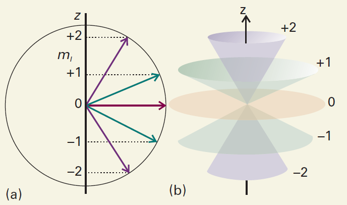
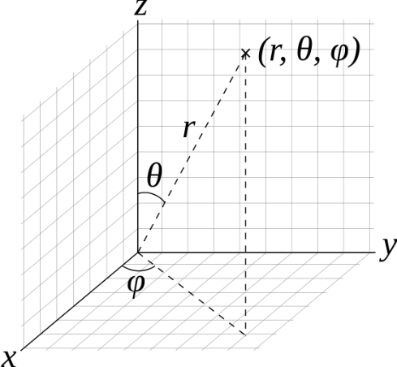
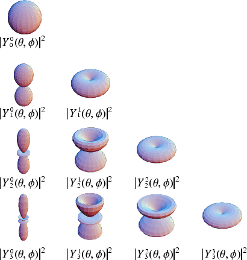

# Angular Momentum

After energy, angular momentum is one of the most important observables in atomic physics. The Coulomb attraction, the dominant interaction in an atom, is a central force, so an electron's orbital angular momentum about the nucleus is conserved in a central-field description. Moreover, magnetic moments are proportional to angular momenta. Both internal magnetic interactions and the energy of an atom in an external magnetic field are therefore closely related to angular momentum. We now examine its properties in detail.

## General Angular Momentum

In classical mechanics, orbital angular momentum about a reference point is the cross product of a particle's displacement from that point and its momentum. In Cartesian coordinates with that point as the origin,

$$
{\bf{L}} = {\bf{r}} \times {\bf{p}} = \left\vert  {\begin{array}{*{20}{c}} {\bf{i}}&{\bf{j}}&{\bf{k}}\\ x&y&z\\ {{p_x}}&{{p_y}}&{{p_z}} \end{array}} \right\vert
$$ {#eq-ch08-p1897}

The three component operators in the position representation are

$$
\begin{array}{l} {{\hat L}_x} = \hat Y{{\hat P}_z} - \hat Z{{\hat P}_y} \buildrel\textstyle.\over= - i\hbar \left( {y\frac{\partial }{{\partial z}} - z\frac{\partial }{{\partial y}}} \right)\\ {{\hat L}_y} = \hat Z{{\hat P}_x} - \hat X{{\hat P}_z} \buildrel\textstyle.\over= - i\hbar \left( {z\frac{\partial }{{\partial x}} - x\frac{\partial }{{\partial z}}} \right)\;\;\\ {{\hat L}_z} = \hat X{{\hat P}_y} - \hat Y{{\hat P}_x} \buildrel\textstyle.\over= - i\hbar \left( {x\frac{\partial }{{\partial y}} - y\frac{\partial }{{\partial x}}} \right) \end{array}
$$ {#eq-zeqnnum826605}

By applying these operators to an arbitrary wavefunction $\psi \left( {x,y,z} \right)$, or by using the position–momentum commutator @eq-zeqnnum944007, we readily verify that

$$
\left[ {{{\hat L}_x},{{\hat L}_y}} \right] = i\hbar {\hat L_z},\;\;\;\;\;\left[ {{{\hat L}_y},{{\hat L}_z}} \right] = i\hbar {\hat L_x},\;\;\;\;\;\left[ {{{\hat L}_z},{{\hat L}_x}} \right] = i\hbar {\hat L_y}
$$ {#eq-ch08-p1901}

These relations can also be written compactly as

$$
\left[ {{{\hat L}_i},{{\hat L}_j}} \right] = i\hbar {\varepsilon _{ijk}}{\hat L_k} \qquad  {\rm{or}} \qquad  {\bf{L}} \times {\bf{L}} = i\hbar {\bf{L}}
$$ {#eq-ch08-p1903}

Recall that spin angular momentum obeys the same commutation relations:

$$
\left[ {{{\hat S}_i},{{\hat S}_j}} \right] = i\hbar {\varepsilon _{ijk}}{\hat S_k}
$$ {#eq-ch08-p1905}

In quantum mechanics, these commutation relations define angular momentum: a vector observable ${\bf{J}}$ is an angular momentum if its Cartesian components ${\hat J_x},{\hat J_y},{\hat J_z}$ satisfy

$$
\left[ {{{\hat J}_x},{{\hat J}_y}} \right] = i\hbar {\hat J_z}{\rm{,}}\;\;\;\;\;\left[ {{{\hat J}_y},{{\hat J}_z}} \right] = i\hbar {\hat J_x}{\rm{,}}\;\;\;\;\;\left[ {{{\hat J}_z},{{\hat J}_x}} \right] = i\hbar {\hat J_y}
$$ {#eq-zeqnnum502879}

The three equations can be combined into one:

$$
{\bf{J}} \times {\bf{J}} = i\hbar {\bf{J}}
$$ {#eq-ch08-p1909}

Besides the three components, another important angular-momentum observable is ${{\bf{\hat J}}^2}$, defined by

$$
{{\bf{\hat J}}^2} = \hat J_x^2 + \hat J_y^2 + \hat J_z^2
$$ {#eq-ch08-p1911}

Using the defining relations @eq-zeqnnum502879, we can show that ${{\bf{\hat J}}^2}$ commutes with all three components:

$$
\left[ {{{{\bf{\hat J}}}^2},{{\hat J}_z}} \right] = \left[ {{{{\bf{\hat J}}}^2},{{\hat J}_x}} \right] = \left[ {{{{\bf{\hat J}}}^2},{{\hat J}_y}} \right] = 0
$$ {#eq-ch08-p1913}

By symmetry, ${\hat J_x},{\hat J_y}$ and ${\hat J_z}$ are on an equal footing. Conventionally we choose ${{\bf{\hat J}}^2}$ and ${\hat J_z}$. Since they commute, they have simultaneous eigenstates. Let us determine their eigenvalues.

### \* Deriving the Eigenvalues of ${J}^{2}$ and ${J}_{z}$

We can always write their eigenvalue equations in the form

$$
{{\bf{\hat J}}^2}\left\vert  {b,m} \right\rangle = b{\hbar ^2}\left\vert  {b,m} \right\rangle
$$ {#eq-zeqnnum611612}

$$
{\hat J_z}\left\vert  {b,m} \right\rangle = m\hbar \left\vert  {b,m} \right\rangle
$$ {#eq-zeqnnum784176}

Here $b$ and $m$ are real numbers to be determined. In the simultaneous eigenstate $\left\vert  {b,m} \right\rangle$, the observables ${{\bf{\hat J}}^2}$ and ${\hat J_z}$ have definite values $b{\hbar ^2}$ and $m\hbar$. To determine $b$ and $m$, first construct two operators ${\hat J_ \pm }$, called ladder operators: ${\hat J_ + }$ is the raising operator and ${\hat J_ - }$ the lowering operator.

$$
{\hat J_ + } \equiv {\hat J_x} + i{\hat J_y}, \qquad  \qquad  {\hat J_ - } \equiv {\hat J_x} - i{\hat J_y}
$$ {#eq-ch08-p1920}

Their definitions imply

$$
{\hat J_x} = \frac{1}{2}\left( {{{\hat J}_ + } + {{\hat J}_ - }} \right), \qquad  \qquad  {\hat J_y} = \frac{1}{{2i}}\left( {{{\hat J}_ + } - {{\hat J}_ - }} \right)
$$ {#eq-zeqnnum857737}

Let us examine the properties of ${\hat J_ \pm }$. It is straightforward to verify that ${\hat J_ + },{\hat J_ - }$ satisfies the following identities:

$$
\hat J_ + ^\dag = {\hat J_ - }, \qquad  \qquad  \hat J_ - ^\dag = {\hat J_ + }
$$ {#eq-zeqnnum223798}

$$
\left[ {{{\hat J}_ + },{{\hat J}_ - }} \right] = 2\hbar {\hat J_z}
$$ {#eq-zeqnnum772126}

$$
\left[ {{{\hat J}_z},{{\hat J}_ \pm }} \right] = \pm \hbar {\hat J_ \pm }
$$ {#eq-zeqnnum700890}

$$
\left[ {{{{\bf{\hat J}}}^2},{{\hat J}_ \pm }} \right] = 0
$$ {#eq-zeqnnum242044}

$$
{{\bf{\hat J}}^2} = \hat J_z^2 + \hbar {\hat J_z} + {\hat J_ - }{\hat J_ + }
$$ {#eq-zeqnnum732391}

$$
{{\bf{\hat J}}^2} = \hat J_z^2 - \hbar {\hat J_z} + {\hat J_ + }{\hat J_ - }
$$ {#eq-zeqnnum324145}

$$
{{\bf{J}}^2} = \hat J_z^2 + \frac{1}{2}\left( {{{\hat J}_ + }{{\hat J}_ - } + {{\hat J}_ - }{{\hat J}_ + }} \right)
$$ {#eq-zeqnnum867638}

To understand the meaning of ${\hat J_ \pm }\left\vert  {b,m} \right\rangle$, use @eq-zeqnnum242044 to obtain

$$
{{\bf{\hat J}}^2}\left( {{{\hat J}_ \pm }\left\vert  {b,m} \right\rangle } \right) = {\hat J_ \pm }{{\bf{\hat J}}^2}\left\vert  {b,m} \right\rangle = b{\hbar ^2}\left( {{{\hat J}_ \pm }\left\vert  {b,m} \right\rangle } \right)
$$ {#eq-zeqnnum973611}

Using @eq-zeqnnum700890, we also obtain

$$
{\hat J_z}\left( {{{\hat J}_ \pm }\left\vert  {b,m} \right\rangle } \right) = \left( {{{\hat J}_z}{{\hat J}_ \pm }} \right)\left\vert  {b,m} \right\rangle = \left( { \pm \hbar {{\hat J}_ \pm } + {{\hat J}_ \pm }{{\hat J}_z}} \right)\left\vert  {b,m} \right\rangle = \left( {m \pm 1} \right)\hbar \left( {{{\hat J}_ \pm }\left\vert  {b,m} \right\rangle } \right)
$$ {#eq-zeqnnum643676}

Combining @eq-zeqnnum973611 and @eq-zeqnnum643676, we find that ${\hat J_ \pm }\left\vert  {b,m} \right\rangle$ remains a simultaneous eigenstate of ${{\bf{\hat J}}^2}$ and ${\hat J_z}$. For ${{\bf{\hat J}}^2}$, the states ${\hat J_ \pm }\left\vert  {b,m} \right\rangle$ and $\left\vert  {b,m} \right\rangle$ share the eigenvalue $b{\hbar ^2}$. For ${\hat J_z}$, however, the eigenvalue of ${\hat J_ \pm }\left\vert  {b,m} \right\rangle$ is raised or lowered by $\hbar$ relative to that of $\left\vert  {b,m} \right\rangle$, becoming $\left( {m \pm 1} \right)\hbar$. This explains the names raising and lowering operators. Thus ${\hat J_ \pm }\left\vert  {b,m} \right\rangle$ and $\left\vert  {b,m \pm 1} \right\rangle$ represent the same state and differ at most by a constant factor:

$$
{\hat J_ \pm }\left\vert  {b,m} \right\rangle = {C_ \pm }\left( {b,m} \right)\left\vert  {b,m \pm 1} \right\rangle
$$ {#eq-zeqnnum904731}

Here ${C_ \pm }\left( {b,m} \right)$ is a coefficient depending on $b,m$.

It appears that applying ${\hat J_ \pm }$ to an eigenstate $\left\vert  {b,m} \right\rangle$ always produces another eigenstate with $m$ increased or decreased by one. But when $b$ (the squared angular momentum) is fixed, $m$ (its projection) should be bounded. Indeed, taking expectation values of @eq-zeqnnum867638 in $\left\vert  {b,m} \right\rangle$ and using @eq-zeqnnum223798 gives

$$
b{\hbar ^2} = {m^2}{\hbar ^2} + \frac{1}{2}\left\langle {b,m} \right\vert {\hat J_ - ^\dag {{\hat J}_ - }}\;\left\vert  {b,m} \right\rangle + \frac{1}{2}\left\langle {b,m} \right\vert \hat J_ + ^\dag {\hat J_ + }\left\vert  {b,m} \right\rangle
$$ {#eq-ch08-p1939}

By the quantum postulates, $\langle \psi \vert \psi\rangle \ge 0$. The second and third terms on the right are both $\ge 0$, so $b \ge {m^2}$. Thus $b \ge 0$, and for fixed $b$, the allowed range of $m$ is finite. Repeatedly applying the raising operator to $\vert {b,m = {m_0}}\rangle$ using @eq-zeqnnum904731 must therefore reach an upper limit ${m_{\max }}$, with $m_{\max }^2 \le b < {({m_{\max }} + 1)^2}$. To ensure $b \ge {m^2}$, we require ${C_ + }\left( {b,{m_{\max }}} \right) = 0$, so that

$$
{\hat J_ + }\vert b,{m_{\max }}\rangle = 0
$$ {#eq-zeqnnum446313}

Similarly, repeated application of the lowering operator to $\vert {b,m = {m_0}}\rangle$ reaches a value ${m_{\min }}$ such that, when $m = {m_{\min }}$, ${C_ - }\left( {b,{m_{\min }}} \right) = 0$ 

$$
{\hat J_ - }\vert b,{m_{\min }}\rangle = 0
$$ {#eq-zeqnnum736764}

.

Let

$$
{m_{\max }} - {m_{\min }} = n
$$ {#eq-zeqnnum714513}

Then $n$ must be a nonnegative integer. From @eq-zeqnnum732391 and @eq-zeqnnum324145, respectively, we obtain

$$
\begin{array}{l} b\vert b,{m_{\max }}\rangle = (m_{\max }^2 + {m_{\max }})\vert b,{m_{\max }}\rangle \\ b\vert b,{m_{\min }}\rangle = (m_{\min }^2 - {m_{\min }})\vert b,{m_{\min }}\rangle \end{array}
$$ {#eq-ch08-p1946}

It follows that

$$
b = m_{\max }^2 + {m_{\max }} = m_{\min }^2 - {m_{\min }}
$$ {#eq-zeqnnum714689}

Hence

$$
({m_{\max }} - {m_{\min }} + 1)({m_{\max }} + {m_{\min }}) = 0
$$ {#eq-ch08-p1950}

The first factor is positive, so

$$
{m_{\min }} = - {m_{\max }}
$$ {#eq-zeqnnum434099}

This agrees with the symmetry of the system. The sign of $m$ depends on our choice of the positive z direction, so the range of $m$ should be symmetric about zero. From @eq-zeqnnum714513 and @eq-zeqnnum434099,

$$
{m_{\max }} = {n \mathord{\left/ {\vphantom {n {2 = j}}} \right. \kern-1.2pt } {2 = j}}, \qquad  {m_{\min }} = - {n \mathord{\left/ {\vphantom {n 2}} \right. \kern-1.2pt } 2} = - j
$$ {#eq-zeqnnum239811}

where $j \equiv {n \mathord{\left/ {\vphantom {n 2}} \right. \kern-1.2pt } 2}$. Since $n$ is a nonnegative integer, the only possible values of $j$ are

$$
j = 0,\frac{1}{2},1,\frac{3}{2},2,\frac{5}{2}, \ldots
$$ {#eq-ch08-p1956}

For a given $j$, $m$ runs from ${m_{\max }}$ to ${m_{\min }}$, giving $2j + 1$ possible values:

$$
m = j,j - 1,j - 2, \cdots , - j
$$ {#eq-ch08-p1958}

From @eq-zeqnnum714689 and @eq-zeqnnum239811,

$$
b = j\left( {j + 1} \right)
$$ {#eq-ch08-p1960}

We shall henceforth use $j$, instead of $b$, as the quantum number specifying the eigenvalue of ${{\bf{\hat J}}^2}$, setting $\left\vert  {j,m} \right\rangle \equiv \left\vert  {b,m} \right\rangle$.

### Results for General Angular Momentum

We have obtained the complete solution of the general angular-momentum eigenvalue equations:

$$
{{\bf{\hat J}}^2}\left\vert  {j,m} \right\rangle = j\left( {j + 1} \right){\hbar ^2}\left\vert  {j,m} \right\rangle , \qquad  j = 0,\frac{1}{2},1,\frac{3}{2},2,\frac{5}{2}, \ldots
$$ {#eq-ch08-p1964}

$$
{\hat J_z}\left\vert  {j,m} \right\rangle = m\hbar \left\vert  {j,m} \right\rangle , \qquad  m = \underbrace {j,j - 1, \cdots - j + 1, - j}_{2j + 1\text{ terms}}
$$ {#eq-ch08-p1965}

The angular-momentum quantum number $j$ specifies the magnitude, while the magnetic or projection quantum number $m$ specifies a component. For spin, $j$ is also called the spin quantum number. If $j$ is an integer, $m$ is an integer and includes $m = 0$. If $j$ is a half-integer, $m$ is also a half-integer and never equals $m = 0$. All measured angular momenta follow these rules. From the abstract commutation relation @eq-zeqnnum502879, quantum mechanics yields a remarkable set of experimentally confirmed predictions.

In the next section we shall see that orbital angular momentum, associated with spatial motion, has integer quantum numbers from zero upward. Each particle species also has a definite spin quantum number, either integer or half-integer. Like mass and charge, spin is an intrinsic property.

| Particle | Spin quantum number |
| --- | --- |
| Electron | $1/2$ |
| Proton | $1/2$ |
| Neutron | $1/2$ |
| Quark | $1/2$ |
| Photon | 1 |
| Graviton | 2 |
| Higgs boson | 0 |

Particles with half-integer spin are called fermions; those with integer spin are bosons. Their behavior differs profoundly: identical bosons favor occupation of the same state, whereas identical fermions obey the Pauli exclusion principle. This is distinct from classical attraction or repulsion. It arises from the quantum indistinguishability of identical particles.

### The Vector Model of Angular-Momentum Eigenstates

Since the eigenvalues of ${{\bf{\hat J}}^2}$ are $j\left( {j + 1} \right){\hbar ^2}$, the magnitude of ${\bf{J}}$ is described by

$$
\left\vert  {\bf{J}} \right\vert  = \sqrt {j\left( {j + 1} \right)} \hbar
$$ {#eq-ch08-p2006}

Clearly $\left\vert  {\bf{J}} \right\vert  > j\hbar$. Why is the maximum value of ${\hat J_z}$ equal to $j\hbar$, rather than $\left\vert  {\bf{J}} \right\vert$? When ${\hat J_z}$ is definite, ${\hat J_x}$ and ${\hat J_y}$ are uncertain and cannot both vanish. By symmetry, for definite ${\hat J_z}$, the uncertainties of ${\hat J_x}$ and ${\hat J_y}$ are equal. We therefore represent $\vert j,m\rangle$ approximately by a cone with its vertex at the origin and its axis along z. Its base intersects the z axis at $z = m$ and has radius $\sqrt {j(j + 1) - {m^2}}$. The figure illustrates $j = 2$; the five cones in panel (b) represent the eigenstates $\left\vert  {j = 2,m} \right\rangle ,\;\;m = 2,1,0, - 1, - 2$. In the eigenstate ${\hat J_z}$, the mean values of ${\hat J_x},{\hat J_y}$ are zero.

$$
\langle {{{\hat J}_x}}\rangle = \langle {{{\hat J}_y}}\rangle = 0
$$ {#eq-ch08-p2008}

These results can be proved rigorously with ladder operators. In the state $\vert j,m\rangle$, we can also show that

$$
\langle {\hat J_x^2}\rangle = \langle {\hat J_y^2}\rangle = \frac{{\langle {{{{\bf{\hat J}}}^2}}\rangle - \langle {\hat J_z^2}\rangle }}{2} = \frac{{j(j + 1) - {m^2}}}{2}{\hbar ^2}
$$ {#eq-ch08-p2010}

The vector model provides an intuitive approximation and sometimes yields the same results as a rigorous quantum calculation. It describes angular-momentum eigenstates, not the expectation-value vector, whose magnitude and direction are definite in any given quantum state.

{width=465px}

::: {.source-caption}
Figure 8.1. The vector model of angular momentum. Source: http://hyperphysics.phy-astr.gsu.edu/hbase/quantum/vecmod.html
:::

### \* Matrix Elements of Angular-Momentum Operators

We now write the matrix elements of the angular-momentum operators in the $\{ {{\bf{\hat J}}^2},{\hat J_z}\}$, or $\left\{ {\left\vert  {j,m} \right\rangle } \right\}$, representation.

1) ${{\bf{\hat J}}^2}$ and ${\hat J_z}$: Since $\left\vert  {j,m} \right\rangle$ are simultaneous eigenstates of ${{\bf{\hat J}}^2}$ and ${\hat J_z}$, the matrices of ${{\bf{\hat J}}^2}$ and ${\hat J_z}$ are diagonal:

$$
\left\langle {j',m'} \right\vert {\hat J^2}\left\vert  {j,m} \right\rangle = {\delta _{j'j}}{\delta _{m'm}}j\left( {j + 1} \right){\hbar ^2}
$$ {#eq-ch08-p2017}

$$
\left\langle {j',m'} \right\vert {\hat J_z}\left\vert  {j,m} \right\rangle = {\delta _{j'j}}{\delta _{m'm}}m\hbar
$$ {#eq-ch08-p2018}

2) ${\hat J_ \pm }$: From @eq-zeqnnum904731, ${\hat J_ \pm }\left\vert  {j,m} \right\rangle = {C_ \pm }\left( {j,m} \right)\left\vert  {j,m \pm 1} \right\rangle$, and therefore

$$
\left\langle {j,m} \right\vert \hat J_ + ^\dag {\hat J_ + }\left\vert  {j,m} \right\rangle = {\left\vert  {{C_ + }\left( {j,m} \right)} \right\vert ^2}
$$ {#eq-zeqnnum141497}

Since $\hat J_ + ^\dag = {\hat J_ - }$, and since @eq-zeqnnum732391 gives ${\hat J_ - }{\hat J_ + } = {{\bf{\hat J}}^2} - \hat J_z^2 - \hbar {\hat J_z}$, this can also be written as

$$
\begin{array}{c} \left\langle {j,m} \right\vert \hat J_ + ^\dag {{\hat J}_ + }\left\vert  {j,m} \right\rangle = \left\langle {j,m} \right\vert {{\hat J}_ - }{{\hat J}_ + }\left\vert  {j,m} \right\rangle \\ = \left\langle {j,m} \right\vert {{{\bf{\hat J}}}^2} - \hat J_z^2 - \hbar {{\hat J}_z}\left\vert  {j,m} \right\rangle \\ = j\left( {j + 1} \right){\hbar ^2} - {m^2}{\hbar ^2} - m{\hbar ^2}\\ = {\hbar ^2}\left[ {j\left( {j + 1} \right) - m\left( {m + 1} \right)} \right] \end{array}
$$ {#eq-zeqnnum904686}

Combining @eq-zeqnnum141497 and @eq-zeqnnum904686, we obtain

$$
{\left\vert  {{C_ + }\left( {j,m} \right)} \right\vert ^2} = {\hbar ^2}\left[ {j\left( {j + 1} \right) - m\left( {m + 1} \right)} \right]
$$ {#eq-ch08-p2024}

By convention, ${C_ + }\left( {j,m} \right)$ is chosen to be real and positive, so

$$
{C_ + }\left( {j,m} \right) = \hbar \sqrt {j\left( {j + 1} \right) - m\left( {m + 1} \right)} = \hbar \sqrt {\left( {{j^2} + j} \right) - \left( {{m^2} + m} \right)}
$$ {#eq-ch08-p2026}

Substituting into @eq-zeqnnum904731 gives

$$
{\hat J_ + }\left\vert  {j,m} \right\rangle = \hbar \sqrt {j\left( {j + 1} \right) - m\left( {m + 1} \right)} \vert {j,m + 1}\rangle
$$ {#eq-ch08-p2028}

Similarly,

$$
{C_ - }\left( {j,m} \right) = \hbar \sqrt {j\left( {j + 1} \right) - m\left( {m - 1} \right)} = \hbar \sqrt {({j^2} + j) - ({m^2} - m)}
$$ {#eq-ch08-p2030}

$$
{\hat J_ - }\left\vert  {j,m} \right\rangle = \hbar \sqrt {j\left( {j + 1} \right) - m\left( {m - 1} \right)} \vert {j,m} - 1\rangle
$$ {#eq-zeqnnum592417}

These two equations automatically reproduce the results required by @eq-zeqnnum446313 and @eq-zeqnnum736764:

$$
{\hat J_ + }\vert {j,j}\rangle = 0, \qquad  \qquad  {\hat J_ - }\vert {j, - j}\rangle = 0
$$ {#eq-ch08-p2033}

The nonzero matrix elements of the ladder operators are therefore

$$
\left\langle {j,m - 1} \right\vert {\hat J_ - }\left\vert  {j,m} \right\rangle = \left\langle {j,m} \right\vert {\hat J_ + }\left\vert  {j,m - 1} \right\rangle = \hbar \sqrt {j\left( {j + 1} \right) - m\left( {m - 1} \right)}
$$ {#eq-zeqnnum713322}

3) ${\hat J_x},{\hat J_y}$: Using @eq-zeqnnum857737 and @eq-zeqnnum713322, the nonzero matrix elements of ${\hat J_x},{\hat J_y}$ are

$$
\left\langle {j,m - 1} \right\vert {{J_x}}\left\vert  {j,m} \right\rangle = \left\langle {j,m} \right\vert {{J_x}}\left\vert  {j,m - 1} \right\rangle = \frac{\hbar }{2}\sqrt {j(j + 1) - m(m - 1)}
$$ {#eq-ch08-p2037}

$$
\left\langle {j,m - 1} \right\vert {{J_y}}\left\vert  {j,m} \right\rangle = - \left\langle {j,m} \right\vert {{J_y}}\left\vert  {j,m - 1} \right\rangle = \frac{{i\hbar }}{2}\sqrt {j(j + 1) - m(m - 1)}
$$ {#eq-ch08-p2038}

For an angular-momentum operator $\hat A$ with fixed $j$, we order the matrix elements by decreasing $m$, so that the upper-left element is $\langle {j,j}\vert {\hat A}\vert {j,j}\rangle$.

Example 1: $j = {1 \mathord{\left/ {\vphantom {1 2}} \right. \kern-1.2pt } 2}$. The matrices ${\hat S_{x,y,z}}$ introduced earlier use this convention; see @eq-zeqnnum931030.

Example 2: $j = 1$.

$$
\frac{{{{\hat J}^2}}}{{{\hbar ^2}}} = 2\left[ {\begin{array}{*{20}{c}} 1&0&0\\ 0&1&0\\ 0&0&1 \end{array}} \right], \qquad  \frac{{{{\hat J}_z}}}{\hbar } = \left[ {\begin{array}{*{20}{c}} 1&0&0\\ 0&0&0\\ 0&0&{ - 1} \end{array}} \right]
$$ {#eq-ch08-p2042}

$$
\frac{{{{\hat J}_ + }}}{\hbar } = \sqrt 2 \left[ {\begin{array}{*{20}{c}} 0&1&0\\ 0&0&1\\ 0&0&0 \end{array}} \right], \qquad  \frac{{{{\hat J}_ - }}}{\hbar } = \sqrt 2 \left[ {\begin{array}{*{20}{c}} 0&0&0\\ 1&0&0\\ 0&1&0 \end{array}} \right]
$$ {#eq-ch08-p2043}

$$
\frac{{{{\hat J}_x}}}{\hbar } = \frac{1}{{\sqrt 2 }}\left[ {\begin{array}{*{20}{c}} 0&1&0\\ 1&0&1\\ 0&1&0 \end{array}} \right], \qquad  \frac{{{{\hat J}_y}}}{\hbar } = \frac{i}{{\sqrt 2 }}\left[ {\begin{array}{*{20}{c}} 0&{ - 1}&0\\ 1&0&{ - 1}\\ 0&1&0 \end{array}} \right]
$$ {#eq-ch08-p2044}

## Orbital Angular Momentum

Orbital angular momentum arises from a particle's motion relative to a reference point. We generally denote it by ${\bf{L}}$, with angular-momentum quantum number $l$. Even without knowing the general angular-momentum spectrum, we can write its eigenvalue equations as

$$
\begin{array}{l} {{{\bf{\hat L}}}^2}\left\vert  {l,m} \right\rangle = l\left( {l + 1} \right){\hbar ^2}\left\vert  {l,m} \right\rangle \\ {{\hat L}_z}\left\vert  {l,m} \right\rangle = m\hbar \left\vert  {l,m} \right\rangle \end{array}
$$ {#eq-zeqnnum747222}

Unlike spin, orbital angular-momentum eigenstates depend on spatial position. We now seek the position wavefunction $\left\langle {{x,y,z}} \mathrel{\left \vert  {\vphantom {{x,y,z} {l,m}}} \right. \kern-1.2pt } {{l,m}} \right\rangle \equiv {\Lambda _{l,m}}\left( {x,y,z} \right)$ of $\left\vert  {l,m} \right\rangle$. Spherical coordinates centered on the reference point are convenient. In this representation, @eq-zeqnnum747222 becomes

$$
\begin{array}{l} {{\bf{L}}^2}{\Lambda _{l,m}}\left( {r,\theta ,\phi } \right) = l\left( {l + 1} \right){\hbar ^2}{\Lambda _{l,m}}\left( {r,\theta ,\phi } \right)\\ {L_z}{\Lambda _{l,m}}\left( {r,\theta ,\phi } \right) = m\hbar {\Lambda _{l,m}}\left( {r,\theta ,\phi } \right) \end{array}
$$ {#eq-zeqnnum921413}

{width=212px}

We also need the operators in spherical coordinates. Using the coordinate transformations

$$
\left\{ {\begin{array}{*{20}{c}} {x = r\sin \theta cos\phi }\\ {y = rsin\theta sin\phi }\\ {z = rcos\theta } \end{array}} \right., \qquad  \qquad  \left\{ {\begin{array}{*{20}{c}} {r = \sqrt {{x^2} + {y^2} + {z^2}} }\\ {\theta = {{\tan }^{ - 1}}\left( {{{\sqrt {{x^2} + {y^2}} } \mathord{\left/ {\vphantom {{\sqrt {{x^2} + {y^2}} } z}} \right. \kern-1.2pt } z}} \right)}\\ {\phi = {{\tan }^{ - 1}}\left( {{y \mathord{\left/ {\vphantom {y x}} \right. \kern-1.2pt } x}} \right)} \end{array}} \right.
$$ {#eq-zeqnnum736187}

$$
\frac{\partial }{{\partial x}} = \frac{{\partial r}}{{\partial x}}\frac{\partial }{{\partial r}} + \frac{{\partial \theta }}{{\partial x}}\frac{\partial }{{\partial \theta }} + \frac{{\partial \phi }}{{\partial x}}\frac{\partial }{{\partial \phi }}
$$ {#eq-ch08-p2054}

we convert the Cartesian expression @eq-zeqnnum826605 for ${\hat L_{x,y,z}}$ into

$$
\begin{array}{l} {{\hat L}_x} \buildrel\textstyle.\over= - i\hbar \left( {y\frac{\partial }{{\partial z}} - z\frac{\partial }{{\partial y}}} \right) = - i\hbar \left( { - \sin \phi \frac{\partial }{{\partial \theta }} - \cot \theta \cos \phi \frac{\partial }{{\partial \phi }}} \right)\\ {{\hat L}_y} \buildrel\textstyle.\over= - i\hbar \left( {z\frac{\partial }{{\partial x}} - x\frac{\partial }{{\partial z}}} \right) = - i\hbar \left( {\cos \phi \frac{\partial }{{\partial \theta }} - \cot \theta \sin \phi \frac{\partial }{{\partial \phi }}} \right)\\ {{\hat L}_z} \buildrel\textstyle.\over= - i\hbar \left( {x\frac{\partial }{{\partial y}} - y\frac{\partial }{{\partial x}}} \right) = - i\hbar \frac{\partial }{{\partial \phi }} \end{array}
$$ {#eq-zeqnnum721118}

and obtain the spherical-coordinate expression for ${{\bf{\hat L}}^2}$:

$$
{{\bf{\hat L}}^2} = {\hat L_x}{\hat L_x} + {\hat L_y}{\hat L_y} + {\hat L_z}{\hat L_z} \buildrel\textstyle.\over= - {\hbar ^2}\left\{ {\frac{1}{{\sin \theta }}\frac{\partial }{{\partial \theta }}\left( {\sin \theta \frac{\partial }{{\partial \theta }}} \right) + \frac{1}{{{{\sin }^2}\theta }}\frac{{{\partial ^2}}}{{\partial {\phi ^2}}}} \right\}
$$ {#eq-zeqnnum657148}

These angular-momentum operators are independent of the distance $r$ from the origin. This suggests separating variables in the simultaneous eigenfunction ${\Lambda _{l,m}}\left( {r,\theta ,\phi } \right)$ of ${{\bf{\hat L}}^2}$ and ${\hat L_z}$:

$$
{\Lambda _{l,m}}\left( {r,\theta ,\phi } \right) = R\left( r \right){Y_{l,m}}\left( {\theta ,\phi } \right)
$$ {#eq-zeqnnum193092}

The radial function $R\left( r \right)$ is an arbitrary function of $r$, and ${Y_{l,m}}\left( {\theta ,\phi } \right)$ is the angular function. Using @eq-zeqnnum721118–@eq-zeqnnum193092, write the eigenvalue equations @eq-zeqnnum921413 in spherical coordinates and cancel $R\left( r \right)$. The angular function satisfies

$$
- i\hbar \frac{\partial }{{\partial \phi }}{Y_{l,m}}\left( {\theta ,\phi } \right) = m\hbar {Y_{l,m}}\left( {\theta ,\phi } \right)
$$ {#eq-zeqnnum252734}

$$
- {\hbar ^2}\left\{ {\frac{1}{{\sin \theta }}\frac{\partial }{{\partial \theta }}\left( {\sin \theta \frac{\partial }{{\partial \theta }}} \right) + \frac{1}{{{{\sin }^2}\theta }}\frac{{{\partial ^2}}}{{\partial {\phi ^2}}}} \right\}{Y_{l,m}}\left( {\theta ,\phi } \right) = l\left( {l + 1} \right){\hbar ^2}{Y_{l,m}}\left( {\theta ,\phi } \right)
$$ {#eq-zeqnnum649652}

Since ${\hat L_z}$ involves only $\phi$, try separating ${Y_{l,m}}\left( {\theta ,\phi } \right)$ as

$$
{Y_{l,m}}\left( {\theta ,\phi } \right) = \Theta \left( \theta \right)\Phi \left( \phi \right)
$$ {#eq-zeqnnum129644}

The eigenvalue equation @eq-zeqnnum252734 for ${\hat L_z}$ then becomes an equation involving only $\phi$:

$$
\frac{\partial }{{\partial \phi }}\Phi = im\Phi
$$ {#eq-zeqnnum956196}

The eigenvalue equation for ${{\bf{\hat L}}^2}$ becomes

$$
\frac{\Phi }{{\sin \theta }}\frac{\partial }{{\partial \theta }}\left( {\sin \theta \frac{{\partial \Theta }}{{\partial \theta }}} \right) + \frac{\Theta }{{{{\sin }^2}\theta }}\frac{{{\partial ^2}\Phi }}{{\partial {\phi ^2}}} = - l\left( {l + 1} \right)\Theta \Phi
$$ {#eq-zeqnnum839472}

Multiply @eq-zeqnnum839472 by ${{{{\sin }^2}\theta } \mathord{\left/ {\vphantom {{{{\sin }^2}\theta } {\Theta \Phi }}} \right. \kern-1.2pt } {\Theta \Phi }}$ and separate the terms involving $\theta$ and $\phi$ onto opposite sides:

$$
\frac{{\sin \theta }}{\Theta }\frac{\partial }{{\partial \theta }}\left( {\sin \theta \frac{{\partial \Theta }}{{\partial \theta }}} \right) + l\left( {l + 1} \right){\sin ^2}\theta = - \frac{1}{\Phi }\frac{{{\partial ^2}\Phi }}{{\partial {\phi ^2}}}
$$ {#eq-zeqnnum309925}

From @eq-zeqnnum956196,

$$
- \frac{1}{\Phi }\frac{{{\partial ^2}\Phi }}{{\partial {\phi ^2}}} = {m^2}
$$ {#eq-zeqnnum135231}

Substituting @eq-zeqnnum135231 into @eq-zeqnnum309925 gives an equation for ${{\bf{\hat L}}^2}$ involving only $\theta$:

$$
\frac{{\sin \theta }}{\Theta }\frac{\partial }{{\partial \theta }}\left( {\sin \theta \frac{{\partial \Theta }}{{\partial \theta }}} \right) + l\left( {l + 1} \right){\sin ^2}\theta = {m^2}
$$ {#eq-zeqnnum830038}

First solve the eigenvalue equation @eq-zeqnnum956196 for ${\hat L_z}$:

$$
{\Phi _m}\left( \phi \right) = \frac{1}{{\sqrt {2\pi } }}{e^{im\phi }}
$$ {#eq-zeqnnum989444}

The constant follows from normalization:

$$
\int_0^{2\pi } {d\phi \;\Phi _{m'}^*\left( \phi \right){\Phi _m}\left( \phi \right)} = {\delta _{m'm}}
$$ {#eq-ch08-p2079}

The azimuths $\phi$ and $\phi + 2\pi$ describe the same point in space, so single-valuedness requires

$$
{\Phi _m}\left( \phi \right) = {\Phi _m}\left( {\phi + 2\pi } \right)
$$ {#eq-ch08-p2081}

That is, 

$$
\begin{array}{c} \exp \left[ {im\phi } \right] = \exp \left[ {im(\phi + 2\pi )} \right]\\ m\phi = m(\phi + 2\pi ) + n2\pi , & n \in {\rm{Integer}} \end{array}
$$ {#eq-zeqnnum804907}

.

Thus $m$ must be an integer. Substituting this result into @eq-zeqnnum830038 and using $\Theta (\theta ) = \Theta (\theta + 2\pi )$ yields

$$
\begin{array}{c} l = 0,\;1,\;2,\; \cdots \\ m = 0,\; \pm 1,\; \cdots ,\; \pm l \end{array}
$$ {#eq-zeqnnum917846}

The detailed derivation is lengthy and is omitted here. Alternatively, general angular-momentum theory requires $m$ to satisfy $m = l, \cdots , - l$, which makes $l$ an integer and also leads to @eq-zeqnnum917846. For orbital angular momentum, both $l$ and $m$ must therefore be integers.

Substituting @eq-zeqnnum917846 into @eq-zeqnnum830038 and carrying out a longer derivation gives

$$
{\Theta _{l,m}}\left( \theta \right) = {N_{l,m}}P_l^m\left( {\cos \theta } \right),
$$ {#eq-zeqnnum839509}

Here $P_l^m\left( {\cos \theta } \right)$ is a real associated Legendre function[^f6], and ${N_{l,m}}$ is a normalization constant chosen so that

$$
\int_0^\pi {d\theta \sin \theta \;\Theta _{l',m}^*\left( \theta \right){\Theta _{l,m}}\left( \theta \right)} = {\delta _{l'l}}
$$ {#eq-ch08-p2089}

Substituting @eq-zeqnnum839509 and @eq-zeqnnum989444 into @eq-zeqnnum129644 finally gives

$$
{Y_{l,m}}\left( {\theta ,\phi } \right) = \frac{{{N_{l,m}}}}{{\sqrt {2\pi } }}P_l^m\left( {\cos \theta } \right){e^{im\phi }}
$$ {#eq-ch08-p2091}

The spherical harmonic ${Y_{l,m}}\left( {\theta ,\phi } \right)$ is a simultaneous eigenfunction of ${{\bf{\hat L}}^2}$ and ${\hat L_z}$:

$$
\begin{array}{l} {{{\bf{\hat L}}}^2}{Y_{l,m}}\left( {\theta ,\phi } \right) = l(l + 1)\hbar {Y_{l,m}}\left( {\theta ,\phi } \right)\\ {{\hat L}_z}{Y_{l,m}}\left( {\theta ,\phi } \right) = m\hbar {Y_{l,m}}\left( {\theta ,\phi } \right) \end{array}
$$ {#eq-ch08-p2093}

Below are all the spherical harmonics for $l = 0,1,2$.

$$
\begin{array}{c} {Y_{0,0}} = \sqrt {\frac{1}{{4\pi }}} \\ Y{{\kern 1pt} _{1,0}} = \sqrt {\frac{3}{{4\pi }}} \cos \theta \\ Y{{\kern 1pt} _{1, \pm 1}} = \mp \sqrt {\frac{3}{{8\pi }}} \sin \theta \;{e^{ \pm i\phi }}\\ Y{{\kern 1pt} _{2,0}} = \sqrt {\frac{5}{{16\pi }}} \left( {3{{\cos }^2}\theta - 1} \right)\\ Y{{\kern 1pt} _{2, \pm 1}} = \mp \sqrt {\frac{{15}}{{8\pi }}} \sin \theta \cos \theta \;{e^{ \pm i\phi }}\\ Y{{\kern 1pt} _{2, \pm 2}} = \mp \sqrt {\frac{{15}}{{32\pi }}} {\sin ^2}\theta \;{e^{ \pm 2i\phi }} \end{array}
$$ {#eq-zeqnnum238379}

{width=289px}

::: {.source-caption}
Figure 8.2. Angular probability-density surfaces. The radial length in direction $(\theta ,\varphi )$ represents ${\left\vert  {Y_l^m\left( {\theta ,\phi } \right)} \right\vert ^2}$: a longer radius indicates a greater probability of finding the particle in that direction.
:::

Since ${\Phi _m}\left( \phi \right)$ and ${\Theta _{l,m}}\left( \theta \right)$ are separately normalized, ${Y_{l,m}}\left( {\theta ,\phi } \right)$ is automatically normalized:

$$
\int_0^{2\pi } {d\phi \int_0^\pi {d\theta \;\sin \theta Y_{l',m'}^*{Y_{l,m}}} } = {\delta _{l'l}}{\delta _{m'm}}
$$ {#eq-ch08-p2099}

Restoring the radial factor gives the general simultaneous eigenfunctions of ${{\bf{\hat L}}^2}$ and ${\hat L_z}$:

$$
{\Lambda _{l,m}}\left( {r,\theta ,\phi } \right) = R\left( r \right){Y_{l,m}}\left( {\theta ,\phi } \right)
$$ {#eq-ch08-p2101}

Since ${Y_{l,m}}\left( {\theta ,\phi } \right)$ is normalized over $\theta ,\phi$, we need only ensure that $R\left( r \right)$ is normalized over $r$, namely

$$
\int_0^\infty {{{\left\vert  {R\left( r \right)} \right\vert }^2}{r^2}dr} = 1
$$ {#eq-ch08-p2103}

Then ${\Lambda _{l,m}}\left( {r,\theta ,\phi } \right)$ is automatically normalized:

$$
\iiint_V {dV{{\left\vert  {{\Lambda _{l,m}}\left( {r,\theta ,\phi } \right)} \right\vert }^2}} = \left[ {\int_0^\infty {dr\;{{\left\vert  {R\left( r \right)} \right\vert }^2}{r^2}} } \right] \cdot \left[ {\int_0^{2\pi } {d\phi } \int_0^\pi {d\theta \;\sin \theta \;{{\left\vert  {{Y_{l,m}}(\theta ,\phi )} \right\vert }^2}} } \right] = 1
$$ {#eq-ch08-p2105}

The orbital angular-momentum eigenvalue equations do not determine the radial distribution and therefore cannot specify the complete spatial probability density. For a particle in state $\vert l,m\rangle$, with ${{\bf{\hat L}}^2}$ and ${\hat L_z}$ equal to $l(l + 1){\hbar ^2}$ and $m\hbar$, ${\left\vert  {{Y_{l,m}}(\theta ,\phi )} \right\vert ^2}$ gives the probability per unit solid angle in direction $(\theta ,\phi )$. We call this the angular probability density of the eigenstate. It is easy to show that ${\left\vert  {{Y_{l,m}}(\theta ,\phi )} \right\vert ^2}$ is independent of $\phi$, so it is rotationally symmetric about the $z$ axis.

## \* Rotations and Angular Momentum

We now examine the relation between rotations and angular momentum.

### \* The Infinitesimal Rotation Operator

Define an infinitesimal rotation operator $\hat D\left( {{\bf{z}},d\phi } \right)$ that rotates the entire system through $d\phi$ about the $z$ axis. The initial state $\left\vert  \psi \right\rangle$ becomes a new state $\left\vert  {\psi (d\phi )} \right\rangle$, depending on $d\phi$:

$$
\hat D\left( {{\bf{z}},d\phi } \right)\left\vert  \psi \right\rangle = \left\vert  {\psi (d\phi )} \right\rangle
$$ {#eq-ch08-p2111}

As with translations, physical considerations impose the following conditions on $\hat D\left( {{\bf{z}},d\phi } \right)$:

$$
\begin{array}{c} \mathop {\lim }\limits_{d\phi \to 0} \hat D\left( {{\bf{z}},d\phi } \right) = \hat I\\ \hat D\left( {{\bf{z}},d{\phi _1}} \right)\hat D\left( {{\bf{z}},d{\phi _2}} \right) = \hat D\left( {{\bf{z}},d{\phi _2}} \right)\hat D\left( {{\bf{z}},d{\phi _1}} \right) = \hat D\left( {{\bf{z}},d{\phi _1} + d{\phi _2}} \right)\\ {{\hat D}^\dag }\left( {{\bf{z}},d\phi } \right) = {{\hat D}^{ - 1}}\left( {{\bf{z}},d\phi } \right) = \hat D\left( {{\bf{z}}, - d\phi } \right) \end{array}
$$ {#eq-ch08-p2113}

The final condition requires the rotation operator to be unitary.

We can construct $\hat D\left( {{\bf{z}},d\phi } \right)$ as

$$
\hat D\left( {{\bf{z}},d\phi } \right) = \left[ {\hat I - i\frac{{{{\hat J}_z}}}{\hbar }d\phi } \right]
$$ {#eq-zeqnnum304369}

Here ${\hat J_z}$ is Hermitian. The dimensions of ${\hat J_z}$ are those of angular momentum, and experiment identifies it with the $z$ component of the system's angular momentum. Just as momentum generates translations (@eq-zeqnnum333148), angular momentum generates rotations.

### \* Orbital Angular Momentum

Applying an infinitesimal rotation to the spherical-coordinate position eigenstate $\left\vert  {r,\theta ,\phi } \right\rangle$ produces $\left\vert  {r,\theta ,\phi + d\phi } \right\rangle$:

$$
\hat D\left( {{\bf{z}},d\phi } \right)\left\vert  {r,\theta ,\phi } \right\rangle = \left\vert  {r,\theta ,\phi + d\phi } \right\rangle
$$ {#eq-zeqnnum108507}

The angular momentum associated with a change in position is orbital angular momentum, conventionally denoted ${\hat L_z}$. Using @eq-zeqnnum304369, rewrite @eq-zeqnnum108507 as

$$
\left[ {\hat I - i\frac{{{{\hat L}_z}}}{\hbar }d\phi } \right]\left\vert  {r,\theta ,\phi } \right\rangle = \left\vert  {r,\theta ,\phi + d\phi } \right\rangle
$$ {#eq-ch08-p2122}

In the bra space this reads

$$
\left\langle {r,\theta ,\phi } \right\vert \left[ {\hat I + i\frac{{{{\hat L}_z}}}{\hbar }d\phi } \right] = \left\langle {r,\theta ,\phi + d\phi } \right\vert
$$ {#eq-ch08-p2124}

Thus

$$
\left\langle {r,\theta ,\phi } \right\vert \left[ {\hat I - i\frac{{{{\hat L}_z}}}{\hbar }d\phi } \right] = \left\langle {r,\theta ,\phi - d\phi } \right\vert
$$ {#eq-ch08-p2126}

Multiply both sides on the right by an arbitrary quantum state $\left\vert  \psi \right\rangle$, and Taylor-expand the right-hand side:

$$
\begin{array}{c} \left\langle {r,\theta ,\phi } \right\vert \left[ {\hat I - i\frac{{{{\hat L}_z}}}{\hbar }d\phi } \right]\left\vert  \psi \right\rangle = \left\langle {{r,\theta ,\phi - d\phi }} \mathrel{\left \vert  {\vphantom {{r,\theta ,\phi - d\phi } \psi }} \right. \kern-1.2pt } {\psi } \right\rangle \\ \left\langle {{r,\theta ,\phi }} \mathrel{\left \vert  {\vphantom {{r,\theta ,\phi } \psi }} \right. \kern-1.2pt } {\psi } \right\rangle - i\frac{{d\phi }}{\hbar }\left\langle {r,\theta ,\phi } \right\vert {{\hat L}_z}\left\vert  \psi \right\rangle \approx \left\langle {{r,\theta ,\phi }} \mathrel{\left \vert  {\vphantom {{r,\theta ,\phi } \psi }} \right. \kern-1.2pt } {\psi } \right\rangle - d\phi \frac{\partial }{{\partial \phi }}\left\langle {{r,\theta ,\phi }} \mathrel{\left \vert  {\vphantom {{r,\theta ,\phi } \psi }} \right. \kern-1.2pt } {\psi } \right\rangle \end{array}
$$ {#eq-ch08-p2128}

Finally,

$$
\left\langle {r,\theta ,\phi } \right\vert {\hat L_z}\left\vert  \psi \right\rangle = - i\hbar \frac{\partial }{{\partial \phi }}\left\langle {{r,\theta ,\phi }} \mathrel{\left \vert  {\vphantom {{r,\theta ,\phi } \psi }} \right. \kern-1.2pt } {\psi } \right\rangle
$$ {#eq-ch08-p2130}

Thus, in the spherical-coordinate position representation, the orbital angular-momentum component ${\hat L_z}$ is

$$
{\hat L_z} \buildrel\textstyle.\over= - i\hbar \frac{\partial }{{\partial \phi }}
$$ {#eq-ch08-p2132}

## Exercises

**8.1** A system has definite ${{\bf{\hat J}}^2}$ and ${\hat J_z}$, equal to $j(j + 1){\hbar ^2}$ and $m\hbar$. Use symmetry to prove that, in this state,

$$
\langle {\hat J_x^2}\rangle = \langle {\hat J_y^2}\rangle = \frac{{j(j + 1) - {m^2}}}{2}{\hbar ^2}
$$ {#eq-ch08-p2137}

**8.2** Starting from @eq-zeqnnum904731, ${\hat J_ \pm }\left\vert  {j,m} \right\rangle = {C_ \pm }\left( {j,m} \right)\left\vert  {j,m \pm 1} \right\rangle$, use @eq-zeqnnum732391 and @eq-zeqnnum324145 to find ${\left\vert  {{C_ \pm }\left( {j,m} \right)} \right\vert ^2}$, and hence prove the preceding result.

**8.3** A particle in a central field $V = V(r)$ has wavefunction

$$
\psi ({\bf{r}}) = (x + y + 3z)f(r)
$$ {#eq-ch08-p2141}

- Is $\psi$ an eigenstate of ${{\bf{\hat L}}^2}$? If so, what is $l$? Otherwise, what values can $l$ take?

- What are the possible values of ${\hat L_z}$, and their probabilities?

Hint: Use @eq-zeqnnum736187 and @eq-zeqnnum238379.

[^f6]: http://mathworld.wolfram.com/AssociatedLegendrePolynomial.html
