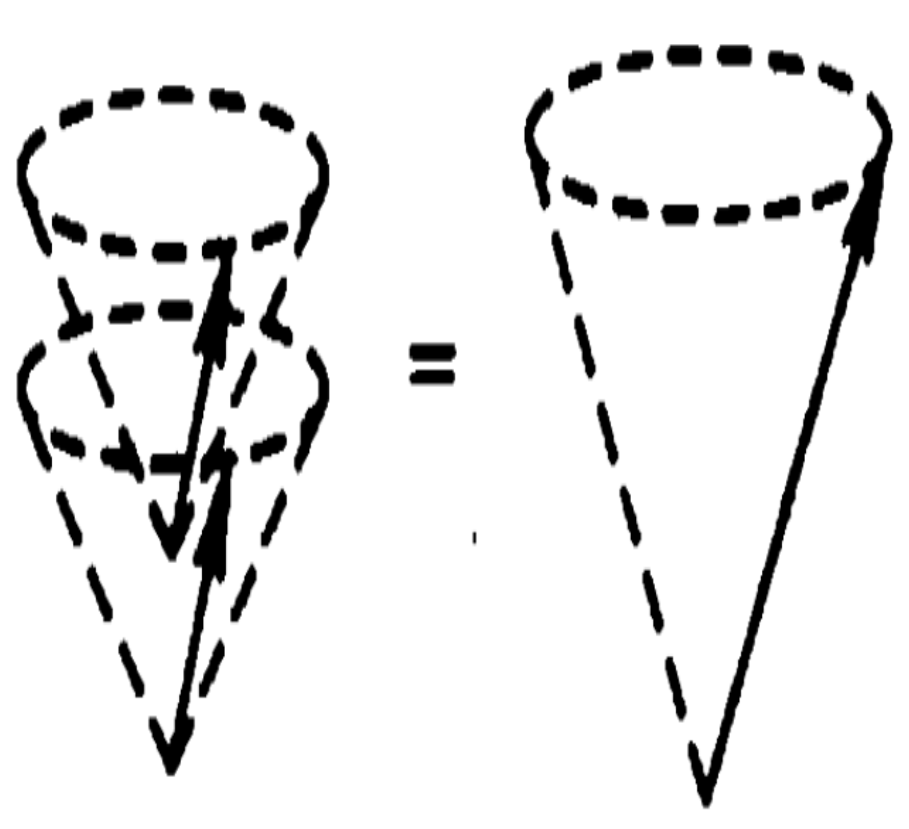
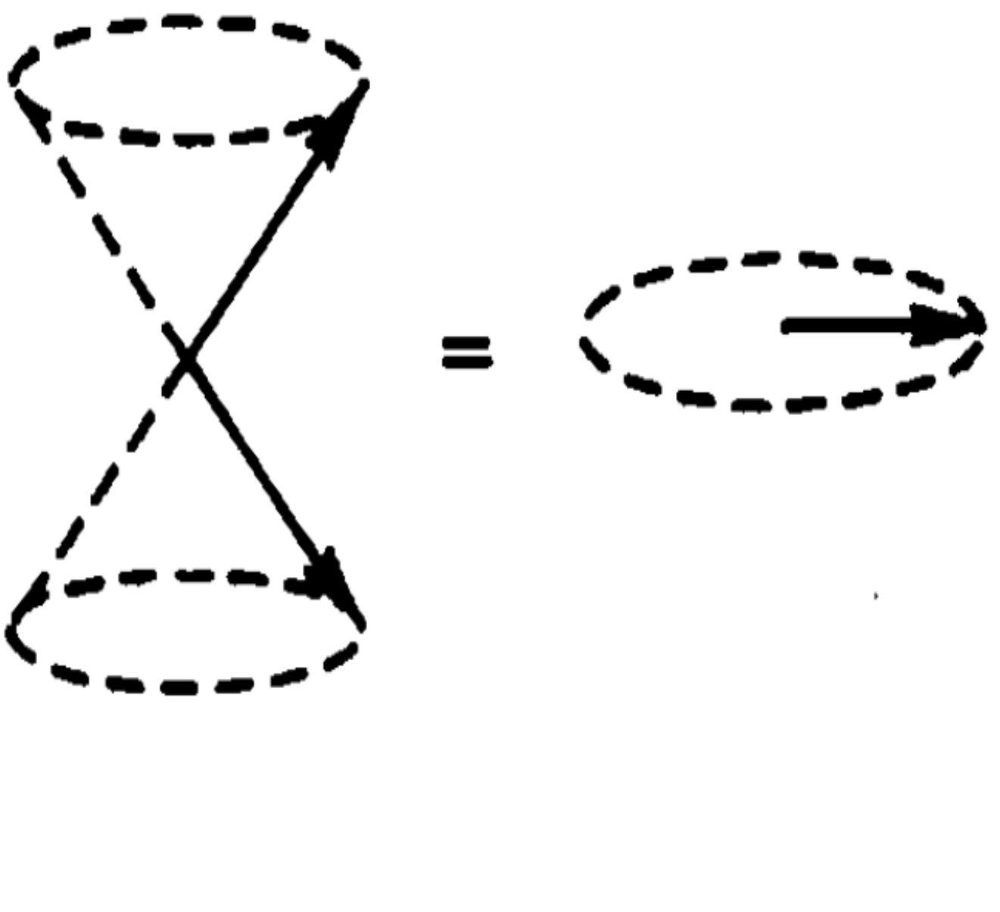
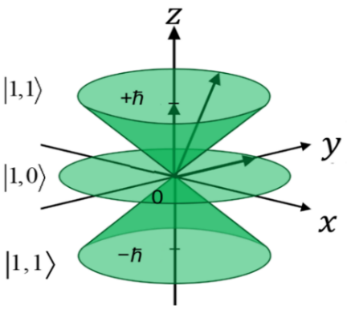
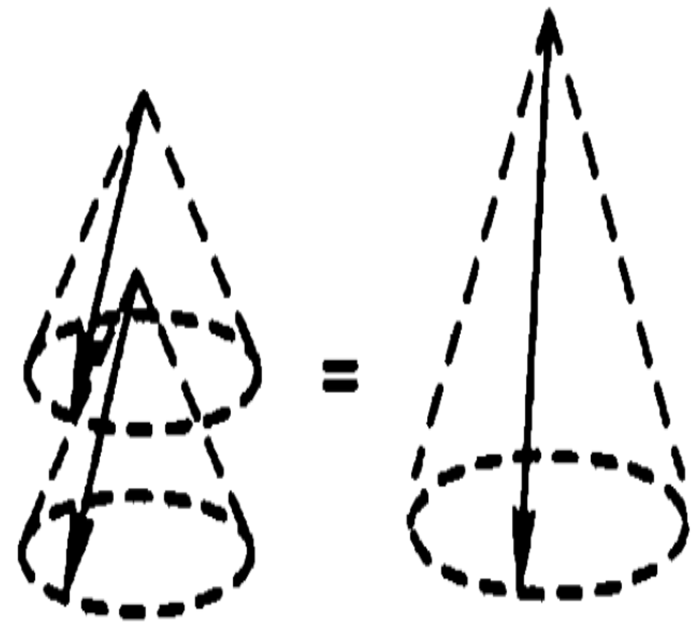
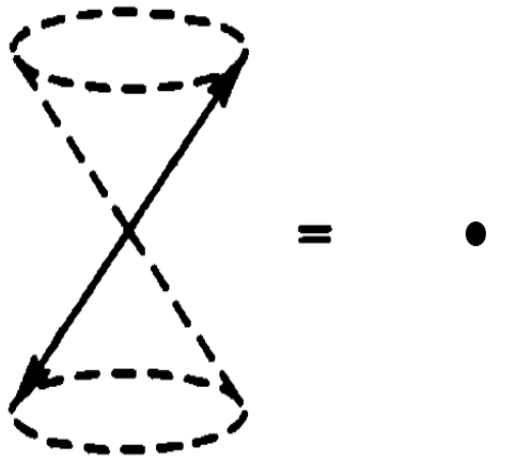
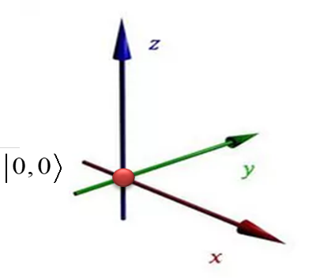

# Coupling Two Angular Momenta

Angular-momentum coupling underlies many phenomena in atomic physics: fine and hyperfine structure, magnetic splitting, and $LS$ and $jj$ coupling in many-electron atoms. It is equally important in nuclear physics. Although often postponed to advanced quantum mechanics, its basic ideas are accessible without the more complicated coefficient formulas. We give a brief introduction here.

We often encounter observables belonging either to different particles, such as the momenta of two electrons, or to different degrees of freedom of one particle, such as its orbital and spin angular momenta. The observables belong to distinct vector subspaces. Each operator acts only on its own subsystem, so operators belonging to different subsystems commute.

## Composite Vector Spaces (Tensor Products)

Consider two angular momenta ${{\bf{J}}_1},\;{{\bf{J}}_2}$ belonging to different subspaces: two spins, two orbital angular momenta, or the spin and orbital angular momentum of one particle. With their quantum numbers fixed at ${j_1},\;{j_2}$, how do we describe the state of the composite system? Complete bases for ${{\bf{J}}_1},\;{{\bf{J}}_2}$ are $\left\{ {\left\vert  {{j_1},{m_1}} \right\rangle } \right\}$ and $\left\{ {\left\vert  {{j_2},{m_2}} \right\rangle } \right\}$, containing $2{j_1} + 1$ and $2{j_2} + 1$ basis vectors. One might initially suppose that the total state is always a tensor product of definite subsystem states:

$$
\vert \Psi \rangle = \vert {\psi _1}\rangle \otimes \vert {\psi _2}\rangle \equiv \vert {\psi _1}\rangle \vert {\psi _2}\rangle = \left( {\sum\limits_{{m_1}} {\left\vert  {{j_1}{m_1}} \right\rangle \left\langle {{{j_1}{m_1}}} \mathrel{\left \vert  {\vphantom {{{j_1}{m_1}} {{\psi _1}}}} \right. \kern-1.2pt } {{{\psi _1}}} \right\rangle } } \right)\left( {\sum\limits_{{m_2}} {\left\vert  {{j_2}{m_2}} \right\rangle \left\langle {{{j_2}{m_2}}} \mathrel{\left \vert  {\vphantom {{{j_2}{m_2}} {{\psi _2}}}} \right. \kern-1.2pt } {{{\psi _2}}} \right\rangle } } \right)
$$ {#eq-zeqnnum878336}

This description uses $(2{j_1} + 1) + (2{j_2} + 1)$ probability amplitudes. Nature, however, allows a more general possibility.

**Quantum Postulate 7:** A basis of a composite vector space consists of tensor products of subsystem basis vectors. Its dimension is the product of the subsystem dimensions.

For the two angular momenta considered here, the composite basis vectors are

$$
\left\vert  {{j_1},{m_1}} \right\rangle \otimes \left\vert  {{j_2},{m_2}} \right\rangle \equiv \left\vert  {{j_1},{m_1}} \right\rangle \left\vert  {{j_2},{m_2}} \right\rangle \equiv \left\vert  {{j_1}{m_1};{j_2}{m_2}} \right\rangle , \qquad  ( - {j_1} \le {m_1} \le {j_1},\; - {j_2} \le {m_2} \le {j_2})
$$ {#eq-ch09-p2154}

There are $(2{j_1} + 1)(2{j_2} + 1)$ such vectors, spanning the $(2{j_1} + 1)(2{j_2} + 1)$-dimensional composite or tensor-product space of ${{\bf{J}}_1},\;{{\bf{J}}_2}$. An arbitrary state in this space expands as

$$
\vert \Psi \rangle = \sum\limits_{{m_1}} {\sum\limits_{{m_2}} {\left\vert  {{j_1}{m_1};{j_2}{m_2}} \right\rangle \left\langle {{{j_1}{m_1};{j_2}{m_2}}} \mathrel{\left \vert  {\vphantom {{{j_1}{m_1};{j_2}{m_2}} \Psi }} \right. \kern-1.2pt } {\Psi } \right\rangle } }
$$ {#eq-zeqnnum695918}

This state can require $(2{j_1} + 1)(2{j_2} + 1)$ probability amplitudes, so @eq-zeqnnum695918 describes more states than @eq-zeqnnum878336. A state of the latter form can always be expanded into the former, but the reverse is not always possible. Some states in @eq-zeqnnum695918 cannot be written as a product of two subsystem states. These are entangled states: the total system has a definite pure state, while its subsystems have no individual pure states. For two spin-1/2 particles, $\vert U{\rangle _1}\vert D{\rangle _2} + \vert D{\rangle _1}\vert U{\rangle _2}$ is an example.

Let ${\hat A_1},\left\vert  {{\psi _1}} \right\rangle$ and ${\hat A_2},\left\vert  {{\psi _2}} \right\rangle$ denote operators and vectors belonging to subspaces $1$ and 2. In the composite space, each operator acts only on the vector in its own subspace. For example,

$$
\begin{array}{c} \hat J_1^2{{\hat J}_{2z}}\vert {j_1}{m_1};{j_2}{m_2}\rangle \equiv \hat J_1^2{{\hat J}_{2z}}\left\vert  {{j_1},{m_1}} \right\rangle \left\vert  {{j_2},{m_2}} \right\rangle = \left( {\hat J_1^2\left\vert  {{j_1},{m_1}} \right\rangle } \right)\left( {{{\hat J}_{2z}}\left\vert  {{j_2},{m_2}} \right\rangle } \right)\\ = {j_1}({j_1} + 1){m_2}{\hbar ^3}\left\vert  {{j_1},{m_1}} \right\rangle \left\vert  {{j_2},{m_2}} \right\rangle \end{array}
$$ {#eq-zeqnnum356609}

$$
\begin{array}{c} \left( {\hat J_1^2 + \hat J_{2z}^2} \right)\left\vert  {{j_1},{m_1}} \right\rangle \left\vert  {{j_2},{m_2}} \right\rangle = \left( {\hat J_1^2\left\vert  {{j_1},{m_1}} \right\rangle } \right)\left\vert  {{j_2},{m_2}} \right\rangle + \left\vert  {{j_1},{m_1}} \right\rangle \left( {\hat J_{2z}^2\left\vert  {{j_2},{m_2}} \right\rangle } \right)\\ = \left[ {{j_1}({j_1} + 1) + m_2^2} \right]{\hbar ^2}\left\vert  {{j_1},{m_1}} \right\rangle \left\vert  {{j_2},{m_2}} \right\rangle \end{array}
$$ {#eq-zeqnnum297307}

Notice that $\left\vert  {{j_1},{m_1}} \right\rangle \left\vert  {{j_2},{m_2}} \right\rangle = \left\vert  {{j_2},{m_2}} \right\rangle \left\vert  {{j_1},{m_1}} \right\rangle$. Provided the subsystem labels are retained, changing the written order of the factors does not change the physical state. In calculations, keep a fixed ordering to avoid confusion.

## Matrix Representations in the Tensor-Product Space

Composite operations can be expressed as matrices using the tensor product (denoted $\otimes$) and the sum of operators acting on different factors. The rules are illustrated below.

Suppose the states $\left\vert  {{\psi _1}} \right\rangle ,\;\left\vert  {{\psi _2}} \right\rangle$ in subspaces 1 and 2 have matrix representations

$$
\left\vert  {{\psi _1}} \right\rangle = \left( {\begin{array}{*{20}{c}} {{\alpha _1}}\\ {{\beta _1}} \end{array}} \right), \qquad  \qquad  \left\vert  {{\psi _2}} \right\rangle = \left( {\begin{array}{*{20}{c}} {{\alpha _2}}\\ {{\beta _2}} \end{array}} \right)
$$ {#eq-ch09-p2165}

Then in the composite representation,

$$
\left\vert  {{\psi _1}} \right\rangle \left\vert  {{\psi _2}} \right\rangle \equiv \left\vert  {{\psi _1}} \right\rangle \otimes \left\vert  {{\psi _2}} \right\rangle = \left( {\begin{array}{*{20}{c}} {{\alpha _1}\left\vert  {{\psi _2}} \right\rangle }\\ {{\beta _1}\left\vert  {{\psi _2}} \right\rangle } \end{array}} \right) = \left( {\begin{array}{*{20}{c}} {{\alpha _1}\left( {\begin{array}{*{20}{c}} {{\alpha _2}}\\ {{\beta _2}} \end{array}} \right)}\\ {{\beta _1}\left( {\begin{array}{*{20}{c}} {{\alpha _2}}\\ {{\beta _2}} \end{array}} \right)} \end{array}} \right) = \left( {\begin{array}{*{20}{c}} {\begin{array}{*{20}{c}} {{\alpha _1}{\alpha _2}}\\ {{\alpha _1}{\beta _2}} \end{array}}\\ {\begin{array}{*{20}{c}} {{\beta _1}{\alpha _2}}\\ {{\beta _1}{\beta _2}} \end{array}} \end{array}} \right)
$$ {#eq-ch09-p2167}

Suppose the operators ${\hat A_1},\;{\hat A_2}$ have the following matrices in subspaces 1 and 2:

$$
{\hat A_1} = \left( {\begin{array}{*{20}{c}} {{a_1}}&{{b_1}}\\ {{c_1}}&{{d_1}} \end{array}} \right), \qquad  \qquad  {\hat A_2} = \left( {\begin{array}{*{20}{c}} {{a_2}}&{{b_2}}\\ {{c_2}}&{{d_2}} \end{array}} \right),
$$ {#eq-ch09-p2169}

In the composite representation,

${\hat A_1} \otimes {\hat A_2}$: tensor product.

$$
{\hat A_1} \otimes {\hat A_2} = \left( {\begin{array}{*{20}{c}} {{a_1}{{\hat A}_2}}&{{b_1}{{\hat A}_2}}\\ {{c_1}{{\hat A}_2}}&{{d_1}{{\hat A}_2}} \end{array}} \right) = \left( {\begin{array}{*{20}{c}} {\begin{array}{*{20}{c}} {{a_1}{a_2}}&{{a_1}{b_2}}\\ {{a_1}{c_2}}&{{a_1}{d_2}} \end{array}}&{\begin{array}{*{20}{c}} {{b_1}{a_2}}&{{b_1}{b_2}}\\ {{b_1}{c_2}}&{{b_1}{d_2}} \end{array}}\\ {\begin{array}{*{20}{c}} {{c_1}{a_2}}&{{c_1}{b_2}}\\ {{c_1}{c_2}}&{{c_1}{d_2}} \end{array}}&{\begin{array}{*{20}{c}} {{d_1}{a_2}}&{{d_1}{b_2}}\\ {{d_1}{c_2}}&{{d_1}{d_2}} \end{array}} \end{array}} \right)
$$ {#eq-ch09-p2172}

${\hat A_1} + {\hat A_2}$: sum in the composite space.

Since the spaces of ${\hat A_1},\;{\hat A_2}$ need not have equal dimensions, ${\hat A_1} + {\hat A_2}$ is not a simple element-by-element matrix sum. The notation ${\hat A_1} + {\hat A_2}$ means

$$
\begin{array}{c} {{\hat A}_1} + {{\hat A}_2} \equiv {{\hat A}_1} \otimes {{\hat I}_2} + {{\hat I}_1} \otimes {{\hat A}_2}\\ {\rm{ = }}\left( {\begin{array}{*{20}{c}} {{a_1}}&0&{{b_1}}&0\\ 0&{{a_1}}&0&{{b_1}}\\ {{c_1}}&0&{{d_1}}&0\\ 0&{{c_1}}&0&{{d_1}} \end{array}} \right) + \left( {\begin{array}{*{20}{c}} {{a_2}}&0&{{b_2}}&0\\ 0&{{a_2}}&0&{{b_2}}\\ {{c_2}}&0&{{d_2}}&0\\ 0&{{c_2}}&0&{{d_2}} \end{array}} \right)\\ = \left( {\begin{array}{*{20}{c}} {{a_1} + {a_2}}&0&{{b_1} + {b_2}}&0\\ 0&{{a_1} + {a_2}}&0&{{b_1} + {b_2}}\\ {{c_1} + {c_2}}&0&{{d_1} + {d_2}}&0\\ 0&{{c_1} + {c_2}}&0&{{d_1} + {d_2}} \end{array}} \right) \end{array}
$$ {#eq-ch09-p2175}

In this example, subspaces 1 and 2 happen to have equal dimensions. The tensor-product and composite-sum rules also apply when their dimensions differ.

These matrix rules readily imply

$$
\left( {{{\hat A}_1} \otimes {{\hat A}_2}} \right)\left( {\left\vert  {{\psi _1}} \right\rangle \otimes \left\vert  {{\psi _2}} \right\rangle } \right) = \left( {{{\hat A}_1}\left\vert  {{\psi _1}} \right\rangle } \right) \otimes \left( {{{\hat A}_2}\left\vert  {{\psi _2}} \right\rangle } \right)
$$ {#eq-ch09-p2178}

$$
\begin{array}{c} \left( {{{\hat A}_1} + {{\hat A}_2}} \right)\left( {\left\vert  {{\psi _1}} \right\rangle \otimes \left\vert  {{\psi _2}} \right\rangle } \right) = \left( {{{\hat A}_1} \otimes {{\hat I}_2} + {{\hat I}_1} \otimes {{\hat A}_2}} \right)\left( {\left\vert  {{\psi _1}} \right\rangle \otimes \left\vert  {{\psi _2}} \right\rangle } \right)\\ = \left( {{{\hat A}_1} \otimes {{\hat I}_2}} \right)\left( {\left\vert  {{\psi _1}} \right\rangle \otimes \left\vert  {{\psi _2}} \right\rangle } \right) + \left( {{{\hat I}_1} \otimes {{\hat A}_2}} \right)\left( {\left\vert  {{\psi _1}} \right\rangle \otimes \left\vert  {{\psi _2}} \right\rangle } \right)\\ = {{\hat A}_1}\left\vert  {{\psi _1}} \right\rangle \otimes {{\hat I}_2}\left\vert  {{\psi _2}} \right\rangle + {{\hat I}_1}\left\vert  {{\psi _1}} \right\rangle \otimes {{\hat A}_2}\left\vert  {{\psi _2}} \right\rangle \\ = {{\hat A}_1}\left\vert  {{\psi _1}} \right\rangle \otimes \left\vert  {{\psi _2}} \right\rangle + \left\vert  {{\psi _1}} \right\rangle \otimes {{\hat A}_2}\left\vert  {{\psi _2}} \right\rangle \end{array}
$$ {#eq-ch09-p2179}

In retrospect, the operation in @eq-zeqnnum356609 suppresses the symbol $\otimes$. Its explicit form is

$$
\left( {\hat J_1^2 \otimes {{\hat J}_{2z}}} \right)\left( {\left\vert  {{j_1},{m_1}} \right\rangle \otimes \left\vert  {{j_2},{m_2}} \right\rangle } \right) = \left( {\hat J_1^2\left\vert  {{j_1},{m_1}} \right\rangle } \right) \otimes \left( {{{\hat J}_{2z}}\left\vert  {{j_2},{m_2}} \right\rangle } \right)
$$ {#eq-ch09-p2181}

Likewise, the explicit form of @eq-zeqnnum297307 is

$$
\left( {\hat J_1^2 \otimes {{\hat I}_2} + {{\hat I}_1} \otimes \hat J_{2z}^2} \right)\left( {\left\vert  {{j_1},{m_1}} \right\rangle \otimes \left\vert  {{j_2},{m_2}} \right\rangle } \right) = \left( {\hat J_1^2\left\vert  {{j_1},{m_1}} \right\rangle } \right) \otimes \left\vert  {{j_2},{m_2}} \right\rangle + \left\vert  {{j_1},{m_1}} \right\rangle \otimes \left( {\hat J_{2z}^2\left\vert  {{j_2},{m_2}} \right\rangle } \right)
$$ {#eq-ch09-p2183}

We shall continue to omit $\otimes$ for simplicity, provided each operator acts only on its own subsystem's vector.

## The Uncoupled Basis

For two angular momenta ${{\bf{J}}_1},\;{{\bf{J}}_2}$ in different subspaces, with magnitudes specified by ${j_1},\;{j_2}$, the following four operators commute pairwise:

$$
\left[ {{\bf{\hat J}}_1^2,\;{{\hat J}_{1z}},\;{\bf{\hat J}}_2^2{\rm{,}}\;{\rm{ }}{{\hat J}_{2z}}} \right] = 0
$$ {#eq-zeqnnum597965}

Their simultaneous eigenstates $\left\vert  {{j_1},{m_1}} \right\rangle \left\vert  {{j_2},{m_2}} \right\rangle$ form the uncoupled basis, also written $\left\vert  {{j_1}{j_2}{m_1}{m_2}} \right\rangle$ or, more briefly, $\vert {m_1},{m_2}\rangle$.

$$
\begin{array}{l} {\bf{\hat J}}_1^2\left\vert  {{j_1},{m_1}} \right\rangle \left\vert  {{j_2},{m_2}} \right\rangle = {j_1}({j_1} + 1){\hbar ^2}\left\vert  {{j_1},{m_1}} \right\rangle \left\vert  {{j_2},{m_2}} \right\rangle \\ {\bf{\hat J}}_2^2\left\vert  {{j_1},{m_1}} \right\rangle \left\vert  {{j_2},{m_2}} \right\rangle = {j_2}({j_2} + 1){\hbar ^2}\left\vert  {{j_1},{m_1}} \right\rangle \left\vert  {{j_2},{m_2}} \right\rangle \\ {{\hat J}_{1z}}\left\vert  {{j_1},{m_1}} \right\rangle \left\vert  {{j_2},{m_2}} \right\rangle = {m_1}\hbar \left\vert  {{j_1},{m_1}} \right\rangle \left\vert  {{j_2},{m_2}} \right\rangle , & {m_1} = {j_1},{j_1} - 1, \cdots , - {j_1}\\ {{\hat J}_{2z}}\left\vert  {{j_1},{m_1}} \right\rangle \left\vert  {{j_2},{m_2}} \right\rangle = {m_2}\hbar \left\vert  {{j_1},{m_1}} \right\rangle \left\vert  {{j_2},{m_2}} \right\rangle , & {m_2} = {j_2},{j_2} - 1, \cdots , - {j_2} \end{array}
$$ {#eq-ch09-p2189}

## The Coupled Basis

A vector space has more than one possible basis, and so does a composite space. Besides the uncoupled basis, the composite space of ${{\bf{J}}_1},\;{{\bf{J}}_2}$ has another especially useful basis: the coupled basis.

First define the total angular momentum ${\bf{\hat J}} \equiv {{\bf{\hat J}}_1} + {{\bf{\hat J}}_2}$ by its three components:

$$
{\hat J_z} \equiv {\hat J_{1z}} + {\hat J_{2z}}, \qquad  {\hat J_x} \equiv {\hat J_{1x}} + {\hat J_{2x}}, \qquad  {\hat J_y} \equiv {\hat J_{1y}} + {\hat J_{2y}}
$$ {#eq-zeqnnum643050}

The total ladder operators are therefore

$$
{\hat J_ \pm } \equiv {\hat J_x} \pm i{\hat J_y} = \left( {{{\hat J}_{1x}} \pm i{{\hat J}_{1y}}} \right) + \left( {{{\hat J}_{2x}} \pm i{{\hat J}_{2y}}} \right) = {\hat J_{1 \pm }} + {\hat J_{2 \pm }}
$$ {#eq-ch09-p2195}

The squared total angular momentum ${{\bf{\hat J}}^2}$ is

$$
{{\bf{\hat J}}^2} = {\left( {{{{\bf{\hat J}}}_1} + {{{\bf{\hat J}}}_2}} \right)^2} = {\bf{\hat J}}_1^2 + {\bf{\hat J}}_2^2 + 2{{\bf{\hat J}}_1} \cdot {{\bf{\hat J}}_2} = \hat J_x^2 + \hat J_y^2 + \hat J_z^2
$$ {#eq-zeqnnum961018}

These definitions imply that ${\bf{\hat J}}$ satisfies the defining angular-momentum relations:

$$
\left[ {{{\hat J}_x},{{\hat J}_y}} \right] = i\hbar {\hat J_z}, \qquad  \qquad  \left[ {{{{\bf{\hat J}}}^2},{{\hat J}_z}} \right] = 0
$$ {#eq-ch09-p2199}

We can also prove, as an exercise, that

$$
\left[ {{{\hat J}_z},{\mathbf{\hat J}}_1^2} \right] = \left[ {{{\hat J}_z},{\mathbf{\hat J}}_2^2} \right] = 0, \qquad  \qquad  \left[ {{{{\mathbf{\hat J}}}^2},{\mathbf{\hat J}}_1^2} \right] = \left[ {{{{\mathbf{\hat J}}}^2},{\mathbf{\hat J}}_2^2} \right] = 0
$$ {#eq-ch09-p2201}

This gives a new set of four pairwise commuting operators:

$$
\left[ {{\bf{\hat J}}_1^2,{\bf{\hat J}}_2^2,{{{\bf{\hat J}}}^2},{{\hat J}_z}} \right] = 0
$$ {#eq-zeqnnum733299}

Their simultaneous eigenstates form the coupled basis, usually denoted $\left\vert  {{j_1}{j_2}jm} \right\rangle$ or, briefly, $\vert j,m\rangle$.

$$
\begin{array}{l} {\bf{\hat J}}_1^2\left\vert  {{j_1}{j_2}jm} \right\rangle = {j_1}({j_1} + 1){\hbar ^2}\left\vert  {{j_1}{j_2}jm} \right\rangle \\ {\bf{\hat J}}_2^2\left\vert  {{j_1}{j_2}jm} \right\rangle = {j_2}({j_2} + 1){\hbar ^2}\left\vert  {{j_1}{j_2}jm} \right\rangle \\ {{{\bf{\hat J}}}^2}\left\vert  {{j_1}{j_2}jm} \right\rangle = j(j + 1){\hbar ^2}\left\vert  {{j_1}{j_2}jm} \right\rangle \\ {{\hat J}_z}\left\vert  {{j_1}{j_2}jm} \right\rangle = m\hbar \left\vert  {{j_1}{j_2}jm} \right\rangle \end{array}
$$ {#eq-ch09-p2205}

Without giving the full proof, let us examine the allowed values of $j$. First, for ${{\bf{J}}_1}$ and ${{\bf{J}}_2}$,

$$
- {j_1} \le {m_1} \le {j_1},\;\; \qquad  - {j_2} \le {m_2} \le {j_2}
$$ {#eq-ch09-p2207}

Conservation of angular momentum requires $m = {m_1} + {m_2}$, so

$$
- {j_1} \le m - {m_2} \le {j_1},\; \qquad  - {j_2} \le m - {m_1} \le {j_2}
$$ {#eq-zeqnnum783552}

General angular-momentum theory requires each $j$ to have $2j + 1$ values of $m$, namely $m = - j,\; - j + 1,\; \cdots ,\;j - 1,\;j$. Substituting the maximum value of $m,{m_1},{m_2}$ into @eq-zeqnnum783552 gives

$$
- {j_1} \le j - {j_2} \le {j_1},\; \qquad  \qquad  - {j_2} \le j - {j_1} \le {j_2}
$$ {#eq-ch09-p2211}

That is,

$$
{j_2} - {j_1} \le j \le {j_1} + {j_2},\; \qquad  {j_1} - {j_2} \le j \le {j_1} + {j_2}
$$ {#eq-ch09-p2213}

Both inequalities must hold, so the allowed range of $j$ is

$$
\left\vert  {{j_1} - {j_2}} \right\vert  \le j \le {j_1} + {j_2}
$$ {#eq-zeqnnum838538}

The same result follows intuitively from vector addition.

Equation @eq-zeqnnum838538 specifies the range of $j$. For each $j$, the total magnetic quantum number $m$ has $2j + 1$ values. Assuming ${j_1} > {j_2}$, the number of coupled basis vectors is

$$
\sum\limits_{j = {j_1} - {j_2}}^{{j_1} + {j_2}} {2j + 1} = (2{j_1} + 1)(2{j_2} + 1)
$$ {#eq-ch09-p2218}

This equals the number of uncoupled basis vectors, as it must: both are bases of the same composite space.

Notice that although $[{\hat J_z}{\rm{,}}\;{\hat J_{1z}}] = 0,\;\;[{\hat J_z}{\rm{,}}\;{\hat J_{2z}}] = 0$, we have $[{{\bf{\hat J}}^2}{\rm{,}}\;{\hat J_{1z}}] \ne 0,\;\;[{{\bf{\hat J}}^2}{\rm{,}}\;{\hat J_{2z}}] \ne 0$. Thus we cannot simultaneously specify ${{\bf{\hat J}}^2}$ and both ${\hat J_{1z}}$ and ${\hat J_{2z}}$.

## Relating the Coupled and Uncoupled Bases

Completeness allows us to expand a coupled basis vector in the uncoupled basis:

$$
\left\vert  {{j_1}{j_2}jm} \right\rangle = \sum\limits_{{m_1} = - {j_1}}^{{j_1}} {\sum\limits_{{m_2} = - {j_2}}^{{j_2}} {\left\vert  {{j_1}{m_1};{j_2}{m_2}} \right\rangle \left\langle {{{j_1}{m_1};{j_2}{m_2}}} \mathrel{\left \vert  {\vphantom {{{j_1}{m_1};{j_2}{m_2}} {{j_1}{j_2}jm}}} \right. \kern-1.2pt } {{{j_1}{j_2}jm}} \right\rangle } }
$$ {#eq-zeqnnum358642}

Conversely, an uncoupled basis vector expands in the coupled basis as

$$
\left\vert  {{j_1}{m_1};{j_2}{m_2}} \right\rangle = \sum\limits_{j = \left\vert  {{j_1} - {j_2}} \right\vert }^{{j_1} + {j_2}} {\sum\limits_{m = - j}^j {\left\vert  {{j_1}{j_2}jm} \right\rangle \left\langle {{{j_1}{j_2}jm}} \mathrel{\left \vert  {\vphantom {{{j_1}{j_2}jm} {{j_1}{m_1};{j_2}{m_2}}}} \right. \kern-1.2pt } {{{j_1}{m_1};{j_2}{m_2}}} \right\rangle } }
$$ {#eq-zeqnnum779006}

The transformation coefficients $\left\langle {{{j_1}{m_1};{j_2}{m_2}}} \mathrel{\left \vert  {\vphantom {{{j_1}{m_1};{j_2}{m_2}} {{j_1}{j_2}jm}}} \right. \kern-1.2pt } {{{j_1}{j_2}jm}} \right\rangle$ are called Clebsch–Gordan (CG) coefficients. Their calculation is discussed below. For now, note these properties:

1) CG coefficients are defined only for $\left\vert  {{j_1} - {j_2}} \right\vert  \le j \le {j_1} + {j_2}$ and $- j \le m \le \;j,\; - {j_2} \le m \le \;{j_2},\; - {j_2} \le {m_2} \le \;{j_2}$.

2) They can be nonzero only when $m = {m_1} + {m_2}$, expressing conservation of angular momentum.

3) The overall phase is conventional and is chosen so that all CG coefficients are real.

Let us prove the second property.

**Theorem 9.1.** If $m \ne {m_1} + {m_2}$, the CG coefficient vanishes.

- Proof: Since $({\hat J_z} - {\hat J_{1z}} - {\hat J_{2z}})\left\vert  {{j_1}{j_2}jm} \right\rangle = 0$,

$$
\begin{array}{c} \left\langle {{j_1}{m_1};{j_2}{m_2}} \right\vert \left( {{{\hat J}_z} - {{\hat J}_{1z}} - {{\hat J}_{2z}}} \right)\left\vert  {{j_1}{j_2}jm} \right\rangle = 0\\ \left\langle {{j_1}{m_1};{j_2}{m_2}} \right\vert {{\hat J}_z}\left\vert  {{j_1}{j_2}jm} \right\rangle - \left\langle {{j_1}{m_1};{j_2}{m_2}} \right\vert {{\hat J}_1}\left\vert  {{j_1}{j_2}jm} \right\rangle - \left\langle {{j_1}{m_1};{j_2}{m_2}} \right\vert {{\hat J}_2}\left\vert  {{j_1}{j_2}jm} \right\rangle = 0\\ \left( {m - {m_1} - {m_2}} \right)\left\langle {{{j_1}{m_1};{j_2}{m_2}}} \mathrel{\left \vert  {\vphantom {{{j_1}{m_1};{j_2}{m_2}} {{j_1}{j_2}jm}}} \right. \kern-1.2pt } {{{j_1}{j_2}jm}} \right\rangle = 0 \end{array}
$$ {#eq-ch09-p2233}

Thus $\left\langle {{{j_1}{m_1};{j_2}{m_2}}} \mathrel{\left \vert  {\vphantom {{{j_1}{m_1};{j_2}{m_2}} {{j_1}{j_2}jm}}} \right. \kern-1.2pt } {{{j_1}{j_2}jm}} \right\rangle$ can be nonzero only when $m = {m_1} + {m_2}$.

Consequently, in @eq-zeqnnum358642 we need sum over only one of ${m_1}$ and ${m_2}$, since the other is not independent. The equation simplifies to

$$
\left\vert  {{j_1}{j_2}jm} \right\rangle = \sum\limits_{{m_1} = - {j_1}}^{{j_1}} {\vert {j_1}{m_1};{j_2}m - {m_1}\rangle \langle {j_1}{m_1};{j_2}m - {m_1}\vert {j_1}{j_2}jm\rangle }
$$ {#eq-ch09-p2236}

Similarly, @eq-zeqnnum779006 simplifies to

$$
\left\vert  {{j_1}{m_1};{j_2}{m_2}} \right\rangle = \sum\limits_{j = \vert {j_1} - {j_2}\vert }^{{j_1} + {j_2}} {\vert {j_1}{j_2}j,{m_1} + {m_2}\rangle \langle {j_1}{j_2}j,{m_1} + {m_2}\vert {j_1}{m_1};{j_2}{m_2}\rangle }
$$ {#eq-ch09-p2238}

For brevity, we shall often write the coupled vector $\left\vert  {{j_1}{j_2}jm} \right\rangle$ as $\left\vert  {j,m} \right\rangle$, and the uncoupled vector $\left\vert  {{j_1}{m_1};{j_2}{m_2}} \right\rangle$ as $\left\vert  {{m_1};{m_2}} \right\rangle$. A semicolon separates the two quantum numbers in the uncoupled notation, whereas a comma separates them in the coupled notation.

### Coupling Two Spin-1/2 Particles

Consider two spin-1/2 particles, ${j_1} = {j_2} = {1 \mathord{\left/ {\vphantom {1 2}} \right. \kern-1.2pt } 2}$. How are the coupled and uncoupled bases related?

First list the uncoupled basis vectors in the notation $\left\vert  {{m_1};{m_2}} \right\rangle$:

$$
\left\vert  {\frac{1}{2};\frac{1}{2}} \right\rangle ,\;\;\;\;\;\left\vert  {\frac{1}{2}; - \frac{1}{2}} \right\rangle ,\;\;\;\;\;\left\vert  { - \frac{1}{2};\frac{1}{2}} \right\rangle ,\;\;\;\;\;\left\vert  { - \frac{1}{2}; - \frac{1}{2}} \right\rangle
$$ {#eq-ch09-p2243}

Next list the coupled basis vectors in the notation $\left\vert  {j,m} \right\rangle$. From @eq-zeqnnum838538, $j = 1,0$:

$$
\left\vert  {1,1} \right\rangle ,\;\;\;\;\;\left\vert  {1,0} \right\rangle ,\;\;\;\;\;\left\vert  {1, - 1} \right\rangle ,\;\;\;\;\;\left\vert  {0,0} \right\rangle
$$ {#eq-ch09-p2245}

The three states with $j = 1$ form a triplet, while the one state with $j = 0$ is a singlet. Using @eq-zeqnnum358642 and the CG coefficients calculated below, the coupled states expand as

$$
\begin{array}{c} \left\vert  {j,m} \right\rangle = \sum\nolimits_{{m_1},{m_2}} {\left\vert  {{m_1};{m_2}} \right\rangle \left\langle {{{m_1};{m_2}}} \mathrel{\left \vert  {\vphantom {{{m_1};{m_2}} {j,m}}} \right. \kern-1.2pt } {{j,m}} \right\rangle } \\ \begin{array}{*{20}{l}} \begin{array}{c} \left\vert  {1,1} \right\rangle = \left\vert  {\frac{1}{2};\frac{1}{2}} \right\rangle \\ \left\vert  {1,0} \right\rangle = \frac{1}{{\sqrt 2 }}\left( {\left\vert  {\frac{1}{2}; - \frac{1}{2}} \right\rangle + \;\left\vert  { - \frac{1}{2};\frac{1}{2}} \right\rangle } \right)\;,\;\;\;\\ \left\vert  {1, - 1} \right\rangle = \left\vert  { - \frac{1}{2}; - \frac{1}{2}} \right\rangle \; \end{array}&{\left\vert  {0,0} \right\rangle = \frac{1}{{\sqrt 2 }}\left( {\left\vert  {\frac{1}{2}; - \frac{1}{2}} \right\rangle - \left\vert  { - \frac{1}{2};\frac{1}{2}} \right\rangle } \right)} \end{array} \end{array}
$$ {#eq-zeqnnum909689}

Because $m = {m_1} + {m_2}$, and since ${m_1} \le {1 \mathord{\left/ {\vphantom {1 2}} \right. \kern-1.2pt } 2}$ and ${m_2} \le {1 \mathord{\left/ {\vphantom {1 2}} \right. \kern-1.2pt } 2}$, the uncoupled expansion of $\left\vert  {1,1} \right\rangle$ contains only the term in which both ${m_1},{m_2}$ are maximal. Similarly, $\left\vert  {1, - 1} \right\rangle$ contains only the term in which both ${m_1},{m_2}$ are minimal. The state $\left\vert  {1,0} \right\rangle$ must be a linear combination of $\left\vert  {{1 \mathord{\left/ {\vphantom {1 2}} \right. \kern-1.2pt } 2}; - {1 \mathord{\left/ {\vphantom {1 2}} \right. \kern-1.2pt } 2}} \right\rangle$ and $\left\vert  { - {1 \mathord{\left/ {\vphantom {1 2}} \right. \kern-1.2pt } 2};{1 \mathord{\left/ {\vphantom {1 2}} \right. \kern-1.2pt } 2}} \right\rangle$, and $\left\vert  {0,0} \right\rangle$ a linear combination of $\left\vert  {{1 \mathord{\left/ {\vphantom {1 2}} \right. \kern-1.2pt } 2}; - {1 \mathord{\left/ {\vphantom {1 2}} \right. \kern-1.2pt } 2}} \right\rangle$ and $\left\vert  { - {1 \mathord{\left/ {\vphantom {1 2}} \right. \kern-1.2pt } 2};{1 \mathord{\left/ {\vphantom {1 2}} \right. \kern-1.2pt } 2}} \right\rangle$. Why does the difference between the expansions of $\left\vert  {1,0} \right\rangle$ and $\left\vert  {0,0} \right\rangle$ give different $j$? Measuring ${\hat J_z} = {\hat J_{1z}} + {\hat J_{2z}}$ in either state produces $\left\vert  {{1 \mathord{\left/ {\vphantom {1 2}} \right. \kern-1.2pt } 2}; - {1 \mathord{\left/ {\vphantom {1 2}} \right. \kern-1.2pt } 2}} \right\rangle$ or $\left\vert  {{{ - 1} \mathord{\left/ {\vphantom {{ - 1} 2}} \right. \kern-1.2pt } 2};{1 \mathord{\left/ {\vphantom {1 2}} \right. \kern-1.2pt } 2}} \right\rangle$ with equal 50% probabilities. The measured values of ${\hat J_{1z}},{\hat J_{2z}}$ are opposite, so ${\hat J_z}$ is $0$. To see the difference, express $\left\vert  {1,0} \right\rangle$ and $\left\vert  {0,0} \right\rangle$ in the ${\hat J_{1x}} \otimes {\hat J_{2x}}$ product representation. Using @eq-zeqnnum667352,

$$
\begin{array}{c} \left\vert  {1,0} \right\rangle = \frac{1}{{\sqrt 2 }}\left( {\left\vert  {\frac{1}{2}; - \frac{1}{2}} \right\rangle + \;\left\vert  { - \frac{1}{2};\frac{1}{2}} \right\rangle } \right) \equiv \frac{1}{{\sqrt 2 }}\left( {\left\vert  U \right\rangle \left\vert  D \right\rangle + \left\vert  D \right\rangle \;\left\vert  U \right\rangle } \right)\\ = \frac{1}{{\sqrt 2 }}\left[ {\frac{1}{{\sqrt 2 }}\left( {\left\vert  R \right\rangle + \left\vert  L \right\rangle } \right)\frac{1}{{\sqrt 2 }}\left( {\left\vert  R \right\rangle - \left\vert  L \right\rangle } \right) + \frac{1}{{\sqrt 2 }}\left( {\left\vert  R \right\rangle - \left\vert  L \right\rangle } \right)\frac{1}{{\sqrt 2 }}\left( {\left\vert  R \right\rangle + \left\vert  L \right\rangle } \right)} \right]\\ = \frac{1}{{\sqrt 2 }}\left( {\left\vert  R \right\rangle \left\vert  R \right\rangle - \left\vert  L \right\rangle \left\vert  L \right\rangle } \right) \end{array}
$$ {#eq-zeqnnum419967}

Keep the order of the two ket factors fixed throughout the calculation. From @eq-zeqnnum419967, measuring ${\hat J_x} = {\hat J_{1x}} + {\hat J_{2x}}$ in $\left\vert  {1,0} \right\rangle$ yields $\vert R\rangle \vert R\rangle$ or $\vert L\rangle \vert L\rangle$, each with probability $50\%$. In the former, both ${\hat J_{1x}},{\hat J_{2x}}$ equal $\hbar /2$ and ${\hat J_x}$ is $\hbar$; in the latter, both ${\hat J_{1x}},{\hat J_{2x}}$ equal $-\hbar /2$ and ${\hat J_x}$ is $-\hbar$. Likewise, in $\left\vert  {1,0} \right\rangle$, ${\hat J_y}$ takes the values $\pm \hbar$ with equal 50% probabilities. Thus, in $\left\vert  {1,0} \right\rangle$, the two z components are opposite, but the $x$ or $y$ components are always equal.

Similarly, expand $\left\vert  {0,0} \right\rangle$ in the ${\hat J_{1x}} \otimes {\hat J_{2x}}$ product representation:

$$
\left\vert  {0,0} \right\rangle = \frac{1}{{\sqrt 2 }}\left( {\vert R\rangle \vert L\rangle - \vert L\rangle \vert R\rangle } \right)
$$ {#eq-ch09-p2252}

::: {layout-ncol=3}

{width=440px}

{width=440px}

{width=440px}

{width=440px}

{width=440px}

{width=440px}

:::

Figure 9.1. Vector illustrations of the triplet and singlet formed by coupling two spin-1/2 particles. Each individual vector has an uncertain direction, but the directions are correlated. Dashed lines show the range of possible directions. The vector-addition sketches are reproduced from Yang Fujia, *Atomic Physics*.

Measuring ${\hat J_x} = {\hat J_{1x}} + {\hat J_{2x}}$ in $\left\vert  {0,0} \right\rangle$ gives $\vert R\rangle \vert L\rangle$ or $\vert L\rangle \vert R\rangle$, each with probability $50\%$. The values of ${\hat J_{1x}}$ and ${\hat J_{2x}}$ are always opposite, so ${\hat J_x}$ is always zero. Likewise, ${\hat J_y}$ is always zero. Thus, in $\left\vert  {0,0} \right\rangle$, the two angular-momentum components are opposite along every direction.

### Spin–Orbit Coupling

An atomic electron has intrinsic spin ${\bf{S}}$ and may also have orbital angular momentum ${\bf{L}}$ of definite magnitude. Its spin quantum number is always ${1 \mathord{\left/ {\vphantom {1 2}} \right. \kern-1.2pt } 2}$. If the orbital quantum number is $l = 0$, the total angular-momentum quantum number $j$ has just one value, $j = {1 \mathord{\left/ {\vphantom {1 2}} \right. \kern-1.2pt } 2}$. If $l > 0$, there are two possible values of $j$:

$$
j = l \pm \frac{1}{2}
$$ {#eq-ch09-p2257}

## \* Calculating Clebsch–Gordan Coefficients

The overall phase of CG coefficients is conventional. We choose the phase convention in which they are real:

$$
\left\langle {{{j_1}{m_1};{j_2}{m_2}}} \mathrel{\left \vert  {\vphantom {{{j_1}{m_1};{j_2}{m_2}} {{j_1}{j_2}jm}}} \right. \kern-1.2pt } {{{j_1}{j_2}jm}} \right\rangle = \left\langle {{{j_1}{j_2}jm}} \mathrel{\left \vert  {\vphantom {{{j_1}{j_2}jm} {{j_1}{m_1};{j_2}{m_2}}}} \right. \kern-1.2pt } {{{j_1}{m_1};{j_2}{m_2}}} \right\rangle
$$ {#eq-ch09-p2260}

Abbreviate the coupled vectors $\left\vert  {{j_1}{j_2}jm} \right\rangle$ as $\left\vert  {j,m} \right\rangle$, and uncoupled vectors $\left\vert  {{j_1}{m_1};{j_2}{m_2}} \right\rangle$ as $\left\vert  {{m_1};{m_2}} \right\rangle$. Let

$$
{j_{\max }} \equiv {j_1} + {j_2}
$$ {#eq-ch09-p2262}

Step 1: Find the uncoupled-basis expansions of all $\left\vert  {{j_{\max }},m} \right\rangle$.

Start with the extreme state $\left\vert  {{j_{\max }},{j_{\max }}} \right\rangle$. To satisfy $m = {m_1} + {m_2}$, its expansion must be

$$
\left\vert  {{j_{\max }},{j_{\max }}} \right\rangle = \left\vert  {{j_1};{j_2}} \right\rangle
$$ {#eq-ch09-p2265}

Apply the lowering operator ${\hat J_ - } = {\hat J_{1 - }} + {\hat J_{2 - }}$ to both sides and use @eq-zeqnnum592417:

$$
\begin{array}{c} {{\hat J}_ - }\left\vert  {{j_{\max }},{j_{\max }}} \right\rangle = {{\hat J}_{1 - }}\left\vert  {{j_1};{j_2}} \right\rangle + {{\hat J}_{2 - }}\left\vert  {{j_1};{j_2}} \right\rangle \\ \sqrt {2{j_{\max }}} \left\vert  {{j_{\max }},{j_{\max }} - 1} \right\rangle = \sqrt {2{j_1}} \left\vert  {{j_1} - 1;{j_2}} \right\rangle + \sqrt {2{j_2}} \left\vert  {{j_1};{j_2} - 1} \right\rangle \end{array}
$$ {#eq-ch09-p2267}

This determines the expansion of $\left\vert  {{j_{\max }},{j_{\max }} - 1} \right\rangle$. Repeated lowering generates the expansions of all $\left\vert  {{j_{\max }},m} \right\rangle$.

Step 2: Find the expansions of all $\left\vert  {{j_{\max }} - 1,m} \right\rangle$.

Again begin with the extreme state $\left\vert  {{j_{\max }} - 1,{j_{\max }} - 1} \right\rangle$. Since only coefficients satisfying $m = {m_1} + {m_2}$ can be nonzero, write

$$
\begin{array}{c} \left\vert  {{j_{\max }} - 1,{j_{\max }} - 1} \right\rangle = {c_1}\left\vert  {{j_1} - 1;{j_2}} \right\rangle + {c_2}\left\vert  {{j_1};{j_2} - 1} \right\rangle \\ c_1^2 + c_2^2 = 1 \end{array}
$$ {#eq-ch09-p2271}

Use the result for $\left\langle {{j_{\max }},{j_{\max }} - 1} \right\vert$ from step 1 and orthogonality of the coupled basis:

$$
\left\langle {{{j_{\max }},{j_{\max }} - 1}} \mathrel{\left \vert  {\vphantom {{{j_{\max }},{j_{\max }} - 1} {{j_{\max }} - 1,{j_{\max }} - 1}}} \right. \kern-1.2pt } {{{j_{\max }} - 1,{j_{\max }} - 1}} \right\rangle = 0
$$ {#eq-ch09-p2273}

This determines ${c_1},{c_2}$ and hence the expansion of $\left\vert  {{j_{\max }} - 1,{j_{\max }} - 1} \right\rangle$. Repeated application of ${J_ - } = {J_{1 - }} + {J_{2 - }}$ then gives all $\left\vert  {{j_{\max }} - 1,m} \right\rangle$.

Step 3: Find the expansions of all coupled vectors $\left\vert  {{j_{\max }} - 2,m} \right\rangle$.

Begin again with the extreme state and write

$$
\begin{array}{c} \left\vert  {{j_{\max }} - 2,{j_{\max }} - 2} \right\rangle = {d_1}\left\vert  {{j_1} - 2;{j_2}} \right\rangle + {d_2}\left\vert  {{j_1} - 1;{j_2} - 1} \right\rangle + {d_3}\left\vert  {{j_1};{j_2} - 2} \right\rangle \\ d_1^2 + d_2^2 + d_3^2 = 1 \end{array}
$$ {#eq-ch09-p2277}

Use the results of the preceding steps and orthogonality:

$$
\begin{array}{c} \left\langle {{{j_{\max }} - 1,{j_{\max }} - 2}} \mathrel{\left \vert  {\vphantom {{{j_{\max }} - 1,{j_{\max }} - 2} {{j_{\max }} - 2,{j_{\max }} - 2}}} \right. \kern-1.2pt } {{{j_{\max }} - 2,{j_{\max }} - 2}} \right\rangle = 0\\ \left\langle {{{j_{\max }},{j_{\max }} - 2}} \mathrel{\left \vert  {\vphantom {{{j_{\max }},{j_{\max }} - 2} {{j_{\max }} - 2,{j_{\max }} - 2}}} \right. \kern-1.2pt } {{{j_{\max }} - 2,{j_{\max }} - 2}} \right\rangle = 0 \end{array}
$$ {#eq-ch09-p2279}

This determines ${d_1},{d_2},{d_3}$ and the expansion of $\left\vert  {{j_{\max }} - 2,{j_{\max }} - 2} \right\rangle$. Continue with the lowering operator in the same way.

This systematic procedure can be implemented recursively. Mathematica provides the built-in CG-coefficient function $ClebschGordan[{{j}_{1},{m}_{1}},{{j}_{2},{m}_{2}},{j,m}]$.

Example: Use this method to expand the coupled basis vectors in the uncoupled basis.

$$
\left\vert  {j,m} \right\rangle = \sum\limits_{{m_1} = - {j_1}}^{{j_1}} {\left\vert  {{m_1};m - {m_1}} \right\rangle \left\langle {{{m_1};m - {m_1}}} \mathrel{\left \vert  {\vphantom {{{m_1};m - {m_1}} {j,m}}} \right. \kern-1.2pt } {{j,m}} \right\rangle }
$$ {#eq-ch09-p2283}

$$
{j_1} = {j_2} = {1 \mathord{\left/ {\vphantom {1 2}} \right. \kern-1.2pt } 2}
$$ {#eq-ch09-p2284}

$$
\begin{array}{*{20}{l}} \begin{array}{l} \left\vert  {1,1} \right\rangle = \left\vert  {\frac{1}{2};\frac{1}{2}} \right\rangle \\ \left\vert  {1,0} \right\rangle = \frac{1}{{\sqrt 2 }}\left( {\left\vert  {\frac{1}{2}; - \frac{1}{2}} \right\rangle + \;\left\vert  { - \frac{1}{2};\frac{1}{2}} \right\rangle } \right)\;,\;\;\;\\ \left\vert  {1, - 1} \right\rangle = \left\vert  { - \frac{1}{2}; - \frac{1}{2}} \right\rangle \; \end{array}&{\left\vert  {0,0} \right\rangle = \frac{1}{{\sqrt 2 }}\left( {\left\vert  {\frac{1}{2}; - \frac{1}{2}} \right\rangle - \left\vert  { - \frac{1}{2};\frac{1}{2}} \right\rangle } \right)} \end{array}
$$ {#eq-ch09-p2285}

$$
{j_1} = {j_2} = 1
$$ {#eq-ch09-p2286}

$$
\begin{array}{*{20}{c}} \begin{array}{l} \left\vert  {2,2} \right\rangle = \left\vert  {1;1} \right\rangle \\ \left\vert  {2,1} \right\rangle = \frac{{\left\vert  {1;0} \right\rangle + \left\vert  {0;1} \right\rangle }}{{\sqrt 2 }}\\ \left\vert  {2,0} \right\rangle = \frac{{\left\vert  { - 1;1} \right\rangle + 2\left\vert  {0;0} \right\rangle + \left\vert  {1; - 1} \right\rangle }}{{\sqrt 6 }},\;\;\\ \left\vert  {2, - 1} \right\rangle = \frac{{\left\vert  {0; - 1} \right\rangle + \left\vert  { - 1;0} \right\rangle }}{{\sqrt 2 }}\\ \left\vert  {2, - 2} \right\rangle = \left\vert  { - 1; - 1} \right\rangle \end{array}&\begin{array}{l} \left\vert  {1,1} \right\rangle = \frac{{\left\vert  {1;0} \right\rangle - \left\vert  {0;1} \right\rangle }}{{\sqrt 2 }}\\ \left\vert  {1,0} \right\rangle = \frac{{\left\vert  {1; - 1} \right\rangle - \left\vert  { - 1;1} \right\rangle }}{{\sqrt 2 }}\;,\\ \left\vert  {1, - 1} \right\rangle = \frac{{\left\vert  {0; - 1} \right\rangle - \left\vert  { - 1;0} \right\rangle }}{{\sqrt 2 }}\;\; \end{array}&{\left\vert  {0,0} \right\rangle = \frac{{\left\vert  {1; - 1} \right\rangle - \left\vert  {0;0} \right\rangle + \left\vert  { - 1;1} \right\rangle }}{{\sqrt 3 }}} \end{array}
$$ {#eq-ch09-p2287}

## \* Exchange Symmetry of CG Coefficients

CG coefficients satisfy the symmetry relation[^f7]

$$
\left\langle {{{j_1}{m_1};{j_2}{m_2}}} \mathrel{\left \vert  {\vphantom {{{j_1}{m_1};{j_2}{m_2}} {jm}}} \right. \kern-1.2pt } {{jm}} \right\rangle = {\left( { - 1} \right)^{{j_1} + {j_2} - j}}\left\langle {{{j_2}{m_2};{j_1}{m_1}}} \mathrel{\left \vert  {\vphantom {{{j_2}{m_2};{j_1}{m_1}} {jm}}} \right. \kern-1.2pt } {{jm}} \right\rangle
$$ {#eq-zeqnnum431426}

If ${j_1}$ and ${j_2}$ represent the angular momenta of two particles, this relation shows that the exchange symmetry of the CG coefficients and total state $\vert j,m\rangle$ depends on the parity of ${j_1} + {j_2} - j$. We use this to prove a rule for $L{\rm{ - }}S$ coupling, known as the even-sum rule.

**Even-sum rule:** For an atomic state in $L{\rm{ - }}S$ coupling with two equivalent valence electrons, $L + S$ must be even.

Proof: Consider two equivalent valence electrons in $L{\rm{ - }}S$ coupling. Write their total state as $\left\vert  {R({r_1},{r_2})} \right\rangle \left\vert  {LSJM} \right\rangle$, where $\left\vert  R \right\rangle$ is the radial part and $\left\vert  {LSJM} \right\rangle$ the angular-momentum part. The total state of fermions must be antisymmetric under exchange, so $\left\vert  R \right\rangle$ and $\left\vert  {LSJM} \right\rangle$ must have opposite exchange symmetries.

Both equivalent electrons have the same radial state $\left\vert  {nl} \right\rangle$, so the total radial factor is

$$
\left\vert  {R({r_1},{r_2})} \right\rangle = {\left\vert  {nl} \right\rangle _1}{\left\vert  {nl} \right\rangle _2}
$$ {#eq-ch09-p2295}

which is symmetric. Therefore $\left\vert  {LSJM} \right\rangle$ must be antisymmetric. Expand it in the uncoupled basis:

$$
\left\vert  {LSJM} \right\rangle = \sum\limits_{{M_L}{M_S}} {\left\vert  {L{M_L};S{M_S}} \right\rangle \left\langle {{L{M_L};S{M_S}}} \mathrel{\left \vert  {\vphantom {{L{M_L};S{M_S}} {LSJM}}} \right. \kern-1.2pt } {{LSJM}} \right\rangle }
$$ {#eq-zeqnnum649848}

For two equivalent electrons,

$$
\begin{array}{l} {l_1} = {l_2} = l \to {l_1} + {l_2} = 2l,\;\left\vert  {{l_1} - {l_2}} \right\vert  = 0\\ {s_1} = {s_2} = {1 \mathord{\left/ {\vphantom {1 2}} \right. \kern-1.2pt } 2} \to {s_1} + {s_2} = 1,\;\left\vert  {{s_1} - {s_2}} \right\vert  = 0 \end{array}
$$ {#eq-ch09-p2299}

Thus the total orbital angular momentum is $L = 2l,2l - 1, \cdots 0$ and the total spin is $S = 1,0$.

Let $\hat X$ be the electron-exchange operator. Using the CG identity @eq-zeqnnum431426 gives

$$
\begin{array}{c} \hat X\left\vert  {L{M_L}} \right\rangle = \hat X\sum\limits_{{m_1},{m_2}} {\left\vert  {l{m_1};l{m_2}} \right\rangle \left\langle {{l{m_1};l{m_2}}} \mathrel{\left \vert  {\vphantom {{l{m_1};l{m_2}} {L{M_L}}}} \right. \kern-1.2pt } {{L{M_L}}} \right\rangle } \\ = \sum\limits_{{m_1},{m_2}} {\left\vert  {l{m_2};l{m_1}} \right\rangle \left\langle {{l{m_1};l{m_2}}} \mathrel{\left \vert  {\vphantom {{l{m_1};l{m_2}} {L{M_L}}}} \right. \kern-1.2pt } {{L{M_L}}} \right\rangle } \\ = {( - 1)^{2l - L}}\sum\limits_{{m_1},{m_2}} {\left\vert  {l{m_1};l{m_2}} \right\rangle \left\langle {{l{m_1};l{m_2}}} \mathrel{\left \vert  {\vphantom {{l{m_1};l{m_2}} {L{M_L}}}} \right. \kern-1.2pt } {{L{M_L}}} \right\rangle } \\ = {( - 1)^{2l - L}}\left\vert  {L{M_L}} \right\rangle \end{array}
$$ {#eq-zeqnnum405893}

Similarly,

$$
\hat X\left\vert  {S{M_S}} \right\rangle = {( - 1)^{2s - S}}\left\vert  {S{M_S}} \right\rangle = {( - 1)^{1 - S}}\left\vert  {S{M_S}} \right\rangle
$$ {#eq-ch09-p2304}

Since $2l$ is even, odd $L$ gives $\hat X\left\vert  {L{M_L}} \right\rangle = - \left\vert  {L{M_L}} \right\rangle$, so $\left\vert  {L{M_L}} \right\rangle$ is antisymmetric under exchange. Conversely, even $L$ makes $\left\vert  {L{M_L}} \right\rangle$ symmetric. Likewise, $S = 1$ makes $\left\vert  {S{M_S}} \right\rangle$ symmetric, whereas $S = 0$ makes it antisymmetric. Consequently, $\left\vert  {L{M_L}} \right\rangle \left\vert  {S{M_S}} \right\rangle$ is antisymmetric when $L + S$ is even and symmetric when it is odd.

Returning to @eq-zeqnnum649848, every term $\left\vert  {L{M_L}} \right\rangle \left\vert  {S{M_S}} \right\rangle$ in the expansion of $\left\vert  {LSJM} \right\rangle$ has the same $L$ and $S$. Thus $\left\vert  {LSJM} \right\rangle$ has the same exchange symmetry as $\left\vert  {L{M_L}} \right\rangle \left\vert  {S{M_S}} \right\rangle$. To make $\left\vert  {LSJM} \right\rangle$ antisymmetric, $L + S$ must be even.

## Exercises

**9.1** Using the definitions @eq-zeqnnum643050 and @eq-zeqnnum961018 of total angular momentum ${\bf{\hat J}}$, prove that

$$
\left[ {{{\hat J}_z},{\mathbf{\hat J}}_1^2} \right] = 0, \qquad  \qquad  \left[ {{{{\mathbf{\hat J}}}^2},{\mathbf{\hat J}}_1^2} \right] = 0
$$ {#eq-ch09-p2310}

**9.2**\* Relate the coupled and uncoupled bases of two spin-1/2 particles. Using ${C_ \pm }(j,m)$ from Exercise 8.2, chosen positive, apply the lowering operator ${\hat J_ - } = {\hat J_{1 - }} + {\hat J_{2 - }}$ to both sides of

$$
\left\vert  {1,1} \right\rangle = \left\vert  {\frac{1}{2};\frac{1}{2}} \right\rangle
$$ {#eq-ch09-p2312}

and find the uncoupled expansion of $\vert {1,0}\rangle$. Then use orthogonality of $\vert {1,0}\rangle$ and $\vert {0,0}\rangle$ to calculate the expansion of $\vert {0,0}\rangle$.

[^f7]: Hecht, Quantum Mechanics. Cf. Symmetry Properties of Clebsch—Gordan Coefficients
