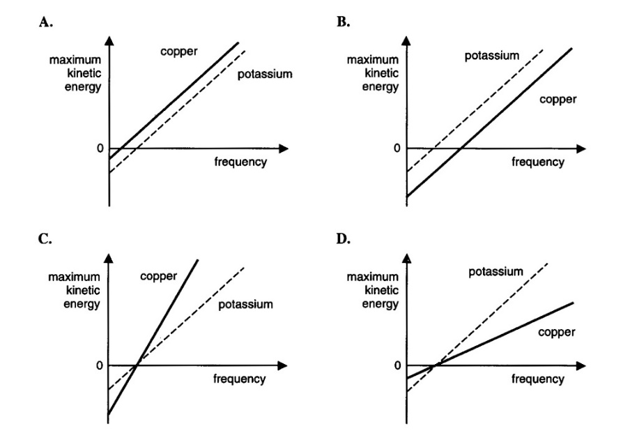
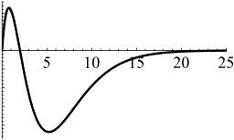
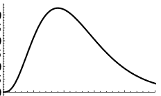
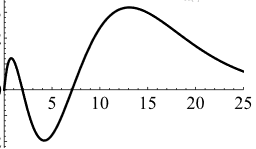
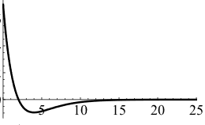
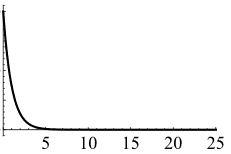
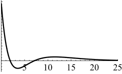
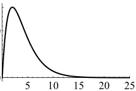

<!-- English translation of 选择题.docx. Questions and options retain their source order. Repeated questions and apparent source errors are preserved. -->

## Question 1

An archaeological excavation of tombs in the middle and lower reaches of a river suggests that the local people were studying the Sun's surface temperature as early as 300,000 years ago. After deciphering their writing, archaeologists obtained the following formula:

$$T_{\mathrm{Sun}}=9a\alpha\exp\left(2b\frac{T_{\mathrm{ground}}}{m_ec^2}\right),$$

where $\alpha$ is the fine-structure constant, $m_e$ is the electron mass, and $c$ is the speed of light. The symbols $a$ and $b$ represent the two unknown constants in the ancient formula. What are the dimensions of $ab$?

A. Energy B. Temperature $\times$ time C. Speed squared D. Angular momentum

## Question 2

Compton scattering provides strong evidence for which hypothesis?

A. Electrons have wave properties. B. Light has wave properties. C. Light has particle properties. D. Atoms have discrete internal energy levels.

## Question 3

The Davisson–Germer experiment provides strong evidence for which hypothesis?

A. Electrons have wave properties. B. Electrons have particle properties. C. Light has particle properties. D. Atoms have discrete internal energy levels.

## Question 4

Which experiment demonstrates that atoms have discrete energy levels?

A. The photoelectric effect B. The blackbody radiation spectrum C. Rutherford scattering D. The Franck–Hertz experiment

## Question 5

Which factor determines the spectral energy density of an ideal blackbody in thermal equilibrium?

A. Its temperature B. Its material C. Its shape D. All of the above

## Question 6

Which statement about blackbodies is incorrect?

A. Two blackbodies with identical spectra must have the same temperature. B. The spectrum of an incandescent lamp more closely resembles blackbody radiation than that of a fluorescent lamp. C. A higher blackbody temperature gives a higher peak frequency in its radiation spectrum. D. Any object that reflects no light must be a blackbody.

## Question 7

If the radiant energy flux density emerging from a small aperture in a blackbody cavity is $I$, what is the energy density inside the cavity?

A. $I/(4c)$ B. $cI/4$ C. $4I/c$ D. $4cI$

## Question 8

Which electromagnetic-wave quantity is not a parameter used to specify a mode?

A. Amplitude B. Wavelength C. Polarization D. Direction

## Question 9

What is the ground-state ionization energy of hydrogen?

A. $2.2\times10^{-18}\,\mathrm{J}$ B. $1.36\times10^{-18}\,\mathrm{J}$ C. $6.3\times10^{-17}\,\mathrm{J}$ D. $3.6\times10^{-18}\,\mathrm{J}$

## Question 10

What is the approximate de Broglie wavelength of a free electron with kinetic energy $10\,\mathrm{eV}$?

A. $0.004\,\mathrm{nm}$ B. $0.4\,\mathrm{nm}$ C. $4\,\mathrm{nm}$ D. $400\,\mathrm{nm}$

## Question 11

What is the wavelength of a photon with energy $2\,\mathrm{eV}$?

A. $0.004\,\mathrm{nm}$ B. $0.4\,\mathrm{nm}$ C. $4\,\mathrm{nm}$ D. $400\,\mathrm{nm}$

<!-- The source options are retained; none matches the wavelength of a 2 eV photon. -->

## Question 12

What is the expression for the fine-structure constant?

<!-- No answer options are supplied for this question in the source document. -->

## Question 13

What is the ground-state ionization energy of hydrogen?

A. $13.6\,\mathrm{eV}$ B. $3.6\,\mathrm{eV}$ C. $2\,\mathrm{eV}$ D. $91.1\,\mathrm{eV}$

## Question 14

What is the approximate Bohr radius, the ground-state orbital radius of hydrogen?

A. $5\,\mathrm{nm}$ B. $0.5\,\mathrm{nm}$ C. $0.05\,\mathrm{nm}$ D. $0.005\,\mathrm{nm}$

## Question 15

What is the minimum photon energy required to make a hydrogen atom initially in its ground state emit fluorescence?

A. $6.8\,\mathrm{eV}$ B. $3.4\,\mathrm{eV}$ C. $1.7\,\mathrm{eV}$ D. $10.2\,\mathrm{eV}$

## Question 16

What is the ionization energy of hydrogen in its first excited state?

A. $6.8\,\mathrm{eV}$ B. $3.4\,\mathrm{eV}$ C. $1.7\,\mathrm{eV}$ D. $10.2\,\mathrm{eV}$

## Question 17

In a Franck–Hertz experiment, assume the excitation energy of mercury vapor is $4.9\,\mathrm{eV}$. What is the minimum kinetic energy remaining for an incident $10\,\mathrm{eV}$ electron after it passes through the vapor?

A. $10\,\mathrm{eV}$ B. $5.1\,\mathrm{eV}$ C. $0.2\,\mathrm{eV}$ D. $0\,\mathrm{eV}$

## Question 18

How many times the hydrogen ground-state ionization energy is the ground-state ionization energy of singly ionized helium ($Z=2$)?

A. The same B. Twice C. Four times D. Eight times

## Question 19

For a radiation field, the energy per unit volume per unit frequency interval at frequency $\nu$ is $A/\nu$, where $A$ is a constant. What is the energy per unit volume per unit wavelength interval near wavelength $\lambda$?

A. $c\lambda A$ B. $A\lambda/c$ C. $\lambda A$ D. $A/\lambda$

## Question 20

Which new mechanism of light–atom interaction did Einstein identify by analyzing the blackbody spectrum using the Bohr model?

A. Spontaneous emission B. Stimulated absorption C. Stimulated emission D. None of the above

## Question 21

An atom in an excited state has probability $A\,dt$ of spontaneously emitting during the next interval $dt$, at any time, where $A$ is constant. What is its mean lifetime in this state? Here $e$ is the base of the natural logarithm.

A. $1/A$ B. $e/A$ C. $1/A^2$ D. $A/e$

## Question 22

Which values can the projection of an electron's spin angular momentum along any direction take?

A. $\hbar,0,-\hbar$ B. $\hbar/2,-\hbar/2$ C. $\hbar/2,0,-\hbar/2$ D. $\hbar,-\hbar$

## Question 23

Which value can the projection of an electron's spin along its direction of motion take?

A. $\hbar/2$ B. $0$ C. $-\hbar$ D. $2\hbar$

## Question 24

Which value can the projection of a photon's spin along its propagation direction take?

A. $\hbar/2$ B. $0$ C. $-\hbar$ D. $2\hbar$

## Question 25

Which statement about the Zeeman effect is correct?

A. Viewed along the magnetic field, three frequencies are observed. The central component is unpolarized, and the two side components have opposite circular polarizations. B. Viewed perpendicular to the magnetic field, three frequencies are observed. The central component is polarized parallel to the field, and the two side components have opposite circular polarizations. C. Viewed perpendicular to the magnetic field, two frequencies are observed, one polarized parallel to the field and the other perpendicular to it. D. Viewed perpendicular to the magnetic field, three frequencies are observed. The central component is polarized parallel to the field, and both side components are polarized perpendicular to it.

## Question 26

Which is not a necessary condition for producing laser light through transitions between atomic energy levels?

A. At least three atomic energy levels are involved. B. A resonant cavity has a partially transmitting end mirror. C. The population of the upper lasing level exceeds that of the lower lasing level. D. The lower lasing level must be the atomic ground state.

## Question 27

The minimum frequency required to eject photoelectrons from copper is twice that for potassium. Which of the four graphs is correct?

{width="651"}

## Question 28

Which statement about orbital angular momentum $\mathbf L$ is correct?

A. The orbital angular-momentum quantum number $l$ can take the values $0,1/2,1,3/2,2,\ldots$. B. For orbital angular-momentum quantum number $l$, the projection along the $x$ axis has $2l+1$ possible values. C. In the orbital angular-momentum eigenstate $|l,m_l\rangle$, $\mathbf L^2$ has the definite value $l^2\hbar^2$. D. In the orbital angular-momentum eigenstate $|l,m_l\rangle$, $L_z$ has the definite value $l\hbar$.

## Question 29

Considering only the Coulomb potential, which quantity cannot have a definite value when the energy of a hydrogen atom is definite?

A. The $z$ component of the electron's orbital angular momentum B. The square of the electron's orbital angular momentum C. The electron's kinetic energy D. The $x$ component of the electron's spin angular momentum

## Question 30

An atom has ground state $3d^54s\,{}^{7}S_3$. What are its angular-momentum quantum numbers?

A. $L=0,\ S=7,\ J=3$ B. $L=0,\ S=7/2,\ J=3$ C. $L=1,\ S=7,\ J=1$ D. $L=0,\ S=3,\ J=3$

## Question 31

For the atom in the preceding question, how many electrons are there in total?

A. 20 B. 22 C. 24 D. 26

## Question 32

Which single-electron spontaneous transition is possible in helium?

A. $1s2s\,{}^{1}S_0\rightarrow1s1s\,{}^{1}S_0$ B. $1s2p\,{}^{3}P_1\rightarrow1s1s\,{}^{1}S_0$ C. $1s2p\,{}^{1}P_1\rightarrow1s1s\,{}^{1}S_0$ D. $1s2s\,{}^{3}S_1\rightarrow1s1s\,{}^{1}S_0$

## Question 33

In the electric-dipole approximation, an atom can undergo spontaneous transitions from level $A$ to $B$, from $B$ to $C$, and from $C$ to $D$. Which statement follows?

A. A spontaneous transition from $A$ to $C$ is possible. B. A spontaneous transition from $A$ to $D$ is possible. C. A spontaneous transition from $B$ to $D$ is possible. D. All of the above.

## Question 34

An atom initially in its ground state is subjected to a $\pi/2$ pulse resonant with an electric-dipole-allowed excited state. What is its state afterward?

A. It remains in the ground state. B. It has a 25% probability of being in the excited state. C. It has a 50% probability of being in the excited state. D. It is in the excited state with 100% probability.

## Question 35

Hydrogen fine-structure splitting depends only on which quantum numbers?

A. $n$ B. $n,l$ C. $n,j$ D. $n,j,l$

## Question 36

What is the ratio of the electron spin $g$ factor to the orbital angular-momentum $g$ factor?

A. 1 B. 2 C. 4 D. $1/2$

## Question 37

For hydrogen in an external magnetic field much weaker than the internal atomic field, which is not a good quantum number?

A. $l$ B. $n$ C. $j$ D. $m_l$

## Question 38

For hydrogen in an external magnetic field much stronger than the internal atomic field, which is definitely not a good quantum number?

A. $l$ B. $n$ C. $j$ D. $m_l$

## Question 39

Under which hierarchy of interactions is $L$–$S$ coupling appropriate for a many-electron atom?

A. Effective central electrostatic potential $\gg$ residual electrostatic interaction $\gg$ magnetic interaction B. Magnetic interaction $\gg$ effective central electrostatic potential $\gg$ residual electrostatic interaction C. Effective central electrostatic potential $\gg$ magnetic interaction $\gg$ residual electrostatic interaction D. Residual electrostatic interaction $\gg$ magnetic interaction $\gg$ effective central electrostatic potential

## Question 40

When is the electron wavefunction of hydrogen spherically symmetric?

A. $l=0$ B. $m=0$ C. $n=0$ D. $l=1$

## Question 41

Which graph most closely resembles $\chi_{5,3}(r)\equiv rR_{5,3}(r)$, where $R_{n,l}(r)$ is the hydrogen radial wavefunction?

A. {width="240px"} B. {width="240px"} C. {width="240px"} D. {width="240px"}

## Question 42

For which function $\chi_{nl}\equiv rR_{nl}(r)$ does its maximum occur at a radius equal to the Bohr radius of the $n$th level?

A. $\chi_{2,0}$ B. $\chi_{2,1}$ C. $\chi_{3,1}$ D. $\chi_{3,0}$

## Question 43

Neglecting spin, the hydrogen energy eigenfunctions are $\psi_{nlm}=R_{nl}(r)Y_{lm}(\theta,\phi)$. Which orthogonality relation is incorrect?

A. $\displaystyle\int_0^{2\pi}d\phi\int_0^\pi d\theta\,Y_{2,1}^{*}Y_{2,0}\sin\theta=0$ B. $\displaystyle\int_0^{2\pi}d\phi\int_0^\pi d\theta\,Y_{2,1}^{*}Y_{1,1}\sin\theta=0$ C. $\displaystyle\int_0^\infty R_{1,0}(r)R_{2,0}(r)r^2\,dr=0$ D. $\displaystyle\int_0^\infty R_{2,0}(r)R_{2,1}(r)r^2\,dr=0$

## Question 44

Neglecting spin, the hydrogen energy eigenfunctions are $\psi_{nlm}=R_{nl}(r)Y_{lm}(\theta,\phi)$. Which orthogonality relation is incorrect?

A. $\displaystyle\int_0^{2\pi}d\phi\int_0^\pi d\theta\,Y_{2,1}^{*}Y_{2,0}\sin\theta=0$ B. $\displaystyle\int_0^{2\pi}d\phi\int_0^\pi d\theta\,Y_{2,1}^{*}Y_{1,1}\sin\theta=0$ C. $\displaystyle\int_0^\infty R_{1,0}(r)R_{2,0}(r)r^2\,dr=0$ D. $\displaystyle\int_0^\infty R_{1,0}(r)R_{2,0}(r)\,dr=0$

## Question 45

Which graph most closely resembles $R_{1,0}(r)$?

A. {width="240px"} B. {width="240px"} C. {width="240px"} D. {width="240px"}

## Question 46

What is the ground-state term symbol for every noble-gas atom?

A. $^{1}P_0$ B. $^{3}S_0$ C. $^{1}S_0$ D. $^{1}S_1$

## Question 47

Let $|n,l,m_l,m_s\rangle_i$ denote the single-electron state of electron $i$. Which expression represents the helium ground state?

A. $\left|1,0,0,\frac12\right\rangle_1\left|1,0,0,-\frac12\right\rangle_2+\left|1,0,0,-\frac12\right\rangle_1\left|1,0,0,\frac12\right\rangle_2$

B. $\left|1,0,0,\frac12\right\rangle_1\left|1,0,0,-\frac12\right\rangle_2-\left|1,0,0,-\frac12\right\rangle_1\left|1,0,0,\frac12\right\rangle_2$

C. $\left|1,0,0,\frac12\right\rangle_1\left|1,0,0,-\frac12\right\rangle_2$

D. $\left|1,0,0,\frac12\right\rangle_1\left|1,0,0,\frac12\right\rangle_2-\left|1,0,0,-\frac12\right\rangle_1\left|1,0,0,-\frac12\right\rangle_2$

<!-- Normalization factors are absent in the source options and have not been added. -->

## Question 48

Which statement about nuclear spin and magnetic moments is incorrect?

A. Both protons and neutrons have spin. B. The proton magnetic moment is two to three orders of magnitude smaller than the electron magnetic moment. C. A nucleus with even numbers of both protons and neutrons has total spin zero. D. A neutron has no magnetic moment because it has no electric charge.

## Question 49

For a single-electron electric-dipole transition in a many-electron atom under $L$–$S$ coupling, which selection rule is incorrect?

A. $\Delta S=0,\pm1$ B. $\Delta M_J=0,\pm1$ C. $\Delta L=0,\pm1$ D. $\Delta l=\pm1$

## Question 50

Which magnetic interaction is strongest in a many-electron atom?

A. The spin–orbit interaction of each individual electron B. The interaction between the orbital magnetic moments of different electrons C. The interaction between the spin magnetic moments of different electrons D. The interaction between one electron's spin magnetic moment and the orbital magnetic moments of other electrons

## Question 51

How many elements are in the third period of the periodic table?

A. 2 B. 8 C. 18 D. 32

## Question 52

Evaluate $\mathbf L\cdot\mathbf S$ for an atom with term symbol $^{3}P_1$.

A. $-3\hbar^2$ B. $-2\hbar^2$ C. $-\hbar^2$ D. $2\hbar^2$

## Question 53

Which term is not possible for an atom with electron configuration $2p3d$?

A. $^{1}P$ B. $^{2}P$ C. $^{1}D$ D. $^{1}F$

## Question 54

Two particles have spin quantum numbers 2 and $3/2$. Which value can their total spin quantum number take?

A. 3 B. 0 C. $9/2$ D. $5/2$

## Question 55

Which statement about quantum mechanics is correct?

A. The three Cartesian components of a particle's momentum cannot all be definite simultaneously. B. The three Cartesian components of a particle's position cannot all be definite simultaneously. C. The three Cartesian components of a particle's angular momentum cannot all be definite simultaneously. D. The three Cartesian components of a particle's angular momentum cannot all be definite simultaneously, unless the angular momentum has magnitude zero.

## Question 56

Two particles have spin quantum numbers $1/2$ and $3/2$. Which value can their total spin quantum number take?

A. 3 B. 0 C. $5/2$ D. 1

## Question 57

Which type of electron has a spherically symmetric electron cloud?

A. An $s$ electron B. A $p$ electron C. A $d$ electron D. All three types

## Question 58

Which hydrogen level has the largest hyperfine splitting?

A. $1S_{1/2}$ B. $2S_{1/2}$ C. $2P_{1/2}$ D. $2P_{3/2}$

## Question 59

Which phenomenon requires quantum electrodynamics for its explanation?

A. Fine structure B. Hyperfine structure C. The Lamb shift D. The Paschen–Back effect

## Question 60

The Hamiltonian responsible for fine-structure splitting is proportional to which quantity? Here $\mathbf I$ is nuclear spin, $\mathbf L$ and $\mathbf S$ are the electronic orbital and spin angular momenta, $\mathbf J=\mathbf L+\mathbf S$, and $\mathbf F=\mathbf J+\mathbf I$.

A. $\mathbf I\cdot\mathbf L$ B. $\mathbf L\cdot\mathbf S$ C. $\mathbf I\cdot\mathbf J$ D. $\mathbf F\cdot\mathbf I$

## Question 61

The Hamiltonian responsible for hyperfine splitting is primarily proportional to which quantity? Here $\mathbf I$ is nuclear spin, $\mathbf L$ and $\mathbf S$ are the electronic orbital and spin angular momenta, $\mathbf J=\mathbf L+\mathbf S$, and $\mathbf F=\mathbf J+\mathbf I$.

A. $\mathbf I\cdot\mathbf L$ B. $\mathbf L\cdot\mathbf S$ C. $\mathbf I\cdot\mathbf J$ D. $\mathbf F\cdot\mathbf I$