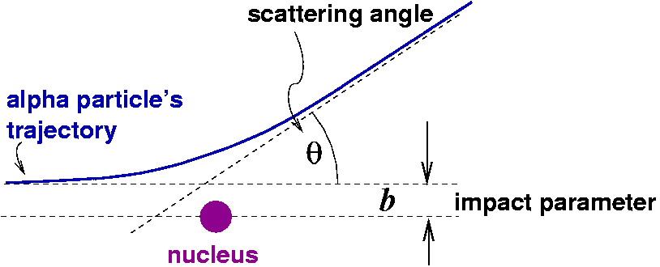
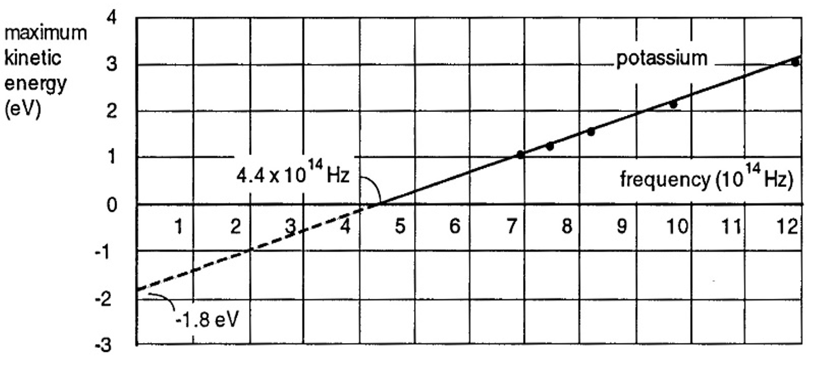
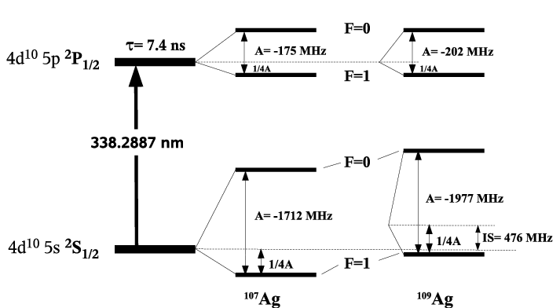
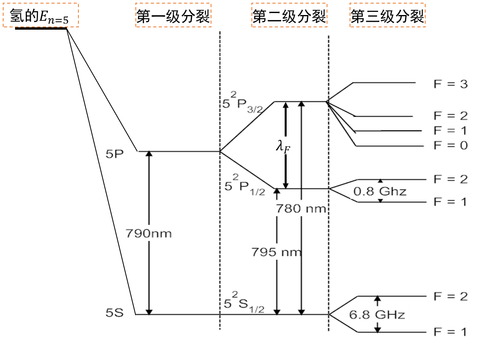
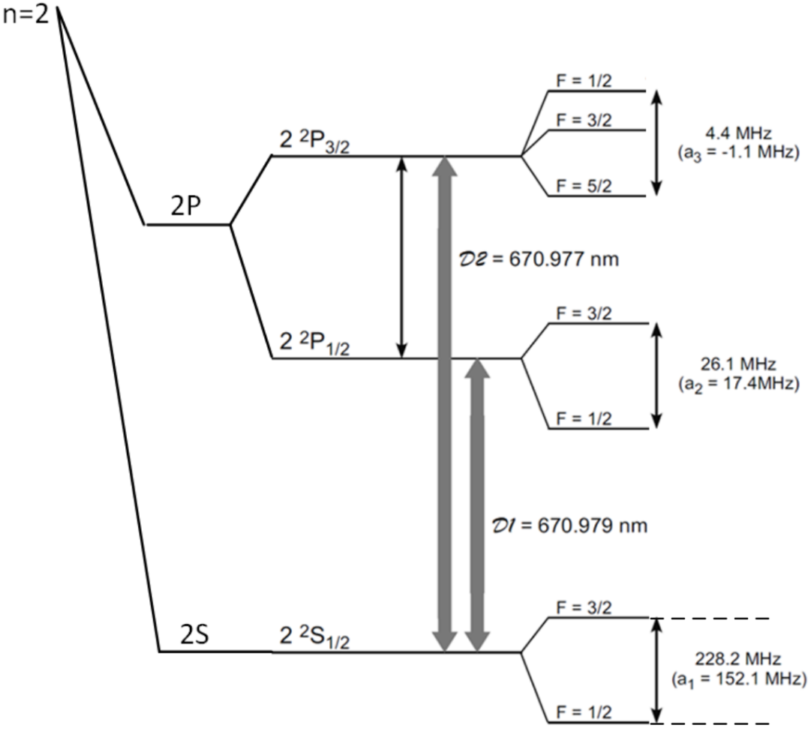

<!-- English translation of 问答题.docx. Source order, marks, solutions, and numerical values are retained. Comments identify apparent source inconsistencies. -->

# Part I

## Blackbody radiation

## Rutherford scattering

### Problem 1

{width="501"}

A beam of $N$ particles, each with charge $Z_1e$ and kinetic energy $E$, is incident normally on a thin target foil of thickness $d$, atomic number density $n$, and nuclear charge $Z_2e$. Assume that the incident particles are much lighter than the target nuclei and that the foil is thin enough for only single scattering to occur. The Coulomb scattering formula is

$$
b=\frac{a}{2}\cot\frac{\theta}{2},\qquad a=\frac{Z_1Z_2e^2}{4\pi\epsilon_0E}.
$$

1.  Explain the physical meaning of $a$. (20%)
2.  Find the total number of particles with scattering angles smaller than $90^\circ$. (50%)
3.  The differential scattering cross section $\sigma_c(\theta)$ is the cross-sectional area associated with one target nucleus that scatters incident particles into unit solid angle in direction $\theta$. Derive $\sigma_c(\theta)$ from the Coulomb scattering formula. (30%)

**Answer**

1.  $a$ is the distance of closest approach in a head-on collision.

2.  Let the beam spot have area $A$. The number of target nuclei within the illuminated foil is $nAd$. Particles with impact parameters

    $$b<\frac{a}{2}\cot\left(\frac{\pi/2}{2}\right)\equiv B$$

    are scattered through angles $\theta>\pi/2$. Each nucleus therefore contributes a cross section $\pi B^2$ for scattering through more than $90^\circ$. The number of such particles is

    $$N'=N\frac{nAd\pi B^2}{A}=Nnd\pi B^2.$$

    The number with scattering angles smaller than $90^\circ$ is $N-Nnd\pi B^2$.

3.  Particles incident within an annulus of area $d\sigma=\pi b\,db$ centered on a target nucleus are scattered into a solid angle $d\Omega=2\pi\sin\theta\,d\theta$ in direction $\theta$. Thus,

    $$\sigma_c(\theta)=\frac{d\sigma}{d\Omega}=\frac{2\pi b\,db}{2\pi\sin\theta\,d\theta}=\frac{b}{\sin\theta}\frac{db}{d\theta}=\frac{a^2}{4}\frac{1}{\sin^4(\theta/2)}.$$

### Problem 2

{width="574"}

A proton beam is incident normally on a heavy-metal foil of thickness $d$, atomic number density $n$, and atomic number $Z$. Assume the foil is thin enough that target nuclei do not shadow one another. The Coulomb scattering formula is

$$\cot\frac{\theta}{2}=\frac{2b}{a}.$$

The cross section per target nucleus for scattering into unit solid angle in direction $\theta$ is

$$\sigma_c(\theta)=\frac{(a/4)^2}{\sin^4(\theta/2)}.$$

1.  Explain the physical meaning of $a$ and give its mathematical expression. (5 marks)

2.  Find the probability of scattering into a circular detector of radius $r$, located a distance $l$ from the target in direction $\theta$ and facing the target, with $l\gg r$. (5 marks)

    **Alternative:** A flat plate facing the incident beam is located a distance $l$ from the target. Find the probability that particles scattered in direction $\theta$ strike a circular region of radius $r$ on the plate, with $l\gg r$.

3.  Find the probability of scattering through an angle between $\theta_1$ and $\theta_2$. (5 marks)

## Photoelectric effect (difficulty level 2)

### Problem 1

1.  An LED emits light at a wavelength of $500\,\mathrm{nm}$, consumes $1\,\mathrm{mW}$ of power, and has a conversion efficiency of 80%. How many photons does it emit per second? (40%)
2.  Photons emitted by spontaneous decay of hydrogen atoms from the first excited state strike a metal surface with a work function of $4\,\mathrm{eV}$. What is the kinetic energy of the emitted electrons? (60%)

**Answer**

1.  The energy of a $500\,\mathrm{nm}$ photon is

    $$hc/\lambda=4\times10^{-19}\,\mathrm{J}.$$

    Since $1\,\mathrm{mW}=0.001\,\mathrm{J\,s^{-1}}$, the energy converted into light each second is $0.001\times80\%=0.0008\,\mathrm{J}$. The number of photons emitted per second is

    $$n=\frac{8\times10^{-4}}{4\times10^{-19}}=2\times10^{15}.$$

2.  The photon energy equals the energy difference between the first excited state and the ground state:

    $$13.6(1-1/4)=10.2\,\mathrm{eV}.$$

    The supplied answer gives the emitted electron kinetic energy as $10.2\,\mathrm{eV}-4\,\mathrm{eV}=6.2\,\mathrm{eV}$.

### Problem 2

The graph below shows the maximum kinetic energy of photoelectrons emitted from potassium as a function of incident-light frequency. The dots are experimental data, and the straight line is a fit.

{width="607"}

1.  What is the minimum photon energy required to eject photoelectrons, in electronvolts? (4 marks)
2.  Use the graph to determine Planck's constant. Show your calculation and use appropriate significant figures. (3 marks)
3.  The threshold frequency for copper is twice that for potassium. Sketch the theoretical curve for copper on the same graph. (3 marks)

## Blackbody radiation

### Problem 1

An insulated blackbody cavity exchanges energy with its surroundings only through a small aperture. Its blackbody wavelength spectrum peaks at $500\,\mathrm{nm}$. A laser beam of wavelength $800\,\mathrm{nm}$ is directed into the aperture. After illuminating the cavity for some time and switching off the laser, will the peak wavelength of the radiation emerging from the aperture increase or decrease? Explain. (6 marks)

### Problem 2

In a blackbody cavity at temperature $T$, the electromagnetic energy per unit volume per unit frequency interval near frequency $\nu$ is

$$u_\nu(T)=\frac{8\pi\nu^2}{c^3}\times\frac{1}{e^{h\nu/(k_BT)}-1}\times h\nu.$$

a.  Explain the physical meaning of each of the three factors, from left to right. (6 marks)

b.  Let $i_\nu(T)$ denote the energy radiated from the blackbody surface per unit time, per unit area, and per unit frequency interval, with

    $$\int_0^\infty i_\nu(T)\,d\nu=\sigma T^4.$$

    Approximate the Sun's surface as a blackbody. The solar energy incident normally on unit area at Earth's surface per unit time is $I_E$. The Earth–Sun distance is $D$, and the solar radius is $R$. Find the solar surface temperature $T_S$. (4 marks)

c.  A metal plate in the solar system has photoelectric threshold frequency $\nu_0$. The solar surface temperature is $T_S$. Assuming the total sunlight power incident on the sheet is $W$ and the plate reflects 90% of the light uniformly over all the frequencies. How many electrons does the plate emit per unit time? (4 marks)

**Answer**

a.  The factors are (1) the number of electromagnetic modes per unit volume per unit frequency interval near $\nu$ in the cavity, (2) the mean photon number per mode, and (3) the energy of a photon of frequency $\nu$.

b.  Assuming spherically symmetric solar radiation, the surface intensity $I_S$ and the intensity at Earth satisfy

    $$I_S=I_E\frac{D^2}{R^2}.$$

    Since the solar surface is a blackbody,

    $$I_S=\int_0^\infty i_\nu(T_S)\,d\nu=\sigma T_S^4,\qquad T_S=\left(\frac{I_ED^2}{\sigma R^2}\right)^{1/4}.$$

c.  Each photon above $\nu_0$ ejects one electron. Thus, the electron emission rate equals the arrival rate of photons above $\nu_0$. Let $i_\nu(T_S)$ be the spectral radiant flux density at the solar surface. The power incident on the sheet in the interval $\nu$ to $\nu+d\nu$ is

    $$W\frac{i_\nu(T_S)\,d\nu}{\int_0^\infty i_\nu(T_S)\,d\nu}=\frac{W}{\sigma T_S^4}i_\nu(T_S)\,d\nu.$$

    The corresponding photon rate is

    $$dn(\nu)=\frac{W}{\sigma T_S^4}\frac{i_\nu(T_S)\,d\nu}{h\nu}.$$

    Therefore,

    $$n=\int_{\nu_0}^\infty dn(\nu)=\frac{W}{h\sigma T_S^4}\int_{\nu_0}^\infty\frac{i_\nu(T_S)}{\nu}\,d\nu.$$

## Compton scattering

The Compton scattering formula is

$$\lambda'-\lambda=\lambda_e(1-\cos\theta),$$

where $\lambda_e$ is the Compton wavelength,

$$\lambda_e=\frac{h}{m_ec}.$$

1.  Explain the physical meaning of the Compton wavelength.
2.  If the incident wavelength equals the Compton wavelength, what is the maximum energy that a photon can transfer to an initially stationary electron?
3.  Given $\theta$ and $\lambda$, find the electron's scattering angle.

## Bohr model

### Problem 1

The Rydberg formula for the hydrogen spectrum is

$$\frac{1}{\lambda}=R\left[\frac{1}{n^2}-\frac{1}{(n')^2}\right].$$

1.  Express the hydrogen energy levels $E_n$ in terms of $R$.

2.  Express the Bohr orbital radii $r_n$ in terms of $R$.

3.  Use the correspondence principle to show that

    $$R=\frac{2\pi^2e^4m_e}{(4\pi\epsilon)^2h^3c}.$$

### Problem 2

Assume that the electron in hydrogen moves in a circular orbit around the proton. Using the angular-momentum quantization postulate

$$L=m_ev_nr_n=n\hbar,$$

derive the Bohr orbital radii $r_n$ and energy levels $E_n$ for a one-electron atom of atomic number $Z$. Assume an infinitely massive nucleus.

# Part II

## One-electron systems

### Problem1: Stern–Gerlach experiment

Explain why silver atoms form two traces in the Stern–Gerlach experiment.

Hint: Silver has $Z=47$ and ground-state configuration $[\mathrm{Kr}]4d^{10}5s^1$. Its two main isotopes, $^{107}\mathrm{Ag}$ and $^{109}\mathrm{Ag}$, each have a natural abundance of approximately 50% and nuclear spin $I=1/2$.

**Answer**

The ground-state configuration is $[\mathrm{Kr}]4d^{10}5s^1$, with term symbol $^{2}S_{1/2}$. The total electronic angular-momentum quantum number therefore equals the electron spin quantum number, $1/2$. The magnetic field in the experiment is strong enough that the external-field energy greatly exceeds the hyperfine splitting. The good quantum numbers are then $m_s$ and $m_I$. The nuclear magnetic moment is very small, so splitting associated with $m_I$ is difficult to resolve. The two observed traces correspond to the two values of $m_S$.

### Problem 2: Hydrogen energy eigenfunctions

(15 marks = $3\times5$.) Neglect electron spin. The hydrogen energy eigenfunctions are

$$\psi_{nlm}(r,\theta,\phi)=R_{nl}(r)Y_{lm}(\theta,\phi).$$

Express the volume element using $d\theta$, $d\phi$, and $dr$, and answer the following questions.

1.  Which mechanical quantities do the three quantum numbers of $\psi_{nlm}$ specify, and what are their values?
2.  What is the probability of finding the electron in a differential volume at $(r,\theta,\phi)$ in state $\psi_{nlm}$?
3.  What is the probability of finding it in the spherical shell between $r$ and $r+dr$?
4.  What is the probability that its distance from the nucleus is less than $r_0$?
5.  What is its probability density at the origin?

**Answer**

1.  $n$ specifies the energy, $-13.6\,\mathrm{eV}/n^2$; $l$ specifies the squared orbital angular momentum, $l(l+1)\hbar^2$; and $m$ specifies its $z$ component, $m\hbar$.

2.  The probability is

    $$|\psi_{nlm}(r,\theta,\phi)|^2dV=|\psi_{nlm}(r,\theta,\phi)|^2r^2\sin\theta\,d\theta\,d\phi\,dr.$$

3.  Integrate over all directions:

    $$\iint |\psi_{nlm}|^2r^2\sin\theta\,d\theta\,d\phi\,dr=R_{nl}^2(r)r^2dr\iint|Y_{lm}|^2\sin\theta\,d\theta\,d\phi=R_{nl}^2(r)r^2dr.$$

4.  The probability is $\displaystyle\int_0^{r_0}R_{nl}^2(r)r^2\,dr$.

5.  Since the origin includes all directions, average the probability density at $r=0$ over all directions:

    $$\frac{\int|\psi_{nlm}(0,\theta,\phi)|^2\,d\Omega}{4\pi}=\frac{R_{nl}^2(0)}{4\pi}.$$

## Many-electron atoms

### Atomic states of many-electron atoms 1

Carbon has six electrons.

1.  Write its ground-state electron configuration. (20%)
2.  List all spectroscopic terms for this configuration. (30%)
3.  Identify the lowest-energy term. (20%)
4.  If one valence electron is excited to $3d$, list all spectroscopic terms for the resulting configuration. (30%)
5.  If one valence electron is excited to $3s$, identify the lowest-energy term and all its spontaneous decay paths.

**Answer**

1.  $1s^22s^22p^2$.

2.  The two outer $2p^2$ electrons are equivalent, so only combinations with even $L+S$ are allowed. Here $l_1=l_2=1$ and $s_1=s_2=1/2$, giving

    $$L=2,1,0;\quad S=1,0;\quad J=L+S,L+S-1,\ldots,|L-S|.$$

    The allowed combinations are $(L,S)=(2,0),(1,1),(0,0)$, yielding the terms $^{2S+1}L_J$:

    $$^{1}D_2,\quad {}^{3}P_{2,1,0},\quad {}^{1}S_0.$$

3.  Hund's first rule favors the largest $S$, so $(L,S)=(1,1)$. For a shell less than half filled, Hund's third rule favors the smallest $J$. The ground state is $^{3}P_0$.

4.  The configuration is $1s^22s^22p3d$. The two valence electrons have different $n$ values and are nonequivalent. The supplied solution gives $L=3,2,1$ and $S=1,0$. All six $(L,S)$ combinations are allowed, with

    $$J=L+S,L+S-1,\ldots,|L-S|.$$

    The listed terms are

    $${}^{3}F_{4,3,2},\quad {}^{1}F_3，\quad ^{3}D_{3,2,1},\quad {}^{1}D_2,\quad {}^{3}P_{2,1,0},\quad {}^{1}P_1$$

5.  For $1s^22s^22p^13s^1$, $l_1=1$, $l_2=0$, and $s_1=s_2=1/2$. Thus $L=1$, $S=1,0$, and $(L,S)=(1,1),(1,0)$. The supplied solution identifies $^{3}P_0$ as the lowest term and lists decay to $2p^2\,{}^{3}P_1$. The transition to $2p^2\,{}^{3}P_0$ is not allowed, because $J=0$ to $J=0$ is forbidden for electric-dipole transition.

### Atomic states of many-electron atoms 2

(15 marks = $3\times5$.) Sulfur has atomic number 16.

1.  Write its ground-state electron configuration.
2.  Determine all spectroscopic terms for this configuration.
3.  Identify the lowest-energy term.

Nitrogen has atomic number 7 and ground state $2p^3\,{}^{4}S_{3/2}$.

4.  Write the electron configuration of its lowest excited state accessible by an electric-dipole transition.
5.  Identify the lowest-energy term for this configuration.

**Answer**

1.  $1s^22s^22p^63s^23p^4$.
2.  The term structure is the same as for $3p^2$. For two equivalent electrons, $L+S$ must be even, giving $^{3}P_{2,1,0}$, $^{1}D_2$, and $^{1}S_0$.
3.  Hund's rules favor the largest $S$, so the lowest level lies within $^{3}P_{2,1,0}$. For fixed $S$ and $L$ in a more-than-half-filled shell, larger $J$ means lower energy. The ground state is $^{3}P_2$.
4.  $2p^23s$.
5.  For the $2p^2$ pair, $L_{12}=1$ and $S_{12}=1$. The $3s$ electron has $s_3=1/2$ and $l_3=0$. Thus $S=3/2,1/2$ and $L=1$. Hund's rules give $S=3/2$, $L=1$, $J=1/2$, hence $^{4}P_{1/2}$.

### Alkali-metal energy levels 1 (comprehensive problem)

(20 marks = $2\times10$.) The diagram shows the energy levels of rubidium-87, an alkali metal with atomic number 37. Starting from a hydrogen-like $n=5$ principal level, three successive splittings produce the actual levels shown.

{width="713"}

1.  Which interaction, between which particles, determines the $n=5$ principal level?
2.  What causes the first splitting? Why is $5S$ lower in energy than $5P$?
3.  What causes the second splitting?
4.  Why does $5S$ remain unsplit at the second stage?
5.  Use the diagram to calculate the transition wavelength between $5\,{}^{2}P_{3/2}$ and $5\,{}^{2}P_{1/2}$.
6.  What causes the third splitting?
7.  Why is the third-stage splitting largest for $5\,{}^{2}S_{1/2}$?
8.  Determine the nuclear spin quantum number of rubidium-87 from the diagram.
9.  In a weak magnetic field, how many sublevels arise from the $F=2$ and $F=1$ branches of $5\,{}^{2}S_{1/2}$? Assume the new splitting is much smaller than the separation between these branches.
10. Find the ratio of the adjacent-sublevel spacing in the $F=2$ branch to that in the $F=1$ branch.

**Answer**

1.  The Coulomb interaction between the single outer valence electron and the nucleus screened by the inner electrons, with an effective charge of $+1$ in units of $e$.

2.  Orbital penetration increases the effective nuclear charge experienced by the valence electron, lowering its energy. The $5S$ electron penetrates more deeply than the $5P$ electron, so it experiences a larger effective charge and has lower energy.

3.  The magnetic interaction between the electron's spin magnetic moment and the magnetic field associated with its orbital motion, also called spin–orbit coupling.

4.  An $S$ electron has no orbital angular momentum and therefore no spin–orbit coupling.

5.  With wavelengths in nanometers,

    $$\frac{1}{\lambda_F}=\frac{1}{780}-\frac{1}{795},\qquad\lambda_F=413\times10^2\,\mathrm{nm}.$$

6.  The hyperfine interaction between the nuclear magnetic moment and the magnetic field produced by the electrons.

7.  The $5S$ electron has the greatest probability density at the nucleus, giving the largest Fermi contact field and the strongest magnetic-dipole hyperfine interaction.

8.  $I=3/2$.

9.  The $F=2$ branch produces five sublevels; the $F=1$ branch produces three.

10. In a weak field, the hyperfine Zeeman splitting is proportional to the $g$ factor for total angular momentum $F$:

    $$g_F=g_S\frac{F(F+1)+S(S+1)-I(I+1)}{2F(F+1)}.$$

    Substitution gives the source's values $g_{F=2}=1/4$ and $g_{F=1}=-1/4$. Their magnitudes are equal, so the spacing ratio is 1.

### Alkali-metal energy levels 2 (comprehensive problem)

The diagram shows the valence-electron energy levels of lithium-6 ($^{6}\mathrm{Li}$), atomic number 3. Starting from a hydrogen-like $n=2$ principal level, three successive splittings produce the actual levels.

{width="650"}

1.  What interaction determines the principal level? (2 marks)
2.  What causes the first splitting? Why is $2S$ lower in energy than $2P$? (2 marks)
3.  What causes the second splitting? Why does $2S$ remain unsplit at this stage? (2 marks)
4.  What causes the third splitting? Why is it largest for $2\,{}^{2}S_{1/2}$? (2 marks)
5.  What nuclear spin quantum number for $^{6}\mathrm{Li}$ can be inferred from the diagram? (2 marks)
6.  Calculate the transition frequency between $2\,{}^{2}P_{3/2}$ and $2\,{}^{2}P_{1/2}$ using the diagram. (2 marks)

**Answer**

1.  The Coulomb interaction between the valence electron and the effective nuclear charge $+e$ after screening by the atomic core.

2.  Orbital penetration makes the effective nuclear charge greater than one. The $2S$ electron penetrates more deeply, experiences a larger effective charge, and has lower potential energy.

3.  The fine-structure interaction, or spin–orbit coupling, is the magnetic interaction between the electron's spin moment and the field associated with its orbital motion. An $S$ electron has zero orbital angular momentum, so there is no orbital magnetic field and no spin–orbit coupling.

4.  The hyperfine interaction couples the nuclear magnetic moment to the field produced by the electron's spin or orbital motion. An $S$ electron has the greatest probability density near the nucleus, so its spin magnetic moment interacts most strongly with the nucleus.

5.  $I=1$, since $F_{\max}=I+S$, $F_{\max}=3/2$, and $S=1/2$.

6.  The supplied answer is

    $$\nu=c\left(\frac{1}{\lambda_{D1}}-\frac{1}{\lambda_{D2}}\right)=1.33\,\mathrm{GHz}.$$

## Other questions

### Magnetic quantum number

Can energy-level splittings caused by internal atomic interactions depend on the quantum number $m_s$?